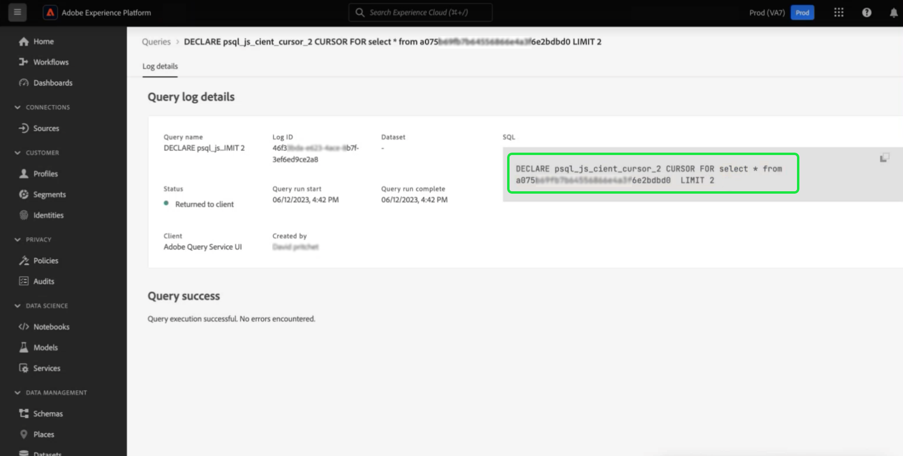

# Parameterized vragen

>[!IMPORTANT]
>
>De parameterized eigenschap van vraag UI is beschikbaar in a **alleen beperkte release** en is niet beschikbaar voor alle klanten.

De Dienst van de vraag steunt het gebruik van parameterized vragen in de Redacteur van de Vraag. Met parameterized vragen, kunt u placeholders voor parameters nu gebruiken en de parameterwaarden bij uitvoeringstijd toevoegen. Plaatsaanduidingen maken het mogelijk om met dynamische gegevens te werken als u niet weet wat de waarden zijn totdat de instructie wordt uitgevoerd. U kunt uw vragen ook vooraf voorbereiden en opnieuw gebruiken voor gelijkaardige doeleinden. Het hergebruiken van vragen bespaart aanzienlijke inspanning aangezien u vermijdt creërend duidelijke SQL vragen voor elk gebruiksgeval.

## Vereisten

Lees voordat u doorgaat met deze handleiding de [Handleiding voor de Query Editor](./user-guide.md). De gids van de Redacteur van de Vraag verstrekt gedetailleerde informatie over hoe te schrijven, te bevestigen, en vragen voor klantenervaringsgegevens binnen het gebruikersinterface van de Experience Platform in werking te stellen.

>[!NOTE]
>
>Binnen Adobe Experience Platform UI, wordt de parameter bepaalde vragen slechts gesteund op het ouderniveau van gealigneerde malplaatjes. Dit betekent dat de parameters bepaalde vragen slechts werken wanneer gebruikt in het originele malplaatje. De malplaatjes van het kind moeten een statisch malplaatje zijn en kunnen geen dynamische parameters hebben. Zie de [documentatie inline templates](../essential-concepts/inline-templates.md) voor meer informatie.

## Parameterized vraagsyntaxis {#syntax}

Parameterized vragen gebruiken het formaat `'$YOUR_PARAMETER_NAME'` en kan worden samengevoegd met puntnotatie. Een voorbeeldSQL verklaring die geparametereerde vragen gebruikt kan hieronder worden gezien.

```sql
INSERT INTO
   $Database_Name.Schema_Name.adwh_lkup_process_delta_log
   (process_name, merge_policy_id, process_status, process_date, create_ts, change_ts)
SELECT
   '$Table_Process_Name' process_name,
   hash('$Merge_PolicyID') merge_policy_id,
   '$process_status' process_status,
   to_date('$date_key') process_date,
   CURRENT_TIMESTAMP create_ts,
   CURRENT_TIMESTAMP change_ts;
```

## Een query met parameters maken {#create}

Navigeer naar de Query-editor om de geparametereerde query in de UI te maken. Zie de sectie over [De Query-editor openen](./user-guide.md#accessing-query-editor) voor meer instructies.

Gebruik de `'$'` Plaats om een vraagparameter in uw vraag in de tekstredacteur in te gaan. Voeg vervolgens de ontbrekende waarde voor de toets in het dialoogvenster [!UICONTROL Query parameters] onder de editor. De query kan niet worden uitgevoerd als u geen waarde toevoegt aan een van de vereiste toetsen. Een waarschuwingspictogram () wordt weergegeven in de sectie Query Parameters naast lege [!UICONTROL Value] invoervelden.


>[!TIP]
>
>Tabs wijzigen van [!UICONTROL Query parameters] tot [!UICONTROL Console] om de consoleoutput van de vraag te bekijken.

Als u een parameter verwijdert en de query opnieuw probeert uit te voeren nadat deze al is uitgevoerd, wordt een foutbericht weergegeven in het dialoogvenster [!UICONTROL Query parameters] gedeelte om u te waarschuwen.

>[!NOTE]
>
>Als uw vraag geen parameters neemt, kunt u onnodige parameters binnen de Redacteur van de Vraag nog ingaan. De redacteur van de Vraag negeert alle onnodige sleutel-waarde paren en zij hebben geen effect op de uitvoering of de resultaten van de vraag.


## Gegevens over querylogbestanden gebruiken om parameterwaarden te controleren {#check-parameter-values}

U kunt geen parameters opslaan binnen sjablonen omdat de gebruikte waarden niet blijvend zijn. U kunt echter de opdracht [!UICONTROL Query log details] pagina om de parameterwaarden te vinden die in een vraaglooppas worden gebruikt. In dit geval, wijzen de logboeken niet erop dat de vraag een parameterized vraag was. Zie de [documentatie met querylogbestanden](./query-logs.md) voor instructies over hoe te om de gebruikte waarden te vinden.



<!-- improve screenshot above ^ I am waiting for a scheduled run to complete -->

## Plan een geparameterialiseerde vraag {#schedule}

Parameterwaarden worden opgeslagen wanneer u een geparametriseerde query plant. Om een parameterized vraag te plannen, volg het typische proces om een geplande vraag tot stand te brengen zoals die in de gids wordt beschreven aan [een queryschema maken](./query-schedules.md#create-schedule)Voer vervolgens de parameterwaarden in die in de query moeten worden gebruikt. Deze UI-sectie wordt alleen weergegeven voor geparametriseerde query&#39;s. Zie de sectie over [parameters instellen voor een geplande parameterized query](./query-schedules.md#set-parameters) voor specifieke instructies.

>[!TIP]
>
>De Dienst van de vraag steunt voorbereide verklaringen door het gebruik van parameterized vragen. Zie de [syntaxishandleiding voor instructies](../sql/prepared-statements.md) voor meer informatie over de betrokken SQL syntaxis.

## Volgende stappen

Door dit document te lezen, hebt u geleerd hoe te om vragen in Adobe Experience Platform UI parameters te bepalen en hen in geplande vraaglooppas te gebruiken. Het document benadrukte ook hoe te om de logboeken voor de parameterwaarden te controleren die in vraaguitvoeringen worden gebruikt.

Vervolgens kunt u de handleiding het beste lezen op [bewaking van geplande query&#39;s](./monitor-queries.md) om een beter inzicht in de status van alle vraagbanen door het Platform UI te verkrijgen.
