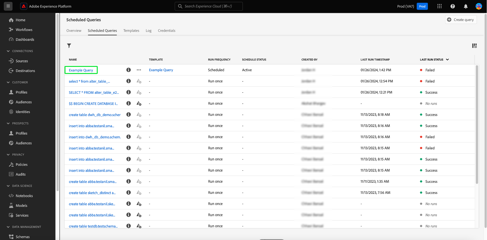
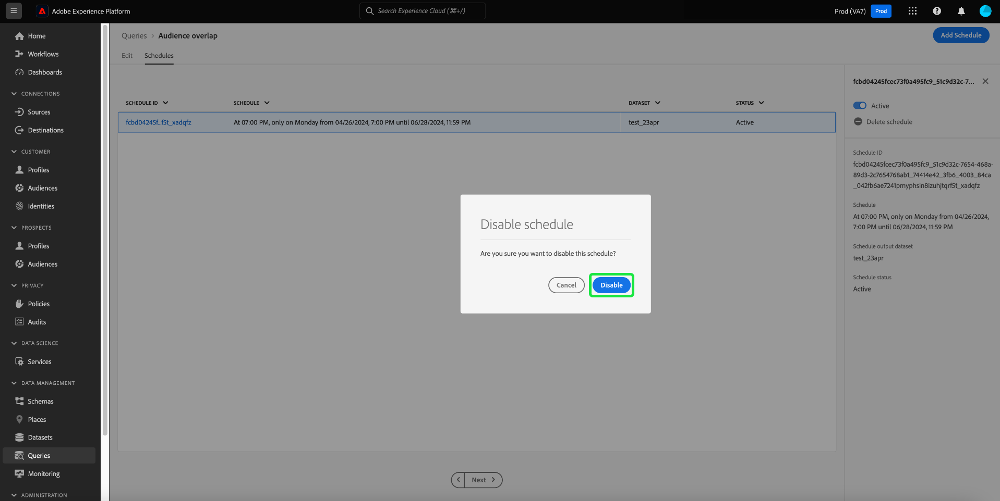

# Zoekprogramma&#39;s

U kunt vraaglooppas automatiseren door vraagprogramma&#39;s te creëren. Geplande vragen lopen op een douanecadence om uw gegevens te beheren die op frequentie, datum, en tijd worden gebaseerd. U kunt een outputdataset voor uw resultaten ook kiezen indien vereist. De vragen die als malplaatje zijn bewaard kunnen van de Redacteur van de Vraag worden gepland.

>[!IMPORTANT]
>
>U kunt alleen een schema toevoegen aan een query die al is gemaakt en opgeslagen.

## Accountvereisten voor geplande query&#39;s {#technical-account-user-requirements}

Om geplande vragen te helpen betrouwbaar lopen, adviseert Adobe dat de beheerders een technische rekening (gebruikend de geloofsbrieven van Server-aan-Server van OAuth) verstrekken voor het creëren van geplande vragen. De geplande vragen kunnen ook met een persoonlijke gebruikersrekening worden gecreeerd, maar de vragen die op deze manier worden gecreeerd zullen ophouden lopend als de toegang van die gebruiker wordt verwijderd of onbruikbaar gemaakt.

Voor details bij vestiging technische rekeningen en het toewijzen van de vereiste toestemmingen, zie de [ Verantwoordelijkheden van de gids van Geloofsbrieven ](./credentials.md#prerequisites) en [ API authentificatie ](../../landing/api-authentication.md).

Raadpleeg voor aanvullende informatie over het maken en configureren van een technische account:

- [ de opstelling van Developer Console ](https://experienceleague.adobe.com/en/docs/platform-learn/getting-started-for-data-architects-and-data-engineers/set-up-developer-console-and-postman): Step-by-step instructies voor het vormen van Adobe Developer Console en het verkrijgen van geloofsbrieven OAuth.
- [ technische de rekeningsopstelling van begin tot eind ](https://experienceleague.adobe.com/en/docs/platform-learn/tutorial-comprehensive-technical/setup): Een uitvoerige analyse voor het creëren van en het vormen van een technische rekening in Adobe Experience Platform.

Als u slechts de Dienst UI van de Vraag gebruikt, zorg ervoor u de noodzakelijke toestemmingen hebt of met een beheerder coördineert die technische rekeningen beheert. Alle geplande query&#39;s worden toegevoegd aan de lijst op het tabblad [!UICONTROL Scheduled queries] , waar u de status, de planningsdetails en de foutberichten voor alle geplande querytaken kunt controleren en zich kunt abonneren op waarschuwingen. Voor meer informatie bij het controleren van en het beheren van uw vragen, zie het [ document van de controlemonitor geplande vragen ](./monitor-queries.md).

Dit werkschema behandelt het het plannen proces in de Dienst UI van de Vraag. Leren hoe te om programma&#39;s toe te voegen gebruikend API, verwijs naar de [ geplande gids van het vraageindpunt ](../api/scheduled-queries.md).

>[!NOTE]
>
>Gebruik een technische rekening om ervoor te zorgen dat de geplande vragen blijven lopen zelfs als de gebruikers de organisatie verlaten of hun rollen veranderen. Kies waar mogelijk een technisch account voor ononderbroken zoekopdrachtautomatisering.

## Een queryschema maken {#create-schedule}

Als u een query wilt plannen, selecteert u een querysjabloon op de tab [!UICONTROL Templates] of in de kolom [!UICONTROL Template] op de tab [!UICONTROL Scheduled Queries] . Als u de sjabloonnaam selecteert, gaat u naar de Query Editor.

Als u tot een bewaarde vraag van de Redacteur van de Vraag toegang hebt, kunt u een programma voor de vraag tot stand brengen of het programma van de vraag van het detailspaneel bekijken.

>[!TIP]
>
>Selecteer **[!UICONTROL View schedule]** om naar de werkruimte van programma&#39;s te navigeren en om het even welke geplande vraaglooppas in een blik te zien.

![ de Redacteur van de Vraag met [!UICONTROL View schedule] en [!UICONTROL Add schedule] benadrukte.](../images/ui/query-schedules/view-add-schedule.png)

Selecteer **[!UICONTROL Add schedule]** om aan de [ pagina van de planningsdetails ](#schedule-details) te navigeren.

U kunt ook het tabblad **[!UICONTROL Schedules]** onder de naam van de query selecteren.

De werkruimte Planningen wordt weergegeven. UI toont een lijst van om het even welke geplande looppas die het malplaatje met wordt geassocieerd. Selecteer **[!UICONTROL Add Schedule]** om een schema te maken.

### Plan-details toevoegen {#schedule-details}

De pagina met planningsdetails wordt weergegeven. Op deze pagina kunt u diverse details voor de geplande query bewerken. De details omvatten de [ frequentie en weekdag van de geplande vraag ](#scheduled-query-frequency) looppas, de begin en einddatum, de dataset om de resultaten naar uit te voeren, en [ alarm van de vraagstatus ](#alerts-for-query-status).

>[!IMPORTANT]
>
>De UI van de vraagplanner steunt niet onbepaalde of onbepaalde planning. Er moet een einddatum worden opgegeven. Er is geen bovengrens voor de einddatum.

#### Geplande queryfrequentie {#scheduled-query-frequency}

U kunt de volgende opties kiezen voor **[!UICONTROL Frequency]** :

- **[!UICONTROL Hourly]**: De geplande query wordt elk uur uitgevoerd voor de datumperiode die u hebt geselecteerd.
- **[!UICONTROL Daily]**: De geplande query wordt elke X dagen uitgevoerd op het moment dat en de datumperiode die u hebt geselecteerd. Gelieve te merken op dat de geselecteerde tijd in **UTC** is, en niet uw lokale tijdzone.
- **[!UICONTROL Weekly]**: De geselecteerde query wordt uitgevoerd op de dagen van de week, tijd en de datumperiode die u hebt geselecteerd. Gelieve te merken op dat de geselecteerde tijd in **UTC** is, en niet uw lokale tijdzone.
- **[!UICONTROL Monthly]**: De geselecteerde query wordt elke maand uitgevoerd op de dag, tijd en de datumperiode die u hebt geselecteerd. Gelieve te merken op dat de geselecteerde tijd in **UTC** is, en niet uw lokale tijdzone.
- **[!UICONTROL Yearly]**: De geselecteerde query wordt elk jaar uitgevoerd op de dag, maand, tijd en de datumperiode die u hebt geselecteerd. Gelieve te merken op dat de geselecteerde tijd in **UTC** is, en niet uw lokale tijdzone.

### Gegevenssetgegevens opgeven {#dataset-details}

U kunt de queryresultaten beheren door de gegevens aan een bestaande gegevensset toe te voegen of door een nieuwe gegevensset te maken en de gegevens eraan toe te voegen.

Selecteer **[!UICONTROL Create and append into new dataset]** om een gegevensset te maken wanneer u een query voor het eerst uitvoert. De volgende uitvoeringen blijven gegevens in die gegevensreeks opnemen. Geef ten slotte een naam en een beschrijving voor de gegevensset.

>[!IMPORTANT]
>
> Aangezien u of bestaand gebruikt of een nieuwe dataset creeert, te hoeven u **** niet `INSERT INTO` of `CREATE TABLE AS SELECT` als deel van de vraag te omvatten, aangezien de datasets reeds worden geplaatst. Als u `INSERT INTO` of `CREATE TABLE AS SELECT` opneemt als onderdeel van uw geplande query&#39;s, treedt er een fout op.

![ het paneel van de Details van het Programma met de details van de Dataset en de [!UICONTROL Create and append into new dataset] benadrukte opties.](../images/ui/query-schedules/dataset-details-create-and-append.png)

Alternatief, uitgezochte **[!UICONTROL Append into existing dataset]** die door het datasetpictogram ().

Het dialoogvenster **[!UICONTROL Select output dataset]** wordt weergegeven.

Daarna, of doorblader de bestaande datasets of gebruik het onderzoeksgebied om de opties te filtreren. Selecteer de rij van de dataset die u wenst te gebruiken. De gegevens van de dataset worden getoond in het paneel op het recht. Selecteer **[!UICONTROL Done]** om uw keuze te bevestigen.

### Quarantine vraagt of ze ononderbroken falen {#quarantine}

Wanneer het creëren van een programma, kunt u uw vraag in de quarantaineeigenschap inschrijven om systeemmiddelen te beschermen en potentiële verstoringen te verhinderen. De quarantainefunctie identificeert en isoleert automatisch vragen die herhaaldelijk mislukken door hen in een [!UICONTROL Quarantined] staat te plaatsen. Door vragen na tien opeenvolgende mislukkingen in quarantining te plaatsen, kunt u tussenbeide komen, kwesties herzien en verbeteren alvorens verdere executies toe te staan. Hierdoor blijven uw operationele efficiëntie en gegevensintegriteit behouden.

![ de werkruimte van Programma&#39;s van Vragen met [!UICONTROL Query Quarantine] benadrukte en ja selecteerde.](../images/ui/query-schedules/quarantine-enroll.png)

Zodra een vraag voor de quarantaineeigenschap wordt ingeschreven, kunt u aan alarm voor deze verandering van de vraagstatus intekenen. Als een geplande vraag niet in quarantaine wordt ingeschreven, verschijnt het niet als optie op [ de dialoog van Alarm ](./monitor-queries.md#alert-subscription).

U kunt ook een geplande query inschrijven voor de quarantainefunctie via de inline-handelingen van het tabblad [!UICONTROL Scheduled Queries] . Zie de [ documentatie van monitorvragen ](./monitor-queries.md#alert-subscription) voor meer details.

### Waarschuwingen instellen voor de status van een geplande query {#alerts-for-query-status}

U kunt zich ook abonneren op querywaarschuwingen als onderdeel van uw geplande queryinstellingen. U kunt uw instellingen zodanig configureren dat meldingen voor verschillende situaties worden ontvangen. Het alarm kan voor een quarantined staat, vertragingen in vraagverwerking, of een verandering in status van uw vraag worden geplaatst. De beschikbare vraag-staat waakzame opties omvatten begin, succes, en mislukking. Waarschuwingen kunnen als pop-upberichten of e-mails worden ontvangen. Schakel het selectievakje in om u te abonneren op waarschuwingen voor die status van de geplande query.

In de onderstaande tabel worden de ondersteunde typen querywaarschuwingen beschreven:

| Type waarschuwing | Beschrijving |
|---|---|
| `start` | Deze waarschuwing brengt u op de hoogte wanneer een geplande vraaglooppas in werking wordt gesteld of begint te verwerken. |
| `success` | Deze waarschuwing geeft aan wanneer een geplande query correct is uitgevoerd en geeft aan dat de query zonder fouten is uitgevoerd. |
| `failed` | Deze waarschuwing treedt op wanneer een geplande query een fout aantreft of niet met succes wordt uitgevoerd. Hiermee kunt u problemen snel identificeren en verhelpen. |
| `quarantine` | Dit alarm wordt geactiveerd wanneer een geplande vraaglooppas in quarantined staat wordt gezet. Zodra een vraag [ in de quarantaineeigenschap ](#quarantine) wordt ingeschreven, wordt om het even welke geplande vraag die tien opeenvolgende looppas ontbreekt automatisch gezet in een [!UICONTROL Quarantined] staat. Een quarantined vraag vereist dan uw interventie alvorens om het even welke verdere uitvoeringen kunnen plaatsvinden. Opmerking: de quarantainevoorziening kan alleen worden geactiveerd als de query&#39;s zijn ingeschreven voor een abonnement op quarantainewaarschuwingen. |
| `delay` | Dit alarm brengt u op de hoogte als er a [ vertraging in het resultaat van een geplande vraaguitvoering ](./monitor-queries.md#query-run-delay) voorbij een gespecificeerde drempel is. U kunt een douanetijd plaatsen die de alarm teweegbrengt wanneer de vraag voor die duur zonder of het voltooien of het ontbreken loopt. Het standaardgedrag plaatst een alarm voor 150 min nadat de vraag begint verwerking. |

>[!NOTE]
>
>Als u een [!UICONTROL Query Run Delay] -waarschuwing wilt instellen, moet u de gewenste vertragingstijd in minuten instellen in de gebruikersinterface van Experience Platform. Voer de duur in minuten in. De maximale vertraging is 24 uur (1440 minuten).

Voor een overzicht van alarm in Adobe Experience Platform, met inbegrip van de structuur van hoe de waakzame regels worden bepaald, zie het [ alarm overzicht ](../../observability/alerts/overview.md). Voor begeleiding bij het beheren van alarm en waakzame regels binnen Adobe Experience Platform UI, zie de [ gids UI van het Alarm ](../../observability/alerts/ui.md).

### Parameters instellen voor een geplande geparametereerde query {#set-parameters}

Als u een geplande vraag voor een parameterized vraag creeert, moet u de parameterwaarden voor deze vraaglooppas nu plaatsen.

Nadat u de planningsdetails hebt bevestigd, selecteert u **[!UICONTROL Save]** om een schema te maken. Je wordt teruggestuurd naar het tabblad Abonnementen van je template. Deze werkruimte toont details van het nieuwe gemaakte programma, met inbegrip van planningsidentiteitskaart, het programma zelf, en de de outputdataset van het programma.

## Geplande query-uitvoering weergeven {#scheduled-query-runs}

Van het lusje van uw malplaatje [!UICONTROL Schedules], selecteer programmaidentiteitskaart om aan de lijst van vraaglooppas voor uw onlangs geplande vraag te navigeren.

U kunt ook een lijst weergeven met de geplande uitvoering van een querysjabloon door naar het tabblad **[!UICONTROL Scheduled queries]** te navigeren en een sjabloonnaam in de beschikbare lijst te selecteren.

De lijst van vraaglooppas voor die geplande vraag verschijnt.

### Uren berekenen op taakniveau {#compute-hours}

Het spoor verwerkt uren die op het niveau van de vraaguitvoering voor uw CTAS/ITAS partijvragen worden verbruikt. Deze functie biedt inzicht in computergebruik, waardoor u de toewijzing van bronnen kunt optimaliseren en de zoekprestaties kunt verbeteren.

>[!AVAILABILITY]
>
>De rekenmachine van Uren is exclusief aan gebruikers die [ Gegevens Distiller SKU ](../data-distiller/overview.md) hebben gekocht. Neem contact op met uw Adobe-vertegenwoordiger voor meer informatie.

De volgende lijst verstrekt beschrijvingen van elke kolom beschikbaar in de detailssectie die van geplande vraaglooppas een lijst maakt.

| Kolomtitel | Beschrijving |
|---------------------|----------------------------------|
| [!UICONTROL Query Run ID] | Toont een uniek herkenningsteken voor elke vraaglooppas, toestaand u om individuele uitvoeringen van uw geplande vragen te volgen en van verwijzingen te voorzien. |
| [!UICONTROL Query Run Start] | Wijst op de begindatum en de tijd van de vraaglooppas, om u te helpen controleren wanneer elke uitvoering begon. |
| [!UICONTROL Query Run Complete] | Toont de voltooiingsdatum en de tijd van de vraaglooppas, om insight in uitvoeringsduur en status te verstrekken. |
| [!UICONTROL Status] | Geeft de huidige status van de query weer, zoals `Completed,` `Running,` of `Failed,` om het resultaat snel te beoordelen. |
| [!UICONTROL Datasets] | Maakt een lijst van datasets die in de vraaglooppas worden gebruikt, om te tonen welke gegevensbronnen bij de uitvoering betrokken waren. |
| [!UICONTROL Compute Hours] | Toont de compute tijd die voor elke vraaglooppas wordt gebruikt, in uren wordt gemeten die. Hierdoor kunt u het gebruik van bronnen bijhouden en de queryprestaties optimaliseren. |

{style="table-layout:auto"}

>[!NOTE]
>
>De gegevens over rekenuren zijn beschikbaar vanaf 15-08-2024. Gegevens vóór deze datum worden weergegeven als &#39;Niet beschikbaar&#39;.

Zie de [ monitor geplande gevraagde gids ](./monitor-queries.md#inline-actions) voor volledige informatie over hoe te om het statuut van alle vraagbanen door UI te controleren.

Selecteer een **[!UICONTROL Query run ID]** in de lijst om naar het overzicht van de queryuitvoering te navigeren. Voor een volledige uitsplitsing van de informatie beschikbaar op het [ overzicht van de vraaglooppas ](./monitor-queries.md#query-run-overview), zie de sectie van de monitor geplande vragen.

Om geplande vragen te controleren gebruikend de Dienst API van de Vraag, zie de [ geplande gids van de vraaglooppas ](../api/runs-scheduled-queries.md).

## Een schema inschakelen, uitschakelen of verwijderen {#delete-schedule}

U kunt, een programma van de plannenwerkruimte van een bepaalde vraag toelaten onbruikbaar maken of schrappen of van de [!UICONTROL Scheduled Queries] werkruimte die van alle geplande vragen een lijst maakt.

Als u het tabblad [!UICONTROL Schedules] van de door u gekozen query wilt openen, moet u de naam van een querysjabloon selecteren op het tabblad [!UICONTROL Templates] of [!UICONTROL Scheduled Queries] . Dit navigeert aan de Redacteur van de Vraag voor die vraag. Vorm de Redacteur van de Vraag, uitgezochte **[!UICONTROL Schedules]** om tot de plannenwerkruimte toegang te hebben.

Selecteer een schema in de rijen met beschikbare schema&#39;s om het deelvenster Details te vullen. Gebruik de knevel om de geplande vraag onbruikbaar te maken (of toe te laten).

### Uitgeschakelde query&#39;s verwijderen

>[!IMPORTANT]
>
>U moet het programma onbruikbaar maken alvorens u een programma voor een vraag kunt schrappen.

Er wordt een bevestigingsvenster weergegeven. Selecteer **[!UICONTROL Disable]** om de handeling te bevestigen.

Selecteer **[!UICONTROL Delete a schedule]** om het uitgeschakelde schema te verwijderen.

Het tabblad [!UICONTROL Scheduled Queries] biedt ook een verzameling inline-handelingen voor elke geplande query. De beschikbare inline-handelingen zijn [!UICONTROL Disable schedule] of [!UICONTROL Enable schedule] , [!UICONTROL Delete schedule] en [!UICONTROL Subscribe] voor waarschuwingen voor de geplande query. Voor volledige instructies op hoe te om een geplande vraag door het geplande lusje van Vragen te schrappen of onbruikbaar te maken, te zien gelieve de [ monitor geplande gevraagde gids ](./monitor-queries.md#inline-actions).
