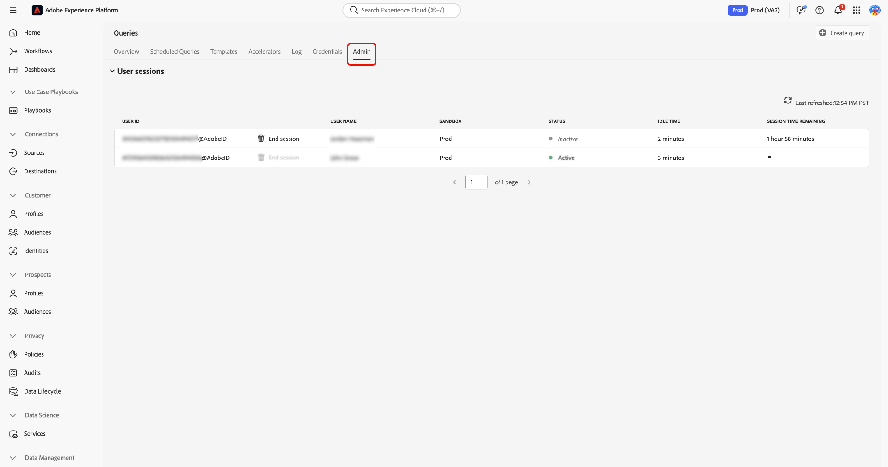

# Query Service-sessies beheren

>[!AVAILABILITY]
>
>Het beheer van de zitting voor de Dienst van de Vraag is momenteel in beperkte beschikbaarheid en is slechts beschikbaar aan organisaties met **Gegevens Distiller** rechten. Neem contact op met uw Adobe-accountteam als u toegang wilt aanvragen.

Gebruik deze handleiding om actieve Query Service-sessies vanuit de Adobe Experience Platform-gebruikersinterface te beheren. Met sessiebeheer kunnen beheerders gelijktijdige Query-editorsessies in sandboxen controleren en de capaciteit vrijmaken wanneer gebruikers sessies geopend laten.

## Machtigingen vereist voor sessiebeheer {#permissions}

>[!IMPORTANT]
>
>Deze functie is bedoeld voor beheerders. Eindgebruikers die query&#39;s uitvoeren, kunnen geen sessies beheren.

Als u sessies wilt weergeven en beëindigen, moet u behoren tot een organisatie met Data Distiller-toegang en de machtiging **[!UICONTROL Manage Query Session]** hebben toegewezen. Gebruikers zonder de vereiste machtigingen hebben toegang tot Query Service, maar kunnen actieve sessies niet weergeven of beheren.

## Actieve sessies weergeven {#view-active-sessions}

Beheerders kunnen alle actieve Query Service-sessies weergeven in verschillende sandboxen in uw organisatie. Selecteer in Experience Platform **[!UICONTROL Queries]** in de linkernavigatie om de werkruimte van Query Service te openen en selecteer vervolgens het tabblad **[!UICONTROL Admin]** voor toegang tot sessiebeheer.

De lijst van het zittingsbeheer werkt automatisch in echt - tijd bij en maakt een lijst van alle zittingen die momenteel de gezamenlijke zittingscapaciteit van de Dienst van de Vraag gebruiken die aan uw organisatie wordt toegewezen. Elke rij vertegenwoordigt één enkele zitting die in de Redacteur van de Vraag wordt geopend.

## Sessiestatus en inactieve tijd {#session-status}

De zittingslijst verstrekt informatie om u te helpen beslissen of een zitting veilig kan worden gebeëindigd.

| Kolom | Beschrijving |
| --- | --- |
| Gebruikers-id | De Adobe ID van de gebruiker die de sessie heeft |
| Gebruikersnaam | De naam die aan de Adobe ID is gekoppeld |
| Sandbox | Geeft de sandbox aan waarop de sessie wordt uitgevoerd |
| Sessiestatus | Geeft aan of de sessie **[!UICONTROL Active]** of **[!UICONTROL Inactive]** is |
| Niet-actieve tijd | Geeft aan hoelang de sessie zonder interactie is geopend |
| Resterende sessietijd | Geeft aan hoelang de sessie open kan blijven voordat deze automatisch verloopt |

### Sessiestatus

**[!UICONTROL Inactive]** geeft aan dat de gebruiker niet actief een query uitvoert; deze sessies kunnen worden beëindigd. **[!UICONTROL Active]** geeft aan dat er momenteel een query wordt uitgevoerd. Het besturingselement **[!UICONTROL End session]** is pas beschikbaar als de query is uitgevoerd.

### Niet-actieve tijd en resterende sessietijd

De inactieve tijd toont hoe lang een zitting zonder gebruikersinteractie open is geweest. De resterende sessietijd geeft aan hoe lang de sessie open kan blijven voordat deze automatisch wordt gesloten door het systeem. Sessies verlopen automatisch na de maximale toegestane duur (twee uur inactiviteit). Deze duur is systeem-bepaald en kan niet worden gevormd.

## Niet-actieve sessies beëindigen {#end-idle-sessions}

U kunt inactieve sessies beëindigen om de capaciteit van gelijktijdige sessies voor andere gebruikers vrij te maken. Overweeg sessies met een hoge inactieve tijd te beëindigen wanneer gebruikers niet langer actief werken.

Selecteer in de tabel voor sessiebeheer de optie **[!UICONTROL End session]** om de inactieve sessie te kiezen die u wilt beëindigen.

Er verschijnt een bevestigingsvenster om te voorkomen dat het programma per ongeluk wordt afgesloten. Selecteer **[!UICONTROL End session]** in het dialoogvenster om de handeling te bevestigen.

Nadat de zitting beëindigt, wordt de zitting verwijderd uit de lijst, wordt de capaciteit onmiddellijk beschikbaar, en de actie wordt geregistreerd voor controle.

>[!NOTE]
>
>Sessies met status **[!UICONTROL Active]** kunnen niet worden beëindigd. Deze beveiliging voorkomt onderbreking van werklasten tijdens de uitvoering.

## Sessiegedrag na beëindiging {#session-behavior-after-termination}

Wanneer een beheerder een zitting beëindigt, blijft de code van de beïnvloede gebruiker in de redacteur zonder het werk te verliezen. Als de gebruiker probeert om een vraag in werking te stellen na beëindiging, ontdekt het systeem de beëindigde zitting, herstelt automatisch de verbinding, en houdt de inhoud van de Redacteur van de Vraag intact.

Dit gedrag zorgt ervoor dat gebruikers het werk dat in de redacteur wordt geschreven niet verliezen en kan verdergaan zodra een nieuwe zitting wordt gevestigd.

## Controlelogboeken voor sessiebeheer {#audit-logs}

Het systeem registreert sessiebeheeracties om zichtbaarheid en verantwoording te bieden. De logboeken van de controle registreren zittings identiteitskaart, de gebruiker van wie zitting werd gebeëindigd, de beheerder die de actie, en de tijd van de actie uitvoerde.

De controlelogboeken van het gebruik om de geschiedenis van de zittingsbeëindiging te herzien en onverwachte losmakingen te onderzoeken.

Voor meer informatie over het bekijken van controlelogboeken, zie de [ gids van het de controlelogboek van de Dienst van de Vraag ](../data-governance/audit-log-guide.md).

## Volgende stappen {#next-steps}

Overweeg de volgende bronnen om uw gebruik van Query Service en Data Distiller uit te breiden:

* [Leer hoe de gebruikers vragen in de gebruikersgids van de Redacteur van de Vraag creëren en in werking stellen](user-guide.md)
* [De geplande werklasten controleren gebruikend de geplande vragen controledocumentatie](monitor-queries.md)
