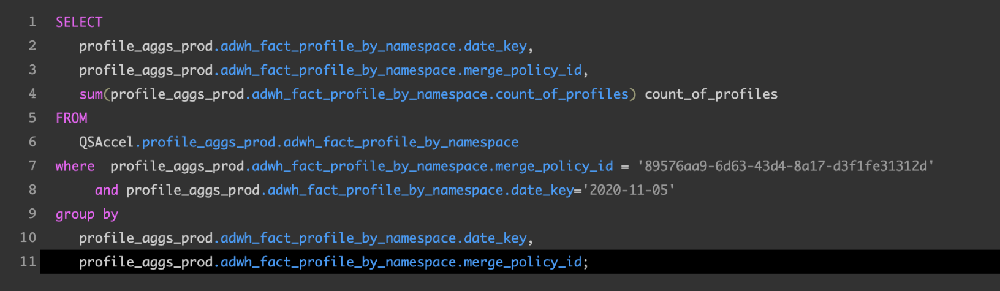

# [!DNL Query Editor] UI-hulplijn

[!DNL Query Editor] is een interactief hulpmiddel dat door Adobe Experience Platform wordt verstrekt  [!DNL Query Service], dat u toestaat om, vragen voor klantenervaringsgegevens binnen het  [!DNL Experience Platform] gebruikersinterface te schrijven te bevestigen en in werking te stellen. [!DNL Query Editor] ondersteunt het ontwikkelen van query&#39;s voor analyse en gegevensexploratie, en staat u toe om interactieve query&#39;s voor ontwikkelingsdoeleinden en niet-interactieve query&#39;s uit te voeren om datasets in te vullen  [!DNL Experience Platform].

Voor meer informatie over de concepten en de eigenschappen van [!DNL Query Service], zie [Overzicht van de Dienst van de Vraag](../home.md). Meer over hoe te om het gebruikersinterface van de Dienst van de Vraag op [!DNL Platform] te navigeren, zie [overzicht UI van de Dienst van de Vraag](./overview.md).

## Aan de slag

[!DNL Query Editor] verstrekt flexibele uitvoering van vragen door met te verbinden,  [!DNL Query Service]en de vragen zullen slechts lopen terwijl deze verbinding actief is.

### Verbinding maken met [!DNL Query Service]

[!DNL Query Editor] Het duurt een paar seconden om te initialiseren en verbinding te maken  [!DNL Query Service] wanneer het wordt geopend. De console vertelt u wanneer het wordt verbonden, zoals hieronder getoond. Als u probeert om een vraag in werking te stellen alvorens de redacteur heeft verbonden, vertraagt het uitvoering tot de verbinding volledig is.

### Hoe de vragen van [!DNL Query Editor] in werking worden gesteld

De vragen die van [!DNL Query Editor] worden uitgevoerd interactief. Dit betekent dat als u de browser sluit of wegnavigeert, de query wordt geannuleerd. Dit is ook waar voor vragen die worden gemaakt om datasets van vraagoutput te produceren.

## Ontwerpend van de vraag gebruikend [!DNL Query Editor]

Met [!DNL Query Editor] kunt u query&#39;s schrijven, uitvoeren en opslaan voor gegevens van de klantenervaring. Alle query&#39;s die worden uitgevoerd in [!DNL Query Editor] of worden opgeslagen, zijn beschikbaar voor alle gebruikers in uw organisatie met toegang tot [!DNL Query Service].

### Toegang tot het [!DNL Query Editor]

Selecteer [!DNL Experience Platform] in het navigatiemenu aan de linkerkant van de gebruikersinterface om de werkruimte [!DNL Query Service] te openen. **[!UICONTROL Queries]** Selecteer vervolgens **[!UICONTROL Create Query]** rechtsboven in het scherm om query&#39;s te schrijven. Deze koppeling is beschikbaar op een van de pagina&#39;s in de werkruimte [!DNL Query Service].

### Bezig met schrijven van query&#39;s

[!UICONTROL Query Editor] is georganiseerd om het schrijven van vragen zo gemakkelijk mogelijk te maken. De schermafbeelding hieronder laat zien hoe de editor in de UI wordt weergegeven, met de knop **Afspelen** en het veld SQL-item gemarkeerd.

Om uw ontwikkelingstijd te minimaliseren, adviseert men dat u uw vragen met grenzen op de teruggekeerde rijen ontwikkelt. Bijvoorbeeld, `SELECT fields FROM table WHERE conditions LIMIT number_of_rows`. Nadat u hebt geverifieerd dat uw vraag de verwachte output veroorzaakt, verwijder de grenzen en stel de vraag met `CREATE TABLE tablename AS SELECT` in werking om een dataset met de output te produceren.

### Schrijfgereedschappen in [!DNL Query Editor]

- **Automatische syntaxismarkering:** maakt het lezen en ordenen van SQL eenvoudiger.

- **SQL-sleutelwoord automatisch aanvullen:** typ de query en gebruik vervolgens de pijltoetsen om naar de gewenste term te navigeren en druk op  **Enter**.

- **Tabel en veld automatisch aanvullen:** typ de tabelnaam die u wilt  `SELECT` opgeven en navigeer met de pijltoetsen naar de gewenste tabel en druk op  **Enter**. Als een tabel eenmaal is geselecteerd, worden de velden in die tabel automatisch herkend.

### Foutdetectie

[!DNL Query Editor] valideert automatisch een vraag aangezien u het schrijft, verstrekkend generische SQL bevestiging en specifieke uitvoeringsbevestiging. Als een rode onderstreping onder de query wordt weergegeven (zoals in de onderstaande afbeelding wordt getoond), vertegenwoordigt deze een fout binnen de query.

Wanneer fouten worden ontdekt, kunt u de specifieke foutenmeldingen bekijken door over de SQL code te hangen.

### Query-details

Terwijl u een vraag in [!DNL Query Editor] bekijkt, **[!UICONTROL Query Details]** verstrekt het paneel hulpmiddelen om de geselecteerde vraag te beheren.

Dit paneel staat u toe om een outputdataset direct van UI te produceren, de getoonde vraag te schrappen of te noemen, en een programma aan de vraag toe te voegen.

In dit deelvenster worden ook nuttige metagegevens weergegeven, zoals de laatste keer dat de query werd gewijzigd en de eventuele wijziging. Selecteer **[!UICONTROL Output Dataset]** om een gegevensset te genereren. Het dialoogvenster **[!UICONTROL Output Dataset]** wordt weergegeven. Voer een naam en beschrijving in en selecteer **[!UICONTROL Run Query]**. De nieuwe dataset wordt getoond in **[!UICONTROL Datasets]** tabel op [!DNL Query Service] gebruikersinterface op [!DNL Platform].

### Geplande query&#39;s {#scheduled-queries}

>[!NOTE]
>
> U kunt alleen een schema toevoegen aan een query die al is gemaakt, opgeslagen en uitgevoerd. Bovendien, zult u **not** een programma aan een parameterized vraag kunnen toevoegen.

Om een programma aan een vraag toe te voegen, selecteer **[!UICONTROL Add schedule]**.

De pagina **[!UICONTROL Schedule details]** wordt weergegeven. Op deze pagina, kunt u de frequentie van de geplande vraag kiezen, de data de geplande vraag zal lopen, evenals welke dataset om de vraag naar uit te voeren.

U kunt de volgende opties kiezen voor **[!UICONTROL Frequency]**:

- **[!UICONTROL Hourly]**: De geplande vraag zal elk uur voor de datumperiode lopen u selecteerde.
- **[!UICONTROL Daily]**: De geplande query wordt elke X dagen uitgevoerd op het moment en de datumperiode die u hebt geselecteerd. Houd er rekening mee dat de geselecteerde tijd zich in **UTC** bevindt en niet in uw lokale tijdzone.
- **[!UICONTROL Weekly]**: De geselecteerde query wordt uitgevoerd op de dagen van de week, tijd en de datumperiode die u hebt geselecteerd. Houd er rekening mee dat de geselecteerde tijd zich in **UTC** bevindt en niet in uw lokale tijdzone.
- **[!UICONTROL Monthly]**: De geselecteerde vraag zal elke maand op de dag, de tijd, en de datumperiode lopen u selecteerde. Houd er rekening mee dat de geselecteerde tijd zich in **UTC** bevindt en niet in uw lokale tijdzone.
- **[!UICONTROL Yearly]**: De geselecteerde vraag zal elk jaar op de dag, de maand, de tijd, en de datumperiode lopen u selecteerde. Houd er rekening mee dat de geselecteerde tijd zich in **UTC** bevindt en niet in uw lokale tijdzone.

Voor de dataset, hebt u de optie om of een bestaande dataset te gebruiken of een nieuwe dataset tot stand te brengen.

>[!IMPORTANT]
>
> Aangezien u of bestaand gebruikt of een nieuwe dataset creeert, moet u **not** of `INSERT INTO` als deel van de vraag omvatten, aangezien de datasets reeds worden geplaatst. `CREATE TABLE AS SELECT` Het opnemen van `INSERT INTO` of `CREATE TABLE AS SELECT` als deel van uw geplande vragen zal in een fout resulteren.

Nadat u al deze details hebt bevestigd, selecteert u **[!UICONTROL Save]** om een schema te maken.

De pagina van vraagdetails verschijnt opnieuw, en nu het tonen van de details van het pas gecreëerde programma, met inbegrip van planningsidentiteitskaart, het programma zelf, en de de outputdataset van het programma. U kunt programmaidentiteitskaart gebruiken om meer informatie over de looppas van de geplande vraag zelf te zoeken. Lees voor meer informatie de [Geplande handleiding voor de eindpunten van querybewerkingen](../api/runs-scheduled-queries.md).

>[!NOTE]
>
> U kunt **one** vraagmalplaatje slechts plannen gebruikend UI. Als u extra programma&#39;s aan een vraagmalplaatje wilt toevoegen, zult u API moeten gebruiken. Als een programma reeds gebruikend API is toegevoegd, zult u **not** extra programma&#39;s gebruikend UI toevoegen. Als de veelvoudige programma&#39;s reeds in bijlage aan een vraagmalplaatje zijn, slechts zal het oudste programma worden getoond. Om te leren hoe te om programma&#39;s toe te voegen gebruikend API, te lezen gelieve [geplande gids van het vraageindpunt](../api/scheduled-queries.md).
>
> Bovendien, zou u de pagina moeten verfrissen als u wilt verzekeren u de recentste staat voor het programma hebt u bekijkt.

#### Een schema verwijderen

U kunt een programma schrappen door **[!UICONTROL Delete a schedule]** te selecteren.

>[!IMPORTANT]
>
> Als u een programma voor een vraag wilt schrappen, moet u eerst het programma onbruikbaar maken.

### Bezig met opslaan van query&#39;s

[!DNL Query Editor] beschikt over een opslagfunctie waarmee u een query kunt opslaan en er later aan kunt werken. Als u een query wilt opslaan, selecteert u **[!UICONTROL Save]** in de rechterbovenhoek van [!DNL Query Editor]. Voordat een query kan worden opgeslagen, moet een naam voor de query worden opgegeven met het deelvenster **[!UICONTROL Query Details]**.

### Hoe te om vorige vragen te vinden

Alle query&#39;s die worden uitgevoerd vanuit [!DNL Query Editor] worden vastgelegd in de logbestandentabel. U kunt de onderzoeksfunctionaliteit op **[!UICONTROL Log]** lusje gebruiken om vraaguitvoeringen te vinden. Opgeslagen query&#39;s worden weergegeven op het tabblad **[!UICONTROL Browse]**.

Zie [Overzicht van de Dienst UI van de Vraag](./overview.md) voor meer informatie.

>[!NOTE]
>
>Vragen die niet worden uitgevoerd, worden niet opgeslagen in het logbestand. De query is alleen beschikbaar in [!DNL Query Service] als deze wordt uitgevoerd of opgeslagen in [!DNL Query Editor].

## Vragen uitvoeren met de Query Editor

Als u een query wilt uitvoeren in [!DNL Query Editor], kunt u SQL invoeren in de editor of een vorige query laden via het tabblad **[!UICONTROL Log]** of **[!UICONTROL Browse]** en **Afspelen** selecteren. De status van query-uitvoering wordt hieronder weergegeven op het tabblad **[!UICONTROL Console]** en de uitvoergegevens worden weergegeven op het tabblad **[!UICONTROL Results]**.

### Console

De console verstrekt informatie over de status en de verrichting van [!DNL Query Service]. De console toont de verbindingsstatus aan [!DNL Query Service], vraagverrichtingen die, en om het even welke foutenmeldingen worden uitgevoerd die uit die vragen voortvloeien.

>[!NOTE]
>
>De console toont slechts fouten die uit het uitvoeren van een vraag voortkwamen. Er worden geen fouten met de queryvalidatie weergegeven voordat een query wordt uitgevoerd.

### Zoekresultaten

Nadat een query is voltooid, worden de resultaten weergegeven op het tabblad **[!UICONTROL Results]**, naast het tabblad **[!UICONTROL Console]**. In deze weergave wordt de tabeluitvoer van uw query weergegeven, met maximaal 100 rijen. In deze weergave kunt u controleren of de query de verwachte uitvoer oplevert. Om een dataset met uw vraag te produceren, verwijder grenzen op teruggekeerde rijen, en stel de vraag met `CREATE TABLE tablename AS SELECT` in werking om een dataset met de output te produceren. Zie [het produceren van datasetleerprogramma](./create-datasets.md) voor instructies op hoe te om een dataset van vraagresultaten in [!DNL Query Editor] te produceren.

## Zoekopdrachten uitvoeren met zelfstudie [!DNL Query Service]

In de volgende video ziet u hoe u query&#39;s uitvoert in de Adobe Experience Platform-interface en in een PSQL-client. Bovendien wordt het gebruik van individuele eigenschappen in een XDM-object, met gebruik van door Adobe gedefinieerde functies en het gebruik van CREATE TABLE AS SELECT (CTAS) aangetoond.

>[!VIDEO](https://video.tv.adobe.com/v/29796?quality=12&learn=on)

## Volgende stappen

Nu u weet welke functies beschikbaar zijn in [!DNL Query Editor] en hoe u door de toepassing kunt navigeren, kunt u uw eigen query&#39;s rechtstreeks schrijven in [!DNL Platform]. Voor meer informatie over het runnen van SQL vragen tegen datasets in [!DNL Data Lake], zie de gids op [lopende query](../best-practices/writing-queries.md).
