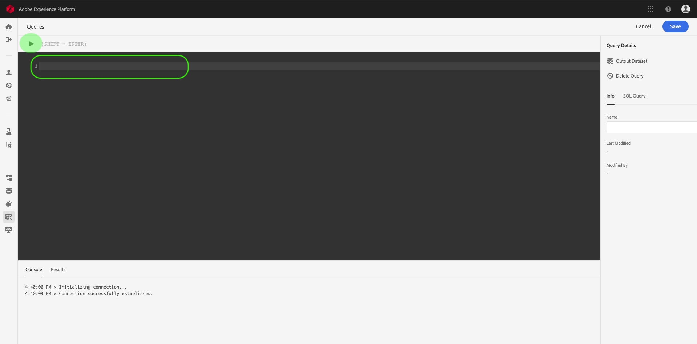
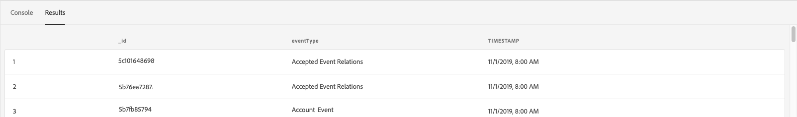

# Gebruikershandleiding voor de Query Editor

De Redacteur van de vraag is een interactief hulpmiddel dat door de Dienst van de Vraag van het Platform van de Ervaring van Adobe wordt verstrekt, die u toestaat om, vragen voor de gegevens van de klantenervaring binnen het Gebruikersinterface van het Platform van de Ervaring te schrijven te bevestigen en in werking te stellen. De Redacteur van de vraag steunt het ontwikkelen van vragen voor analyse en gegevensexploratie, en staat u toe om interactieve vragen voor ontwikkelingsdoeleinden evenals niet-interactieve vragen in werking te stellen om datasets in het Platform van de Ervaring te bevolken.

Voor meer informatie over de concepten en de eigenschappen van de Dienst van de Vraag, zie het overzicht [van de Dienst van de][query-service-overview]Vraag. Meer over hoe te om het gebruikersinterface van de Dienst van de Vraag op Platform te navigeren, zie het overzicht [van de Dienst van de][query-service-ui]Vraag.

## Aan de slag

De Redacteur van de vraag verstrekt flexibele uitvoering van vragen door met de Dienst van de Vraag te verbinden, en de vragen zullen slechts lopen terwijl deze verbinding actief is.

### Verbinding maken met Query-service

De Redacteur van de vraag neemt een paar seconden om met de Dienst van de Vraag te initialiseren en te verbinden wanneer het wordt geopend. De console vertelt u wanneer het wordt verbonden, zoals hieronder getoond. Als u probeert om een vraag in werking te stellen alvorens de redacteur heeft verbonden, vertraagt het uitvoering tot de verbinding volledig is.

### Hoe de vragen van de Redacteur van de Vraag in werking worden gesteld

De vragen die van de Redacteur van de Vraag worden uitgevoerd interactief. Dit betekent dat als u de browser sluit of wegnavigeert, de query wordt geannuleerd. Dit is ook waar voor vragen die worden gemaakt om datasets van vraagoutput te produceren.

## Query schrijven met de Query Editor

Gebruikend de Redacteur van de Vraag, kunt u schrijven, uitvoeren en sparen vragen voor de gegevens van de klantenervaring. Alle vragen die in de Redacteur van de Vraag worden uitgevoerd, of worden bewaard, zijn beschikbaar aan alle gebruikers in uw organisatie met toegang tot de Dienst van de Vraag.

### Query-editor openen

In het Platform van de Ervaring UI, klik **Vragen** in het linkernavigatiemenu om de werkruimte van de Dienst van de Vraag te openen. Klik vervolgens **op Query** maken rechtsboven in het scherm om query&#39;s te schrijven. Deze koppeling is beschikbaar op een van de pagina&#39;s in de werkruimte van de Query-service.

### Bezig met schrijven van query&#39;s

De redacteur van de vraag wordt georganiseerd om het schrijven vragen zo gemakkelijk mogelijk te maken. In de onderstaande schermafbeelding ziet u hoe de editor in de gebruikersinterface wordt weergegeven, met de knop **Afspelen** en het veld SQL-item gemarkeerd.

Om uw ontwikkelingstijd te minimaliseren, adviseert men dat u uw vragen met grenzen op de teruggekeerde rijen ontwikkelt. Bijvoorbeeld, `SELECT fields FROM table WHERE conditions LIMIT number_of_rows`. Nadat u hebt geverifieerd dat uw vraag de verwachte output veroorzaakt, verwijder de grenzen en stel de vraag met in werking `CREATE TABLE tablename AS SELECT` om een dataset met de output te produceren.

### Schrijfgereedschappen in de Query Editor

- **Automatische syntaxismarkering:** Maakt het lezen en ordenen van SQL gemakkelijker.

- **SQL-trefwoord automatisch aanvullen:** Begin het typen van uw vraag dan de pijlsleutels te gebruiken om aan de gewenste termijn te navigeren en **binnengaan** te drukken.

- **Tabel en veld automatisch aanvullen:** Typ de tabelnaam die u wilt `SELECT` gebruiken en navigeer naar de gewenste tabel met de pijltoetsen. Druk op **Enter**. Als een tabel eenmaal is geselecteerd, worden de velden in die tabel automatisch herkend.

### Foutdetectie

De Redacteur van de vraag bevestigt automatisch een vraag aangezien u het schrijft, verstrekkend generische SQL bevestiging en specifieke uitvoeringsbevestiging. Als een rode onderstreping onder de query wordt weergegeven (zoals in de onderstaande afbeelding wordt getoond), vertegenwoordigt deze een fout binnen de query.

Wanneer fouten worden ontdekt, kunt u de specifieke foutenmeldingen bekijken door over de SQL code te hangen.

### Query-details

Terwijl u een vraag in de Redacteur van de Vraag bekijkt, verstrekt het paneel van de Details *van de* Vraag hulpmiddelen om de geselecteerde vraag te beheren.

In dit deelvenster kunt u rechtstreeks vanuit de gebruikersinterface een uitvoergegevensset genereren, de weergegeven query verwijderen of een naam geven en de SQL-code in een gemakkelijk te kopiëren indeling weergeven op het tabblad *SQL-query* . In dit deelvenster worden ook nuttige metagegevens weergegeven, zoals de laatste keer dat de query werd gewijzigd en de eventuele wijziging. Als u een gegevensset wilt genereren, klikt u op Gegevensset **Uitvoer**. Het dialoogvenster *Uitvoergegevensset* wordt geopend. Voer een naam en beschrijving in en klik vervolgens op **Query** uitvoeren. De nieuwe dataset wordt getoond in het lusje van *Datasets* op het gebruikersinterface van de Dienst van de Vraag op Platform.

### Bezig met opslaan van query&#39;s

De Redacteur van de vraag verstrekt een sparen functie die u toestaat om een vraag op te slaan en aan het later te werken. Als u een query wilt opslaan, klikt u op **Opslaan** in de rechterbovenhoek van de Query-editor. Voordat een query kan worden opgeslagen, moet u een naam opgeven voor de query via het deelvenster *Query-details* .

### Hoe te om vorige vragen te vinden

Alle vragen die van de Redacteur van de Vraag worden uitgevoerd worden gevangen in de lijst van het Logboek. U kunt de zoekfunctionaliteit op het tabblad *Logboek* gebruiken om query-uitvoeringen te zoeken. Opgeslagen query&#39;s worden weergegeven op het tabblad *Bladeren* .

Zie het overzicht [van de Dienst van de][query-service-ui] Vraag UI voor meer informatie.

>[!NOTE] Vragen die niet worden uitgevoerd, worden niet opgeslagen in het logbestand. De query is alleen beschikbaar in Query Service als deze wordt uitgevoerd of opgeslagen in Query Editor.

## Vragen uitvoeren met de Query Editor

Om een vraag in de Redacteur van de Vraag in werking te stellen, kunt u SQL in de redacteur ingaan of een vorige vraag van het *Logboek* laden of *doorbladert* lusje, en **Spel** klikken. De status van de vraaguitvoering wordt getoond op het lusje van de *Console* hieronder, en de outputgegevens worden getoond op het lusje van *Resultaten* .

### Console

De console verstrekt informatie over de status en de verrichting van de Dienst van de Vraag. De console toont de verbindingsstatus aan de Dienst van de Vraag, vraagverrichtingen die, en om het even welke foutenmeldingen worden uitgevoerd die uit die vragen voortvloeien.

>[!NOTE] De console toont slechts fouten die uit het uitvoeren van een vraag voortkwamen. Er worden geen fouten met de queryvalidatie weergegeven voordat een query wordt uitgevoerd.

### Zoekresultaten

Nadat een query is voltooid, worden de resultaten weergegeven op het tabblad *Resultaten* , naast het tabblad *Console* . In deze weergave wordt de tabeluitvoer van uw query weergegeven, met maximaal 100 rijen. In deze weergave kunt u controleren of de query de verwachte uitvoer oplevert. Om een dataset met uw vraag te produceren, verwijder grenzen op teruggekeerde rijen, en stel de vraag met in werking `CREATE TABLE tablename AS SELECT` om een dataset met de output te produceren. Zie het [produceren datasetleerprogramma][query-service-create-datasets] voor instructies op hoe te om een dataset van vraagresultaten in de Redacteur van de Vraag te produceren.

## Volgende stappen

Nu u weet welke eigenschappen in de Redacteur van de Vraag beschikbaar zijn en hoe te om de toepassing te navigeren, kunt u beginnen creërend uw eigen vragen direct in Platform. Voor meer informatie over het runnen van SQL vragen tegen datasets in het Meer van Gegevens, zie de gids bij het [runnen van vragen][query-service-running-queries]. Zie de naslaggids voor [voorbeeldquery&#39;s voor voorbeeld-SQL-query&#39;s voor het werken met Adobe Analytics en Adobe Target-gegevens][query-service-sample-queries].

[query-service-overview]: ../home.md
[query-service-ui]: overview.md
[query-service-running-queries]: ../creating-queries/creating-queries.md
[query-service-sample-queries]: ../sample-queries/overview.md
[query-service-create-datasets]: ../creating-queries/create-datasets.md
