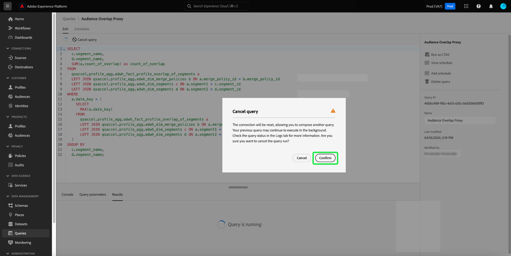

# Handleiding voor de Query Editor

>[!NOTE]
>
>Op 24 mei 2024 is de erfenisredacteur afgekeurd. Het is niet meer toegankelijk voor gebruik. U kunt nu de opdracht [Uitgebreide query-editor](#enhanced-editor-toggle) om uw vragen te schrijven, te bevestigen en te leiden

De Redacteur van de vraag is een interactief hulpmiddel dat door de Dienst van de Vraag van Adobe Experience Platform wordt verstrekt, die u toestaat schrijven, bevestigen, en vragen voor de gegevens van de klantenervaring in werking te stellen binnen [!DNL Experience Platform] gebruikersinterface. De Redacteur van de vraag steunt het ontwikkelen van vragen voor analyse en gegevensexploratie, en staat u toe om interactieve vragen voor ontwikkelingsdoeleinden evenals niet-interactieve vragen in werking te stellen om datasets in te vullen [!DNL Experience Platform].

Voor meer informatie over de concepten en de eigenschappen van de Dienst van de Vraag, zie [Overzicht van Query Service](../home.md). Meer over leren hoe te om het gebruikersinterface van de Dienst van de Vraag te navigeren [!DNL Platform], zie de [Overzicht van Query Service](./overview.md).

## Aan de slag {#getting-started}

De redacteur van de Vraag verstrekt flexibele uitvoering van vragen door met de Dienst van de Vraag te verbinden, en vragen slechts lopen terwijl deze verbinding actief is.

## Query-editor openen {#accessing-query-editor}

In de [!DNL Experience Platform] UI, selecteer **[!UICONTROL Queries]** in het linkernavigatiemenu om de werkruimte van de Dienst van de Vraag te openen. Selecteer vervolgens **[!UICONTROL Create Query]** rechtsboven in het scherm. Deze koppeling is beschikbaar op een van de pagina&#39;s in de werkruimte van de Query-service.

### Verbinding maken met Query-service {#connecting-to-query-service}

De redacteur van de Vraag neemt een paar seconden om met de Dienst van de Vraag te initialiseren en te verbinden wanneer het wordt geopend. De console vertelt u wanneer het wordt aangesloten, zoals hieronder getoond. Als u probeert om een vraag in werking te stellen alvorens de redacteur heeft verbonden, vertraagt het uitvoering tot de verbinding volledig is.

### Hoe de vragen van de Redacteur van de Vraag in werking worden gesteld {#run-a-query}

De vragen die van de Redacteur van de Vraag worden uitgevoerd stellen interactief in werking. Dit betekent dat als u browser sluit of weg navigeert, de vraag wordt geannuleerd. Het zelfde is waar voor vragen die worden gemaakt om datasets van vraagoutput te produceren.

## Query schrijven met de Uitgebreide Query Editor {#query-authoring}

>[!NOTE]
>
>Op 24 mei 2024 is de erfenisredacteur afgekeurd. Het is niet meer toegankelijk voor gebruik. U kunt de Uitgebreide Redacteur van de Vraag nu gebruiken om, uw vragen te schrijven te bevestigen en in werking te stellen.

Gebruikend de Redacteur van de Vraag, kunt u schrijven, uitvoeren en sparen vragen voor de gegevens van de klantenervaring. Alle uitgevoerde vragen, of opgeslagen in de Redacteur van de Vraag zijn beschikbaar aan alle gebruikers in uw organisatie met toegang tot de Dienst van de Vraag.

### Instellingen {#settings}

Een instellingenpictogram boven het invoerveld van de Query Editor bevat opties voor het in-/uitschakelen van donker thema of voor het automatisch aanvullen.

>[!TIP]
>
>U kunt [!UICONTROL Disable syntax auto complete] terwijl het ontwerpen van een vraag zonder uw vooruitgang te verliezen.

Selecteer het instellingspictogram () gevolgd door de optie in het vervolgkeuzemenu dat wordt weergegeven.

#### Automatisch aanvullen {#auto-complete}

De redacteur van de Vraag stelt automatisch potentiële SQL sleutelwoorden samen met lijst of kolomdetails voor de vraag voor aangezien u het schrijft. De functie voor automatisch aanvullen is standaard ingeschakeld en kan op elk gewenst moment worden uitgeschakeld of ingeschakeld via de instellingen in de Query Editor.

De auto-volledige configuratie het plaatsen is per gebruiker en voor de opeenvolgende logins voor die gebruiker herinnerd. Als u deze functie uitschakelt, worden meerdere metagegevensopdrachten niet verwerkt en worden aanbevelingen gedaan die de snelheid van de auteur bij het bewerken van query&#39;s ten goede komen.

<!-- Currently editing the auto complete setting info. -->

### Meerdere opeenvolgende query&#39;s uitvoeren {#execute-multiple-sequential-queries}

Gebruik de Uitgebreide Redacteur van de Vraag om meer dan één vraag te schrijven en alle vragen op een opeenvolgende manier uit te voeren. De uitvoering van veelvoudige vragen in een opeenvolging elk produceert een logboekingang. Nochtans, slechts de resultaten van de eerste vraagvertoning in de console van de Redacteur van de Vraag. Controleer het vraaglogboek als u de vragen moet problemen oplossen of bevestigen die werden uitgevoerd. Zie de [documentatie met querylogbestanden](./query-logs.md) voor meer informatie .

>[!NOTE]
> 
>Als een vraag CTAS na de eerste vraag in de Redacteur van de Vraag wordt uitgevoerd, wordt een lijst nog gecreeerd maar er is geen output op de console van de Redacteur van de Vraag.

### Geselecteerde query uitvoeren {#execute-selected-query}

Als u meerdere query&#39;s hebt geschreven maar slechts één query moet uitvoeren, kunt u de gekozen query markeren en de opdracht
[!UICONTROL Run selected query] pictogram. Dit pictogram wordt standaard uitgeschakeld totdat u de querysyntaxis in de editor selecteert.

![De Query-editor met de [!UICONTROL Run selected query] gemarkeerd.](../images/ui/query-editor/run-selected-query.png)

### Query Editor-sessie annuleren {#cancel-query}

Neem controle van vraaguitvoering en verbeter uw productiviteit door langdurige vragen te annuleren. Deze actie ontruimt de Redacteur van de Vraag tijdens een vraaglooppas. De query wordt op de achtergrond uitgevoerd. Als het een vraag CTAS is zal het nog een outputdataset produceren. Als u de uitvoering in de editor wilt annuleren en een SQL-instructie wilt blijven samenstellen, selecteert u **[!UICONTROL Cancel query]** nadat een query is uitgevoerd.

![De Query-editor met [!UICONTROL Cancel query] gemarkeerd.](../images/ui/query-editor/cancel-query-run.png)

Er wordt een bevestigingsvenster weergegeven. Selecteren **[!UICONTROL Confirm]** om de queryuitvoering te annuleren.

### Resultaattelling {#result-count}

De redacteur van de Vraag heeft een maximum 50.000 rijoutput. U kunt het aantal rijen kiezen die tegelijkertijd in de console van de Redacteur van de Vraag worden getoond. Als u het aantal rijen wilt wijzigen dat in de console wordt weergegeven, selecteert u de optie **[!UICONTROL Result count]** en selecteer de opties 50, 100, 150, 300 en 500.

## Bezig met schrijven van query&#39;s {#writing-queries}

[!UICONTROL Query Editor] is georganiseerd om het schrijven van vragen zo gemakkelijk mogelijk te maken. In de onderstaande schermafbeelding ziet u hoe de editor in de gebruikersinterface wordt weergegeven, met het veld voor SQL-invoer en **Afspelen** gemarkeerd.

Om uw ontwikkelingstijd te minimaliseren, wordt u geadviseerd om uw vragen met grenzen op het aantal teruggekeerde rijen te ontwikkelen. Bijvoorbeeld: `SELECT fields FROM table WHERE conditions LIMIT number_of_rows`. Nadat u hebt gecontroleerd dat uw vraag de verwachte output veroorzaakt, verwijder de grenzen en stel de vraag met in werking `CREATE TABLE tablename AS SELECT` om een dataset met de output te produceren.

## Schrijfgereedschappen in de Query Editor {#writing-tools}

- **Automatische syntaxismarkering:** Maakt het lezen en ordenen van SQL gemakkelijker.

- **SQL trefwoord automatisch aanvullen:** Begin uw vraag te typen dan de pijlsleutels te gebruiken om aan de gewenste termijn te navigeren en te drukken **Enter**.

- **Tabel en veld automatisch aanvullen:** Typ de tabelnaam die u wilt gebruiken `SELECT` van, dan gebruik de pijlsleutels om aan de lijst te navigeren u zoekt, en drukt **Enter**. Als een tabel is geselecteerd, worden de velden in die tabel automatisch herkend.

### Tekst opmaken {#format-text}

De [!UICONTROL Format text] maakt uw query leesbaarder door gestandaardiseerde syntaxisopmaak toe te voegen. Selecteren **[!UICONTROL Format text]** om alle tekst binnen de Redacteur van de Vraag te standaardiseren.

>[!NOTE]
>
>De [!UICONTROL Format text] werkt niet met anonieme blokken. Als u wilt weten hoe u een of meer SQL-instructies opeenvolgend kunt koppelen, raadpleegt u de [anonieme blokdocumentatie](../key-concepts/anonymous-block.md).

![De Query-editor met [!UICONTROL Format text] en de SQL-instructies gemarkeerd.](../images/ui/query-editor/format-text.png)

<!-- ### Undo text {#undo-text}

If you format your SQL in the Query Editor, you can undo the formatting applied by the [!UICONTROL Format text] feature. To return your SQL back to its original form, select **[!UICONTROL Undo text]**.

![The Query Editor with [!UICONTROL Undo text] and the SQL statements highlighted.](../images/ui/query-editor/undo-text.png) -->

### SQL kopiëren {#copy-sql}

Selecteer het kopieerpictogram om SQL van de Redacteur van de Vraag aan uw klembord te kopiëren. Deze kopieerfunctie is beschikbaar voor zowel querysjablonen als nieuwe query&#39;s in de Query Editor.

### Query-details {#query-details}

Als u een query wilt weergeven in de Query-editor, selecteert u een opgeslagen sjabloon in het menu [!UICONTROL Templates] tab. Het deelvenster met querydetails bevat meer informatie en gereedschappen voor het beheer van de geselecteerde query. Het toont ook nuttige meta-gegevens zoals de laatste tijd dat de vraag werd gewijzigd en wie het, indien van toepassing wijzigde.

>[!NOTE]
>
>De [!UICONTROL View schedule], [!UICONTROL Add schedule] en [!UICONTROL Delete query] opties zijn alleen beschikbaar nadat de query als sjabloon is opgeslagen. De [!UICONTROL Add schedule] neemt u rechtstreeks aan de planningsbouwer van de Redacteur van de Vraag. De [!UICONTROL View schedule] neemt u rechtstreeks naar de planningsinventaris voor die vraag. Zie de documentatie van vraagprogramma&#39;s leren hoe te [vraagprogramma&#39;s in UI creëren](./query-schedules.md#create-schedule).

Van het detailspaneel kunt u een outputdataset direct van UI produceren, schrapt of noemt de getoonde vraag, bekijkt het programma van de vraaglooppas, en voegt de vraag aan een programma toe.

Om een outputdataset te produceren, selecteer **[!UICONTROL Run as CTAS]**. De **[!UICONTROL Enter output dataset details]** wordt weergegeven. Voer een naam en beschrijving in en selecteer **[!UICONTROL Run as CTAS]**. De nieuwe dataset wordt getoond in **[!UICONTROL Datasets]** Tabblad Bladeren. Zie [de documentatie van meningsdatasets](../../catalog/datasets/user-guide.md#view-datasets) om meer over beschikbare datasets voor uw organisatie te leren.

>[!NOTE]
>
>De [!UICONTROL Run as CTAS] optie is alleen beschikbaar als de query **niet** is gepland.

![De [!UICONTROL Enter output dataset details] in.](../images/ui/query-editor/output-dataset-details.png)

Nadat u de opdracht **[!UICONTROL Run as CTAS]** actie, verschijnt er een bevestigingsbericht om u op de hoogte te brengen van de geslaagde actie. Dit popup bericht bevat een verbinding die een geschikte manier verstrekt om aan de werkruimte van vraaglogboeken te navigeren. Zie de [documentatie met querylogbestanden](./query-logs.md) voor meer informatie over vraaglogboeken.

### Vragen opslaan {#saving-queries}

De redacteur van de Vraag verstrekt sparen functie die u toestaat om een vraag te bewaren en het later te werken aan het. Als u een query wilt opslaan, selecteert u **[!UICONTROL Save]** in de hoger-juiste hoek van de Redacteur van de Vraag. Voordat een query kan worden opgeslagen, moet u een naam opgeven voor de query met de opdracht **[!UICONTROL Query Details]** deelvenster.

>[!NOTE]
>
>Vragen die zijn genoemd en opgeslagen in de Query-editor, zijn beschikbaar als sjablonen in het dashboard Query [!UICONTROL Templates] tab. Zie de [sjabloondocumentatie](./query-templates.md) voor meer informatie .

Als u een query opslaat in de Query Editor, verschijnt er een bevestigingsbericht om u op de hoogte te brengen van de geslaagde actie. Dit popup bericht bevat een verbinding die een geschikte manier verstrekt om aan de vragen te navigeren die werkruimte plannen. Zie de [documentatie met planningquery&#39;s](./query-schedules.md) om te leren hoe vragen op een douanecadence in werking te stellen.

### Geplande query&#39;s {#scheduled-queries}

De vragen die als malplaatje zijn bewaard kunnen van de Redacteur van de Vraag worden gepland. Het plannen van vragen staat u toe om vraaglooppas op een douanecadence te automatiseren. U kunt vragen plannen die op frequentie, datum, en tijd worden gebaseerd, en ook een outputdataset voor uw resultaten kiezen indien nodig. De programma&#39;s van de vraag kunnen ook door UI worden onbruikbaar gemaakt of worden geschrapt.

Planningen worden ingesteld in de Query-editor. Wanneer het gebruiken van de Redacteur van de Vraag, kunt u een programma aan een vraag slechts toevoegen die reeds is gecreeerd, en bewaard. Dezelfde beperking geldt niet voor de API van de Query-service.

>[!NOTE]
>
>Geplande vragen die tien opeenvolgende looppas ontbreken worden automatisch gezet in a [!UICONTROL Quarantined] status. Voor een query met deze status is uw interventie vereist voordat verdere uitvoeringen kunnen plaatsvinden. Zie de [quarantines](./monitor-queries.md#quarantined-queries) voor meer informatie.

Zie de documentatie van vraagprogramma&#39;s leren hoe te [vraagprogramma&#39;s in UI creëren](./query-schedules.md). U kunt ook leren hoe u schema&#39;s kunt toevoegen met de API, door de [de geplande gids van het vraageindpunt](../api/scheduled-queries.md).

Alle geplande query&#39;s worden toegevoegd aan de lijst in de [!UICONTROL Scheduled queries] tab. Van die werkruimte kunt u het statuut van alle geplande vraagbanen door UI controleren. Op de [!UICONTROL Scheduled queries] kunt u belangrijke informatie over uw vraaglooppas vinden en aan alarm intekenen. De beschikbare informatie bevat de status, de planningsdetails en foutberichten/codes als een uitvoering is mislukt. Zie de [Geplande query&#39;s controleren](./monitor-queries.md) voor meer informatie .

### Hoe te om vorige vragen te vinden {#previous-queries}

Alle vragen die van de Redacteur van de Vraag worden uitgevoerd worden gevangen in de lijst van het Logboek. U kunt de zoekfunctionaliteit in het dialoogvenster **[!UICONTROL Log]** om query-uitvoeringen te zoeken. Opgeslagen query&#39;s worden weergegeven in het dialoogvenster **[!UICONTROL Templates]** tab.

Als een vraag gepland was, toen [!UICONTROL Scheduled Queries] biedt een verbeterde zichtbaarheid via de gebruikersinterface voor die querytaken. Zie de [query-monitoringdocumentatie](./monitor-queries.md) voor meer informatie .

>[!NOTE]
>
>Vragen die niet worden uitgevoerd, worden niet opgeslagen in het logbestand. De vraag om in de Dienst van de Vraag beschikbaar te zijn, moet het in de Redacteur van de Vraag in werking stellen of worden bewaard.

## Vragen uitvoeren met de Query Editor {#executing-queries}

Als u een query wilt uitvoeren in de Query Editor, kunt u SQL invoeren in de editor of een vorige query laden vanuit de **[!UICONTROL Log]** of **[!UICONTROL Templates]** en selecteert u **Afspelen**. De status van query-uitvoering wordt weergegeven in het dialoogvenster **[!UICONTROL Console]** en de uitvoergegevens worden weergegeven in het dialoogvenster **[!UICONTROL Results]** tab.

### Console {#console}

De console verstrekt informatie over de status en de verrichting van de Dienst van de Vraag. De console toont de verbindingsstatus aan de Dienst van de Vraag, vraagverrichtingen die, en om het even welke foutenmeldingen worden uitgevoerd die uit die vragen voortvloeien.

>[!NOTE]
>
>De console toont slechts fouten die uit de uitvoering van een vraag resulteerden. De code geeft niet de fouten van de queryvalidatie weer die optreden voordat een query wordt uitgevoerd.

### Zoekresultaten {#query-results}

Nadat een vraag is voltooid, worden de resultaten getoond in **[!UICONTROL Results]** tab, naast de **[!UICONTROL Console]** tab. In deze weergave wordt de tabeluitvoer van de query weergegeven. Afhankelijk van uw keuze worden tussen 50 en 500 rijen met resultaten weergegeven [aantal resultaten](#result-count). In deze weergave kunt u controleren of de query de verwachte uitvoer oplevert. Om een dataset met uw vraag te produceren, verwijder grenzen op teruggekeerde rijen, en stel de vraag met in werking `CREATE TABLE tablename AS SELECT` om een dataset met de output te produceren. Zie de [het produceren van datasetleerprogramma](./create-datasets.md) voor instructies op hoe te om een dataset van vraagresultaten in de Redacteur van de Vraag te produceren.

## Gebruik hoofdletters {#use-cases}

De Dienst van de vraag verstrekt oplossingen aan een verscheidenheid van gebruiksgevallen over industrieën en bedrijfsscenario&#39;s. Deze praktische voorbeelden tonen de flexibiliteit en het effect van de dienst in het aanpakken van diverse behoeften aan. Naar [ontdekken hoe de Dienst van de Vraag waarde aan uw specifieke bedrijfsbehoeften kan brengen](../use-cases/overview.md), de uitgebreide verzameling van gebruiksdossiers te onderzoeken. Leer hoe te om de Dienst van de Vraag te gebruiken om inzichten en oplossingen voor verbeterde operationele efficiency en bedrijfssucces te verstrekken.

<!-- This video is from 2019. The logic is sounds but the workflow is too outdated. -->

## De vragen van de looppas met de zelfstudie van de Dienst van de Vraag {#query-tutorial-video}

In de volgende video ziet u hoe u query&#39;s uitvoert in de Adobe Experience Platform-interface en in een PSQL-client. De video demonstreert ook het gebruik van individuele eigenschappen in een XDM-object, Adobe-gedefinieerde functies en hoe u CREATE TABLE AS SELECT (CTAS)-query&#39;s gebruikt.

>[!NOTE]
>
>De interface die in de video wordt weergegeven, is verouderd, maar de logica die in de workflow wordt gebruikt, blijft ongewijzigd.

>[!VIDEO](https://video.tv.adobe.com/v/29796?quality=12&learn=on)

## Volgende stappen

Nu u weet welke eigenschappen in de Redacteur van de Vraag beschikbaar zijn en hoe te om de toepassing te navigeren, kunt u beginnen direct creërend uw eigen vragen in [!DNL Platform]. Voor meer informatie over het runnen van SQL vragen tegen datasets binnen [!DNL Data Lake], zie de handleiding op [uitvoeren, query&#39;s](../best-practices/writing-queries.md).
