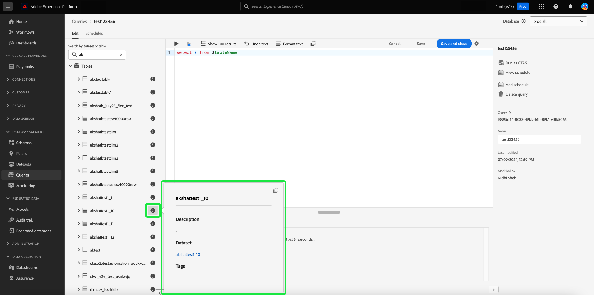
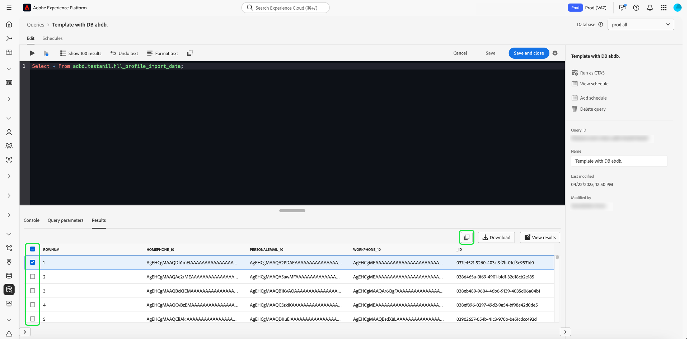

# Handleiding voor de Query Editor

De Redacteur van de vraag is een interactief hulpmiddel dat door de Dienst van de Vraag van Adobe Experience Platform wordt verstrekt, die u toestaat om, vragen voor klantenervaringsgegevens te schrijven te bevestigen en in werking te stellen binnen het [!DNL Experience Platform] gebruikersinterface. De Redacteur van de vraag steunt het ontwikkelen van vragen voor analyse en gegevensexploratie, en staat u toe om interactieve vragen voor ontwikkelingsdoeleinden evenals niet-interactieve vragen in werking te stellen om datasets in [!DNL Experience Platform] te bevolken.

Voor meer informatie over de concepten en de eigenschappen van de Dienst van de Vraag, zie het [ overzicht van de Dienst van de Vraag ](../home.md). Meer over leren hoe te om het gebruikersinterface van de Dienst van de Vraag op [!DNL Experience Platform] te navigeren, zie het [ overzicht UI van de Dienst van de Vraag ](./overview.md).

## Aan de slag {#getting-started}

De redacteur van de Vraag verstrekt flexibele uitvoering van vragen door met de Dienst van de Vraag te verbinden, en vragen slechts lopen terwijl deze verbinding actief is.

## Query-editor openen {#accessing-query-editor}

Selecteer in de gebruikersinterface van [!DNL Experience Platform] de optie **[!UICONTROL Queries]** in het navigatiemenu aan de linkerkant om de werkruimte van Query Service te openen. Selecteer vervolgens **[!UICONTROL Create Query]** rechtsboven in het scherm om query&#39;s te beginnen schrijven. Deze koppeling is beschikbaar op een van de pagina&#39;s in de werkruimte van de Query-service.

### Verbinding maken met Query-service {#connecting-to-query-service}

De redacteur van de Vraag neemt een paar seconden om met de Dienst van de Vraag te initialiseren en te verbinden wanneer het wordt geopend. De console vertelt u wanneer het wordt aangesloten, zoals hieronder getoond. Als u probeert om een vraag in werking te stellen alvorens de redacteur heeft verbonden, vertraagt het uitvoering tot de verbinding volledig is.

### Hoe de vragen van de Redacteur van de Vraag in werking worden gesteld {#run-a-query}

De vragen die van de Redacteur van de Vraag worden uitgevoerd stellen interactief in werking. Dit betekent dat als u browser sluit of weg navigeert, de vraag wordt geannuleerd. Het zelfde is waar voor vragen die worden gemaakt om datasets van vraagoutput te produceren.

## Query schrijven met de Uitgebreide Query Editor {#query-authoring}

Gebruikend de Redacteur van de Vraag, kunt u schrijven, uitvoeren en sparen vragen voor de gegevens van de klantenervaring. Alle uitgevoerde vragen, of opgeslagen in de Redacteur van de Vraag zijn beschikbaar aan alle gebruikers in uw organisatie met toegang tot de Dienst van de Vraag.

### Databasekiezer {#database-selector}

Selecteer een gegevensbestand aan vraag van het drop-down menu in het hoogste recht van de Redacteur van de Vraag. De geselecteerde database wordt weergegeven in de vervolgkeuzelijst.

### Instellingen {#settings}

Een instellingenpictogram boven het invoerveld van de Query Editor bevat opties voor het in-/uitschakelen van donker thema of voor het automatisch aanvullen.

>[!TIP]
>
>U kunt [!UICONTROL Disable syntax auto complete] tijdens het ontwerpen van een query gebruiken zonder dat dit uw voortgang verliest.

Om donkere of lichte thema&#39;s toe te laten, selecteer het montagespictogram () gevolgd door de optie in het vervolgkeuzemenu dat wordt weergegeven.

#### Automatisch aanvullen {#auto-complete}

De redacteur van de Vraag stelt automatisch potentiële SQL sleutelwoorden samen met lijst of kolomdetails voor de vraag voor aangezien u het schrijft. De functie voor automatisch aanvullen is standaard ingeschakeld en kan op elk gewenst moment worden uitgeschakeld of ingeschakeld via de instellingen in de Query Editor.

De auto-volledige configuratie het plaatsen is per gebruiker en voor de opeenvolgende logins voor die gebruiker herinnerd. Als u deze functie uitschakelt, worden meerdere metagegevensopdrachten niet verwerkt en worden aanbevelingen gedaan die de snelheid van de auteur bij het bewerken van query&#39;s ten goede komen.

### Meerdere opeenvolgende query&#39;s uitvoeren {#execute-multiple-sequential-queries}

Gebruik de Uitgebreide Redacteur van de Vraag om meer dan één vraag te schrijven en alle vragen op een opeenvolgende manier uit te voeren. De uitvoering van veelvoudige vragen in een opeenvolging elk produceert een logboekingang. Nochtans, slechts de resultaten van de eerste vraagvertoning in de console van de Redacteur van de Vraag. Controleer het vraaglogboek als u de vragen moet problemen oplossen of bevestigen die werden uitgevoerd. Zie de [ documentatie van vraaglogboeken ](./query-logs.md) voor meer informatie.

>[!NOTE]
> 
>Als een vraag CTAS na de eerste vraag in de Redacteur van de Vraag wordt uitgevoerd, wordt een lijst nog gecreeerd maar er is geen output op de console van de Redacteur van de Vraag.

### Geselecteerde query uitvoeren {#execute-selected-query}

Als u meerdere query&#39;s hebt geschreven maar slechts één query moet uitvoeren, kunt u de gekozen query markeren en de opdracht
[!UICONTROL Run selected query] pictogram. Dit pictogram wordt standaard uitgeschakeld totdat u de querysyntaxis in de editor selecteert.

![ de Redacteur van de Vraag met het [!UICONTROL Run selected query] benadrukte pictogram.](../images/ui/query-editor/run-selected-query.png)

### Query Editor-sessie annuleren {#cancel-query}

Neem controle van vraaguitvoering en verbeter uw productiviteit door langdurige vragen te annuleren. Deze actie ontruimt de Redacteur van de Vraag tijdens een vraaglooppas. De query wordt op de achtergrond uitgevoerd. Als het een vraag CTAS is zal het nog een outputdataset produceren. Als u de uitvoering in de editor wilt annuleren en een SQL-instructie wilt blijven samenstellen, selecteert u **[!UICONTROL Cancel query]** nadat u een query hebt uitgevoerd.

![ de Redacteur van de Vraag met [!UICONTROL Cancel query] benadrukt.](../images/ui/query-editor/cancel-query-run.png)

Er wordt een bevestigingsvenster weergegeven. Selecteer **[!UICONTROL Confirm]** om de query uit te voeren.

### Resultaattelling {#result-count}

De redacteur van de Vraag heeft een maximum 50.000 rijoutput. U kunt het aantal rijen kiezen die tegelijkertijd in de console van de Redacteur van de Vraag worden getoond. Als u het aantal rijen wilt wijzigen dat in de console wordt weergegeven, selecteert u het vervolgkeuzemenu **[!UICONTROL Result count]** en selecteert u een van de opties 50, 100, 150, 300, 500 en 1000.

>[!NOTE]
>
>Aangezien de gebruikersinterface van Experience Platform maximaal 1000 rijen kan ondersteunen, wordt het doorgeven van een LIMIT-waarde van meer dan 1000 genegeerd.

## Bezig met schrijven van query&#39;s {#writing-queries}

[!UICONTROL Query Editor] is zo geordend dat het schrijven van query&#39;s zo eenvoudig mogelijk is. Het schermafbeelding hieronder toont hoe de redacteur in UI verschijnt, met het SQL ingangsgebied en **benadrukte Spel**.

Om uw ontwikkelingstijd te minimaliseren, wordt u geadviseerd om uw vragen met grenzen op het aantal teruggekeerde rijen te ontwikkelen. Bijvoorbeeld `SELECT fields FROM table WHERE conditions LIMIT number_of_rows` . Nadat u hebt geverifieerd dat uw vraag de verwachte output veroorzaakt, verwijder de grenzen en stel de vraag met `CREATE TABLE tablename AS SELECT` in werking om een dataset met de output te produceren.

## Schrijfgereedschappen in de Query Editor {#writing-tools}

Gebruik de het schrijven hulpmiddelen van de Redacteur van de Vraag om uw vraag te verbeteren creërend proces. Functies omvatten opties voor het opmaken van tekst, het kopiëren van SQL, het beheren van query-details en het opslaan of plannen van uw werk terwijl u verdergaat.

### Tekst opmaken {#format-text}

Met de functie [!UICONTROL Format text] kunt u de query beter leesbaar maken door gestandaardiseerde syntaxisopmaak toe te voegen. Selecteer **[!UICONTROL Format text]** om alle tekst binnen de Redacteur van de Vraag te standaardiseren.

>[!NOTE]
>
>De functie [!UICONTROL Format text] werkt niet met anonieme blokken. Leren hoe te om één of meerdere SQL verklaringen opeenvolgend te ketenen, zie de [ anonieme blokdocumentatie ](../key-concepts/anonymous-block.md).

![ de Redacteur van de Vraag met [!UICONTROL Format text] en de SQL benadrukte verklaringen.](../images/ui/query-editor/format-text.png)

<!-- ### Undo text {#undo-text}

If you format your SQL in the Query Editor, you can undo the formatting applied by the [!UICONTROL Format text] feature. To return your SQL back to its original form, select **[!UICONTROL Undo text]**.

![The Query Editor with [!UICONTROL Undo text] and the SQL statements highlighted.](../images/ui/query-editor/undo-text.png) -->

### SQL kopiëren {#copy-sql}

Selecteer het kopieerpictogram om SQL van de Redacteur van de Vraag aan uw klembord te kopiëren. Deze kopieerfunctie is beschikbaar voor zowel querysjablonen als nieuwe query&#39;s in de Query Editor.

### Query-details {#query-details}

Als u een query wilt weergeven in de Query-editor, selecteert u een opgeslagen sjabloon op het tabblad [!UICONTROL Templates] . Het deelvenster met querydetails bevat meer informatie en gereedschappen voor het beheer van de geselecteerde query. Het toont ook nuttige meta-gegevens zoals de laatste tijd dat de vraag werd gewijzigd en wie het, indien van toepassing wijzigde.

>[!NOTE]
>
>De opties [!UICONTROL View schedule] , [!UICONTROL Add schedule] en [!UICONTROL Delete query] zijn alleen beschikbaar nadat de query als een sjabloon is opgeslagen. De optie [!UICONTROL Add schedule] neemt u rechtstreeks aan de planningsbouwer van de Redacteur van de Vraag. Met de optie [!UICONTROL View schedule] gaat u rechtstreeks naar de planningsinventaris voor die query. Zie de documentatie van vraagprogramma&#39;s leren hoe te [ vraagprogramma&#39;s in UI ](./query-schedules.md#create-schedule) creëren.

Van het detailspaneel kunt u een outputdataset direct van UI produceren, schrapt of noemt de getoonde vraag, bekijkt het programma van de vraaglooppas, en voegt de vraag aan een programma toe.

Selecteer **[!UICONTROL Run as CTAS]** om een uitvoergegevensset te genereren. Het dialoogvenster **[!UICONTROL Enter output dataset details]** wordt weergegeven. Voer een naam en beschrijving in en selecteer vervolgens **[!UICONTROL Run as CTAS]** . De nieuwe dataset wordt getoond in **[!UICONTROL Datasets]** doorbladeren tabel. Zie [ de documentatie van meningsdatasets ](../../catalog/datasets/user-guide.md#view-datasets) om meer over beschikbare datasets voor uw organisatie te leren.

>[!NOTE]
>
>De [!UICONTROL Run as CTAS] optie is slechts beschikbaar als de vraag **niet** is gepland.

![ de [!UICONTROL Enter output dataset details] dialoog.](../images/ui/query-editor/output-dataset-details.png)

Nadat u de handeling **[!UICONTROL Run as CTAS]** hebt uitgevoerd, verschijnt er een bevestigingsbericht om u op de hoogte te brengen van de geslaagde actie. Dit popup bericht bevat een verbinding die een geschikte manier verstrekt om aan de werkruimte van vraaglogboeken te navigeren. Zie de [ documentatie van vraaglogboeken ](./query-logs.md) voor meer informatie over vraaglogboeken.

### Vragen opslaan {#saving-queries}

De redacteur van de Vraag verstrekt sparen functie die u toestaat om een vraag te bewaren en het later te werken aan het. Als u een query wilt opslaan, selecteert u **[!UICONTROL Save]** in de rechterbovenhoek van de Query-editor. Voordat een query kan worden opgeslagen, moet u een naam opgeven voor de query via het deelvenster **[!UICONTROL Query Details]** .

>[!NOTE]
>
>Vragen die zijn genoemd en opgeslagen in de Query-editor zijn beschikbaar als sjablonen op het tabblad Query-dashboard [!UICONTROL Templates] . Zie de [ malplaatjedocumentatie ](./query-templates.md) voor meer informatie.

Als u een query opslaat in de Query Editor, verschijnt er een bevestigingsbericht om u op de hoogte te brengen van de geslaagde actie. Dit popup bericht bevat een verbinding die een geschikte manier verstrekt om aan de vragen te navigeren die werkruimte plannen. Zie de [ documentatie van planningsvragen ](./query-schedules.md) leren hoe te om vragen op een douanecadence in werking te stellen.

### Geplande query&#39;s {#scheduled-queries}

De vragen die als malplaatje zijn bewaard kunnen van de Redacteur van de Vraag worden gepland. Het plannen van vragen staat u toe om vraaglooppas op een douanecadence te automatiseren. U kunt vragen plannen die op frequentie, datum, en tijd worden gebaseerd, en ook een outputdataset voor uw resultaten kiezen indien nodig. De programma&#39;s van de vraag kunnen ook door UI worden onbruikbaar gemaakt of worden geschrapt.

Planningen worden ingesteld in de Query-editor. Wanneer het gebruiken van de Redacteur van de Vraag, kunt u een programma aan een vraag slechts toevoegen die reeds is gecreeerd, en bewaard. Dezelfde beperking geldt niet voor de API van de Query-service.

>[!NOTE]
>
>Geplande query&#39;s die mislukken op tien opeenvolgende regels worden automatisch in de status [!UICONTROL Quarantined] geplaatst. Voor een query met deze status is uw interventie vereist voordat verdere uitvoeringen kunnen plaatsvinden. Zie [ quarantined vragen ](./monitor-queries.md#quarantined-queries) documentatie voor meer details.

Zie de documentatie van vraagprogramma&#39;s leren hoe te [ vraagprogramma&#39;s in UI ](./query-schedules.md) creëren. Alternatief, om te leren hoe te om programma&#39;s toe te voegen gebruikend API, lees de [ geplande gids van het vraageindpunt ](../api/scheduled-queries.md).

Alle geplande query&#39;s worden toegevoegd aan de lijst op het tabblad [!UICONTROL Scheduled queries] . Van die werkruimte kunt u het statuut van alle geplande vraagbanen door UI controleren. Op het tabblad [!UICONTROL Scheduled queries] vindt u belangrijke informatie over de query-uitvoering en kunt u zich abonneren op waarschuwingen. De beschikbare informatie bevat de status, de planningsdetails en foutberichten/codes als een uitvoering is mislukt. Zie het [ Monitor geplande vraagdocument ](./monitor-queries.md) voor meer informatie.

### Hoe te om vorige vragen te vinden {#previous-queries}

Alle vragen die van de Redacteur van de Vraag worden uitgevoerd worden gevangen in de lijst van het Logboek. U kunt de zoekfunctionaliteit op het tabblad **[!UICONTROL Log]** gebruiken om query-uitvoeringen te zoeken. Opgeslagen query&#39;s worden weergegeven op het tabblad **[!UICONTROL Templates]** .

Als een query was gepland, biedt het tabblad [!UICONTROL Scheduled Queries] betere zichtbaarheid via de interface voor die querytaken. Zie de [ vraag controledocumentatie ](./monitor-queries.md) voor meer informatie.

>[!NOTE]
>
>Vragen die niet worden uitgevoerd, worden niet opgeslagen in het logbestand. De vraag om in de Dienst van de Vraag beschikbaar te zijn, moet het in de Redacteur van de Vraag in werking stellen of worden bewaard.

### Objectbrowser {#object-browser}

Gebruik objecten browser aan gemakkelijk onderzoek en filterdatasets. De objecten browser vermindert de tijd besteed het zoeken naar lijsten en datasets in grote milieu&#39;s met talrijke datasets. Met gestroomlijnde toegang tot relevante gegevens en meta-gegevens, kunt u zich meer op vraag creatie en minder op navigatie concentreren.

Als u met de objectbrowser door de database wilt navigeren, voert u een tabelnaam in het zoekveld in of selecteert u **[!UICONTROL Tables]** om de lijst met beschikbare datasets en tabellen uit te vouwen. Wanneer u het zoekveld gebruikt, wordt de lijst met beschikbare tabellen dynamisch gefilterd op basis van uw invoer.

Elke dataset bevat in [ uw geselecteerde gegevensbestand ](#database-dropdown) is vermeld in een navigatieregel links van de Redacteur van de Vraag.

Het schema dat in de objectbrowser wordt weergegeven, is een waarneembaar schema. Dit betekent dat u het kunt gebruiken om veranderingen en updates in echt te controleren - tijd aangezien de veranderingen onmiddellijk zichtbaar zijn. De waarneembare schema&#39;s helpen gegevenssynchronisatie verzekeren en helpen bij het zuiveren of analytische taken.

#### Huidige beperking {#current-limitation}

Het systeem verwerkt opeenvolgend vragen, betekenend slechts één vraag kan tegelijkertijd lopen. Terwijl een vraag lopend is, kunnen de extra lijsten niet in de linkernavigatie worden betreden.

#### Metagegevens van tabellen openen {#table-metadata}

Naast snelle zoekopdrachten hebt u nu gemakkelijk toegang tot metagegevens voor elke tabel door het pictogram &#39;i&#39; naast de tabelnaam te selecteren. Dit verstrekt u van gedetailleerde informatie over de geselecteerde lijst, die u helpt om geïnformeerde besluiten te nemen wanneer het schrijven van vragen.

#### Onderliggende tabellen verkennen

Als u onderliggende of gekoppelde tabellen wilt verkennen, selecteert u de vervolgkeuzepijl naast de tabelnaam in de lijst. Dit breidt de lijst uit om het even welke bijbehorende kindlijsten te tonen, en geeft een duidelijke mening van de gegevensstructuur en staat voor complexere vraagconstructies toe. Het pictogram naast de veldnaam geeft het gegevenstype van de kolom aan, zodat u deze kunt identificeren tijdens complexe query&#39;s.

## Vragen uitvoeren met de Query Editor {#executing-queries}

Om een vraag in de Redacteur van de Vraag in werking te stellen, kunt u SQL in de redacteur ingaan of een vorige vraag van het **[!UICONTROL Log]** of **[!UICONTROL Templates]** lusje laden, en **Spel** selecteren. De status van de query-uitvoering wordt hieronder weergegeven op het tabblad **[!UICONTROL Console]** en de uitvoergegevens worden weergegeven op het tabblad **[!UICONTROL Results]** .

### Console {#console}

De console verstrekt informatie over de status en de verrichting van de Dienst van de Vraag. De console toont de verbindingsstatus aan de Dienst van de Vraag, vraagverrichtingen die, en om het even welke foutenmeldingen worden uitgevoerd die uit die vragen voortvloeien.

>[!NOTE]
>
>De console toont slechts fouten die uit de uitvoering van een vraag resulteerden. De code geeft niet de fouten van de queryvalidatie weer die optreden voordat een query wordt uitgevoerd.

## Zoekresultaten {#query-results}

Nadat een query is voltooid, worden de resultaten weergegeven op het tabblad **[!UICONTROL Results]** , naast het tabblad **[!UICONTROL Console]** . Deze mening toont de tabelvormige output van uw vraag, die tussen 50 en 1000 rijen van resultaten afhankelijk van uw gekozen [ resultaattelling ](#result-count) toont. In deze weergave kunt u controleren of de query de verwachte uitvoer oplevert. Om een dataset met uw vraag te produceren, verwijder grenzen op teruggekeerde rijen, en stel de vraag met `CREATE TABLE tablename AS SELECT` in werking om een dataset met de output te produceren. Zie [ het produceren datasetleerprogramma ](./create-datasets.md) voor instructies op hoe te om een dataset van vraagresultaten in de Redacteur van de Vraag te produceren.

### Zoekresultaten downloaden {#download-query-results}

>[!AVAILABILITY]
>
>Downloadmogelijkheden zijn alleen beschikbaar voor klanten met de Data Distiller-invoegtoepassing. Neem contact op met uw Adobe-vertegenwoordiger voor meer informatie over Data Distiller.

Na het uitvoeren van een succesvolle vraag, download de resultaten in Csv, formaat XLSX, of formaat JSON aan gebruik in off-line analyse, rapportering, of spreadsheetwerkschema&#39;s. Deze functionaliteit stroomlijnt werkschema&#39;s voor marketing en analytische teams door directe toegang tot vraagresultaten voor off-line analyse, rapportering, en op Excel-Gebaseerde processen toe te laten.

Als u de queryresultaten wilt downloaden, selecteert u **[!UICONTROL Download]** in de rechterbovenhoek van het tabblad Query-editor **[!UICONTROL Result]** . Kies vervolgens **[!UICONTROL CSV]** , **[!UICONTROL XLSX]** of **[!UICONTROL JSON]** in het vervolgkeuzemenu. Het bestand wordt automatisch naar uw lokale computer gedownload. Kies de indeling die past bij uw gebruiksscenario, CSV voor lichte exportbewerkingen, XLSX voor opgemaakte werkbladen of JSON voor gestructureerde gegevensverwerking.

>[!NOTE]
>
>Controleer de zoekresultaten als de knop **[!UICONTROL Download]** ontbreekt. De knop wordt alleen weergegeven wanneer records worden geretourneerd. Als er geen records worden geretourneerd, wordt op het tabblad **[!UICONTROL Result]** het bericht &#39;Geen resultaten&#39; weergegeven en is de downloadoptie uitgeschakeld.

>[!NOTE]
>
>Wanneer het openen van een Csv- dossier in Excel, kunt u de volgende waarschuwing zien:  &quot;Mogelijke Verlies van Gegevens. Sommige eigenschappen zouden kunnen worden verloren als u dit werkboek in het komma-afgebakende formaat (.csv) opslaat. Als u deze functies wilt behouden, slaat u ze op in Excel-bestandsindeling.&quot;  bovendien, ben zich ervan bewust dat datum en tijd het formatteren per dossiertype kunnen variëren. CSV-bestanden behouden de indeling die wordt weergegeven in de zoekresultaten, terwijl XLSX-bestanden de gelokaliseerde opmaak automatisch kunnen toepassen in Excel. Als deze waarschuwing verschijnt, kunt u veilig verdergaan. Als u Excel-specifieke opmaak wilt behouden, slaat u het bestand op als XLSX.

### Resultaten op volledig scherm weergeven {#view-results}

Nadat de query met succes is uitgevoerd, selecteert u **[!UICONTROL View results]** op het tabblad **[!UICONTROL Result]** om een tabelweergave op volledig scherm met uw resultaten te openen.

Met de voorvertoning op volledig scherm kunt u gemakkelijk brede tabellen scannen en details op rijniveau inspecteren zonder horizontaal schuiven. In de weergave Volledig scherm wordt de uitvoer weergegeven in een raster waarvan de grootte kan worden gewijzigd, zodat u gemakkelijker grote gegevenssets kunt bekijken en over kolommen kunt scannen.

>[!NOTE]
>
>De voorvertoning is alleen-lezen en wijzigt uw query of dataset niet.

### Resultaten kopiëren {#copy-results}

Gebruik de verbeterde exemplaareigenschap in de Redacteur van de Vraag om vraagresultaten als komma-gescheiden waarden (CSV) te kopiëren en hen te kleven in spreadsheethulpmiddelen zoals Excel voor directe bevestiging of het melden. Deze functionaliteit verbetert de leesbaarheid, behoudt de opmaak en stroomlijnt workflows zonder te vertrouwen op gereedschappen van derden.

U kunt queryresultaten kopiëren via het tabblad [!UICONTROL Result] of vanuit de voorvertoning van de resultaten op het volledige scherm. Van het **[!UICONTROL Result]** lusje, selecteer het exemplaarpictogram () om alle queryresultaten naar het klembord te kopiëren. Selecteer eerst een rij om het kopieerpictogram in te schakelen. U kunt afzonderlijke rijen selecteren of het selectievakje bovenaan gebruiken om alle rijen tegelijk te selecteren.

U kunt ook **[!UICONTROL View results]** selecteren om de voorvertoning op volledig scherm te openen. Van dit dialoog, uitgezochte individuele rijen of gebruik checkbox in de upper-left hoek om alle rijen te selecteren, dan het exemplaarpictogram ( ) om de geselecteerde gegevens te kopiëren.

### Oudere resultatentabel (beperkte beschikbaarheid) {#legacy-results-table}

>[!AVAILABILITY]
>
>De lijst van erfenisresultaten is slechts beschikbaar om gebruikers door een eigenschapvlag te selecteren en kan niet in uw huidige Ervaring van de Redacteur van de Vraag verschijnen. Als uw team afhankelijk is van workflows voor slepen en selecteren, neemt u contact op met uw Adobe-vertegenwoordiger om toegang aan te vragen.

De oudere versie van de Redacteur van de Vraag is voorgenomen voor gebruikers die op flexibele, handgegevenswerkschema&#39;s zoals QA of op spreadsheet-gebaseerd overzicht vertrouwen.

Het steunt inheemse browser-gebaseerde belemmering selectie, zodat kunt u om het even welk gedeelte van output benadrukken en kopiëren—met inbegrip van individuele cellen of blokken-gebruikend standaardselectiegedrag. Dit staat in schril contrast met de verbeterde lijst, die gestructureerde rijselectie en specifieke exemplaaracties gebruikt.

De gekopieerde gegevens worden gescheiden door tabs, dus wanneer u deze plakt in gereedschappen zoals Excel, blijven de kolommen uitgelijnd en leesbaar. Kolomkoppen worden ook opgenomen wanneer u met slepen en selecteren over de koptekstrij gaat.

## Voorbeelden {#examples}

De Dienst van de vraag verstrekt oplossingen aan een verscheidenheid van gebruiksgevallen over industrieën en bedrijfsscenario&#39;s. Deze voorbeelden tonen de flexibiliteit en het effect van de dienst in het aanpakken van diverse behoeften aan. Om [ te ontdekken hoe de Dienst van de Vraag waarde aan uw specifieke bedrijfsbehoeften ](../use-cases/overview.md) kan brengen, de uitvoerige inzameling van gebruiksgevaldocumenten onderzoeken. Leer hoe te om de Dienst van de Vraag te gebruiken om inzichten en oplossingen voor verbeterde operationele efficiency en bedrijfssucces te verstrekken.

<!-- This video is from 2019. The logic is sounds but the workflow is too outdated. -->

## De vragen van de looppas met de zelfstudie van de Dienst van de Vraag {#query-tutorial-video}

In de volgende video ziet u hoe u query&#39;s uitvoert in de Adobe Experience Platform-interface en in een PSQL-client. De video demonstreert ook het gebruik van individuele eigenschappen in een XDM-object, door Adobe gedefinieerde functies en hoe u query&#39;s CREATE TABLE AS SELECT (CTAS) gebruikt.

>[!NOTE]
>
>De interface die in de video wordt weergegeven, is verouderd, maar de logica die in de workflow wordt gebruikt, blijft ongewijzigd.

>[!VIDEO](https://video.tv.adobe.com/v/29796?quality=12&learn=on)

## Volgende stappen

Nu u weet welke eigenschappen in de Redacteur van de Vraag beschikbaar zijn en hoe te om de toepassing te navigeren, kunt u beginnen direct creërend uw eigen vragen in [!DNL Experience Platform]. Voor meer informatie over het runnen van SQL vragen tegen datasets in [!DNL Data Lake], zie de gids op [ lopende vragen ](../best-practices/writing-queries.md).
