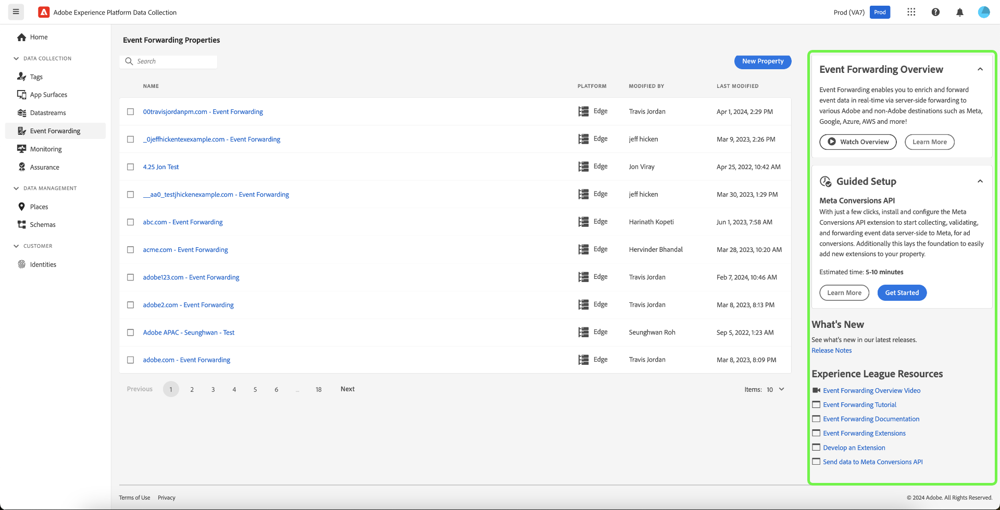

# Opmerkingen bij de release van Adobe Experience Platform

**Releasedatum: woensdag 30 april 2024**

>[!TIP]
>
>Gebruik de [ verklarende woordenlijst van Adobe Experience Platform ](/help/landing/glossary.md) vertrouwd te worden met terminologie die in Real-time Customer Data Platform en Adobe Experience Platform wordt gebruikt. Als u een bepaalde term die u zoekt niet kunt vinden, gebruikt u de feedbackopties op de pagina om te vragen dat nieuwe termen aan de verklarende woordenlijst worden toegevoegd.

Updates voor bestaande functies in Experience Platform:

- [Dashboards](#dashboards)
- [Gegevensverzameling](#data-collection)
- [Doelen](#destinations)
- [Identiteitsservice](#identity-service)
- [Bewaking](#monitoring)
- [Query-service](#query-service)
- [Sandboxes](#sandboxes)
- [Segmenteringsservice](#segmentation)
- [Bronnen](#sources)

## Dashboards {#dashboards}

Adobe Experience Platform biedt meerdere dashboards waarmee u belangrijke inzichten over de gegevens van uw organisatie kunt bekijken, zoals vastgelegd tijdens dagelijkse momentopnamen.

**Nieuwe of bijgewerkte eigenschappen**

| Functie | Beschrijving |
| --- | --- |
| Real-time Customer Data Platform B2B-inzichten | Onderzoek pre-gevormde [ de gegevensinzicht van Real-Time CDP B2B op rekeningen en kansen ](../../dashboards/insights/account-profiles.md) om u te helpen uw gegevens begrijpen en uw bedrijfsbesluiten informeren. U kunt ook [ uw eigen inzichten bouwen gebruikend het Model van Gegevens van Real-Time CDP B2B ](../../dashboards/data-models/cdp-insights-data-model-b2c.md) om uw gegevens te visualiseren en te onderzoeken en uw douanevisualisaties in uw dashboard te bewaren. |

{style="table-layout:auto"}

Voor meer informatie over dashboards, met inbegrip van hoe te om toegangstoestemmingen te verlenen en douanegidgets tot stand te brengen, begin door het [ overzicht van dashboards ](../../dashboards/home.md) te lezen.

## Gegevensverzameling {#data-collection}

Adobe Experience Platform biedt een reeks technologieën waarmee u gegevens over klantervaringen aan de clientzijde kunt verzamelen en naar de Edge Network van het Experience Platform kunt verzenden waar het kan worden verrijkt, getransformeerd en gedistribueerd naar Adobe- of niet-Adobe-bestemmingen.

**Nieuwe of bijgewerkte eigenschappen**

| Type | Functie | Beschrijving |
| --- | --- | --- |
| Extensies | [!DNL Acxiom Anonymous Visitor Insights] Extensie tags | Ontdek waar uw websitebezoekers vandaan komen met [!DNL Acxiom's Visitor Insights] . Door geoIP raadplegingstechnologie te gebruiken, kan Acxiom de plaats van anonieme browsers identificeren. Zodra geïdentificeerd, geeft een onderzoek in hun georganiseerd gegevensbestand extra inzichten die naar browser worden teruggestuurd. De makers van inhoud kunnen zo hun inhoud aanpassen aan deze gegevenspunten en bezoekers een meer persoonlijke en boeiende ervaring bieden, zelfs als ze als vreemden zijn gestart. |
| Gegevensstromen | [ Edge Network bot detection ](../../datastreams/bot-detection.md) | Verkeer afkomstig van niet-menselijke entiteiten, zoals geautomatiseerde programma&#39;s, webschrapers, spinnen, scanners met scripts, kan het moeilijker maken om gebeurtenissen die plaatsvinden bij bezoekers van het menselijk publiek te identificeren. Dit type van verkeer kan belangrijke bedrijfsmetriek negatief beïnvloeden, die tot onjuist verkeer leiden meldend.   Bot de opsporing staat u toe om gebeurtenissen te identificeren die door [ Web SDK ](../../web-sdk/home.md) worden geproduceerd, [ Mobiele SDK ](https://developer.adobe.com/client-sdks/home/) en [[!DNL Server API]](../../server-api/overview.md) zoals die door bekende spinnen en bots worden geproduceerd. Door beide detectie voor uw gegevensstromen te configureren, kunt u specifieke IP-adressen, IP-bereiken en aanvraagheaders identificeren die u als beide gebeurtenissen wilt classificeren.   De identificatie van beide verkeer kan u een nauwkeurigere meting van gebruikersactiviteit op uw plaats of mobiele toepassing verstrekken. |
| Mobiele SDK | Primaire release | Nieuwe grote versies van de Mobile SDK zijn uitgebracht voor de volgende platforms: iOS Mobile Core 5.x en compatibele iOS-extensies, Android Mobile Core 3.x en compatibele Android-extensies, React Native Core 6.x en compatibele React Native-extensies, Flutter Core 4.x en compatibele Flutter-extensies. Deze release biedt verschillende nieuwe functies en verbeteringen, waaronder ondersteuning in de SDK van Android voor Jetpack Compose, ondersteuning voor op Adobe Journey Optimizer gebaseerde ervaringen en algemene beschikbaarheid van de Adobe Journey Optimizer Messaging-extensie voor Flutter. Voor meer gedetailleerde versienota&#39;s zie {de versienota&#39;s van 0} Mobiele SDK ](https://developer.adobe.com/client-sdks/home/release-notes/).[ |
| Mobiele SDK | Privacy | Vanwege de beleidsupdate van Apple, die op 1 mei 2024 begint, moeten ontwikkelaars nieuwe privacyfuncties implementeren om zich bij de App Store in te dienen. Alle klanten van de Adobe die de Mobile SDK gebruiken, moeten een upgrade uitvoeren naar versie 5.x van de SDK als ze na 1 mei App Store-goedkeuring willen ontvangen. |
| Roku SDK | Roku SDK | De eerste grote versie van de Roku SDK is vrijgegeven met ondersteuning voor de Streaming Media voor de Platform Edge Network. |
| Tags en doorsturen van gebeurtenissen | Richtlijnen voor producten | Experience Platform [ Markeringen ](../../tags/home.md) en [ Gebeurtenis die ](../../tags/ui/event-forwarding/overview.md) door:sturen bieden een nieuwe waaier van ervaringen aan die u kunnen helpen snel begonnen worden en een snelle tijd aan waarde realiseren. Deze ervaringen omvatten nieuwe instapschermen, zelfstudies in producten en knopinfo.  {width="100" zoomable="yes"}  |
| Web SDK | Vereenvoudigde toepassing van SDK van het Web voor klanten van de Audience Manager | De veelvoudige updates van SDK van het Web vereenvoudigen nu goedkeuring van Web SDK zonder het Model van de Gegevens van de Ervaring (XDM) voor de Oplossingen van het Experience Cloud, zoals Audience Manager, Analytics en Doel te gebruiken. Meer over de goedkeuring van SDK van het Web van de Audience Manager van de volgende gidsen: <ul><li><a href="https://experienceleague.adobe.com/en/docs/audience-manager/user-guide/migrate-to-web-sdk/dil-extension-to-web-sdk"> werk uw bibliotheek van de gegevensinzameling voor Audience Manager van de de markeringsuitbreiding van de Audience Manager aan de de markeringsuitbreiding van SDK van het Web bij</li><li><a href="https://experienceleague.adobe.com/en/docs/audience-manager/user-guide/migrate-to-web-sdk/appmeasurement-to-web-sdk"> werk uw bibliotheek van de gegevensinzameling voor Audience Manager van de AppMeasurement JavaScript bibliotheek aan de bibliotheek van de JavaScript van SDK van het Web bij</li></ul> |

{style="table-layout:auto"}

<!--| Web SDK | [Streaming Media Collection support in Web SDK](../../web-sdk/commands/configure/streamingmedia.md) | You can now use Experience Platform Web SDK to collect data related to media sessions on your website. The collected data can include information about media playbacks, pauses, completions, and other related events. Once collected, you can send this data to Adobe Experience Platform and/or Adobe Analytics, to generate reports. This feature provides a comprehensive solution for tracking and understanding media consumption behavior on your website.  See the [Web SDK](../../web-sdk/commands/configure/streamingmedia.md) documentation to learn how to configure the `streamingMedia` component.  See the guide on [migrating your Analytics for Streaming Media implementation from Media JS to Web SDK](https://experienceleague.adobe.com/en/docs/media-analytics/using/implementation/edge-recommended/media-edge-sdk/edge-web-sdk) for more details.|-->

Meer over gegevensinzamelingen leren, lees het [ overzicht van de gegevensinzameling ](../../collection/home.md).

## Doelen {#destinations}

[!DNL Destinations] zijn vooraf gebouwde integratie met bestemmingsplatforms die voor de naadloze activering van gegevens van Adobe Experience Platform toestaan. U kunt bestemmingen gebruiken om uw bekende en onbekende gegevens voor kanaalmarketing campagnes, e-mailcampagnes, gerichte reclame, en vele andere gebruiksgevallen te activeren.

**Nieuwe of bijgewerkte functionaliteit** {#destinations-new-updated-functionality}

| Functionaliteit | Beschrijving |
| ----------- | ----------- |
| `isRequired` nu beschikbaar voor geneste gegevensvelden van klanten in Destination SDK | Wanneer het vormen van een bestemming in Destination SDK, kunt u [ genestelde gebieden van klantengegevens nu plaatsen zoals vereist ](/help/destinations/destination-sdk/functionality/destination-configuration/customer-data-fields.md#nested-fields). Op deze manier kunnen gebruikers die uw bestemming instellen, pas verdergaan met hun activeringsstroom als ze een waarde voor dat veld selecteren. |
| De segmentatie van Edge is niet meer verplicht wanneer het opzetten van een Adobe Target-bestemming met Web SDK | Eerder, toen het vormen van een [ bestemming van Adobe Target ](/help/destinations/catalog/personalization/adobe-target-connection.md) met Web SDK, moest de gegevensstroom voor verpersoonlijking en randsegmentatie worden toegelaten. Het vereiste dat de gegevensstroom voor randsegmentatie [ wordt toegelaten is nu verwijderd ](/help/destinations/ui/activate-edge-personalization-destinations.md#configure-datastream). Met dit integratiepatroon kunt u alleen profiteren van een subset van gevallen waarin u gebruikmaakt van personalisatie wanneer u Adobe Target met Real-Time CDP gebruikt. Lees meer over de [ gebruiksgevallen die door integratietype ](/help/destinations/catalog/personalization/adobe-target-connection.md#parameters) worden toegelaten. |
| [!BADGE  Beta ] {type=Informative} verwijdert veelvoudige publiek en datasets uit activeringsstromen | U kunt nu meerdere soorten publiek en gegevenssets selecteren en verwijderen uit doelactiveringsstromen. Zie de [ bestemmingsdetails ](../../destinations/ui/destination-details-page.md#bulk-remove) en [ datasetuitvoer ](../../destinations/ui/export-datasets.md) documentatie voor meer details. |

{style="table-layout:auto"}

Voor meer algemene informatie over bestemmingen, verwijs naar het [ overzicht van bestemmingen ](../../destinations/home.md).

## Identiteitsservice {#identity-service}

Gebruik Adobe Experience Platform Identity Service om een uitgebreide weergave van uw klanten en hun gedrag te maken door identiteiten tussen apparaten en systemen te overbruggen, zodat u in real-time een indrukwekkende, persoonlijke digitale ervaring kunt bieden.

**Bijgewerkte eigenschappen**

| Functie | Beschrijving |
| --- | --- |
| Verplaatsing van de `/orgs/{ORG}/` -eindpunten in de API | De volgende eindpunten in [[!DNL Identity Service]  API ](https://developer.adobe.com/experience-platform-apis/references/identity-service/) zijn afgekeurd:<ul><li>`https://platform.adobe.io/data/core/idnamespace/orgs/{ORG}/identities`</li><li>`https://platform.adobe.io/data/core/idnamespace/orgs/{ORG}/identities/{ID}`</li></ul> U kunt de eindpunten `/idnamespace/identities` en `/idnamespace/identities/{ID}` gebruiken om dezelfde taken uit te voeren en alle naamruimten in een organisatie of een specifieke naamruimte in een organisatie op te halen. |

{style="table-layout:auto"}

Voor meer informatie over de Dienst van de Identiteit, lees het [ overzicht van de Dienst van de Identiteit ](../../identity-service/home.md).

## Bewaking {#monitoring}

Gebruik het controledashboard in de UI van het Experience Platform om de reis van uw gegevens van Bronnen, de Dienst van de Identiteit, het Profiel van de Klant in real time, Soorten, en Doelen te controleren.

**Bijgewerkte eigenschappen**

| Functie | Beschrijving |
| --- | --- |
| Uitbreiding van dashboard controleren | U kunt nu het controledashboard voor verschillende gegevenstypes gebruiken die op uw bedrijfs gebruikscase worden gebaseerd. Gebruik het controledashboard om persoon, rekening, en de activiteiten van het vooruitgangsgegevenstype in bronnen, publiek, en bestemmingen te controleren. |

{style="table-layout:auto"}

Voor meer informatie, lees de gids op [ gebruikend het controledashboard ](../../dataflows/ui/monitor.md).

## Query-service {#query-service}

Met Query Service kunt u standaard-SQL gebruiken om query&#39;s uit te voeren op gegevens in Adobe Experience Platform [!DNL Data Lake] . U kunt zich bij om het even welke datasets van [!DNL Data Lake] aansluiten en de vraagresultaten vangen als nieuwe dataset voor gebruik in rapportering, de Wetenschap van Gegevens Workspace, of voor opname in het Profiel van de Klant in real time.

**Bijgewerkte eigenschappen**

| Functie | Beschrijving |
| --- | --- |
| Query Quarantine | Sluit mislukte query-uitvoeringen automatisch af om onderbrekingen te voorkomen en consistente prestaties te behouden. Zie de [ documentatie van de vraagquarantaine ](../../query-service/ui/query-schedules.md#quarantine) voor meer informatie. |
| Query annuleren | Neem controle van vraaguitvoering en verbeter uw productiviteit door langdurige vragen te annuleren.Zie [ vraag ](../../query-service/ui/user-guide.md#cancel-query) documentatie voor meer informatie annuleren. |
| Geplande querywaarschuwingen | Blijf op de hoogte van proactieve meldingen tijdens het plannen van query&#39;s, zodat u over een efficiënt en tijdig taakbeheer beschikt. U kunt [ aan alarm of intekenen wanneer het creëren van een vraag ](../../query-service/ui/query-schedules.md#alerts-for-query-status) of het gebruiken van de gealigneerde acties voor bestaande geplande vragen. Zie [ aan alarm met gealigneerde acties ](../../query-service/ui/monitor-queries.md#alert-subscription) documentatie voor meer informatie intekenen. |
| Verbeterde geplande querynavigatie | Navigeer gemakkelijk tussen vraagmalplaatjes en geplande looppas voor verhoogde productiviteit. Zie de documentatie bij [ het bekijken van geplande vraaglooppas ](../../query-service/ui/query-schedules.md#scheduled-query-runs) voor meer informatie. |
| Uitgebreide query-uitvoer | Toegang tot tot 500 rijen van vraagresultaten binnen de console voor diepere analyse van uw gegevens.Zie de ](../../query-service/ui/user-guide.md#result-count) documentatie van de 0} resultaattelling {voor meer informatie.[ |
| Oudere versie van Query Editor | Vanaf 30-april-2024 is de Verbeterde Redacteur van de Vraag de standaardeditor voor alle gebruikers geworden. De verouderde editor wordt op 24 mei 2024 afgekeurd en is niet meer beschikbaar voor gebruik. Zie de [ gebruikersgids van de Redacteur van de Vraag ](../../query-service/ui/user-guide.md) voor meer informatie. |

{style="table-layout:auto"}

Voor meer informatie over de Diensten van de Vraag, verwijs naar het [ overzicht van de Dienst van de Vraag ](../../query-service/home.md).

## Sandboxes {#sandboxes}

Adobe Experience Platform is ontworpen om toepassingen voor digitale beleving wereldwijd te verrijken. Bedrijven voeren vaak meerdere digitale-ervaringstoepassingen parallel uit en moeten rekening houden met de ontwikkeling, het testen en de implementatie van deze toepassingen en tegelijk de operationele compatibiliteit garanderen. Om aan deze behoefte tegemoet te komen, biedt Experience Platform sandboxen die één enkele instantie Platform in afzonderlijke virtuele omgevingen verdelen om toepassingen voor digitale ervaringen te ontwikkelen en te ontwikkelen.

**Nieuwe of bijgewerkte eigenschappen**

| Functie | Beschrijving |
| --- | --- |
| [ het tooling van Sandbox ](../../sandboxes/ui/sandbox-tooling.md) | Het zandbakhulpmiddel van het gebruik aan [ uitvoer ](../../sandboxes/ui/sandbox-tooling.md#export-entire-sandbox) alle gesteunde objecten types in een volledig zandbakpakket, dan [ voert ](../../sandboxes/ui/sandbox-tooling.md#import-entire-sandbox) het pakket over diverse zandbakken in om objecten configuraties te herhalen. |

{style="table-layout:auto"}

Voor meer informatie over zandbakken, lees het [ overzicht van zandbakken ](../../sandboxes/home.md).

## Segmenteringsservice {#segmentation}

Met [!DNL Segmentation Service] kunt u gegevens die zijn opgeslagen in [!DNL Experience Platform] en die betrekking hebben op personen (zoals klanten, vooruitzichten, gebruikers of organisaties) segmenteren naar het publiek. U kunt een publiek maken via segmentdefinities of andere bronnen op basis van uw [!DNL Real-Time Customer Profile] -gegevens. Deze soorten publiek worden centraal geconfigureerd en onderhouden op [!DNL Platform] en zijn gemakkelijk toegankelijk voor elke Adobe.

**Bijgewerkte eigenschap**

| Functie | Beschrijving |
| ------- | ----------- |
| Status van levenscyclus van het publiek | De levenscyclusstaten van de doelgroep zijn gestroomlijnd om het levenscyclusbeheer te vereenvoudigen. Meer over deze levenscyclusstaten leren, lees de [ Veelgestelde vragen van de Dienst van de Segmentatie ](../../segmentation/faq.md#lifecycle-states). |

{style="table-layout:auto"}

Voor meer informatie over [!DNL Segmentation Service], gelieve te zien het [ overzicht van de Segmentatie ](../../segmentation/home.md).

## Bronnen {#sources}

Experience Platform biedt een RESTful-API en een interactieve UI waarmee u eenvoudig bronverbindingen voor verschillende gegevensproviders kunt instellen. Deze bronverbindingen staan u toe om met externe opslagsystemen en de diensten van CRM voor authentiek te verklaren en te verbinden, tijden voor ingestiingslooppas te plaatsen, en gegevensinvoer te beheren.

Gebruik bronnen in Experience Platform om gegevens van een Adobe of een gegevensbron van derden in te voeren.

**Nieuwe bronnen**

| Nieuwe bronnen | Beschrijving |
| --- | --- |
| [!BADGE  Beta ] {type=Informative} [!DNL PathFactory] | Gebruik de [[!DNL PathFactory]  bron ](../../sources/tutorials/ui/create/marketing-automation/pathfactory.md) om uw bezoeker, zitting, en de gegevens van de paginamening van [!DNL PathFactory] aan Experience Platform te integreren. Lees het [[!DNL PathFactory]  overzicht ](../../sources/connectors/marketing-automation/pathfactory.md) voor informatie over hoe te begonnen worden. |
| [!DNL Teradata Vantage] | Gebruik de [[!DNL Teradata Vantage]  bron ](../../sources/tutorials/ui/create/databases/teradata-vantage.md) om gegevens van hybride multi-wolkenmilieu&#39;s aan Experience Platform in te voeren. Lees het [[!DNL Teradata Vantage]  overzicht ](../../sources/connectors/databases/teradata-vantage.md) voor informatie over hoe te begonnen worden. |

{style="table-layout:auto"}

**Nieuwe en bijgewerkte eigenschappen**

| Functie | Beschrijving |
| --- | --- |
| Updates voor IP-adressen voor het toestaan van lijsten in VA7 | De volgende IP adressen zijn toegevoegd aan de lijst van IP adressen om aan uw lijst van gewenste personen voor VA7 (Noord-Amerika) toe te voegen: <ul><li>`20.98.198.224/29`</li><li>`20.119.28.57/32`</li><li>`20.232.89.104/29`</li><li>`20.98.195.172/32`</li><li>`172.210.218.144/28`</li></ul> Voor een uitvoerige lijst van IP adressen om aan uw lijst van gewenste personen toe te voegen, lees het [ IP document van de lijst van gewenste personen van het Adres ](../../sources/ip-address-allow-list.md). |
| Ondersteuning voor nieuwe verificatietypen met de [!DNL Azure Event Hubs] -bron | U kunt de [!DNL Event Hubs] -bron nu met een Experience Platform verbinden via [!DNL Azure Active Directory Authentication] of [!DNL Scoped Azure Active Directory Authentication] . Lees de gids op [ verbindend  [!DNL Event Hubs]  met Experience Platform ](../../sources/tutorials/ui/create/cloud-storage/eventhub.md) voor meer informatie. |
| Updates voor het ophalen van [!DNL Data Landing Zone] referenties | U kunt nu de juiste rail in de werkruimte voor bronnen gebruiken om uw [!DNL Data Landing Zone] -gegevens op te halen. U kunt nu ook de juiste rail gebruiken om uw referenties te vernieuwen. Lees de [[!DNL Data Landing Zone]  gids UI ](../../sources/tutorials/ui/create/cloud-storage/data-landing-zone.md) voor meer informatie. |

{style="table-layout:auto"}

<!--| Enhanced filtering and navigation in the sources UI workspace | Use the enhanced filtering, search, and inline action tools in the sources UI workspace to streamline your workflow. <ul><li>Use filtering and search capabilities to navigate your way through sources accounts and dataflows in your organization.</li><li>Use inline actions to modify configuration settings applied to your dataflows and improve organizational workflows. You can use inline actions to apply tags, set up alerts, or create ingestion jobs on demand.</li></ul> For more information, read the guide on [filtering sources objects in the UI](../../sources/tutorials/ui/filter.md).|-->

Voor meer informatie over bronnen, lees het [ overzicht van bronnen ](../../sources/home.md).
