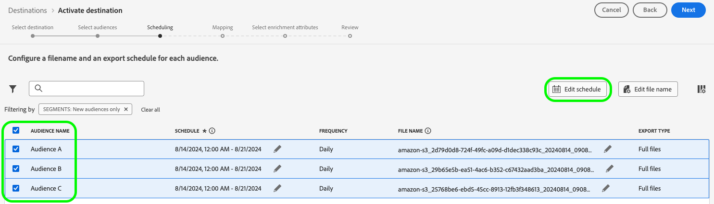

# Aanvullende informatie voor Adobe Experience Platform

**Releasedatum: 20 augustus 2024**

>[!TIP]
>
>Bekijk een [overzicht van documentatie met voorbeelden van gebruiksscenario&#39;s](https://experienceleague.adobe.com/en/docs/experience-platform/rtcdp/use-cases/overview) en ontdek welke verschillende gebruiksscenario&#39;s uw organisatie met Real-Time CDP kan bereiken, zoals prospectie, acquisitie en meer.

Updates van bestaande functies en documentatie in Experience Platform:

- [Toegangsbeheer op basis van kenmerken](#abac)
- [Gegevensopname](#data-ingestion)
- [Bestemmingen](#destinations)
- [Experience-datamodel (XDM)](#xdm)
- [Identiteitsservice](#identity-service)
- [Segmentatieservice](#segmentation)
- [Bronnen](#sources)

## Toegangsbeheer op basis van kenmerken {#abac}

Toegangscontrole op basis van kenmerken is een functionaliteit van Adobe Experience Platform waarmee merken die aandacht hebben voor privacy, meer flexibiliteit krijgen bij toegangsbeheer voor gebruikers. Individuele objecten, zoals schemavelden en segmenten, kunnen aan gebruikersrollen worden toegewezen. Met deze functie kunt u toegang tot afzonderlijke objecten verlenen of intrekken voor specifieke Experience Platform-gebruikers in uw organisatie.

Via attribuut-gebaseerde toegangscontrole, kunnen de beheerders van uw organisatie gebruikers&#39; toegang tot gevoelige persoonlijke gegevens (SPD) controleren, persoonlijk identificeerbare informatie (PII), en ander aangepast type van gegevens over alle werkschema&#39;s en middelen van Experience Platform. Beheerders kunnen gebruikersrollen definiëren die alleen toegang hebben tot specifieke velden en gegevens die bij die velden horen.

**Nieuwe functie**

| Functie-update | Beschrijving |
| --- | --- |
| Nieuwe functie voor Permission Manager | U kunt nu [Permission Manager](../../access-control/abac/permission-manager/overview.md) gebruiken om rapporten te genereren met behulp van eenvoudige query&#39;s. Hiermee krijgt u inzicht in toegangsbeheer en bespaart u tijd bij het verifiëren van toegangsmachtigingen in verschillende workflows en op verschillende granulariteitsniveaus. Raadpleeg het [handboek voor Permission Manager](../../access-control/abac/permission-manager/permissions.md) voor meer informatie over het maken van rapporten voor gebruikers en rollen. {width="250" align="center" zoomable="yes"} |

{style="table-layout:auto"}

Zie het [overzicht van toegangsbeheer op basis van kenmerken](../../access-control/abac/overview.md) voor meer informatie over toegangsbeheer op basis van kenmerken. Voor een uitgebreide handleiding over de workflow voor toegangsbeheer op basis van kenmerken leest u de [end-to-end handleiding voor toegangsbeheer op basis van kenmerken](../../access-control/abac/end-to-end-guide.md).

## Gegevensopname (bijgewerkt op 23 augustus) {#data-ingestion}

Adobe Experience Platform biedt een uitgebreide reeks functies voor het toevoegen van elk type en elke latentie van gegevens. U kunt gegevens toevoegen via batch- of streaming-API&#39;s, via door Adobe gebouwde bronnen, via gegevensintegratiepartners of via de gebruikersinterface van Adobe Experience Platform.

**Update van datumnotatieverwerking bij batchopname van gegevens**

In deze release wordt een probleem opgelost met de *datumnotatieverwerking* bij batchopname van gegevens. Voorheen veranderde het systeem datumvelden die door klanten waren ingevoegd van `Date` in de `DateTime`-indeling. Dit betekende dat de tijdzone automatisch aan velden werd toegevoegd en dat leverde problemen op voor gebruikers die de `Date`-indeling wensten of nodig hadden. Vanaf nu wordt de tijdzone niet meer automatisch toegevoegd aan velden van het type `Date`. Deze update zorgt ervoor dat de geëxporteerde indeling van gegevens overeenkomt met de indeling die op verzoek van klanten wordt weergegeven in het profiel voor dat veld.

`Date`-velden vóór de release: `"birthDate": "2018-01-12T00:00:00Z"`
`Date`-velden na de release: `"birthDate": "2018-01-12"`

Meer informatie over [batchopname](/help/ingestion/batch-ingestion/overview.md).

## Bestemmingen {#destinations}

[!DNL Destinations] zijn pre-built integraties met bestemmingsplatforms die de naadloze activering van gegevens van Adobe Experience Platform mogelijk maken. U kunt bestemmingen gebruiken om uw bekende en onbekende gegevens te activeren voor cross-channel marketingcampagnes, e-mailcampagnes, gerichte advertenties en vele andere gebruiksscenario&#39;s.

**Nieuwe of bijgewerkte bestemmingen** {#new-updated-destinations}

| Bestemming | Beschrijving |
| ----------- | ----------- |
| [Braze](/help/destinations/catalog/mobile-engagement/braze.md) | [!UICONTROL Braze] beheert een aantal verschillende instanties voor hun dashboard en REST-eindpunten. [!UICONTROL Braze]-klanten moeten het juiste REST-eindpunt gebruiken op basis van de instantie waarvoor ze zijn ingericht. Deze versie voegt een nieuw US-07-eindpunt toe dat u kunt selecteren wanneer u verbinding maakt met [!UICONTROL Braze]. |

{style="table-layout:auto"}

**Nieuwe of bijgewerkte functionaliteit** {#destinations-new-updated-functionality}

| Functie | Beschrijving |
| ----------- | ----------- |
| Het is nu algemeen mogelijk om bestanden op aanvraag naar batchbestemmingen te exporteren. | De optie om bestanden op aanvraag te exporteren naar batchbestemmingen is nu beschikbaar voor alle klanten. Raadpleeg de [specifieke documentatie](../../destinations/ui/export-file-now.md) voor meer informatie. |
| Exportschema&#39;s bewerken voor meerdere geëxporteerde doelgroepen in de [planningsstap](../../destinations/ui/activate-batch-profile-destinations.md#scheduling). | De optie om de exportschema&#39;s voor meerdere geëxporteerde doelgroepen rechtstreeks vanuit de planningstap van de workflow voor doelgroepactivering te bewerken, is nu beschikbaar voor alle klanten. {width="250" align="center" zoomable="yes"} |
| Bestandsnamen bewerken voor meerdere geëxporteerde doelgroepen in de [planningsstap](../../destinations/ui/activate-batch-profile-destinations.md#scheduling). | De optie om de namen van meerdere geëxporteerde bestanden rechtstreeks te bewerken vanuit de planningstap van de workflow voor doelgroepactivering is nu beschikbaar voor alle klanten. {width="250" align="center" zoomable="yes"} |
| Meerdere doelgroepen uit een gegevensstroom verwijderen vanaf de pagina [Bestemmingsgegevens](../../destinations/ui/destination-details-page.md#bulk-remove). | De optie om meerdere doelgroepen uit bestaande gegevensstromen te verwijderen vanaf de pagina **[!UICONTROL Destination Details]** is nu beschikbaar voor alle klanten. {width="250" align="center" zoomable="yes"} |
| Meerdere bestanden op aanvraag exporteren naar batchbestemmingen vanaf de pagina [Bestemmingsgegevens](../../destinations/ui/destination-details-page.md#bulk-export). | De optie om meerdere bestanden op aanvraag naar batchbestemmingen te exporteren vanaf de pagina **[!UICONTROL Destination Details]** is nu beschikbaar voor alle klanten. {width="250" align="center" zoomable="yes"} |
| Bestandsnamen bewerken voor meerdere geëxporteerde doelgroepen vanaf de pagina [Bestemmingsgegevens](../../destinations/ui/destination-details-page.md#bulk-edit-file-names). | U kunt de namen van meerdere geëxporteerde bestanden nu rechtstreeks vanaf de pagina **[!UICONTROL Destination Details]** bewerken. {width="250" align="center" zoomable="yes"} |
| Meerdere datasets uit een gegevensstroom verwijderen vanaf de pagina [Bestemmingsgegevens](../../destinations/ui/export-datasets.md#remove-dataset). | De optie om meerdere datasets uit een gegevensstroom te verwijderen is nu beschikbaar voor alle klanten. {width="250" align="center" zoomable="yes"} |

{style="table-layout:auto"}

Voor meer informatie raadpleegt u het [overzicht van bestemmingen](../../destinations/home.md).

## Experience-datamodel (XDM) {#xdm}

XDM is een open-bronspecificatie die algemene structuren en definities (schema&#39;s) biedt voor gegevens die in Adobe Experience Platform worden geïmporteerd. Door de XDM-standaarden te hanteren, kunnen alle gegevens over de klantervaring worden opgenomen in een gemeenschappelijke weergave. Zo worden inzichten sneller en beter geïntegreerd verkregen. U kunt waardevolle inzichten verkrijgen uit klantacties, klantdoelgroepen definiëren via segmenten en klantkenmerken gebruiken voor personalisatiedoeleinden.

**Nieuwe functies**

| Functie | Beschrijving |
| --- | --- |
| Workflow voor het maken van een ML-ondersteund schema | Gebruik geavanceerde machine learning-algoritmen om uw bestanden met voorbeeldgegevens te analyseren en automatisch geoptimaliseerde schema&#39;s te maken met standaardvelden en aangepaste velden. Belangrijkste functies: <ul><li>Sneller schema&#39;s maken: genereer schema&#39;s rechtstreeks vanuit voorbeeldgegevensbestanden met behulp van door ML aanbevolen en gegenereerde XDM-velden.</li><li>Flexibele evolutie van schema&#39;s: voeg eenvoudig velden toe of werk ze bij in het gegenereerde schema.</li><li>Naadloze integratie: volledig geïntegreerd met de workflow voor het maken van schema&#39;s in de Schema-gebruikersinterface, wat zorgt voor een vlotte en samenhangende gebruikerservaring.</li><li>Efficiënt beoordelen en bewerken: bekijk en werk uw schema snel bij met de Flat View-editor, waardoor het ontwerpproces efficiënter en gebruiksvriendelijker wordt.</li></ul> Raadpleeg de [handleiding voor de workflow voor het maken van schema&#39;s met behulp van ML](../../xdm/ui/ml-assisted-schema-creation.md) voor meer informatie. |

{style="table-layout:auto"}

Voor meer informatie over XDM in Experience Platform, zie het [ XDM overzicht van het Systeem ](../../xdm/home.md).

## Identiteitsservice {#identity-service}

Met Identity Service van Adobe Experience Platform krijgt u een uitgebreid beeld van uw klanten en hun gedrag door identiteiten op verschillende apparaten en systemen te koppelen, zodat u in real-time een impactvolle, persoonlijke digitale ervaring kunt bieden.

**Bijgewerkte documentatie**

| Functie | Beschrijving |
| --- | --- |
| Handleiding voor grafiekconfiguraties | Raadpleeg de [handleiding voor grafiekconfiguraties](../../identity-service/identity-graph-linking-rules/example-configurations.md) voor informatie over veelvoorkomende grafiekscenario&#39;s die u kunt tegenkomen bij het werken met koppelingsregels voor identiteitsgrafieken en identiteitsgegevens. De handleiding voor grafiekconfiguraties bevat voorbeelden die variëren van eenvoudige grafiekscenario&#39;s voor één persoon tot complexe en hiërarchische grafiekscenario&#39;s voor meerdere personen. U kunt de handleiding ook gebruiken om voorbeelden van gebeurtenissen en algoritmeconfiguraties te verkrijgen die u kunt invoeren in de [gebruikersinterface van de grafieksimulatie](../../identity-service/identity-graph-linking-rules/graph-simulation.md), evenals een overzicht van hoe primaire identiteiten in bepaalde grafiekscenario&#39;s worden geselecteerd. |

{style="table-layout:auto"}

Voor meer informatie over Identity Service raadpleegt u het [Identity Service-overzicht](../../identity-service/home.md).

## Segmentatieservice {#segmentation}

Met [!DNL Segmentation Service] kunt u gegevens die zijn opgeslagen in [!DNL Experience Platform] en die betrekking hebben op personen (zoals klanten, prospects, gebruikers of organisaties) segmenteren in doelgroepen. U kunt doelgroepen maken via segmentdefinities of andere bronnen op basis van uw [!DNL Real-Time Customer Profile]-gegevens. Deze doelgroepen worden centraal geconfigureerd en bijgehouden in [!DNL Experience Platform] en zijn gemakkelijk toegankelijk via elke Adobe-applicatie.

**Bijgewerkte functies**

| Functie | Beschrijving |
| ------- | ----------- |
| Opnamegegevens | Voor doelgroepen met de oorsprong Aangepaste upload kunt u uitgebreidere details over de doelgroepopname bekijken op de pagina Doelgroepgegevens. Bovendien kunt u labels toepassen op de payload-kenmerken door het schema te selecteren en de gewenste kenmerken voor de labels te selecteren. Voor meer informatie over de sectie Opnamegegevens raadpleegt u de [Handleiding voor Audience Portal](../../segmentation/ui/audience-portal.md#ingestion-details). |

{style="table-layout:auto"}

Voor meer informatie over [!DNL Segmentation Service] raadpleegt u het [Segmentatieoverzicht](../../segmentation/home.md).

## Bronnen

Experience Platform biedt een RESTful-API en een interactieve gebruikersinterface waarmee u eenvoudig bronverbindingen voor verschillende gegevensproviders kunt instellen. Met deze bronverbindingen kunt u externe opslagsystemen en CRM-services verifiëren en er verbinding mee maken, tijden voor opnameruns instellen en de doorvoer van gegevensopname beheren.

Gebruik bronnen in Experience Platform om gegevens vanuit een Adobe-applicatie of een databron van derden toe te voegen.

**Bijgewerkte functie**

| Functie | Beschrijving |
| --- | --- |
| Updates voor de Adobe Analytics-bronconnector | Op de pagina met datasetactiviteiten wordt geen informatie over batches weergegeven, omdat de Analytics-bronconnector volledig door Adobe wordt beheerd. U kunt de gegevensstroom controleren door naar de statistieken van de opgenomen records te kijken. Raadpleeg de handleiding over het maken van een [bronverbinding voor Analytics-gegevens](../../sources/tutorials/ui/create/adobe-applications/analytics.md) voor meer informatie. |

**Bijgewerkte documentatie**

| Bijgewerkte documentatie | Beschrijving |
| --- | --- |
| Uitgebreide documentatie over het bijwerken van gegevensstromen | De handleiding over het [bijwerken van bestaande brongegevensstromen in de gebruikersinterface](../../sources/tutorials/ui/update-dataflows.md) is bijgewerkt om meer informatie te geven over de verschillende configuraties die u kunt maken voor een bestaande gegevensstroom. De handleiding is ook bijgewerkt om het verwachte gedrag te verduidelijken wanneer een uitgeschakelde gegevensstroom opnieuw wordt ingeschakeld. |

{style="table-layout:auto"}

Raadpleeg voor meer informatie het [overzicht van bronnen](../../sources/home.md).
