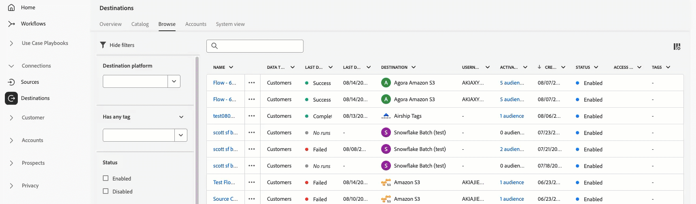

# Aanvullende informatie voor Adobe Experience Platform

>[!TIP]
>
>Raadpleeg de volgende documentatie voor aanvullende informatie voor andere Adobe Experience Platform-toepassingen:
>
>- [Adobe Journey Optimizer](https://experienceleague.adobe.com/en/docs/journey-optimizer/using/whats-new/release-notes)
>- [Adobe Journey Optimizer B2B](https://experienceleague.adobe.com/en/docs/journey-optimizer-b2b/user/release-notes)
>- [Customer Journey Analytics](https://experienceleague.adobe.com/nl/docs/analytics-platform/using/releases/pre-release-notes)
>- [Samenstelling van Federated-doelgroep](https://experienceleague.adobe.com/nl/docs/federated-audience-composition/using/e-release-notes)
>- [Real-Time CDP Collaboration](https://experienceleague.adobe.com/nl/docs/real-time-cdp-collaboration/using/latest)

**Releasedatum: 19 augustus 2025**

Nieuwe functies en updates van bestaande functies in Adobe Experience Platform:

- [Waarschuwingen](#alerts)
- [Catalogusservice](#catalog-service)
- [Bestemmingen](#destinations)
- [Experience Data Model (XDM)](#xdm)
- [Sandboxes](#sandboxes)
- [Segmentatieservice](#segmentation-service)
- [Bronnen](#sources)

## Waarschuwingen {#alerts}

Met Experience Platform kunt u zich aanmelden voor gebeurtenisgebaseerde waarschuwingen voor verschillende Experience Platform-activiteiten. U kunt zich aanmelden voor verschillende waarschuwingsregels via het tabblad [!UICONTROL Alerts] in de gebruikersinterface van Experience Platform, en u kunt ervoor kiezen waarschuwingsmeldingen te ontvangen in de gebruikersinterface zelf of via e-mailberichten.

**Nieuwe functies**

| Functie | Beschrijving |
| --- | --- |
| Waarschuwingen over de capaciteit van streamingdoorvoer | Met drie nieuwe waarschuwingen kunnen gebruikers zich abonneren op waarschuwingen en deze configureren om de prestaties van de streamingdoorvoercapaciteit proactief te beheren en te bewaken. De nieuwe waarschuwingen worden bijvoorbeeld gegeven wanneer de streamingdoorvoer 80% of 90% bereikt of de capaciteitslimieten overschrijdt. Voor meer informatie raadpleegt u de handleiding voor [capaciteitswaarschuwingsregels](../../observability/alerts/rules.md#capacity). |

Raadpleeg het [[!DNL Observability Insights] overzicht](../../observability/home.md) voor meer informatie over meldingen.

## Catalogusservice {#catalog-service}

Catalogusservice is het systeem voor het vastleggen van de locatie en herkomst van gegevens binnen Adobe Experience Platform. Alle gegevens die in Experience Platform worden opgenomen, worden in een datalake opgeslagen als bestanden en mappen. De catalogus bevat daarentegen de metagegevens en beschrijvingen van die bestanden en mappen voor opzoek- en controledoeleinden.

**Nieuwe of bijgewerkte functies**

| Functie | Beschrijving |
| --- | --- |
| Gegevensbewaring voor Real-Time Customer Profile | U kunt de termijn voor gegevensbewaring voor Real-Time Customer Profile **slechts** één keer per 30 dagen bijwerken. |

Voor meer informatie over de catalogusservice raadpleegt u het [overzicht van de catalogusservice](../../catalog/home.md).

## Bestemmingen {#destinations}

[!DNL Destinations] zijn vooraf gebouwde integraties met bestemmingsplatforms waarmee gegevens uit Experience Platform naadloos kunnen worden geactiveerd. U kunt bestemmingen gebruiken om uw bekende en onbekende gegevens te activeren voor cross-channel marketingcampagnes, e-mailcampagnes, gerichte advertenties en vele andere gebruiksscenario&#39;s.

>[!IMPORTANT]
>
>**Extensie voor het exportschema voor datasets**
>
>Als uw organisatie gegevensstromen voor het exporteren van datasets heeft die vóór november 2024 zijn gemaakt, werken deze gegevensstromen vanaf **1 september 2025** niet meer. Als u wilt dat de gegevensstromen ook na 1 september 2025 gegevens blijven exporteren, moet u de schema&#39;s voor elke bestemming waarnaar u datasets exporteert, verlengen door de stappen in [deze handleiding](../../destinations/ui/dataset-expiration-update.md) te volgen.

>[!IMPORTANT]
>
>**Update van de lijst met IP&#39;s van gewenste personen vereist voor API-gebaseerde bestemmingen**
>
>Wegens verbeteringen aan de exportengine voor streamingbestemmingen moeten organisaties die voor API-gebaseerde bestemmingen [lijsten met IP&#39;s van gewenste personen](../../destinations/catalog/streaming/ip-address-allow-list.md) gebruiken, **vóór 15 september 2025** de volgende IP-adressen aan hun lijsten met gewenste personen toevoegen:
>
>**Vereiste IP-adressen:**
>
>```
>3.209.222.108
>3.211.230.204
>35.169.227.49
>66.117.18.133
>66.117.18.134
>66.117.18.135
>```
>
>**Deze wijziging geldt voor de volgende bestemmingstypen:**
>
>- [Exportbestemmingen voor streamingdoelgroepen](../../destinations/destination-types.md#streaming-destinations) ([Pega CDH Realtime Audience](/help/destinations/catalog/personalization/pega-v2.md), API-gebaseerde integraties met [Salesforce Marketing Cloud](../../destinations/catalog/email-marketing/salesforce-marketing-cloud-exact-target.md) en [Oracle Eloqua](../../destinations/catalog/email-marketing/oracle-eloqua-api.md))
>- Openbare of privébestemmingen die via [Destination SDK](../../destinations/destination-sdk/getting-started.md) zijn opgebouwd
>
>**Vereiste actie:** Als u met Adobe hebt samengewerkt om IP-adressen voor API-gebaseerde streamingbestemmingen op de lijst met gewenste personen te plaatsen, moet u de bovenstaande IP-adressen aan uw lijst met gewenste personen toevoegen om ononderbroken gegevensstromen naar uw API-gebaseerde bestemmingen te garanderen.

**Nieuwe bestemmingen**

| Bestemming | Beschrijving |
| --- | --- |
| [[!DNL Acxiom Real ID Audience Connection]](../../destinations/catalog/advertising/acxiom-real-id-audience-connection.md)-bestemming | Gebruik de [!DNL Acxiom Real ID Audience Connection]-bestemming om uw doelgroepen te verbeteren met [!DNL Acxiom's] [Real ID](https://www.acxiom.com/real-id/real-id/)-technologie en doelgroepen activeren op meerdere platforms, zoals [!DNL Altice], [!DNL Ampersand], [!DNL Comcast] en meer. |

**Bijgewerkte bestemmingen**

| Bestemming | Beschrijving |
| --- | --- |
| Interne [[!DNL Microsoft Bing]](../../destinations/catalog/advertising/bing.md)-upgrade | Vanaf 11 augustus 2025 is het mogelijk dat u gedurende een korte periode twee **[!DNL Microsoft Bing]**-kaarten naast elkaar in de bestemmingscatalogus hebt gezien. Dit komt door een interne upgrade van de bestemmingsservice. De naam van de bestaande bestemmingsconnector **[!DNL Microsoft Bing]** is gewijzigd in **[!UICONTROL (Deprecated) Microsoft Bing]** en er is nu een nieuwe kaart met de naam **[!UICONTROL Microsoft Bing]** voor u beschikbaar. <br> De upgrade is voltooid en de verouderde kaart is verwijderd uit de bestemmingscatalogus. Gebruik de **[!UICONTROL Microsoft Bing]**-verbinding in de catalogus voor nieuwe activeringsgegevensstromen. Als u actieve gegevensstromen naar de **[!UICONTROL (Deprecated) Microsoft Bing]**-bestemming hebt, worden deze automatisch bijgewerkt. U hoeft dus niets te doen. <br><br>Als u gegevensstromen maakt via de [Flow Service API](https://developer.adobe.com/experience-platform-apis/references/destinations/), moet u uw [!DNL flow spec ID] en [!DNL connection spec ID] bijwerken naar de volgende waarden:<ul><li>Stroomspecificatie-ID: `8d42c81d-9ba7-4534-9bf6-cf7c64fbd12e`</li><li>Verbindingsspecificatie-ID: `dd69fc59-3bc5-451e-8ec2-1e74a670afd4`</li></ul> Na deze upgrade kunt u in uw gegevensstromen naar [!DNL Microsoft Bing] een **daling in het aantal geactiveerde profielen** ervaren. Deze daling wordt veroorzaakt door de introductie van de **ECID-toewijzingsvereiste** voor alle activeringen op dit bestemmingsplatform. |
| Informatie over de verloopdatum van de verificatie voor [[!DNL LinkedIn]](../../destinations/catalog/social/linkedin.md)- en [LinkedIn Matched Audiences](../../destinations/catalog/social/linkedin-b2b.md)-bestemmingen | Informatie over de verloopdatum van de verificatie voor [!DNL LinkedIn]-bestemmingen is nu rechtstreeks zichtbaar in de Experience Platform-interface. Zo kunt u zien wanneer uw verificatie verloopt en deze vernieuwen voordat er verstoringen in uw gegevensstromen ontstaan. U kunt de vervaldatums van uw tokens controleren in de kolom **[!UICONTROL Account expiration date]** op de tabbladen **[[!UICONTROL Accounts]](../../destinations/ui/destinations-workspace.md#accounts)** of **[[!UICONTROL Browse]](../../destinations/ui/destinations-workspace.md#browse)** . |

**Nieuwe of bijgewerkte functionaliteit**

| Functie | Beschrijving |
| --- | --- |
| Verbeterde zoek-, filter- en tagmogelijkheden voor bestemmingen | Verbeter uw workflow voor bestemmingsbeheer met verbeterde zoek-, filter- en tagmogelijkheden op de tabbladen [Verkennen](../../destinations/ui/destinations-workspace.md#browse) en [Accounts](../../destinations/ui/destinations-workspace.md#accounts). <br> U kunt nu op naam zoeken naar specifieke gegevensstromen en accounts, filteren op verschillende criteria zoals bestemmingsplatform, status en datums, en aangepaste tags maken om uw bestemmingen te ordenen. Kolomsortering is ook beschikbaar voor belangrijke velden als de laatste uitvoeringstijd van de gegevensstroom, zodat u de verbindingen met bestemmingen gemakkelijker kunt identificeren en beheren. <br>  |


## Experience Data Model (XDM) {#xdm}

XDM is een open-bronspecificatie die algemene structuren en definities (schema&#39;s) biedt voor gegevens die in Experience Platform worden geïmporteerd. Door de XDM-standaarden te hanteren, kunnen alle gegevens over de klantervaring worden opgenomen in een gemeenschappelijke weergave. Zo worden inzichten sneller en beter geïntegreerd verkregen. U kunt waardevolle inzichten verkrijgen uit klantacties, klantdoelgroepen definiëren via segmenten en klantkenmerken gebruiken voor personalisatiedoeleinden.

**Nieuwe functies**

| Functie | Beschrijving |
| ------- | ----------- |
| Op modellen gebaseerde schema&#39;s | Vereenvoudig uw gegevensmodellering met op modellen gebaseerde schema&#39;s. U kunt nu eenvoudiger schema&#39;s maken met uitgebreide voorbeelden en richtlijnen. Deze functie is momenteel beschikbaar voor Campaign Orchestration-licentiehouders en zal worden uitgebreid naar Data Distiller-klanten bij GA, waardoor gegevensmodellering toegankelijker en efficiënter wordt. |

Voor meer informatie raadpleegt u het [overzicht van XDM](../../xdm/home.md).

<!--

## Real-Time Customer Profile {#profile}

Real-Time Customer Profile provides a unified, actionable view of each customer by consolidating data from all channels into a single profile.

**New or updated features**

| Feature | Description |
| --- | --- |
| Enhanced lookup functionality in the Entities API | The Entities API now supports the following: <ul><li>Person (Profile)</li><li>Experience Events</li><li>Account</li><li>Opportunity</li></ul> This update simplifies API usage and helps ensure optimal performance and reliability. If you previously used lookups for other entity types—including join tables and custom Multi-Entity types—now is a great opportunity to review your API usage and take advantage of the improved experience. For more information, read the [Real-Time CDB B2B Edition architecture upgrade guide](../../rtcdp/b2b-architecture-upgrade.md). |

For more information on Real-Time Customer Profile, read the [Profile overview](../../profile/home.md).

-->

## Sandboxes {#sandboxes}

Experience Platform is ontworpen om digitale ervaringstoepassingen wereldwijd te verrijken. Bedrijven gebruiken vaak meerdere digitale ervaringstoepassingen parallel en moeten de ontwikkeling, het testen en de implementatie van deze toepassingen verzorgen en tegelijkertijd de operationele naleving waarborgen.

**Nieuwe of bijgewerkte functies**

| Functie | Beschrijving |
| --- | --- |
| Deduplicatie van afhankelijkheidsobjecten in de importworkflow | Sandboxtools gebruiken voortaan altijd, als er objecten met dezelfde naam worden gedetecteerd, die bestaande objecten opnieuw om objectproliferatie te voorkomen. Deze wijziging is van toepassing op de volgende objecten: <ul><li>Schema</li><li>Veldgroepen</li><li>Doelgroep</li><li>`decisioning_ranking`</li><li>`decisioning_rules`</li></ul> Raadpleeg voor meer informatie de [handleiding voor objecten die worden ondersteund voor sandboxtooling](../../sandboxes/ui/sandbox-tooling.md#objects-supported-for-sandbox-tooling). |
| Volledige sandboxondersteuning voor het delen van pakketten tussen organisaties | Sandboxtools ondersteunen nu bij het delen van pakketten tussen organisaties het type **Gehele sandbox**. U kunt nu pakketten met zowel volledige sandboxen als meerdere objecten tussen organisaties delen. Voor meer informatie raadpleegt u de [handleiding over voorwerpen die voor sandboxgereedschappen](../../sandboxes/ui/sharing-packages-across-orgs.md) worden ondersteund. |

Voor meer informatie over sandboxes, lees het [ overzicht van sandboxes](../../sandboxes/home.md).

## Segmentatieservice {#segmentation-service}

[!DNL Segmentation Service] definieert een specifieke subset van profielen door de criteria te beschrijven die een groep personen aan wie marketing kan worden aangeboden binnen uw klantenbestand onderscheiden. Doelgroepen kunnen worden gebaseerd op recordgegevens (zoals demografische informatie) of tijdreeksgebeurtenissen die klantinteracties met uw merk vertegenwoordigen.

**Nieuwe of bijgewerkte functies**

| Functie | Beschrijving |
| ------- | ----------- |
| Doelgroepinschattingen | Doelgroepinschattingen worden nu weergegeven als een **bereik**, dat is gebaseerd op het betrouwbaarheidsinterval van de steekproefgegevens. Voor meer informatie over schattingen kunt u de [Segment Builder-handleiding](/help/segmentation/ui/segment-builder.md#audience-properties) raadplegen. |

Voor meer informatie raadpleegt u het [[!DNL Segmentation Service] overzicht](../../segmentation/home.md).

## Bronnen {#sources}

Experience Platform biedt een RESTful-API en een interactieve gebruikersinterface waarmee u eenvoudig bronverbindingen voor verschillende gegevensproviders kunt instellen. Met deze bronverbindingen kunt u externe opslagsystemen en CRM-services verifiëren en er verbinding mee maken, tijden voor opnameruns instellen en de doorvoer van gegevensopname beheren.

**Nieuwe of bijgewerkte functionaliteit**

| Functie | Beschrijving |
| --- | --- |
| Algemene beschikbaarheid van de [!DNL Oracle NetSuite]-bron | De [!DNL Oracle NetSuite]-bron is nu algemeen beschikbaar. U kunt uw [!DNL Oracle NetSuite]-account nu verbinden met Experience Platform om activiteiten en gegevens van entiteiten in te voeren voor uniforme analyse en activering. Voor meer informatie raadpleegt u het [[!DNL Oracle NetSuite] overzicht](../../sources/connectors/marketing-automation/oracle-netsuite.md). |
| Algemene beschikbaarheid van de [!DNL PathFactory]-bron | De [!DNL PathFactory]-bron is nu algemeen beschikbaar. U kunt uw [!DNL PathFactory]-account verbinden met Experience Platform om gegevens van bezoekers, sessies en paginaweergaven in te voeren voor een uniforme analyse en activering. Voor meer informatie raadpleegt u het [[!DNL PathFactory] overzicht](../../sources/connectors/marketing-automation/pathfactory.md). |
| Algemene beschikbaarheid van de [!DNL Stripe]-bron | De [!DNL Stripe]-bron is nu algemeen beschikbaar. U kunt uw [!DNL Stripe]-account verbinden met Experience Platform om betalings- en transactiegegevens in te voeren voor een uniforme analyse en activering. Voor meer informatie raadpleegt u het [[!DNL Stripe] overzicht](../../sources/connectors/payments/stripe.md). |
| Verbeterde verificatie voor [!DNL Azure Blob Storage] | U kunt nu verificatie op basis van de belangrijkste service gebruiken om uw [!DNL Azure Blob Storage]-bron met Experience Platform te verbinden. U kunt nu verificatie op basis van de belangrijkste service gebruiken voor verbeterde veiligheid, eenvoudigere rotatie van aanmeldingsgegevens en een nauwkeurigere toegangscontrole voor uw account. Voor meer informatie raadpleegt u het [[!DNL Azure Blob Storage] overzicht](../../sources/connectors/cloud-storage/blob.md). |

Voor meer informatie raadpleegt u het [overzicht van bronnen](../../sources/home.md).

<!---

| [!BADGE Beta]{type=Informative} Support for [!DNL Azure Private Links] in the UI | You can now use [!DNL Azure Private Links] for a select group of sources in the UI. Use this feature to create a private endpoint that which your source can connect to. With private endpoints, you can set up connections and dataflows that bypass the public internet, giving you enhanced security and network isolation for your sensitive data. Support for [!DNL Azure Private Links] is available to the following following sources: <ul><li>[[!DNL Azure Blob Storage]](../../sources/connectors/cloud-storage/blob.md)</li><li>[[!DNL ADLS Gen2]](../../sources/connectors/cloud-storage/adls-gen2.md)</li><li>[[!DNL Azure File Storage]](../../sources/connectors/cloud-storage/azure-file-storage.md)</li><li>[[!DNL Snowflake]](../../sources/connectors/databases/snowflake.md)</li></ul> For more information, read the guide on [[!DNL Azure Private Links]](../../sources/tutorials/ui/private-link.md). |

| Enhanced [[!DNL Marketo Engage]](../../destinations/catalog/adobe/marketo-engage-connection.md) destination  | The enhanced [[!DNL Marketo Engage]](../../destinations/catalog/adobe/marketo-engage-connection.md) destination is an upgraded version of the existing [[!DNL (Legacy) (V2) Marketo Engage]](../../destinations/catalog/adobe/marketo-engage.md) connector. This new connector brings profile sync capabilities in addition to the existing audience sync capabilities from the legacy connector, providing a tighter integration with [!DNL Marketo Engage]. <br> The [[!DNL (Legacy) (V2) Marketo Engage]](../../destinations/catalog/adobe/marketo-engage.md) connector will be deprecated in **March 2026**. To ensure a smooth transition to the new **[[!UICONTROL Marketo Engage]](../../destinations/catalog/adobe/marketo-engage-connection.md)** destination, review the following key points and required actions: <ul><li>All users of the existing **[!UICONTROL (Legacy) (V2) Marketo Engage]** must migrate to the new **[!UICONTROL Marketo Engage]** destination by March 2026.</li><li> **Existing dataflows will not be migrated automatically.** You must [set up a new connection](../../destinations/ui/connect-destination.md) to the new **[!UICONTROL Marketo Engage]** destination and activate your audiences there.</li></ul>|

-->

