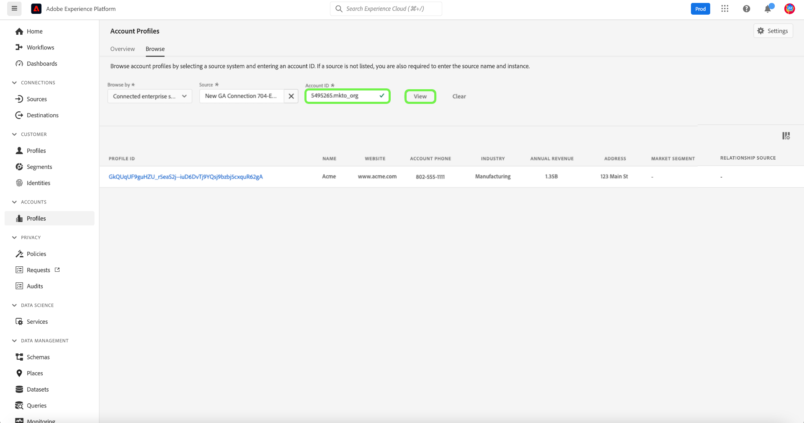

# Gebruikersgids voor accountprofielen

>[!IMPORTANT]
>
>Real-time Customer Data Platform B2B Edition is momenteel in bèta. De documentatie en functionaliteit kunnen worden gewijzigd.

>[!NOTE]
>
>Accountprofielen zijn alleen beschikbaar voor Real-time Customer Data Platform B2B Edition-klanten. Om meer over CDP in real time, met inbegrip van de eigenschappen en de functionaliteit beschikbaar aan elk vergunningstype te leren, te beginnen door [CDP overzicht in real time](../overview.md) te lezen.

Met accountprofielen kunt u accountgegevens uit meerdere bronnen verenigen. Deze verenigde mening van een rekening brengt gegevens van over uw vele marketing kanalen en de diverse systemen samen die uw organisatie momenteel gebruikt om de informatie van de klantenrekening op te slaan. Dit document biedt een handleiding voor het werken met accountprofielen met behulp van de CDP- en B2B Edition-mogelijkheden in realtime die beschikbaar zijn in de gebruikersinterface van Adobe Experience Platform (UI).

## Accountprofielen zoeken

Als u door accountprofielen wilt bladeren, selecteert u eerst **[!UICONTROL Profiles]** onder Accounts in de linkernavigatie.

Op het tabblad **[!UICONTROL Browse]** kunt u accountprofielen verkennen aan de hand van een account-id van een verbonden ondernemingsbron of door brongegevens rechtstreeks in te voeren.

### Bladeren op [!UICONTROL Connected enterprise source]

Als u door accountprofielen wilt bladeren op basis van een verbonden bedrijfsbron, moet u eerst een verbonden bron selecteren met de selectieknop naast het veld **[!UICONTROL Source]**.

Dit opent de dialoog **[!UICONTROL Select source]**, waar u een bron kunt selecteren die op de verbindingen wordt gebaseerd die uw organisatie heeft gevestigd.

>[!NOTE]
>
>Uw organisatie kan veelvoudige bronnen hebben die voor de zelfde dienstverlener (bijvoorbeeld, Marketo) worden gevormd, zodat is het belangrijk om de verbindingsnaam, het bronsysteem, en de instantie van het bronsysteem te herzien om ervoor te zorgen u door de correcte broninstantie zoekt.

Raadpleeg het [overzicht van bronnen](../sources/sources-overview.md) voor meer informatie over het verbinden van bedrijfsbronnen.

U kunt een bron kiezen door het keuzerondje naast de naam van de verbinding te selecteren en vervolgens **[!UICONTROL Select]** te gebruiken om terug te keren naar het tabblad [!UICONTROL Browse].

Als er een bron is geselecteerd, moet u nu een **[!UICONTROL Account id]** invoeren die betrekking heeft op de bron. Als u bijvoorbeeld een Salesforce-bron selecteert, moet u een account-id invoeren in de Salesforce-instantie om het accountprofiel weer te geven dat aan die id is gekoppeld.

>[!NOTE]
>
>Voor Marketo-account-id&#39;s zijn er twee mogelijke accounttabellen waarnaar kan worden verwezen. Daarom moet u een specifieke syntaxis gebruiken om ervoor te zorgen dat u de juiste account weergeeft.
>
>De meest gangbare, standaardsyntaxis is de Marketo-account-id die wordt toegevoegd door `.mkto_org` (bijvoorbeeld `1234567.mkto_org`). Marketo Account-Based Marketing-klanten kunnen extra waarden hebben die u kunt vinden met de Marketo-account-id die u hebt toegevoegd door `.mkto_account`. Neem contact op met uw Marketo-beheerder als u niet zeker weet welke syntaxis u moet gebruiken.

### Bladeren op [!UICONTROL Other]

CDP in real time, steunt de Uitgave B2B de capaciteit om een directe raadpleging uit te voeren door u toe te staan om **[!UICONTROL Source name]**, **[!UICONTROL Source instance]**, en **[!UICONTROL Account id]** voor een rekening in te gaan die u zou willen bekijken. Door de bronnaam en -instantie rechtstreeks in te voeren, geeft u de context op die Experience Platform nodig heeft om de juiste accountprofielgegevens te zoeken en weer te geven.

De mogelijkheid om een directe zoekopdracht uit te voeren is handig in omstandigheden waarin een bronverbinding rechtstreeks met de gegevens niet mogelijk is. Als uw organisatie bijvoorbeeld een beleid voor gegevensbeheer heeft dat directe verbinding met een CRM verhindert, kunt u die gegevens exporteren naar een systeem voor cloudopslag en deze vervolgens in Experience Platform opnemen.

Een ander voorbeeld zou kunnen zijn dat u een transformatie op de gegevens uitvoert tussen de tijd het van een systeem verlaat en Platform ingaat. U kunt de directe raadplegingsfunctionaliteit gebruiken om context voor de gegevens te verstrekken (zoals specificerend dat het gegevens van Marketo is, ondanks het feit dat het uit een emmertje van Amazon S3, bijvoorbeeld) komt zodat het systeem weet waar te zoeken, en hoe te om behoorlijk terug te geven, de gegevens.

## Accountprofieldetails weergeven

Als u op het tabblad **[!UICONTROL Browse]** een accountprofiel hebt gevonden en **[!UICONTROL Profile ID]** selecteert, wordt het tabblad **[!UICONTROL Detail]** voor het accountprofiel geopend. De profielgegevens die op het tabblad **[!UICONTROL Detail]** worden weergegeven, zijn samengevoegd vanuit meerdere profielfragmenten en vormen één weergave van het individuele account. Dit omvat accountdetails zoals basiskenmerken en gegevens over sociale media.

De weergegeven standaardvelden kunnen ook op organisatorisch niveau worden gewijzigd om de voorkeurskenmerken van het accountprofiel weer te geven.

>[!NOTE]
>
>Er is een vergelijkbare functionaliteit beschikbaar voor klantprofielen en er is een stapsgewijze handleiding gemaakt met instructies voor het toevoegen en verwijderen van kenmerken, het wijzigen van het formaat van deelvensters, enzovoort. Lees de [handleiding voor het aanpassen van profieldetails](../../profile/ui/profile-customization.md) voor meer informatie.

U kunt aanvullende gegevens met betrekking tot de account weergeven door een andere beschikbare tabbladen te selecteren. Deze lusjes omvatten attributen, mensen, en het kansen lusje dat open en gesloten kansen met betrekking tot de rekening over uw ondernemingssystemen toont. Raadpleeg de volgende secties voor meer informatie over elk tabblad.

## Tabblad Kenmerken

Op het tabblad **[!UICONTROL Attributes]** worden alle recordgegevens weergegeven die betrekking hebben op de account. Dit omvat kenmerkgegevens die afkomstig zijn van meerdere bronnen die samen zijn samengevoegd om één weergave van de account te vormen.

U kunt de gegevens niet alleen in een lijst weergeven, maar u kunt ook de zoekbalk gebruiken om te zoeken naar specifieke kenmerken of om de recordgegevens als JSON weer te geven.

## Het tabblad Personen

Het tabblad **[!UICONTROL People]** bevat een lijst met individuele personen die aan de account zijn gekoppeld. Deze mensen kunnen contacten en lood van verschillende ondernemingssystemen zijn die door verschillende teams binnen uw organisatie worden beheerd, maar in real time CDP, B2B Uitgave worden zij samen voorgesteld als één enkele lijst toelatend u om een holistische mening van uw rekeningscontacten te zien.

>[!NOTE]
>
>Op het tabblad [!UICONTROL People] wordt een lijst weergegeven met maximaal 25 personen die aan de account zijn gekoppeld. Voor rekeningen met meer dan 25 geassocieerde personen toont het systeem een willekeurige steekproef van 25 records.

Naast het tonen van u een momentopname van informatie voor het contact, omvat elke vermelde persoon ook **[!UICONTROL Profile ID]**, die een klikbare verbinding is die u toestaat om het Profiel van de Klant in real time voor dat individu te onderzoeken. Meer informatie over het bekijken van individuele klantenprofielen met betrekking tot uw rekeningen, gelieve de gids voor [doorbladerprofielen in CDP in real time, B2B Uitgave](../profile/profile-browse.md) te bezoeken.

## Tabblad Kansen

Het tabblad **[!UICONTROL Opportunities]** biedt informatie over open en gesloten mogelijkheden die betrekking hebben op de account. Deze kansen kunnen in Experience Platform van veelvoudige bronnen worden opgenomen, nochtans in real time CDP, maakt B2B Uitgave het voor marketers gemakkelijk om al deze kansen samen op één plaats te zien.

>[!NOTE]
>
>Op het tabblad [!UICONTROL Opportunities] wordt een lijst weergegeven met maximaal 25 mogelijkheden die aan de account zijn gekoppeld. Voor rekeningen met meer dan 25 bijbehorende kansen, toont het systeem een willekeurige steekproef van 25 verslagen.

Elke kans bevat informatie zoals de naam van de kans, de hoeveelheid kansen, het werkgebied en of de kans open, gesloten, gewonnen of verloren is.

