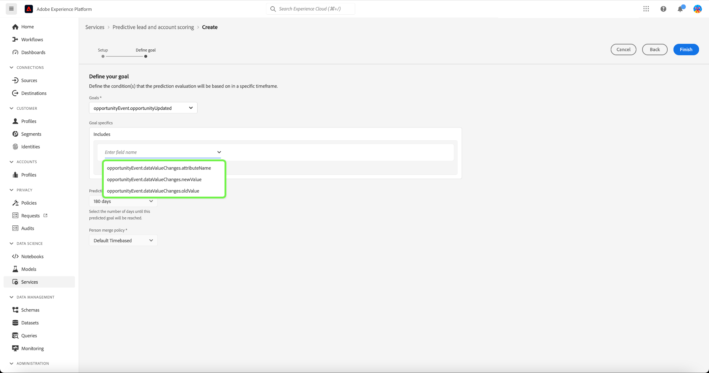

# Beheer voorspellende leads en accountscoring in Real-time Customer Data Platform, B2B Edition

>[!NOTE]
>
>Alleen gebruikers met de machtiging B2B AI beheren kunnen muziekdoelen maken, wijzigen en verwijderen.

Dit leerprogramma begeleidt u door de stappen om scoredoelstellingen van de voorspellende lood en rekening het scoren dienst te beheren. Score-doelen kunnen worden gesteld voor het profiel van een persoon of account

## Een nieuwe score maken

Als u een nieuwe score wilt maken, selecteert u de optie **[!UICONTROL Services]** in de zijbalk en selecteer **[!UICONTROL Create score]**.

De **[!UICONTROL Basic information]** wordt weergegeven en u wordt gevraagd een profieltype te selecteren, een naam en een optionele beschrijving in te voeren. Als u klaar bent, selecteert u **[!UICONTROL Next]**.

De **[!UICONTROL Define your goal]** wordt weergegeven. Selecteer de vervolgkeuzepijl en selecteer vervolgens een doeltype in het vervolgkeuzevenster dat wordt weergegeven.

De **[!UICONTROL Goal specifics]** wordt geopend. Selecteer de vervolgkeuzepijl en selecteer vervolgens de naam van het doelveld in het vervolgkeuzevenster dat wordt weergegeven.

De **[!UICONTROL Goal conditions]** wordt weergegeven. Selecteer de vervolgkeuzepijl en selecteer vervolgens de voorwaarde in het vervolgkeuzevenster dat wordt weergegeven.

De **[!UICONTROL Goal value]** wordt weergegeven. Vervolgens configureert u uw [!UICONTROL Goal specifics]. Selecteer [!UICONTROL Enter Field Value] en voer de waarde van uw doel in.

>[!NOTE]
>
>U kunt meerdere doelwaarden toevoegen.

Als u aanvullende velden wilt toevoegen, selecteert u **[!UICONTROL Add field]**.

Selecteer de vervolgkeuzepijl en selecteer vervolgens het gewenste tijdframe om de voorspelling te configureren.

Het geselecteerde samenvoegbeleid bepaalt hoe de veldwaarden van een personenprofiel worden geselecteerd. Selecteer met de vervolgkeuzepijl het gewenste samenvoegbeleid en selecteer **[!UICONTROL Finish]**.

De **[!UICONTROL Scoring setup is complete]** wordt bevestigd dat de nieuwe score is gemaakt. Selecteer **[!UICONTROL OK]**.

>[!NOTE]
>
>Het kan tot 24 uur duren voor elk scoringsproces wordt voltooid.

U bent teruggekeerd aan **[!UICONTROL Services]** Hier kunt u de nieuwe score zien die in de lijst met scores is gemaakt.

Selecteer de score om details en aanvullende informatie over de details van de laatste uitvoering weer te geven.

Voor meer gedetailleerde informatie over de foutcodes die u kunt zien onder de laatste run-details, raadpleegt u de sectie over [leidt tot AI pijpleidingsfoutencodes](#leads-ai-pipeline-error-codes) in dit document.

## Een score bewerken

Als u een score wilt bewerken, selecteert u een score in het menu **[!UICONTROL Services]** en selecteert u **[!UICONTROL Edit]** in het deelvenster Extra details aan de rechterkant van het scherm.

De **[!UICONTROL Edit instance]** wordt weergegeven, waar u de beschrijving van de score kunt bewerken. Breng uw wijzigingen aan en selecteer **[!UICONTROL Save]**.

>[!NOTE]
>
>De scoreconfiguratie kan niet worden gewijzigd omdat dit modelomscholing en re-scoring teweegbrengt. Het equivalent hiervan is het verwijderen van de score en het maken van een nieuwe score. Als u de configuratie van de score wilt bewerken, moet u deze score klonen of een nieuwe score maken.

U bent teruggekeerd aan **[!UICONTROL Services]** tab. Selecteer de score om de bijgewerkte beschrijvingsdetails in het extra detailpaneel op de rechterkant van het scherm te bekijken.

## Een score klonen

Als u een score wilt klonen, selecteert u een score in het menu **[!UICONTROL Services]** en selecteert u **[!UICONTROL Clone]** in het deelvenster Extra details aan de rechterkant van het scherm.

De **[!UICONTROL Basic information]** wordt weergegeven. Het profieltype, de naam en de beschrijving worden gekloond op basis van de oorspronkelijke score. Wijzig deze details en selecteer **[!UICONTROL Next]**.

De **[!UICONTROL Define your goal]** wordt weergegeven. Voltooi de sectie Doelen zoals u zou wanneer het creëren van een nieuwe score en selecteer **[!UICONTROL Finish]**.

U bent teruggekeerd aan **[!UICONTROL Services]** Hier ziet u de zojuist gekloonde score in de lijst.

>[!NOTE]
>
>De **[!UICONTROL Define your goal]** wordt niet gekloond vanaf de oorspronkelijke score.

## Muziek verwijderen

Als u een score wilt verwijderen, selecteert u een score in het menu **[!UICONTROL Services]** en selecteert u **[!UICONTROL Delete]** in het deelvenster Extra details aan de rechterkant van het scherm.

De **[!UICONTROL Delete documentation]** bevestigingsvenster verschijnt. Selecteer **[!UICONTROL Delete]**.

>[!NOTE]
>
>Als u de muziekdefinitie verwijdert, worden ook alle voorspelde scores in het profiel van de persoon of het account verwijderd, maar niet de veldgroep die voor de muziekdefinitie is gemaakt. De veldgroep wordt in het gegevensmodel &#39;wees&#39; gelaten.

U bent teruggekeerd aan **[!UICONTROL Services]** waar u de score niet meer in de lijst kunt zien.

## Voorloopfoutcodes voor AI-pijpleidingen

| Foutcode | Foutbericht |
| --- | --- |
| 401 | FOUT 401. De AI-pijpleiding van leads is gestopt: onvoldoende geldige accounts voor accountscoring. Aantal rekeningen: {} . |
| 402 | FOUT 402. De AI-pijpleiding van leads is gestopt: niet genoeg geldige contacten voor contactscore. Aantal contactpersonen: {} . |
| 403 | FOUT 403. De AI-pijpleiding van leads is gestopt: onvoldoende activiteitenvolume voor modeltraining. Aantal gebeurtenissen: {} . |
| 404 | FOUT 404. De AI-pijpleiding van leads is gestopt: onvoldoende conversies voor modeltraining. Aantal omzettingen: {} . |
| 405 | FOUT 405. De AI-pijpleiding van leads is gestopt: te weinig activiteit voor een geldige modelopleiding. Slechts {} procent van de accounts heeft activiteit. |
| 406 | FOUT 406. De AI-pijpleiding van leads is gestopt: te weinig activiteit voor een geldige modelopleiding. Slechts {} percent van contacten heeft activiteit. |
| 407 | FOUT 407. De AI-pijpleiding van leads is gestopt: de typen scoring van gegevensactiviteiten komen niet overeen met de trainingsgegevens. |
| 408 | FOUT 408. De AI-pijpleiding van leads is gestopt: de ontbrekende snelheid is te hoog voor activiteitsfuncties. Ontbrekende frequentie: {} . |
| 409 | FOUT 409. De AI-pijpleiding van leads is gestopt: test auc is te laag. Auc testen: {} . |
| 410 | FOUT 410. De AI-pijpleiding van leads is gestopt: test auc is te laag na parameterinstelling. Auc testen: {} . |
| 411 | FOUT 411. De AI-pijpleiding van leads is gestopt: de opleidingsgegevens hebben niet genoeg omzettingen om betrouwbaar model te produceren. conversies: {}. |
| 412 | FOUT 412. De AI-pijpleiding van leads is gestopt: de testgegevens hebben geen conversie om de AUC-ROC te berekenen. |

| Waarschuwing/informatiecode | Bericht |
| --- | --- |
| 100 | INFO 100. Leidt AI-kwaliteitscontrole: het aantal rekeningen bedraagt : {} . |
| 101 | INFO 101. Leidt AI-kwaliteitscontrole: het aantal contacten is : {} . |
| 102 | INFO 102. Leidt AI-kwaliteitscontrole: het aantal kansen is : {} . |
| 103 | INFO 103. Leidt AI-kwaliteitscontrole: de testauc is laag . Start parameterinstelling. Testauc: {} . |
| 200 | WAARSCHUWING 200. Leidt AI-kwaliteitscontrole: het ontbrekende aantal ontstekingsfuncties is: {} . |
| 201 | WAARSCHUWING 201. Leidt AI-kwaliteitscontrole: de ontbrekende activiteitskenmerken zijn : {} . |

## Volgende stappen

Met deze zelfstudie kunt u nu scores maken en beheren. Raadpleeg de volgende documenten voor meer informatie:

* [Voorspelend lood en account scoring](/help/rtcdp/b2b-ai-ml-services/predictive-lead-and-account-scoring.md)
* [Voorspelende functies en taken voor accountscoring bewaken](/help/dataflows/ui/b2b/monitor-profile-enrichment.md)
