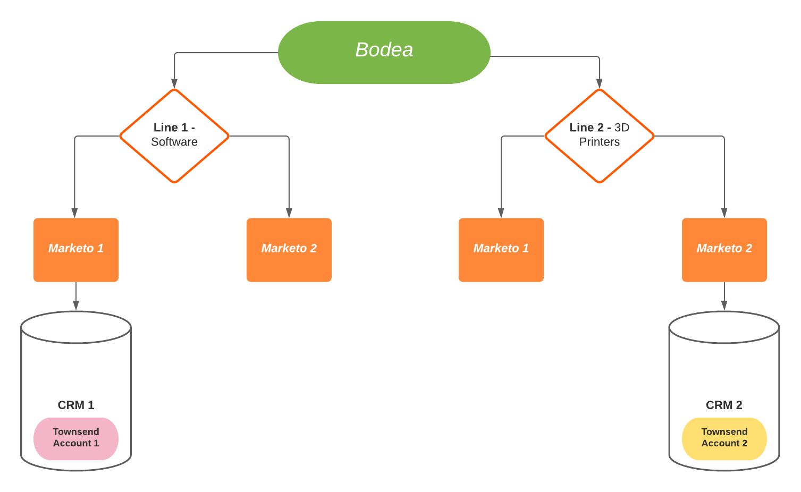

# Voorbeeld: Hoofdlettergebruik voor Real-time Customer Data Platform B2B Edition

>[!IMPORTANT]
>
>CDP Business to Business Edition in realtime wordt momenteel in bèta weergegeven. De documentatie en de functionaliteit kunnen worden gewijzigd.

Real-time Customer Data Platform B2B Edition breidt het bestaande Real-time CDP- en Adobe Experience Platform-aanbod uit om B2B-gegevens en -workflows te ondersteunen. Dit document biedt een voorbeeld van een gebruiksgeval dat de extra voordelen aantoont die door de B2B Edition worden geboden. Deze omvatten:

- Combineer persoon- en accountgegevens uit verschillende gegevensbronnen op dezelfde locatie om een uitgebreide weergave te maken die een beter inzicht in de klanten en een nauwkeuriger segmentering mogelijk maakt. Zie de documentatie over [het creëren van XDM schemaverhoudingen](./schemas/b2b.md) voor gebruik met gevarieerde B2B bronnen voor meer informatie.
- Segmenteer een publiek op basis van kenmerken van verwante entiteiten. Dit omvat Rekeningen, Kansen, Campagnes, en de Lijst van de Marketing. Segmenten blijven niet langer beperkt tot alleen personekenmerken en Experience Events. Zie de documentatie over B2B-segmentatie voor meer voorbeelden van het maken van B2B-specifieke soorten publiek.
   <!-- PLACEHOLDER [B2B segmentation documentation]()  -->
- Native ondersteuning bieden voor het gebruik van één persoon met betrekking tot meerdere rekeningen.

## Gebruiksscenario

Bodea, een technologiebedrijf, heeft een nieuw product en wil tegelijkertijd klanten met een e-mail en een LinkedIn advertentiecampagne richten. Om de doeltreffendheid van hun marketingcampagne te maximaliseren, wil Bodea zich ook richten op de mensen die met die bestaande rekening verbonden zijn en die meer dan een miljoen dollar hebben uitgegeven aan hun producten eerder, EN de nieuwe productpagina in de afgelopen maand hebben bezocht.

Bodea heeft echter twee verschillende bedrijfsonderdelen. Bodea&#39;s eerste business line 1 creëert software voor de automobielindustrie. De tweede branche, &quot;Line 2&quot;, verkoopt 3D-printers die auto-onderdelen maken. Als gevolg van de twee bedrijfsonderdelen van Bodea zijn de inkomstengegevens die uit de klantenrekeningen van Bodea worden gegenereerd, niet in één enkele weergave verenigd.

Elke branche heeft zijn eigen verkoopsysteem: &quot;CRM 1&quot; en &quot;CRM 2&quot;. Beide CRM-verkoopsystemen zijn verbonden met hun eigen marketingautomatiseringsplatform &quot;Marketo 1&quot; en &quot;Marketo 2&quot;. Gegevens van CRM 1 worden alleen gesynchroniseerd naar Marketo 1 en gegevens van CRM2 worden alleen gesynchroniseerd naar Marketo 2. Uiteindelijk worden hun gegevens bewaard in verschillende informatiesilo&#39;s van bedrijven.

<!--  -->

## Huidige gegevenssituatie

Aangezien beide bedrijfsonderdelen van Bodea aan de Townsend-onderneming verkopen, worden de bedrijfsgegevens van Townsend in elk verkoopsysteem als twee afzonderlijke rekeningen geregistreerd.

In Marketo 1 wordt Townsend opgenomen als Account 1. Het heeft twee verwante mensen (p1@townsend.com en p2@townsend.com) en één gesloten-won kans van $200k (&quot;Opportunity 1&quot;) in CRM 1. Deze gegevens worden gesynchroniseerd van CRM 1 naar Marketo 1.

In Marketo 2 wordt Townsend opgenomen als Account 2. Account 2 heeft ook twee verwante personen (p2@townsend.com en p3@townsend.com) en één &#39;closed-won&#39; kans van $900k (&#39;Opportunity 2&#39;) in CRM 2. Deze gegevens worden gesynchroniseerd van CRM 2 naar Marketo 2.

Voor integratie en aanvullende bedrijfscontroledoeleinden beschikt Bodea ook over een Master gegevensbeheersysteem (MDM) waarbij het een record bijhoudt waarin wordt vermeld dat Account 1 in Marketo 1 (en CRM 1) en Account 2 in Marketo 2 (en CRM 2) dezelfde onderneming zijn.

In de laatste maand bezocht `p2@townsend.com` de nieuwe productpagina en het webbezoek werd geregistreerd door Marketo 1.

## Het probleem

Lijn 1 heeft onlangs een nieuw softwareproduct vrijgegeven en zou het aan Bodea&#39;s bestaande top-tier klantenbasis willen omhoog-verkopen. Bodea lanceert een marketing campagne met dat specifieke doelpubliek in mening.

Aangezien de relevante informatie over de stad wordt geregistreerd als account 1 in Marketo 1 en account 2 in Marketo 2, kan het marketingteam van Bodea de opgeslagen informatie niet efficiënt gebruiken.

Dit verbiedt het marketingteam van Bodea om op efficiënte wijze specifieke zakelijke contacten met deze nieuwe kans aan te knopen bij deze bedrijven.

Tot op heden heeft Townsend meer dan een miljoen dollar cumulatief uitgegeven aan Bodea producten over al hun rekeningen. Een segment dat met behulp van het oude systeem is gemaakt, zou echter niemand van Townsend omvatten, tenzij het totaal dat binnen één verkoopsysteem is uitgegeven meer dan 1 miljoen dollar bedroeg. Dit komt doordat de inkomstengegevens in rekeningen onder verschillende verkoopsystemen worden opgeslagen.

Aangezien de uitgaven van Townsend over verschillende verkoopsystemen worden verdeeld en individueel niet meer dan een miljoen bedragen, zou het segment niemand vinden die in Marketo 1 of Marketo 2 gekwalificeerd is.

### Hoe Echte - tijdCDP B2B Uitgave het probleem oplost

Met CDP B2B Edition in realtime kan het marketingteam van Bodea:

- Combineer de gegevens uit alle verschillende bronnen (meerdere Marketo- en CRM-instanties en het Master gegevensbeheer) tot CDP B2B Edition in realtime.

Met RT-CDP B2B Edition, kan Bodea de BronVerbinding van de Marketo Engage gebruiken om B2B gegevens van Marketo 1 en Marketo 2 in Experience Platform te brengen en deze gegevens huidig te houden gebruikend Platform verbonden toepassingen. Zie de [Marketo-bronconnector](../sources/connectors/adobe-applications/marketo/marketo.md) documentatie voor meer informatie.

B2B-gegevens (Mensen, Accounts, Opportunity, and activity ) van CRM1 worden gesynchroniseerd in Marketo 1. Evenzo worden alle B2B-gegevens van CRM 2 gesynchroniseerd in Marketo 2. Ze worden gesynchroniseerd in Adobe Experience Platform via de Marketo-bronconnector. Nochtans, als Bodea extra gegevens van CRM in Experience Platform wil brengen, kunnen zij bestaande Verbindingen van CRM gebruiken.

In het belang van de eenvoud en het doel van dit voorbeeld worden mensen geïdentificeerd door hun e-mails. De gecombineerde accountgegevens voor dit voorbeeld zien er als volgt uit:

| Mensen |
|---|
| p1@townsend.com |
| p2@townsend.com (die de laatste maand de nieuwe productpagina heeft bezocht) |
| p3@townsend.com |

| Kansen (gesloten-won) |
|---|
| Opportunity 1, $200 k |
| Opportunity 2, $900 k |

- Maak unieke segmenten met deze geaggregeerde gegevens voor verschillende marketinginitiatieven. In dit voorbeeld vindt het segment alle mensen die:

   - Heb bijbehorende kansen (over ALLE rekeningen) $1 miljoen in waarde overschrijden
   - AND
   - De productpagina in de afgelopen maand hebben bezocht

- Creëer een publiek dat de meest efficiënte ontvangers van de nieuwe marketingcampagne van Bodea is. In dit voorbeeld, RT-CDP, zal de Uitgave B2B de teler helpen `p2@townsend.com` als het juiste doel voor deze marketing campagne identificeren.

Door de bestemmingen van Marketo Engage en van LinkedIn te gebruiken, heeft Bodea een oplossing van het het beheer van de klantenervaring van begin tot eind (CXM) voor zijn marketing team. Het in Experience Platform gemaakte publiek wordt naar de Marketo-bestemming geduwd, waar het als een statische lijst wordt weergegeven. Dit publiek wordt vervolgens automatisch toegevoegd aan een Marketo-marketingcampagne. Tegelijkertijd kan het publiek ook door de RT-CDP B2B Edition naar een LinkedIn-marketingcampagne worden gestuurd.

## Volgende stappen

Door dit document te lezen, bent u nu geïntroduceerd aan de soorten doelstellingen en problemen die kunnen worden opgelost gebruikend Echte - tijd CDP B2B Uitgave.

De volgende documentatie wordt aanbevolen om meer inzicht te krijgen in B2B-specifieke functies:

<!-- - [Marketo connector]() -->
- [Schema&#39;s in Real-time Customer Data Platform B2B Edition](./schemas/b2b.md)
- [Marketo Engage-doeldocumentatie](https://experienceleague.adobe.com/docs/experience-platform/destinations/catalog/adobe/marketo-engage.html)
- [Een bestemming voor een met LinkedIn overeenkomend publiek configureren](https://experienceleague.adobe.com/docs/experience-platform/destinations/catalog/social/linkedin.html#connect)

<!-- PLACEHOLDER -->
<!-- - [Account Profiles]() -->
<!-- - [B2B Segmentation examples]() -->
<!-- PLACEHOLDERS to tutorial / account profiles / B2B connectors / segmentation examples -->
