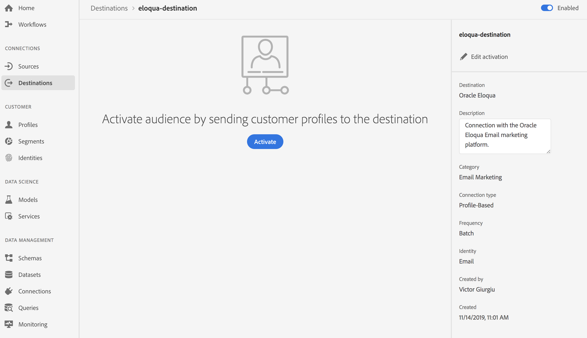
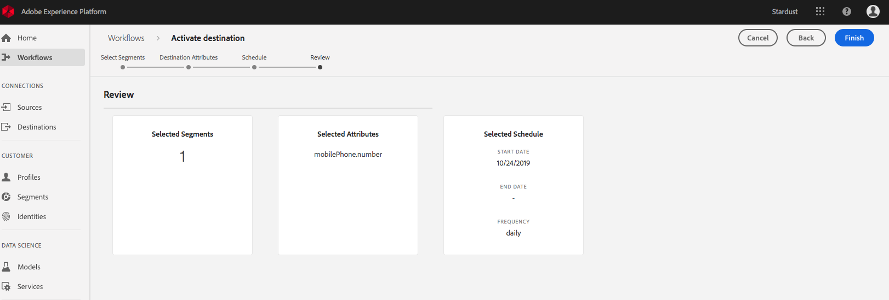

# Profielen en segmenten naar een doel activeren

Activeer de gegevens u in het Platform van de Gegevens van de Klant van Adobe in real time door segmenten aan bestemmingen in kaart te brengen hebt. Volg onderstaande stappen om dit te bereiken.

## Vereisten {#prerequisites}

Om gegevens aan bestemmingen te activeren, moet u een bestemming [met succes hebben](/help/rtcdp/destinations/connect-destination.md)verbonden. Als u dit niet reeds hebt gedaan, ga naar de [bestemmingscatalogus](/help/rtcdp/destinations/destinations-catalog.md), doorblader de gesteunde bestemmingen, en opstelling één of meerdere bestemmingen.

## Gegevens activeren {#activate-data}

De stappen in het activeringswerkschema variëren lichtjes tussen bestemmingstypes. De volledige werkstroom voor alle bestemmingstypes wordt hieronder geschetst.

### Selecteer het doel waarop de gegevens moeten worden geactiveerd {#select-destination}

Van toepassing op: Alle bestemmingen

1. In de Echte Adobe - tijdCDP gebruikersinterface, navigeer aan **[!UICONTROL Doelen]** > **[!UICONTROL doorbladeren]**, en selecteer de bestemming waar u uw segmenten wilt activeren.
   
2. Klik op de naam van het doel. Hiermee gaat u naar de activeringsworkflow.
   Merk op dat als een activeringswerkschema reeds voor een bestemming bestaat, u de segmenten kunt zien die momenteel aan de bestemming worden geactiveerd. Selecteer Activering **** bewerken in de rechtertrack en voer de onderstaande stappen uit om de activeringsdetails te wijzigen.
3. Selecteer **[!UICONTROL Activeren]**.

<br> 

### **[!UICONTROL Segmenten]** selecteren {#select-segments}

Van toepassing op: Alle bestemmingen


Selecteer in de workflow Doel **** activeren op de pagina Segmenten **** selecteren een of meer segmenten die u wilt activeren op de bestemming. Druk op **[!UICONTROL Volgende]** om door te gaan naar de volgende stap.


<br> 

### **[!UICONTROL stap Identiteitstoewijzing]** {#identity-mapping}

Van toepassing op: sociale bestemmingen en Google Customer Match-advertentiebestemming


Voor *sociale bestemmingen*, in de het in kaart brengen **[!UICONTROL van de]** Identiteit stap, kunt u bronattributen selecteren om als doelidentiteiten in de bestemming in kaart te brengen. Deze stap is optioneel of verplicht, afhankelijk van de primaire identiteit die u in het schema gebruikt. <br> 

*E-mailadres als primaire identiteit*: Als u het e-mailadres als primaire identiteit in uw schema gebruikt, kunt u de stap Identiteitstoewijzing overslaan, zoals hieronder wordt getoond:


<br> 

*Een andere id als primaire identiteit*: Als u een andere identiteitskaart, zoals *Uitkerings identiteitskaart* of identiteitskaart *van de* Loyalty, als primaire identiteit in uw schema gebruikt, moet u het e-mailadres van uw identiteitsschema als doelidentiteit in de sociale bestemming manueel in kaart brengen, zoals hieronder getoond:


Selecteer deze optie `Email_LC_SHA256` als doel als u de e-mailadressen van klanten bij het invoeren van gegevens in Adobe Experience Platform hebt gewijzigd volgens de vereisten voor [!DNL Facebook] e- [mailhashing](/help/rtcdp/destinations/facebook-destination.md#email-hashing-requirements). <br> Selecteer `Email` als doel-id als de e-mailadressen die u gebruikt geen hashing zijn. Adobe In real time CDP zal de e-mailadressen hash om aan [!DNL Facebook] vereisten te voldoen.


<br> 

### **[!UICONTROL Stap configureren]** {#configure}

Van toepassing op: E-mailmarketingbestemmingen en cloudopslagbestemmingen


Deze stap is optioneel. In de **[!UICONTROL Configure]** stap, kunt u de dossiernamen voor elk segment vormen u uitvoert. De standaardbestandsnamen bestaan uit een doelnaam, segment-id en een datum- en tijdindicator. U kunt bijvoorbeeld uw geëxporteerde bestandsnamen bewerken om onderscheid te maken tussen verschillende campagnes of om de exporttijd van de gegevens aan de bestanden toe te voegen.

Selecteer **[!UICONTROL Volgende]** om de standaardbestandsnamen te gebruiken of klik op het potloodpictogram om een modaal venster te openen en de bestandsnamen te bewerken. Bestandsnamen mogen maximaal 255 tekens bevatten.


In de bestandsnaameditor kunt u verschillende componenten selecteren om aan de bestandsnaam toe te voegen. De doelnaam en segment-id kunnen niet uit bestandsnamen worden verwijderd. Naast deze, kunt u het volgende toevoegen:

* **[!UICONTROL Segmentnaam]**: U kunt de segmentnaam aan de bestandsnaam toevoegen.
* **[!UICONTROL Datum en tijd]**: Selecteer tussen het toevoegen van een `MMDDYYYY_HHMMSS` indeling of een Unix 10-cijferig tijdstempel van het tijdstip waarop de bestanden worden gegenereerd. Selecteer een van deze opties als u voor de bestanden een dynamische bestandsnaam wilt genereren bij elke incrementele exportbewerking.
* **[!UICONTROL Aangepaste tekst]**: Voeg aangepaste tekst toe aan de bestandsnamen.

Selecteer Wijzigingen **** toepassen om uw selectie te bevestigen.

>[!IMPORTANT]
> 
>Als u de component **[!UICONTROL Datum en tijd]** niet selecteert, zijn de bestandsnamen statisch en overschrijft het nieuwe geëxporteerde bestand het vorige bestand op uw opslaglocatie met elke exportbewerking. Als u een terugkerende importtaak uitvoert vanaf een opslaglocatie naar een e-mailmarketingplatform, is dit de aanbevolen optie.


<br> 

### **[!UICONTROL stap Segmentplanning]** {#segment-schedule}

Van toepassing op: reclamebestemmingen, sociale bestemmingen


Op de **[!UICONTROL het programmapagina]** van het Segment, kunt u de begindatum voor het verzenden van gegevens naar de bestemming, evenals de frequentie plaatsen om gegevens naar de bestemming te verzenden.

>[!IMPORTANT]
>
>Voor sociale bestemmingen, moet u de oorsprong van uw publiek in deze stap selecteren. U kunt pas verdergaan met de volgende stap nadat u een van de opties in de onderstaande afbeelding hebt geselecteerd.


<br> 

### **[!UICONTROL Stap plannen]** {#scheduling}

Van toepassing op: e-mailmarketingdoelen en cloudopslagdoelen


Op de **[!UICONTROL Plannende]** pagina, kunt u de begindatum zien voor het verzenden van gegevens naar de bestemming evenals de frequentie om gegevens naar de bestemming te verzenden. Deze waarden kunnen niet worden bewerkt.

<br> 

### **[!UICONTROL stap Kenmerken]** selecteren {#select-attributes}

Van toepassing op: e-mailmarketingdoelen en cloudopslagdoelen


Selecteer op de pagina Kenmerken **** selecteren het veld **[!UICONTROL Nieuw]** toevoegen en selecteer de kenmerken die u naar het doel wilt verzenden.

>[!NOTE]
>
> Adobe CDP in real time vult uw selectie met vier geadviseerde, algemeen gebruikte attributen van uw schema vooraf in: `person.name.firstName`, `person.name.lastName`, `personalEmail.address`, `segmentMembership.status`.

Het exporteren van bestanden kan als volgt variëren, afhankelijk van of `segmentMembership.status` is geselecteerd:
* Als het `segmentMembership.status` veld is geselecteerd, bevatten geëxporteerde bestanden **Actieve** leden in de eerste volledige opname en **Actieve** en **Verlopen** leden in volgende incrementele exportbewerkingen.
* Als het `segmentMembership.status` veld niet is geselecteerd, bevatten geëxporteerde bestanden alleen **actieve** leden in de eerste volledige opname en in de volgende incrementele exportbewerkingen.


Wij adviseren één van de attributen om een [uniek herkenningsteken](/help/rtcdp/destinations/email-marketing-destinations.md#identity) van uw schema te zijn. Zie Identiteit in het artikel [E-mailmarketingdoelen](/help/rtcdp/destinations/email-marketing-destinations.md#identity) voor meer informatie over verplichte kenmerken.

>[!NOTE]
> 
>Als er labels voor gegevensgebruik zijn toegepast op bepaalde velden in een gegevensset (in plaats van op de gehele gegevensset), wordt de toepassing van die labels op veldniveau bij activering uitgevoerd onder de volgende voorwaarden:
>* De velden worden gebruikt in de segmentdefinitie.
>* De velden worden geconfigureerd als geprojecteerde kenmerken voor de doelbestemming.

>
> 
Bekijk de onderstaande schermafbeelding. Als, bijvoorbeeld, het gebied bepaalde etiketten van het gegevensgebruik `person.name.firstName` had die met de marketing van de bestemming gebruiksgeval in conflict waren, zou u een schending van het beleid van het gegevensgebruik in de overzichtsstap (stap 9) worden getoond. Voor meer informatie, zie [het Beleid van Gegevens in Echt - tijd CDP](/help/rtcdp/privacy/data-governance-overview.md#destinations).


<br> 

### **[!UICONTROL Revisiestap]** {#review}

Van toepassing op: alle bestemmingen


Op de pagina **[!UICONTROL Revisie]** ziet u een overzicht van uw selectie. Selecteer **[!UICONTROL Annuleren]** om de stroom te verbreken, **[!UICONTROL Terug]** om uw instellingen te wijzigen of **[!UICONTROL Voltooien]** om uw selectie te bevestigen en gegevens naar de bestemming te verzenden.

>[!IMPORTANT]
>
>In deze stap, CDP in real time controleert op de schendingen van het beleid van het gegevensgebruik. Hieronder ziet u een voorbeeld waarin een beleid wordt overtreden. U kunt de workflow voor segmentactivering pas voltooien nadat u de schending hebt opgelost. Voor informatie over hoe te om beleidsschendingen op te lossen, zie [Beleidshandhaving](/help/rtcdp/privacy/data-governance-overview.md#enforcement) in de sectie van de documentatie van het gegevensbeheer.


Als er geen beleidsovertredingen zijn vastgesteld, selecteert u **[!UICONTROL Voltooien]** om uw selectie te bevestigen en gegevens naar de bestemming te verzenden.




## Activering bewerken {#edit-activation}

Voer de onderstaande stappen uit om bestaande activeringsstromen in CDP in real time te bewerken:

1. Selecteer **[!UICONTROL Doelen]** in de linkernavigatiebar, klik dan de **[!UICONTROL Browse]** tabel, en klik de bestemmingsnaam.
2. Selecteer Activering **** bewerken in de rechtertrack om te wijzigen welke segmenten naar de bestemming moeten worden verzonden.

## Controleren of segmentactivering is gelukt {#verify-activation}

### E-mailmarketingbestemmingen en cloudopslagbestemmingen {#esp-and-cloud-storage}

Voor e-mailmarketingdoelen en cloudopslagdoelen maakt Adobe Real-time CDP een door tabs gescheiden `.csv` of `.txt` bestand op de opslaglocatie die u hebt opgegeven. Verwacht dat er elke dag een nieuw bestand op uw opslaglocatie wordt gemaakt. De standaardbestandsindeling is:
`<destinationName>_segment<segmentID>_<timestamp-yyyymmddhhmmss>.csv|txt`

U kunt de bestandsindeling bewerken. Voor meer informatie, ga naar [Configure](/help/rtcdp/destinations/activate-destinations.md#configure) stap voor de bestemmingen van de wolkenopslag en e-mailmarketing van bestemmingen.

Met de standaardbestandsindeling kunnen de bestanden die u op drie opeenvolgende dagen ontvangt er als volgt uitzien:

```console
Salesforce_Marketing_Cloud_segment12341e18-abcd-49c2-836d-123c88e76c39_20200408061804.csv
Salesforce_Marketing_Cloud_segment12341e18-abcd-49c2-836d-123c88e76c39_20200409052200.csv
Salesforce_Marketing_Cloud_segment12341e18-abcd-49c2-836d-123c88e76c39_20200410061130.csv
```

De aanwezigheid van deze bestanden op de opslaglocatie bevestigt dat de activering is gelukt. Als u wilt weten hoe de geëxporteerde bestanden zijn gestructureerd, kunt u een voorbeeld-CSV-bestand [](assets/sample_export_file_segment12341e18-abcd-49c2-836d-123c88e76c39_20200408061804.csv)downloaden. Dit voorbeeldbestand bevat de profielkenmerken `person.firstname`, `person.lastname`, `person.gender`, `person.birthyear`en `personalEmail.address`.

### Reclamebestemmingen

Controleer je account in de advertentiebestemming waarnaar je gegevens activeert. Als de activering is gelukt, worden de doelgroepen in uw advertentieplatform ingevuld.

### Sociale netwerkbestemmingen

Een geslaagde activering betekent [!DNL Facebook]bijvoorbeeld dat er via de programmacode een [!DNL Facebook] aangepast publiek wordt gemaakt in [[!UICONTROL Facebook Ads Manager]](https://www.facebook.com/adsmanager/manage/). Het lidmaatschap van een segment in het publiek zou worden toegevoegd en verwijderd aangezien de gebruikers voor de geactiveerde segmenten worden gekwalificeerd of worden uitgesloten.

>[!TIP]
>
>De integratie tussen Adobe in real time CDP en [!DNL Facebook] steunt historische publieksbackfills. Alle historische segmentkwalificaties worden verzonden naar [!DNL Facebook] wanneer u de segmenten naar de bestemming activeert.

## Activering uitschakelen {#disable-activation}

Volg onderstaande stappen om een bestaande activeringsstroom uit te schakelen:

1. Selecteer **[!UICONTROL Doelen]** in de linkernavigatiebar, klik dan de **[!UICONTROL Browse]** tabel, en klik de bestemmingsnaam.
2. Klik op het besturingselement **[!UICONTROL Ingeschakeld]** in de rechterrail om de activeringsstatus te wijzigen.
3. Selecteer in het statusvenster **Gegevens bijwerken de optie** Bevestigen **** om de activeringsstroom uit te schakelen.
