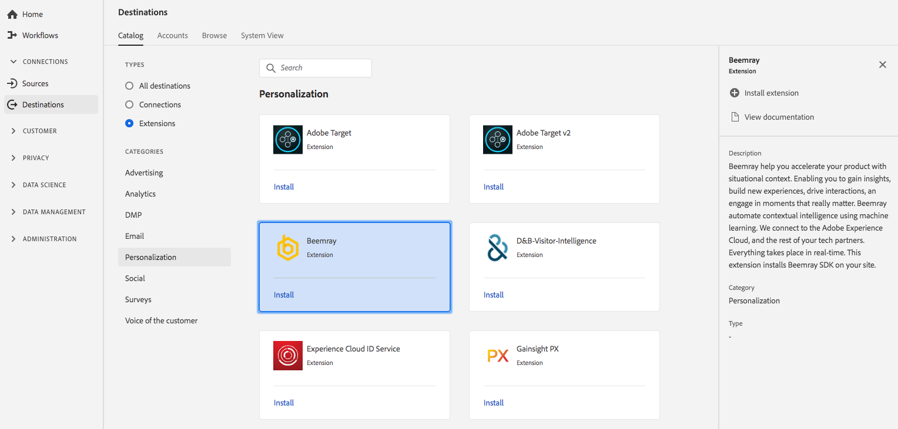

# [!DNL Beemray] extension {#beemray-extension}

## Overzicht {#overview}

[!DNL Beemray] helpt u uw product te versnellen in een situatie. U kunt inzichten opdoen, nieuwe ervaringen opdoen, interacties stimuleren en zich bezighouden met momenten die echt van belang zijn. Beemray automatiseert contextafhankelijke intelligentie met behulp van machinaal leren. Beemray maakt verbinding met de Adobe Experience Cloud en de rest van uw technologiepartners. Alles gebeurt in real-time. Deze extensie installeert [!DNL Beemray] SDK op uw site.

Beemray is een personalisatieuitbreiding in Adobe Real-time Platform van de Gegevens van de Klant. Voor meer informatie over de uitbreidingsfunctionaliteit, zie de uitbreidingspagina op de Uitwisseling van [Adobe](https://exchange.adobe.com/experiencecloud.details.101063.beemray-human-context.html).

Dit doel is een [!DNL Adobe Experience Platform Launch] extensie. Voor meer informatie over hoe de [!DNL Platform Launch] uitbreidingen in Adobe in real time CDP werken, zie het overzicht [van de uitbreidingen van het](/help/rtcdp/destinations/experience-platform-launch-extensions.md)Experience Platform Launch.

## Vereisten {#prerequisites}

Deze extensie is beschikbaar in de [!DNL Destinations] catalogus voor alle klanten die Adobe Real-time CDP hebben aangeschaft.

Als u deze extensie wilt gebruiken, hebt u toegang nodig tot [!DNL Adobe Experience Platform Launch]. [!DNL Platform Launch] wordt aangeboden aan Adobe Experience Cloud-klanten als een inbegrepen, waardetoevoegend element. Neem contact op met uw organisatiebeheerder om toegang te krijgen [!DNL Platform Launch] en vraag hem of haar om u de **[!UICONTROL manage_properties]** machtiging te verlenen zodat u extensies kunt installeren.

## Extensie installeren {#install-extension}

De [!DNL Beemray] extensie installeren:

1. In de [Adobe in real time CDP interface](http://platform.adobe.com/), ga naar **[!UICONTROL Doelen]** > **[!UICONTROL Catalogus]**.
2. Selecteer de extensie in de catalogus of gebruik de zoekbalk.
3. Klik op de bestemming om deze te markeren en selecteer vervolgens **[!UICONTROL Configureren]** in de rechterrail. Als de **[!UICONTROL Configure]** controle grayed is, mist u de toestemming **[!UICONTROL manage_properties]** . Zie [Voorwaarden](#prerequisites).
4. Selecteer in het **[!UICONTROL venster Beschikbare Platform starten-eigenschap]** selecteren de [!DNL Platform Launch] eigenschap waarin u de extensie wilt installeren. U kunt ook een nieuwe eigenschap maken in [!DNL Platform Launch]. Een bezit is een inzameling van regels, gegevenselementen, gevormde uitbreidingen, milieu&#39;s, en bibliotheken. Meer informatie over eigenschappen vindt u in de sectie [Eigenschappen op de pagina](https://docs.adobe.com/content/help/en/launch/using/reference/admin/companies-and-properties.html#properties-page) Eigenschappen van de [!DNL Launch] documentatie.
5. U moet de installatie voltooien [!DNL Platform Launch] om de workflow te voltooien.

Voor informatie over de opties van de uitbreidingsconfiguratie en installatiesteun, zie de pagina [Beemray op de Uitwisseling](https://exchange.adobe.com/experiencecloud.details.101063.beemray-human-context.html)van de Adobe.

U kunt de extensie ook rechtstreeks in de [Adobe Experience Platform Launch-interface](https://launch.adobe.com/)installeren. Zie [Een nieuwe extensie](https://docs.adobe.com/content/help/en/launch/using/reference/manage-resources/extensions/overview.html#add-a-new-extension) toevoegen in de [!DNL Platform Launch] documentatie.

## De extensie gebruiken {#how-to-use}

Nadat u de extensie hebt geïnstalleerd, kunt u rechtstreeks regels voor de extensie instellen [!DNL Platform Launch].

In [!DNL Platform Launch], kunt u opstellingsregels voor uw geïnstalleerde uitbreidingen om gebeurtenisgegevens naar de uitbreidingsbestemming slechts in bepaalde situaties te verzenden. Raadpleeg de documentatie bij [Regels voor meer informatie over het instellen van regels voor uw extensies](https://docs.adobe.com/help/en/launch/using/reference/manage-resources/rules.html).

## De extensie configureren, upgraden en verwijderen {#configure-upgrade-delete}

U kunt uitbreidingen in de [!DNL Platform Launch] interface vormen, bevorderen en schrappen.

>[!TIP]
>
>Als de extensie al op een van uw eigenschappen is geïnstalleerd, wordt CDP-interface in realtime van Adobe nog steeds **[!UICONTROL Install]** voor de extensie weergegeven. Kies de installatieworkflow die wordt beschreven in de extensie  Installeren om de extensie te configureren [!DNL Platform Launch] en te verwijderen.

Zie [Extensies upgraden](https://docs.adobe.com/content/help/en/launch/using/reference/manage-resources/extensions/extension-upgrade.html) in de [!DNL Platform Launch] documentatie voor een upgrade van de extensie.

