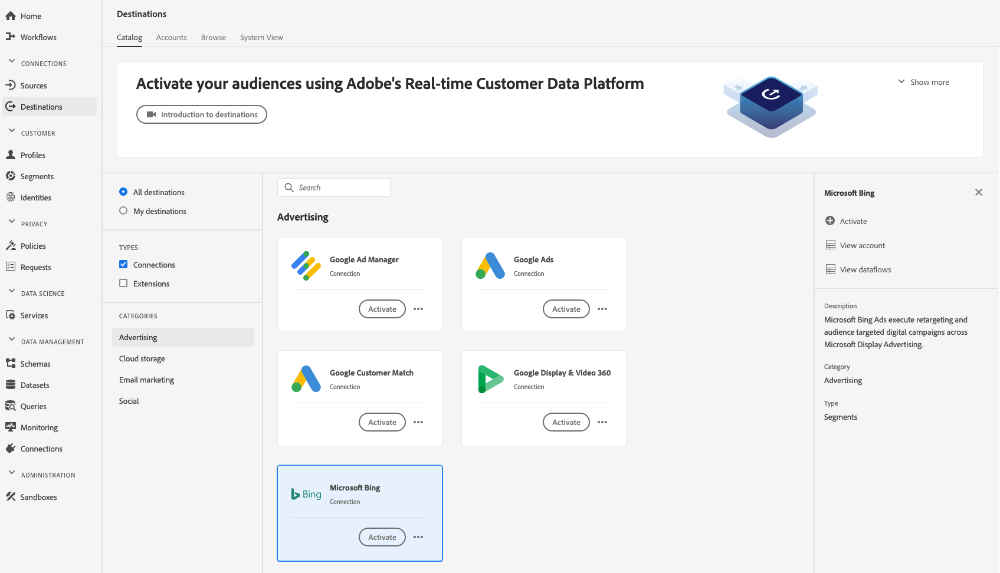

# [!DNL Microsoft Bing] doel

## Overzicht {#overview}

Het [!DNL Microsoft Bing] doel helpt u profielgegevens naar te verzenden [!DNL Microsoft Display Advertising].

Als u profielgegevens naar wilt verzenden, moet u eerst verbinding maken met het doel. [!DNL Microsoft Bing]

## Doelspecificaties {#destination-specs}

Let op de volgende details die specifiek zijn voor het [!DNL Microsoft Bing] doel:

* U kunt de volgende [identiteiten](../../identity-service/namespaces.md) naar [!DNL Microsoft Bing] bestemmingen verzenden: [!DNL Microsoft ID].

## Gebruiksscenario’s {#use-cases}

Als markator, wil ik segmenten kunnen gebruiken die van [!DNL Microsoft Advertising IDs] aan doelgebruikers via vertoningsreclame over [!DNL Microsoft Advertising] kanalen worden gebouwd.

## Exporttype {#export-type}

**[!DNL Segment Export]** - u exporteert alle leden van een segment (publiek) naar de [!DNL Microsoft Bing] bestemming.

## Vereisten {#prerequisites}

Wanneer het vormen van de bestemming zult u worden gevraagd om de volgende informatie te verstrekken:

* [!UICONTROL Account-id]: Dit is uw [!DNL Bing Ads CID]geheel getal.

## Verbinden met doel {#connect-destination}

1. Selecteer in **[!UICONTROL Verbindingen]** > **[!UICONTROL Doelen]** de optie [!DNL Microsoft Bing]en selecteer **[!UICONTROL Configureren]**.

   

   >[!NOTE]
   >
   >Als er al een verbinding met dit doel bestaat, ziet u een knop **[!UICONTROL Activeren]** op de doelkaart. Voor meer informatie over het verschil tussen **[!UICONTROL Activate]** en **[!UICONTROL Configure]**, verwijs naar de sectie van de [Catalogus](../destinations/destinations-workspace.md#catalog) van de documentatie van de bestemmingswerkruimte.
   >
   >

1. In de stap [!UICONTROL Verificatie] moet u de gegevens van de doelverbinding invoeren:

   * **[!UICONTROL Naam]**: Een naam waarmee u deze bestemming in de toekomst zult erkennen.
   * **[!UICONTROL Omschrijving]**: Een beschrijving die u zal helpen deze bestemming in de toekomst identificeren.
   * **[!UICONTROL Account-id]**: Je [!DNL Bing Ads CID].
   * **[!UICONTROL Geval]** voor gebruik bij het in de handel brengen: Gebruiksgevallen voor marketingdoeleinden geven de intentie aan waarvoor gegevens naar de bestemming worden geëxporteerd. U kunt kiezen uit door de Adobe gedefinieerde gebruiksgevallen voor marketingdoeleinden of u kunt uw eigen gebruiksscenario voor marketingdoeleinden maken. Raadpleeg de pagina [Data Governance in Adobe Experience Platform](../privacy/data-governance-overview.md#destinations) voor meer informatie over gevallen van marketinggebruik. Voor informatie over de individuele Adobe-bepaalde het in de handel brengen gebruiksgevallen, zie het overzicht [van het het gebruiksbeleid van](../../data-governance/policies/overview.md#core-actions)Gegevens.

   

1. Klik op **[!UICONTROL Doel]** maken. Uw doel is nu gemaakt. U kunt op [!UICONTROL Opslaan en afsluiten] klikken als u segmenten later wilt activeren. U kunt ook op [!UICONTROL Volgende] klikken om de workflow voort te zetten en segmenten te selecteren die u wilt activeren. In beide gevallen raadpleegt u de volgende sectie Segmenten activeren voor de rest van de workflow.

## Segmenten activeren {#activate-segments}

Zie Profielen en segmenten [activeren naar een doel](activate-destinations.md#select-attributes) voor informatie over de workflow voor segmentactivering.

Tijdens de het programmastap [van het](activate-destinations.md#segment-schedule) Segment, moet u uw segmenten aan hun overeenkomstige identiteitskaart of vriendschappelijke naam in de bestemming manueel in kaart brengen.

Wanneer het in kaart brengen van segmenten, adviseren wij u de [!DNL Platform] segmentnaam of een kortere vorm van het, voor gebruiksgemak gebruiken. De segment-id of naam in uw bestemming hoeft echter niet overeen te komen met de id of naam in uw [!DNL Platform] account. Elke waarde die u in het toewijzingsveld invoegt, wordt weerspiegeld door het doel.

## Geëxporteerde gegevens {#exported-data}

Controleer uw [!DNL Microsoft Bing] account om te controleren of gegevens naar de [!DNL Microsoft Bing Ads] bestemming zijn geëxporteerd. Als de activering succesvol was, worden de soorten publiek in uw account ingevuld.