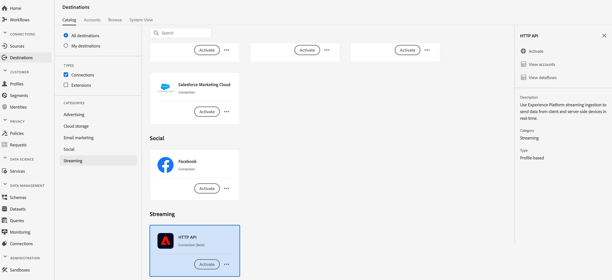

# (Alfa) [!DNL HTTP] Doel

>[!IMPORTANT]
>
>Het [!DNL HTTP] doel in Adobe Real-time CDP is momenteel in alpha. De documentatie en de functionaliteit kunnen worden gewijzigd.

## Overzicht {#overview}

Het [!DNL HTTP] doel is een [!DNL Adobe Real-Time Customer Data Platform] streamingdoel waarmee u profielgegevens naar eindpunten van derden kunt verzenden [!DNL HTTP] .

Als u profielgegevens naar [!DNL HTTP] eindpunten wilt verzenden, moet u eerst verbinding maken met het doel in de [[!DNL Adobe Real-Time Customer Data Platform]](#connect-destination)map.

## Use Cases {#use-cases}

De [!DNL HTTP] bestemming wordt gericht op klanten die XDM profielgegevens en publiekssegmenten naar generische [!DNL HTTP] eindpunten moeten uitvoeren.

[!DNL HTTP] de eindpunten kunnen of de systemen van klanten of derdeoplossingen zijn.

## Verbinden met doel {#connect-destination}

1. Selecteer in **[!UICONTROL Verbindingen]** > **[!UICONTROL Doelen]** de optie [!DNL HTTP API]en selecteer **[!UICONTROL Configureren]**.

   

   >[!NOTE]
   >
   >Als er al een verbinding met dit doel bestaat, ziet u een knop **[!UICONTROL Activeren]** op de doelkaart. Voor meer informatie over het verschil tussen **[!UICONTROL Activate]** en **[!UICONTROL Configure]**, verwijs naar de sectie van de [Catalogus](../destinations/destinations-workspace.md#catalog) van de documentatie van de bestemmingswerkruimte.
   >
   >

2. In de stap van de [!UICONTROL Rekening] , moet u de details van de HTTP- eindpuntverbinding bepalen. Selecteer **[!UICONTROL Nieuwe account]** en voer de verbindingsgegevens in voor het HTTP-eindpunt waarmee u verbinding wilt maken.
   * **[!UICONTROL httpEndpoint]**: de volledige voltooiing [!DNL URL] van het eindpunt van HTTP dat u de profielgegevens wilt verzenden naar.
      * Naar keuze kunt u vraagparameters aan [!UICONTROL httpEndpoint] toevoegen [!DNL URL].
   * **[!UICONTROL authEndpoint]**: het volledige eindpunt [!DNL URL] van HTTP dat voor [!DNL OAuth2] authentificatie wordt gebruikt.
   * **[!UICONTROL Client-id]**: de [!DNL clientID] parameter die in de [!DNL OAuth2] cliëntgeloofsbrieven wordt gebruikt.
   * **[!UICONTROL Clientgeheim]**: de [!DNL clientSecret] parameter die in de [!DNL OAuth2] cliëntgeloofsbrieven wordt gebruikt.

   >[!NOTE]
   >
   >Momenteel worden alleen [!DNL OAuth2] clientreferenties ondersteund.

   
3. Klik op **[!UICONTROL Verbinden met doel]**.
4. Klik op **[!UICONTROL Volgende]** nadat de verbinding tot stand is gebracht.
5. Voer in de stap [!UICONTROL Verificatie] de verificatiereferenties van de account in:
   * **[!UICONTROL Naam]**: Voer een naam in waarmee u deze bestemming in de toekomst wilt herkennen.
   * **[!UICONTROL Omschrijving]**: Voer een beschrijving in die u helpt deze bestemming in de toekomst te identificeren.
   * **[!UICONTROL Aangepaste kopteksten]**: Ga om het even welke douanekopballen in die u in de bestemmingsvraag, volgend dit formaat wilt worden omvat: `header1:value1,header2:value2,...headerN:valueN`.

      >[!IMPORTANT]
      >
      >Voor de huidige implementatie is ten minste één aangepaste header vereist. Deze beperking wordt opgelost in een toekomstige update.
   

6. **[!UICONTROL Geval]** voor gebruik bij het in de handel brengen: Gebruiksgevallen voor marketingdoeleinden geven de intentie aan waarvoor gegevens naar de bestemming worden geëxporteerd. U kunt kiezen uit door de Adobe gedefinieerde gebruiksgevallen voor marketingdoeleinden of u kunt uw eigen gebruiksscenario voor marketingdoeleinden maken. Voor meer informatie over het op de markt brengen van gebruiksgevallen, zie de [Governance van Gegevens in Echte tijd CDP](../privacy/data-governance-overview.md#destinations) pagina. Voor informatie over de individuele Adobe-bepaalde het in de handel brengen gebruiksgevallen, zie het overzicht [van het het gebruiksbeleid van](../../data-governance/policies/overview.md#core-actions)Gegevens.
7. Klik op **[!UICONTROL Doel]** maken.

## Segmenten activeren

Zie Profielen en segmenten [activeren naar een doel](activate-destinations.md#select-attributes) voor informatie over de workflow voor segmentactivering.

## Doelkenmerken

Tijdens de [[!UICONTROL Uitgezochte attributenstap]](activate-destinations.md#select-attributes) , wanneer het [activeren van segmenten](activate-destinations.md) aan een [!DNL HTTP] bestemming, adviseren wij dat u een uniek herkenningsteken van uw [verenigingsschema](../../profile/home.md#profile-fragments-and-union-schemas)selecteert. Selecteer de unieke id en andere XDM-velden die u naar het doel wilt exporteren.

## Geëxporteerde gegevens {#exported-data}

Uw geëxporteerde [!DNL Experience Platform] gegevens worden in JSON-indeling op uw [!DNL HTTP] bestemming geplaatst. De gebeurtenis hieronder bevat bijvoorbeeld het kenmerk E-mailadresprofiel van een publiek dat voor een bepaald segment is gekwalificeerd en een ander segment heeft verlaten. De identiteiten voor dit vooruitzicht zijn [!DNL ECID] en e-mail.

```json
{
  "person": {
    "email": "yourstruly@adobe.con"
  },
  "segmentMembership": {
    "ups": {
      "7841ba61-23c1-4bb3-a495-00d3g5fe1e93": {
        "lastQualificationTime": "2020-05-25T21:24:39Z",
        "status": "exited"
      },
      "59bd2fkd-3c48-4b18-bf56-4f5c5e6967ae": {
        "lastQualificationTime": "2020-05-25T23:37:33Z",
        "status": "existing"
      }
    }
  },
  "identityMap": {
    "ecid": [
      {
        "id": "14575006536349286404619648085736425115"
      },
      {
        "id": "66478888669296734530114754794777368480"
      }
    ],
    "email_lc_sha256": [
      {
        "id": "655332b5fa2aea4498bf7a290cff017cb4"
      },
      {
        "id": "66baf76ef9de8b42df8903f00e0e3dc0b7"
      }
    ]
  }
}
```
