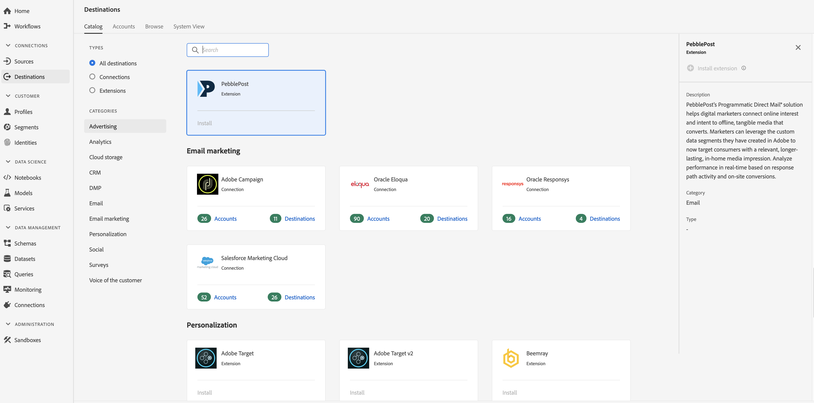

# [!DNL PebblePost] Extensie {#pebblepost-extension}

## Overzicht {#overview}

[!DNL PebblePost's Programmatic Direct Mail®] Met deze oplossing kunnen digitale marketers online interesse en intentie verbinden met offline, tastbare media die worden geconverteerd. Marketers kunnen de aangepaste gegevenssegmenten die ze in Adobe hebben gemaakt, gebruiken om nu consumenten te bereiken met een relevante, langere, in-home media-indruk. De prestaties in real-time analyseren op basis van de activiteit van het responspad en de conversies ter plaatse.

[!DNL PebblePost] is een e-mailextensie in Adobe Real-time Customer Data Platform. Zie de extensiepagina op [Adobe Exchange](https://exchange.adobe.com/experiencecloud.details.100315.programmatic-direct-mail.html)voor meer informatie over de extensiefunctionaliteit.

Deze bestemming is een Experience Platform Launch uitbreiding. Zie Overzicht van extensies voor Experience Platforms Launch voor meer informatie over hoe Launch-extensies werken in Adobe Real-time CDP.

## Vereisten {#prerequisites}

Deze extensie is beschikbaar in de [!DNL Destinations] catalogus voor alle klanten die Adobe Real-time CDP hebben aangeschaft.

Als u deze extensie wilt gebruiken, hebt u toegang tot Experience Platform Launch nodig. Experience Platform Launch wordt aangeboden aan klanten van Adobe Experience Cloud als inbegrepen, waardetoevoegend element. Neem contact op met de systeembeheerder van uw organisatie om toegang te krijgen tot Launch en vraag hen om u de machtiging **[!UICONTROL manage_properties]** te verlenen, zodat u extensies kunt installeren.

## Extensie installeren {#install-extension}

De [!DNL PebblePost] extensie installeren:

1. Ga in de [Adobe Real-time CDP-interface](http://platform.adobe.com/)naar **[!UICONTROL Doelen > Catalogus]**.
2. Selecteer de extensie in de catalogus of gebruik de zoekbalk.
3. Klik op de bestemming om deze te markeren en selecteer Extensie **** installeren in de rechterrail. Als het besturingselement Extensie **** installeren grijs wordt weergegeven, ontbreekt u de machtiging **[!UICONTROL manage_properties]** . Zie [Voorwaarden](#prerequisites).
4. Selecteer in het venster **[!UICONTROL Selecteer beschikbare]** starteigenschap de eigenschap Launch waarin u de extensie wilt installeren. U kunt ook een nieuwe eigenschap maken in Launch. Een bezit is een inzameling van regels, gegevenselementen, gevormde uitbreidingen, milieu&#39;s, en bibliotheken. Meer informatie over eigenschappen vindt u in de sectie [Eigenschappen op de pagina](https://docs.adobe.com/content/help/en/launch/using/reference/admin/companies-and-properties.html#properties-page) Eigenschappen van de documentatie bij Starten.
5. Met de workflow gaat u naar Start om de installatie te voltooien.

Zie de pagina [PebblePost op Adobe Exchange](https://exchange.adobe.com/experiencecloud.details.100315.programmatic-direct-mail.html)voor informatie over de configuratieopties voor extensies en de installatieondersteuning.

U kunt de extensie ook rechtstreeks in de interface Experience Platform Launch installeren. Zie [Een nieuwe extensie](https://docs.adobe.com/content/help/en/launch/using/reference/manage-resources/extensions/overview.html#add-a-new-extension) toevoegen in de documentatie bij Starten.

## De extensie gebruiken {#how-to-use}

Nadat u de extensie hebt geïnstalleerd, kunt u rechtstreeks regels voor de extensie instellen in Launch.

In Launch kunt u regels instellen voor geïnstalleerde extensies om gebeurtenisgegevens alleen in bepaalde situaties naar de extensiebestemming te verzenden. Raadpleeg de documentatie bij [Regels voor meer informatie over het instellen van regels voor uw extensies](https://docs.adobe.com/help/en/launch/using/reference/manage-resources/rules.html).

## De extensie configureren, upgraden en verwijderen {#configure-upgrade-delete}

U kunt extensies configureren, upgraden en verwijderen in de interface Launch.

>[!TIP]
>
>Als de extensie al op een van uw eigenschappen is geïnstalleerd, wordt in de CDP-interface van Adobe Real-time nog steeds **[!UICONTROL Install]** voor de extensie weergegeven. Kies de installatieworkflow zoals beschreven in de extensie  Installeren om de extensie te starten en te configureren of te verwijderen.

Zie [Extensies upgraden](https://docs.adobe.com/content/help/en/launch/using/reference/manage-resources/extensions/extension-upgrade.html) in de documentatie bij Starten voor een upgrade van de extensie.