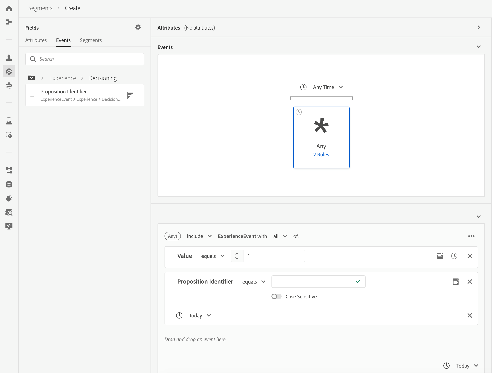

# Aan de slag met Adobe Real-time Customer Data Platform

Deze gids Aan de slag leidt u door een steekproefimplementatie van het Platform van de Gegevens van de Klant van Adobe in real time (CDP in real time). U kunt dit als voorbeeld gebruiken wanneer u uw eigen implementatie instelt. Hoewel in deze handleiding specifieke voorbeelden worden gegeven, wordt er een koppeling gemaakt naar aanvullende informatie die u kunt gebruiken tijdens het maken van uw instellingen.

In dit voorbeeld ziet u de kracht van het Adobe Real-time Customer Data Platform, aangedreven door het Adobe Experience Platform, voor:

* Gegevens uit meerdere bronnen samenvoegen
* Voeg hen in één enkel in real time klantenprofiel samen
* Lever een consistente, relevante en gepersonaliseerde ervaring op verschillende apparaten.

## Hoofdletters gebruiken

Luma, een atletisch kledingbedrijf, probeert altijd hun klantervaring te verbeteren. Ze hebben een nieuw initiatief om de verkoop van cadeautjes te verhogen. Ze willen ook de overbelichting verminderen, zoals irritante advertenties die klanten volgen.

Momenteel besteden ze te veel aan media die zich richten op objecten die de bezoeker niet gaat kopen om verder te gaan. Luma wil iemand bijvoorbeeld niet opnieuw toewijzen met een object dat was bedoeld als eenmalige aankoop voor iemand anders.

Op dit moment worden de gegevens van Luma verspreid over meerdere bronnen. Als gevolg daarvan staan zij voor grote uitdagingen:

* De marketingorganisatie moet samenwerken met verschillende teams die elk eigenaar zijn van een gegevensbron, zoals een website, mobiele app, loyaliteitssystemen, CRM enzovoort.
* Tegen de tijd dat het marketing team toegang tot de gegevens krijgt, is het vaak verouderd en niet meer relevant voor hun tijdgevoelige campagne.
* Ze moeten de gegevens verenigen zodat ze zich richten op een persoon, niet op kanalen.

Het resultaat is dat Luma de volgende zakelijke doelstellingen heeft:

* Creeer in real time één mening van hun consumenten van hun verschillende bronnen van gegevens.
* Pas marketingcampagnes aan met relevante berichten op verschillende kanalen en apparaten.

Om aan deze doelstellingen te voldoen, moet het marketing team klantengegevens op schaal kunnen beheren.

Met CDP in real time, aangedreven door het Platform van de Ervaring van Adobe, kan de het marketing organisatie van Luma:

1. Verzamel gegevens van verschillende platforms en zorg ervoor dat deze downstream beschikbaar zijn voor andere marketingactiviteiten.
1. Maak één realtime weergave van hun consumenten, onafhankelijk van waar de gegevens vandaan komen.
1. Een consistente, relevante en gepersonaliseerde ervaring op elk aanraakpunt.

## Stappen

Deze zelfstudie bevat de volgende stappen:

1. Bouw het [klantenprofiel](#customer-profile).
1. [Pas](#personalizing-the-user-experience) de gebruikerservaring aan.
1. Gebruik [meerdere gegevensbronnen](#using-multiple-data-sources).
1. [Configureer een gegevensbron](#configuring-a-data-source).
1. [Verzamel de gegevens](#bringing-the-data-together-for-a-specific-customer) voor een specifieke klant.
1. Stel [segmenten](#segments)in.
1. Stel [doelen](#destinations)in.
1. [Tik het profiel op verschillende apparaten](#cross-device-identity-stitching).
1. [Analyseer het profiel](#analyzing-the-profile).

## Klantprofiel

Wanneer klanten uw site voor het eerst bezoeken, weet u niets over hen.


Tijdens het navigeren worden gegevens in real-time vastgelegd en niet alleen naar een rapportsuite in Adobe Analytics verzonden, maar ook rechtstreeks naar het Adobe Experience Platform. Terwijl gegevens worden verzameld, vormt u één weergave van de consument op basis van gedragsgegevens in het realtime profiel van de klant van het Experience Platform.

Veel bezoekers van de website zijn waarschijnlijk herhaalde klanten die eerder bij Luma hebben aangeschaft.  Het is belangrijk voor Luma om overseinen en dienstenaanbod te personaliseren om zowel nieuwe als herhaalde bezoekers, evenals bekende klanten te richten.

### Eerste bezoek van nieuwe klant

Een niet-geïdentificeerde bezoeker navigeert bijvoorbeeld naar het gedeelte Men op de site Luma en bekijkt een paar zwevende overhemden.


Als de klant klikt om meer over deze producten te leren, worden deze productweergaven verzameld in Adobe Analytics en verzonden naar het Experience Platform.

<!---->

Luma kan het gedrag van de bezoeker toewijzen aan een gebruikersprofiel op het Adobe Experience Platform en beginnen met het samenstellen van een rijkere weergave van het gedrag van die consument.

### Een gedetailleerdere weergave van de klant krijgen

Naarmate de klant de website blijft gebruiken, ontstaat een duidelijker beeld. Stel dat de bezoeker een product aan het winkelwagentje toevoegt en zich aanmeldt.

Als de klant zich aanmeldt, identificeert ze zichzelf als Sarah Rose.


Twee middelpunten worden samengevoegd:

* De anonieme bladergegevens
* De bestaande gegevens van Sarah Rose-account

Beide middelpunten worden gecombineerd in één enkel profiel in het Platform van de Ervaring. Luma heeft nu een eensgezind beeld van deze consument.

Op basis van het bladergedrag van de anonieme bezoeker in de sectie Men van de plaats, zou men kunnen veronderstellen dat de klant een man was. Nu ze zich heeft aangemeld, herkent Luma Sarah Rose. Luma gebruikt de macht van het klantenprofiel in real time om het overseinen te raffineren dat aan haar over kanalen wordt geleverd.

## De gebruikerservaring aanpassen

Sarah wordt verwelkomd met een loyaliteitsboodschap en bedankt voor het feit dat ze lid is van de Bronze met meer informatie over voordelen en hoe haar status en punten te verbeteren.

Ze klikt op de homepage om nog wat meer te bladeren.


Sarah ontvangt een persoonlijke homepage-ervaring die dynamisch wordt opgeleverd op basis van haar realtime klantprofiel in het Adobe Experience Platform.

Ze ziet relevante inhoud dankzij de personalisatie op basis van Adobe Sensei in Adobe Target, waarin rekening wordt gehouden met haar eerdere aankopen en haar affiniteit voor het uitvoeren van kleding en uitrusting. Luma maakt de inhoud van de mannencatalogus ook geschikt voor loopwerk voor mannen op basis van haar meest recente browse.

Verder op de pagina ziet u Sarah als aanbevolen producten en een nieuwe aanbevolen lade op basis van haar meest recent bekeken artikelen.

Deze persoonlijke inhoud helpt Sarah snel relevante items te vinden. Dit verhoogt omzettingen en verstrekt een prettigere klantenervaring.

### De klant terugbrengen

Sarah wordt afgeleid en verlaat de site en beëindigt haar sessie. Luma kan haar gegevens in het Adobe Experience Platform gebruiken om haar terug te brengen naar de site.

Adobe Real-time Customer Data Platform, aangedreven door Adobe Experience Platform, is gebouwd voor het beheer van de klantervaring. Organisaties kunnen:

* Gegevensintegratie en -activering vereenvoudigen
* Bekend en onbekend gegevensgebruik beheren
* Gebruiksgevallen op schaal versnellen

## Meerdere gegevensbronnen gebruiken

Het team bij Luma heeft al hun gedrag en klantgegevens op één plaats.


Ze kunnen gegevens uit alle volgende bronnen invoeren:

* Gegevens van bestaande Adobe Experience Cloud-oplossingen
* Niet-Adobe-bronnen, zoals het loyaliteitsprogramma van Luma, callcenter en systeemgegevens van het verkooppunt
* Streaming gegevens in realtime uit Luminagegegevensbronnen
* Real-time gegevens van Adobe-oplossingen (geen nieuwe tags vereist)

Al deze gegevens uit verschillende bronnen worden samengevoegd in één enkel uniform klantprofiel.

## Een gegevensbron configureren

Gebruik het Real-time platform van de Gegevens van de Klant om nieuwe bronnen van gegevens in platform te brengen. CDP in real time omvat een catalogus van gegevensbronnen die aan het profiel in slechts een paar klikken kunnen worden toegevoegd.


Bijvoorbeeld, om de gegevens van CRM van Luma in te voeren, filter de catalogus door *CRM*, en alle uit-van-de-doos schakelaars die *CRM* bevatten zijn vermeld. Om de gegevens van CRM van de Dynamica van Microsoft toe te voegen:

1. Autoriseer de verbinding.

   

1. Kies wat u wilt importeren uit een aanbevolen lijst met vooraf toegewezen XDM-tabellen.

   <!--     -->

   Selecteer bijvoorbeeld **[!UICONTROL Contactpersonen]**. Er wordt automatisch een voorvertoning van de contactgegevens geladen, zodat u zeker weet dat alles er naar behoren uitziet.

   Het Adobe Experience-platform haalt veel handmatige werk uit dit proces door standaardvelden automatisch toe te wijzen aan het XDM-profielschema (Experience Data Model).

1. Controleer de veldtoewijzingen.

   <!--     -->

   Controleer bijvoorbeeld nogmaals of het e-mailveld voor contactpersonen correct is toegewezen.\
   U kunt de gegevens voorvertonen en geavanceerde toewijzingen uitvoeren.

1. Stel een schema in.

   

Het is klaar. U hebt zojuist Microsoft CRM als gegevensbron toegevoegd aan Experience Platform.

### Ingesloten gegevens labelen voor gebruiksbeleid

Luma heeft een groot aantal interne beleidslijnen die het gebruik van bepaalde soorten verzamelde informatie beperken, en moet ook voldoen aan wettelijke en privacygerelateerde zorgen met betrekking tot gegevensgebruik. Met de gegevensbeheer van het Adobe Experience Platform kunnen vooraf gedefinieerde labels voor gegevensgebruik worden toegepast op gegevenssets (en specifieke velden binnen die gegevenssets), zodat Luma de gegevens kan indelen volgens specifieke gebruiksbeperkingen.


Nadat labels voor gegevensgebruik zijn toegepast, kan Luma vervolgens gegevensbeheer gebruiken om beleidsregels voor gegevensgebruik te maken. Het beleid van het gebruik van gegevens is regels die de soorten acties beschrijven die u op gegevens mag uitvoeren die bepaalde etiketten bevatten. Wanneer wordt geprobeerd om een actie in real time CDP uit te voeren die een beleidsschending vormt, wordt de actie verhinderd en een alarm gegeven om te tonen welk beleid werd geschonden en waarom.

## Het samenbrengen van de gegevens voor een specifieke klant

In dit scenario, onderzoeksprofielen voor Sarah Rose. Haar profiel wordt weergegeven met de e-mail die ze gebruikte om zich aan te melden.

<!--  -->

Alle profielinformatie Luma heeft over Sarah displays. Dit omvat haar persoonlijke informatie zoals adres en telefoonaantal, communicatie voorkeur, en de segmenten zij voor kwalificeert.

| Categorie | Beschrijving |
|---|---|
| Identiteiten | Toont de identiteiten die in Platform van Sarah&#39;s interactie met Luma over kanalen en apparaten verbonden zijn. Haar ECID van de website wordt weergegeven. Haar identiteit omvat ook de ECID van haar mobiele app, haar e-mailadres, een CRM-id van de onlangs toegevoegde dataset van Microsoft Dynamics en een loyaliteits-id die vanuit het Luma-loyaliteitssysteem is doorgegeven aan het Adobe Experience Platform. |
| Gebeurtenissen | Toont alle interactiegegevens van Sarah met het merk Luma. Dit omvat het item dat ze net bekeken heeft, alles wat ze in het verleden bekeken heeft, de e-mails die ze heeft ontvangen, haar interacties met het callcenter, en op welk kanaal en apparaat deze interacties plaatsvonden. |

Het profiel in real time CDP vermindert het werkschema van het marketingteam Luma van weken aan notulen en ontgrendelt mogelijkheden voor verpersoonlijking die op deze 360 graadklantenmening wordt gebaseerd. In het profiel worden de gedragsgegevens samengevoegd vanaf het moment dat ze door de site bladert voordat ze zich aanmeldt, met haar bestaande klantprofiel, en wordt een uitgebreide weergave van Sarah gemaakt.

Het marketingteam kan dit verbeterde, realtime klantprofiel gebruiken om Sarah&#39;s ervaring beter te personaliseren en haar merkloyaliteit met Luma te vergroten.

## Segmenten

Dankzij de krachtige segmenteringsmogelijkheden van het Adobe Experience Platform kunnen marketers kenmerken, gebeurtenissen en bestaande segmenten combineren op basis van gegevens die zijn vastgelegd in het realtime klantprofiel.

<!--  -->

In dit scenario vertonen de recente interacties van Sarah op de site een ander gedrag dan haar eerdere acties. Meestal koopt ze vrouwenkleding. Het artikel in haar winkelwagentje is echter een groot sweatshirt van mannen.

Het gegevenswetenschappelijk team van Luma heeft modellen gemaakt rond de koopkracht. Eén model identificeert een plotselinge wijziging in de kledingcategorie (zoals mens/vrouw) of de grootte voor de bestaande consument. De verandering van het koopgedrag van Sarah suggereert dat ze niet voor zichzelf winkelt.

<!--  -->

### Een segment definiëren

Wijzig of creeer een segment dat karretoucheerders vertegenwoordigt die lijken bezig te zijn om een cadeau te kopen:

```
Profile: Category != Preferred Category 
AND 
Product Size != Preferred Size 
in last 7 days.  
AND 
Abandoned Cart 
AND 
Loyalty member 
```

<!-- -->

Omdat Sarah een geschenk in het winkelwagentje heeft toegevoegd en het heeft verlaten, kan Luma haar bestraffen met een gratis cadeauverpakking.

## Doelen

Als je het segment &quot;Gift Giving Cart Abandoner&quot; hebt toegevoegd, kun je ruwweg zien hoeveel mensen deel uitmaken van dit segment. U kunt actie ondernemen en het beschikbaar maken voor verpersoonlijking over kanalen.

Klik op **[!UICONTROL Verzenden naar doelen]**.

In Adobe Real-time CDP kan Luma naadloos op hun publiekssegmenten voor verpersoonlijking handelen.\
Hier ziet u alle bestemmingen die beschikbaar zijn voor Luma om deze bestemming naar te sturen, zowel Adobe- als niet-Adobe-oplossingen:


### Doelen selecteren

In dit scenario, wil Luma dit publiek met verpersoonlijking over deze bestemmingen opnieuw richten:

* Google, voor weergave
   <!--* Facebook -->
* Adobe-campagne, voor e-mail

<!--  -->

### Bestemmingen plannen

U kunt het segment ook plannen om op een bepaald tijdstip te beginnen of te eindigen. Het segment wordt gepost en automatisch bijgewerkt in de geconfigureerde platforms op de geplande datums.

>[!NOTE]
>Als u in het datumveld klikt, wordt deze automatisch 90 dagen gepland.

Klik op **[!UICONTROL Opslaan]** om naar de volgende pagina te gaan.

Wanneer een klant in dit publiek een aankoop doet, wordt zijn lidmaatschap aan dit publiek onderdrukt in real time. Ze komen niet meer in aanmerking omdat hun status is gewijzigd.

Hierdoor bespaart de directeur van het medieteam van Luma honderdduizenden dollars door geen voorraad te gebruiken voor een publiek dat niet gekwalificeerd is.

### Beleid voor gegevensgebruik voor doelen afdwingen

Adobe Experience Platform bevat privacy- en beveiligingsopties om te bepalen of een segment beschikbaar is om te worden geactiveerd voor een bepaald doel. Activering wordt ingeschakeld of beperkt op basis van de marketingdoeleinden die aan de bestemming zijn toegewezen toen deze werd gemaakt, en het beleid voor gegevensgebruik dat door uw organisatie is gedefinieerd.

Als uw activiteit beleid schendt, verschijnt een waarschuwing. Deze waarschuwing bevat informatie over de gegevenslijn die u kan helpen identificeren waarom het beleid werd overtreden, en wat u kunt doen om de schending op te lossen.

Met deze controles helpt het Experience Platform Luma om zich aan de regels en de markt op verantwoorde wijze te houden. Deze controles zijn flexibel en kunnen worden gewijzigd om aan de vereisten van de veiligheids en governanceteams van de Luma te voldoen, die hen toestaan om regionale en organisatorische vereisten voor het beheren van bekende en onbekende klantengegevens op betrouwbare wijze te richten.

### Gegevensflowcanvas

Wanneer u opslaat, wordt het segment dat is toegewezen van het verenigde profiel aan de drie doelen die u hebt geselecteerd, weergegeven op een visueel canvas met gegevensstroom.


## Identiteitsstitching tussen apparaten

Sarah bladert door een sociale-mediasite op haar mobiele apparaat en ze ziet een Luma-advertentie. Het herinnert haar aan het punt dat ze in haar kar achterliet.

Later opent ze haar e-mail en ziet ze de nieuwe e-mails. Ze klikt op een koppeling naar Luma via een e-mail.

De link brengt Sarah naar de mobiele Luma homepage, waar ze een zeer persoonlijke ervaring ziet, aangedreven door Adobe Target.

* Ze wordt verwelkomd als Brons-lid.
* Ze ziet de &quot;Gift&quot; boodschap.
* Ze ziet ook &quot;Free Gift Wrap&quot;, een boodschap die deel uitmaakt van haar Bronze lidmaatschapsvoordelen.
* Ze is nog steeds gericht op het hoofdbeeld gebaseerd op haar affiniteit voor het rennen.

Ze koopt de trui, voegt cadeauverpakking toe en schrijft een cadeautje. Ze heeft ook de mogelijkheid om deze gebeurtenis te onthouden en volgend jaar een herinnering te krijgen om op dit moment een cadeau te krijgen. Ze zegt ja, en is gepland voor een e-mailcampagne het volgende jaar om haar eraan te herinneren een ander geschenk te kopen.

Dankzij de mogelijkheden van publieksonderdrukking zal Sarah niet gericht zijn op de trui van die mannen.

## Het profiel analyseren

Luminantiemarkeringen gebruiken Adobe Experience Platform om het schenkingsegment op het CDP-dashboard in realtime te bekijken. Ze bekijken de resultaten van dit initiatief in de loop der tijd en zien dat het groeit. Klanten reageren op aanbiedingen en geven meer geld uit.

Deze inzichten stellen de marketers in staat actie te ondernemen op dit signaal, dat werd gevoed door deze gegevens beschikbaar te hebben in CDP en klanten als Sarah aan het segment te laten vastzitten.

Luma gebruikt deze CDP gegevens om verhoogde loyaliteit en klantentevredenheid te drijven.
