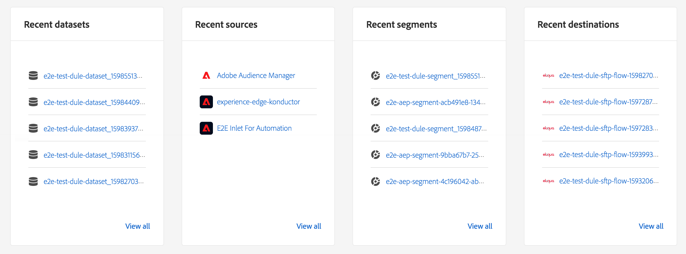

# [!DNL Real-Time Customer Data Platform] homepage en dashboards

De startpagina van Adobe Real-time Customer Data Platform (Real-Time CDP), die een dashboard voor cijfergegevens bevat, wordt weergegeven wanneer u zich aanmeldt bij Real-Time CDP.

De homepage is slechts een van de plaatsen waar metrische kaarten verschijnen. Real-Time CDP biedt metrische kaarten voor je hele ervaring. Deze metriek informeren u over de gegevens, het profiel, en het segmentpubliek in het systeem.

Als het systeem geen gegevens bevat wanneer u zich aanmeldt bij Real-Time CDP, wordt het dashboard op de startpagina niet weergegeven. In dit geval biedt de startpagina leermateriaal voor een eerste gebruikerservaring. Als gegevens worden verzameld, met andere woorden als <!--sources-->datasets, profielen, segmenten, en bestemmingen worden gecreeerd en de gegevens stromen in systeem-dashboard automatisch updates aan vertoningsinformatie over die gegevens<!-- in metric cards-->.

## Dashboardweergave startpagina

<!--The dashboard shows information in several areas. Each category of information displays for the time range shown beneath the data.-->

Het dashboard bestaat uit<!-- two areas.-->:

* **Het leaderboard** bevindt zich boven aan het dashboard. Het leaderboard toont het aantal gegevenssets, profielen, segmenten en doelen in het systeem.

   

<!-- * **Metric cards** display beneath the leaderboard. Metric cards show additional information, such as percentages or trends. Metric cards appear as data is collected.
    
Some information is shown in different ways on both the leaderboard and metric cards. -->
* **Recente objecten** maakt een lijst van de vijf meest recente datasets, bronnen, segmenten, en bestemmingen die aan het systeem worden toegevoegd.

   

Extra meetgegevens, bijvoorbeeld voor profielen en segmenten, zijn beschikbaar in andere delen van Real-time Customer Data Platform.

### Gegevenssets

De **[!UICONTROL Datasets]** de teller toont het aantal datasets in het systeem en de hoeveelheid gegevens in [!DNL Platform]. Deze teller wordt bijgewerkt wanneer een dataset wordt gecreeerd.

Voor meer informatie over datasets, zie [Overzicht van gegevenssets](../catalog/datasets/overview.md).

### Profielen

De **[!UICONTROL Profiles]** het totale aantal personen met profielen in het deelvenster [!DNL Real-time Customer Profile]. Het bevat geen profielfragmenten. Dit is uw totaal adresseerbare publiek.

Deze telling gebruikt het gebrek [samenvoegingsbeleid](profile/merge-policies.md) zoals die in de configuratie van het fusiebeleid in Verenigd Profiel wordt geplaatst.

Het aantal profielen wordt eenmaal per 24 uur bijgewerkt.

Zie voor meer informatie over profielen [Een uniforme weergave van uw klant in Real-Time CDP](profile/profile-overview.md).

### Segmenten

**[!UICONTROL Segments]** toont het totale aantal segmenten die voor de organisatie worden gecreeerd. Dit aantal wordt bijgewerkt wanneer de nieuwe segmenten worden gecreeerd.

Zie voor meer informatie over segmenten [Overzicht van segmentatieservice](segmentation/segmentation-overview.md).

### Doelen

**[!UICONTROL Destinations]** toont het totale aantal bestemmingen die voor de organisatie worden gecreeerd. Dit aantal wordt bijgewerkt wanneer de nieuwe bestemmingen worden gecreeerd.

Voor meer informatie over bestemmingen, zie [Overzicht van doelen](destinations/overview.md).

<!-- ### Successful profile records

In the leaderboard **[!UICONTROL Successful profile records]** shows the total number of records that have been successfully processed into the profile.

There is also a metric card that shows the percentage of successful records. Select **[!UICONTROL View datasets]** to see more details about the profile records. Hover over the colored area of the graph to see additional details:

The number of successful profile records is updated hourly. 

For more information about profiles, see [A unified view of your customer in Real-Time CDP](profile/profile-overview.md).

### Total profile records

The **[!UICONTROL Total profile records]** metric card shows the total number of data records enabled to feed into the profiles, and the percentage that are successful, updated once per day. This does not include all data in the data lake, because some data might not be enabled to feed into the profiles.

 Hover over the colored area of the graph to see additional details about the successful profiles:

Select **[!UICONTROL View profiles]** to see more details about the profile records.

For more information about profiles, see [A unified view of your customer in Real-Time CDP](profile/profile-overview.md).

For more information about viewing a specific profile, see [Profile viewer](profile/profile-viewer.md).

### Failed profile records

In the leaderboard, **[!UICONTROL Failed profile records]** counts the number of records that failed to process into the profile.

The **[!UICONTROL Failed profile records]** metric card shows this count, and includes a graphical representation that helps you see how failures have trended during the time shown below the graphic. This chart is updated hourly. Select **[!UICONTROL View datasets]** to see more details about the profile records.

The number of failed profile records is updated hourly. -->

### Recente gegevensbestanden

De **[!UICONTROL Recent datasets]** De kaart toont de vijf meest recente datasets die binnen de organisatie worden gecreeerd. Deze lijst wordt bijgewerkt wanneer een nieuwe dataset wordt gecreeerd.

Selecteer een dataset om de details voor dat punt te bekijken, of **[!UICONTROL View all]** om de lijst met gegevenssets te zien. Van daar, kunt u een specifieke bron voor details selecteren.

Voor meer informatie over datasets, zie [Overzicht van gegevenssets](../catalog/datasets/overview.md).

### Recente bronnen

De **[!UICONTROL Recent sources]** De metrische kaart toont de vijf meest recente die bronnen binnen de organisatie worden gecreeerd. Deze lijst wordt bijgewerkt wanneer een nieuwe bron wordt gemaakt.

Selecteer een bron om de details voor dat item weer te geven, of **[!UICONTROL View all]** om de lijst met bronnen weer te geven. Van daar, kunt u een specifieke bron voor details selecteren.

Voor meer informatie over bronnen raadpleegt u [Overzicht van bronnen](sources/sources-overview.md).

### Recente segmenten

De **[!UICONTROL Recent segments]** De metrische kaart toont de vijf meest recente die segmenten binnen de organisatie worden gecreeerd. Deze lijst wordt bijgewerkt wanneer een nieuw segment wordt gecreeerd.

Selecteer een segment om de details voor dat item weer te geven, of **[!UICONTROL View all]** om informatie over meer segmenten te zien.

Zie voor meer informatie over segmenten [Overzicht van segmentatieservice](segmentation/segmentation-overview.md).

### Recente bestemmingen

De **[!UICONTROL Recent destinations]** De metrische kaart toont de vijf meest recente bestemmingen binnen de organisatie worden gecreeerd die. Deze lijst wordt bijgewerkt wanneer een nieuwe bestemming wordt gecreeerd.

Selecteer een bestemming om de details voor dat item weer te geven, of **[!UICONTROL View all]** om informatie over meer bestemmingen te zien.

Voor meer informatie over bestemmingen, zie [Overzicht van doelen](destinations/overview.md).
