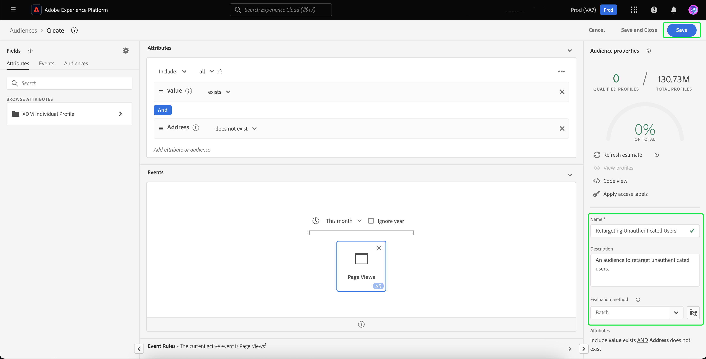

# Offsite herbestemming van niet-geregistreerde bezoekers

>[!AVAILABILITY]
>
>Deze functionaliteit is beschikbaar voor klanten die een licentie hebben verkregen voor Real-Time CDP (App Service), Adobe Experience Platform Activation, Real-Time CDP, Real-Time CDP Premiere, Real-Time CDP Ultimate. Meer informatie over deze pakketten vindt u in de [productbeschrijvingen](https://helpx.adobe.com/legal/product-descriptions.html) en neem contact op met uw Adobe voor meer informatie.

Leer hoe u een publiek van niet-geverifieerde bezoekers kunt maken en deze opnieuw kunt richten met behulp van door de partner geleverde duurzame id&#39;s.

## Waarom dit gebruiksgeval overwegen? {#why-use-case}

Met de geleidelijke afschaffing van cookies van derden moeten de digitale marketers zich opnieuw voorstellen hoe ze hun strategieën voor het opnieuw betrekken van anonieme bezoekers kunnen bedenken. De merken die verkiezen om met identiteitsverkopers voor de erkenning van de bezoeker in real time te integreren kunnen partner ook gebruiken verstrekte duurzame herkenningstekens voor off-site betaalde-media heroriënteren.

Ondanks het grote verkeersvolume zien veel merken een aanzienlijke daling in de conversiefase. Bezoekers doen mee met inhoud en productdemo&#39;s, maar vertrekken zonder zich aan te melden of een aankoop te doen.

U kunt niet alleen een publiek maken op basis van on-site betrokkenheid om marketingberichten aan uw wensen aan te passen, u kunt ook de ondersteuning van de Adobe voor partner-id&#39;s gebruiken om opnieuw contact op te nemen met bezoekers die betaalmedia-bestemmingen gebruiken.

## Vereisten en planning {#prerequisites-and-planning}

Houd rekening met de volgende voorwaarden tijdens uw planningsproces wanneer u van plan bent niet-geverifieerde bezoekers opnieuw te sturen:

- Heb ik opstelling partner IDs met juiste identiteit namespaces?

Bovendien, om het gebruiksgeval uit te voeren, zult u van de volgende functionaliteit van Real-Time CDP en UI elementen gebruik maken. Zorg ervoor dat u de noodzakelijke op attribuut-gebaseerde toegangsbeheertoestemmingen voor al deze gebieden hebt of vraag uw systeembeheerder om u de noodzakelijke toestemmingen te verlenen.

- [Doelgroepen](../../segmentation/home.md)
- [Berekende kenmerken](../../profile/computed-attributes/overview.md)
- [Doelen](../../destinations/home.md)
- [Web SDK](../../edge/home.md)

## Partnergegevens in Real-Time CDP ophalen {#get-data-in}

Als u een publiek van niet-geverifieerde bezoekers wilt maken, moet u eerst de partnergegevens in Real-Time CDP ophalen.

Als u wilt leren hoe u gegevens het beste kunt importeren in Real-Time CDP met Web SDK, leest u de [afdelingen gegevensbeheer en verzameling van gebeurtenisgegevens](./onsite-personalization.md#data-management) van het gebruiksgeval voor onsite personalisatie.

## Door partner opgegeven id&#39;s voorwaarts plaatsen {#bring-partner-ids-forward}

Na het invoeren van de partner verstrekte IDs in een gebeurtenisdataset, zult u deze gegevens in de profielverslagen moeten krijgen. U kunt dit doen door berekende attributen te gebruiken.

Met de berekende kenmerken kunt u de gedragsgegevens van het profiel snel omzetten in geaggregeerde waarden op profielniveau. Hierdoor kunt u deze expressies gebruiken, zoals &quot;totaal van levenslange aanschaf&quot; voor het profiel, zodat u het berekende kenmerk eenvoudig kunt gebruiken bij uw publiek. Meer informatie over berekende kenmerken vindt u in de [overzicht van berekende kenmerken](../../profile/computed-attributes/overview.md).

Selecteer **[!UICONTROL Profiles]** gevolgd door **[!UICONTROL Computed attributes]** en **[!UICONTROL Create computed attribute]**.

![De [!UICONTROL Create computed attributes] wordt naast de knop [!UICONTROL Computed attributes] binnen de [!UICONTROL Profiles] werkruimte.](../assets/offsite-retargeting/create-ca.png)

De **[!UICONTROL Create computed attribute]** wordt weergegeven. Op deze pagina kunt u de componenten gebruiken om uw berekend attribuut tot stand te brengen.

>[!NOTE]
>
>Lees voor meer informatie over het maken van berekende kenmerken de [UI-gids voor berekende kenmerken](../../profile/computed-attributes/ui.md).

Voor dit gebruiksgeval, kunt u een gegevens verwerkt attribuut tot stand brengen dat, als partneridentiteitskaart bestaat, de meest recente waarde van partneridentiteitskaart binnen de laatste 24 uren krijgt.

Gebruikend de onderzoeksbar, kunt u van de &quot;identiteitskaart van de Partner&quot;gebeurtenis de plaats bepalen en toevoegen aan het gegevens verwerkte attributencanvas.

![De [!UICONTROL Events] en de zoekbalk worden gemarkeerd.](../assets/offsite-retargeting/ca-add-partner-id.png)

Na het toevoegen van de &quot;identiteitskaart van de Partner&quot;gebeurtenis aan de definitie, plaats de gebeurtenis het filtreren voorwaarde aan **[!UICONTROL Exists]**, stelt u de filtervoorwaarde voor gebeurtenissen in als de **[!UICONTROL Most Recent]** waarde van toegevoegde partneridentiteitskaart, en met een raadplegingsperiode van 24 uren.

Geef de gegevens verwerkte attributen een aangewezen naam (zoals &quot;identiteitskaart van de Partner&quot;) en beschrijving, dan uitgezocht **[!UICONTROL Publish]** om het berekende aanmaakproces voor kenmerken te voltooien.

## Een publiek maken met het berekende kenmerk {#create-audience}

Nu u het gegevens verwerkte attribuut hebt gecreeerd, kunt u dit gegevens verwerkte attribuut gebruiken om een publiek tot stand te brengen. In dit voorbeeld maakt u een publiek dat bestaat uit bezoekers die uw website meer dan vijf keer deze maand hebben bezocht maar zich nog niet hebben aangemeld.

Als u een publiek wilt maken, selecteert u **[!UICONTROL Audiences]**, gevolgd door **[!UICONTROL Create audience]**.

![De [!UICONTROL Create audience] wordt gemarkeerd.](../assets/offsite-retargeting/create-audience.png)

Er wordt een dialoogvenster weergegeven waarin u wordt gevraagd tussen [!UICONTROL Compose audience] en [!UICONTROL Build rule]. Selecteren **[!UICONTROL Build rule]** gevolgd door **[!UICONTROL Create]**.

![De [!UICONTROL Build rule] wordt gemarkeerd.](../assets/offsite-retargeting/select-build-rule.png)

De pagina Segment Builder wordt weergegeven. Op deze pagina kunt u de componenten gebruiken om uw publiek op te bouwen.

>[!NOTE]
>
>Voor meer gedetailleerde informatie over het gebruik van de Segment Builder leest u de [Handleiding voor de gebruikersinterface van Segment Builder](../../segmentation/ui/segment-builder.md).

Als u deze bezoekers wilt vinden, moet u eerst een **[!UICONTROL Page View]** aan uw publiek. Selecteer de **[!UICONTROL Events]** tab onder **[!UICONTROL Fields]** en sleep vervolgens de **[!UICONTROL Page View]** en voeg deze toe aan het canvas van de gebeurtenissensectie.

![De [!UICONTROL Events] in de [!UICONTROL Fields] wordt gemarkeerd bij het weergeven van de [!UICONTROL Page View]gebeurtenis.](../assets/offsite-retargeting/add-page-view.png)

Selecteer de zojuist toegevoegde **[!UICONTROL Page View]** gebeurtenis. De terugzoekperiode wijzigen van **[!UICONTROL Any time]** tot **[!UICONTROL This month]** en wijzig de gebeurtenisregel in **Ten minste 5**.

![Details van de toegevoegde [!UICONTROL Page View] wordt weergegeven.](../assets/offsite-retargeting/edit-event.png)

Nadat u de gebeurtenis hebt toegevoegd, moet u een kenmerk toevoegen. Aangezien u met ongeautoriseerde bezoekers werkt, kunt u het berekende attribuut toevoegen u enkel creeerde. Met dit nieuwe berekende kenmerk kunt u partner-id&#39;s koppelen aan een publiek.

Om het berekende attribuut toe te voegen, onder **[!UICONTROL Attributes]**, selecteert u **[!UICONTROL XDM Individual Profile]**, gevolgd door **[!UICONTROL _atag]**, **[!UICONTROL SystemComputedAttributes]**, en **[!UICONTROL PartnerID]**. Voeg nu de **[!UICONTROL Value]** van het berekende kenmerk aan de sectie attributes van het canvas.

Daarnaast kunt u zoeken naar **[!UICONTROL Personal Email]** en voeg de **[!UICONTROL Address]** kenmerk hieronder **[!UICONTROL PartnerID]** naar de sectie Kenmerken van het canvas.

![De [!UICONTROL PartnerID] berekende attributen en [!UICONTROL Personal Email Address] worden gemarkeerd op het canvas Segment Builder.](../assets/offsite-retargeting/added-attributes.png)

Nu u uw attributen hebt toegevoegd, zult u hun evaluatiecriteria moeten plaatsen. Voor **[!UICONTROL PartnerID]** stelt u het criterium in op **[!UICONTROL exists]** en voor **[!UICONTROL Address]** stelt u het criterium in op **[!UICONTROL does not exist]**.

U hebt nu een publiek gemaakt dat op zoek is naar intensieve bezoekers met een door partners opgegeven id, maar die zich nog niet hebben aangemeld voor uw site. Geef uw publiek de naam &quot;Niet-geverifieerde gebruikers opnieuw toewijzen&quot; en selecteer **[!UICONTROL Save]** om uw publiek te maken.

## Uw publiek activeren {#activate-audience}

Nadat u het publiek hebt gemaakt, kunt u dit publiek nu activeren naar downstreambestemmingen. Selecteren **[!UICONTROL Audiences]** op de linkernavigatieregel, zoek uw pas gecreëerde publiek, selecteer het ellipspictogram, en selecteer **[!UICONTROL Activate to destination]**.

![De [!UICONTROL Activate to destination] wordt gemarkeerd.](../assets/offsite-retargeting/activate-to-destination.png)

>[!NOTE]
>
>Alle bestemmingstypes, met inbegrip van op dossier-gebaseerde bestemmingen, steunen publiekactivering met partner IDs.
>
>Voor meer informatie over het activeren van publiek naar een bestemming, gelieve te lezen [activeringsoverzicht](../../destinations/ui/activation-overview.md).

De **[!UICONTROL Activate destination]** wordt weergegeven. Op deze pagina kunt u selecteren naar welk doel u de bestemming wilt activeren. Selecteer de gewenste bestemming en selecteer **[!UICONTROL Next]**.

De **[!UICONTROL Scheduling]** wordt weergegeven. Op deze pagina kunt u een programma maken dat bepaalt hoe vaak het publiek moet worden geactiveerd. Selecteren **[!UICONTROL Create schedule]** om een programma voor de activering van het publiek te maken.

![De [!UICONTROL Create schedule] wordt gemarkeerd.](../assets/offsite-retargeting/select-create-schedule.png)

De [!UICONTROL Scheduling] wordt weergegeven. Op deze pagina kunt u het programma voor activering van uw publiek maken. Na het vormen van het programma selecteert u **[!UICONTROL Create]** om door te gaan.

Nadat u de planningsdetails hebt bevestigd, selecteert u **[!UICONTROL Next]**.

De **[!UICONTROL Select attributes]** wordt weergegeven. Op deze pagina kunt u selecteren welke kenmerken u samen met het geactiveerde publiek wilt exporteren. Minstens, zult u partneridentiteitskaart willen omvatten, aangezien dit u de bezoekers zal laten identificeren u van plan bent om zich te richten. Selecteren **[!UICONTROL Add new mapping]** en zoek naar het berekende kenmerk. Nadat u de benodigde kenmerken hebt toegevoegd, selecteert u **[!UICONTROL Next]**.

![Beide [!UICONTROL Add new mapping] en het berekende kenmerk worden gemarkeerd.](../assets/offsite-retargeting/add-new-mapping.png)

De **[!UICONTROL Review]** wordt weergegeven. Op deze pagina kunt u de details van de activering van uw publiek bekijken. Als u tevreden bent met de opgegeven details, selecteert u **[!UICONTROL Finish]**.

![De [!UICONTROL Review] wordt weergegeven, met daarin details over de activering van het publiek.](../assets/offsite-retargeting/review-destination-activation.png)

U hebt nu een publiek van niet-geverifieerde gebruikers geactiveerd voor een verdere herbestemming.

## Andere gebruiksgevallen {#other-use-cases}

U kunt verdere gebruiksgevallen onderzoeken die door de steun van partnergegevens in Real-Time CDP worden toegelaten:

- [Nieuwe klanten aantrekken en aanschaffen](./prospecting.md) met partnergegevens.
- [Onsite ervaringen personaliseren](./offsite-retargeting.md) met de herkenning van bezoekers met hulp van partners.
- [Eerste-partijprofielen uitbreiden](./supplement-first-party-profiles.md) met door partners verschafte kenmerken.
