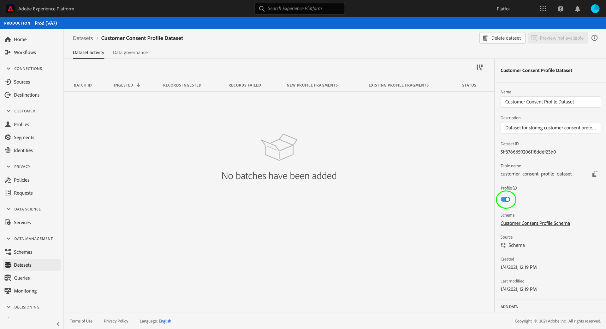

# Gegevenssets maken voor het vastleggen van gegevens met IAB TCF 2.0-toestemming

Om gegevens van de klantentoestemming in overeenstemming met IAB [!DNL Real-time Customer Data Platform] [!DNL Transparency & Consent Framework] (TCF) 2.0 te verwerken, moeten die gegevens worden verzonden naar datasets waarvan de schema&#39;s TCF 2.0 toestemmingsgebieden bevatten.

Specifiek, worden twee datasets vereist voor het vangen van TCF 2.0 toestemmingsgegevens:

* Een dataset die op de [!DNL XDM Individual Profile] klasse wordt gebaseerd, voor gebruik binnen wordt toegelaten [!DNL Real-time Customer Profile].
* Een dataset die op de [!DNL XDM ExperienceEvent] klasse wordt gebaseerd.

Dit document verstrekt stappen voor vestiging deze twee datasets om IAB TCF 2.0 toestemmingsgegevens te verzamelen. Voor een overzicht van het volledige werkschema om [!DNL Real-time CDP] voor TCF 2.0 te vormen, verwijs naar het [IAB TCF 2.0 nalevingsoverzicht](./overview.md).

## Vereisten

Deze zelfstudie vereist een goed begrip van de volgende onderdelen van Adobe Experience Platform:

* [XDM (Experience Data Model)](../../../xdm/home.md): Het gestandaardiseerde kader waardoor de gegevens van de klantenervaring worden [!DNL Experience Platform] georganiseerd.
   * [Basisbeginselen van de schemacompositie](../../../xdm/schema/composition.md): Leer over de basisbouwstenen van schema&#39;s XDM.
   * [Een schema maken in de gebruikersinterface](../../../xdm/tutorials/create-schema-ui.md): Een zelfstudie over de basisbeginselen van het werken met de Schema-editor.
* [Adobe Experience Platform Identity Service](../../../identity-service/home.md): Staat u toe om klantenidentiteiten van uw verschillende gegevensbronnen over apparaten en systemen te overbruggen.
* [Klantprofiel](../../../profile/home.md)in realtime: Hefboomwerkingen [!DNL Identity Service] om u gedetailleerde klantenprofielen van uw datasets in real time te laten tot stand brengen. [!DNL Real-time Customer Profile] trekt gegevens van het meer van Gegevens en handhaaft klantenprofielen in zijn eigen afzonderlijke gegevensopslag.

## Goedgekeurde schemastructuur {#structure}

Er zijn twee mengsels XDM die de gebieden van de klantentoestemming verstrekken die voor TCF 2.0 steun worden vereist: één voor op record gebaseerde gegevens ([!DNL XDM Individual Profile]) en een ander voor op tijdreeksen gebaseerde gegevens ([!DNL XDM ExperienceEvent]):

| Schema | Beschrijving |
| --- | --- |
| Profielprivacy-mix | Deze mix legt de huidige toestemmingsvoorkeur van een klant vast. Wanneer gebruikt in een [!DNL Profile]-toegelaten schema, worden de waarden die in deze mengeling worden verstrekt genomen als bron van waarheid voor hoe de toestemmingshandhaving op de gegevens van een klant zou moeten van toepassing zijn. |
| [!DNL Experience Event] privacymix | Met deze mix worden de voorkeuren voor toestemming van een klant op een bepaald tijdstip vastgelegd. De gegevens die in deze velden worden vastgelegd, kunnen worden gebruikt om wijzigingen in de voorkeuren voor toestemming van de klant in de loop van de tijd bij te houden. |

Hoewel het gebruiksgeval van elke mix verschillend is, zijn de specifieke gebieden die zij verstrekken ruwweg het zelfde. Deze velden worden nader toegelicht in de volgende sectie.

### Toegestane mixvelden {#privacy-mixin}

Hoewel elke privacymix varieert in structuur en de typen velden die deze bevatten, bieden ze beide het `xdm:consentString` kenmerk, waarvan de subvelden vereist zijn voor TCF 2.0-handhaving. De structuur van deze velden wordt hieronder weergegeven, samen met de waarden die ze verwachten:

```json
{
  "xdm:consentString": {
    "xdm:consentStandard": "IAB TCF",
    "xdm:consentStandardVersion": "2.0",
    "xdm:consentStringValue": "BObdrPUOevsguAfDqFENCNAAAAAmeAAA.PVAfDObdrA.DqFENCAmeAENCDA",
    "xdm:gdprApplies": true,
    "xdm:containsPersonalData": false
  }
}
```

| Eigenschap | Beschrijving |
| --- | --- |
| `xdm:consentString` | Bevat de bijgewerkte toestemmingsgegevens van de klant en andere contextuele informatie. |
| `xdm:consentStandard` | Het kader voor de toestemming waarop de gegevens van toepassing zijn. Voor TCF conformiteit, zou de waarde &quot;IAB TCF&quot;moeten zijn. |
| `xdm:consentStandardVersion` | Het versienummer van het toestemmingskader dat door `xdm:consentStandard`wordt aangegeven. Voor TCF 2.0 naleving, zou de waarde &quot;2.0&quot;moeten zijn. |
| `xdm:consentStringValue` | De verbindingstekenreeks die is gegenereerd op basis van de geselecteerde toestemmingsinstellingen van de klant. |
| `xdm:gdprApplies` | Een booleaanse waarde die aangeeft of de GDPR al dan niet op deze klant van toepassing is. De waarde moet aan &quot;waar&quot;worden geplaatst opdat de handhaving TCF 2.0 voorkomt. De standaardwaarde is &quot;false&quot; als dit niet het geval is. |
| `xdm:containsPersonalData` | Een booleaanse waarde die aangeeft of de toestemmingsupdate persoonsgegevens bevat. De standaardwaarde is &quot;false&quot; als dit niet het geval is. |

## Goedkeuringsschema&#39;s voor klanten maken {#create-schemas}

Klik in de gebruikersinterface van het Platform op **[!UICONTROL Schema]** in de linkernavigatie om de werkruimte **[!UICONTROL Schema]** te openen. Voer van hieruit de stappen in de onderstaande secties uit om elk vereist schema te maken.

>[!NOTE]
>
>Als u bestaande XDM-schema&#39;s hebt die u wilt gebruiken om toestemmingsgegevens in plaats daarvan te vangen, kunt u die schema&#39;s uitgeven in plaats van nieuwe te creëren. Nochtans, wanneer het uitgeven van bestaande schema&#39;s, is het belangrijk om de [beginselen van schemaontwikkeling](../../../xdm/schema/composition.md#evolution) te volgen om het breken van veranderingen te vermijden.

### Een op records gebaseerd toestemmingsschema maken {#profile-schema}

Van het **[!UICONTROL Browse]** lusje in de werkruimte **[!UICONTROL van] Schema**, creeer een nieuw schema dat op de [!DNL XDM Individual Profile] klasse wordt gebaseerd. Als u het schema hebt geopend in de Schema-editor, klikt u op **[!UICONTROL Toevoegen]** onder de sectie **[!UICONTROL Mixins]** links op het canvas.


Het dialoogvenster **[!UICONTROL Toevoegen]** wordt geopend. Van hier, selecteer de privacy **[!UICONTROL van het]** Profiel van de lijst. U kunt de zoekbalk desgewenst gebruiken om de resultaten te beperken en zo gemakkelijker de mix te vinden. Als de mix is geselecteerd, klikt u op **[!UICONTROL Toevoegen]**.


Het canvas van de Redacteur van het Schema verschijnt opnieuw, toestaand u om de structuur van de toegevoegde gebieden van het toestemmingskoord te herzien.


Herhaal hier de bovenstaande stappen om de volgende extra mixen aan het schema toe te voegen:

* [!UICONTROL IdentityMap]
* [!UICONTROL Gebied voor gegevensvastlegging voor profiel]
* [!UICONTROL Details van profielpersoon]
* [!UICONTROL Persoonlijke gegevens registreren]


Als u een bestaand schema uitgeeft dat reeds voor gebruik binnen is toegelaten, klik [!DNL Real-time Customer Profile]sparen **[!UICONTROL om uw veranderingen te bevestigen alvorens vooruit naar de sectie over te slaan over het]** creëren van een dataset die op uw toestemmingsschema [](#dataset)wordt gebaseerd. Als u een nieuw schema maakt, gaat u verder met de stappen in de onderstaande subsectie.

#### Het schema inschakelen voor gebruik in [!DNL Real-time Customer Profile]

Om de toestemmingsgegevens [!DNL Real-time CDP] te associëren het aan specifieke klantenprofielen ontvangt, moet het toestemmingsschema voor gebruik in worden toegelaten [!DNL Real-time Customer Profile].

>[!NOTE]
>
>Het voorbeeldschema dat in deze sectie wordt getoond gebruikt zijn `identityMap` gebied als zijn primaire identiteit. Als u een ander veld wilt instellen als primaire identiteit, moet u ervoor zorgen dat u een indirecte id gebruikt, zoals een cookie-id, en niet een rechtstreeks identificeerbaar veld dat niet mag worden gebruikt in op rente gebaseerde reclame, zoals een e-mailadres. Raadpleeg de juridische adviseur als u niet zeker weet welke velden beperkt zijn.
>
>De stappen op hoe te om een primair identiteitsgebied voor een schema te plaatsen kunnen in de [schemaverwezenlijking zelfstudie](../../../xdm/tutorials/create-schema-ui.md#identity-field)worden gevonden.

Om het schema voor toe te laten [!DNL Profile], klik de naam van het schema in de linkerspoorstaaf om de de eigenschappen **[!UICONTROL van het]** Schema dialoog in het rechterspoor te openen. Klik vanaf hier op de schakelknop **[!UICONTROL Profiel]** .


Er wordt een pop-up weergegeven die aangeeft dat de primaire identiteit ontbreekt. Selecteer checkbox voor het gebruiken van een afwisselende primaire identiteit, aangezien de primaire identiteit in het identityMap gebied zal worden bevat.

<br>

Klik tot slot op **[!UICONTROL Opslaan]** om uw wijzigingen te bevestigen.


### Een op tijdreeksen gebaseerd toestemmingsschema maken {#event-schema}

Van het **[!UICONTROL Browse]** lusje in de werkruimte van **[!UICONTROL Schema]** , creeer een nieuw schema dat op de [!DNL XDM ExperienceEvent] klasse wordt gebaseerd. Als u het schema hebt geopend in de Schema-editor, klikt u op **[!UICONTROL Toevoegen]** onder de sectie **[!UICONTROL Mixins]** links op het canvas.


Het dialoogvenster **[!UICONTROL Toevoegen]** wordt geopend. Selecteer hier in de lijst de optie **[!UICONTROL Geniet van een privacymix]** voor gebeurtenissen. U kunt de zoekbalk desgewenst gebruiken om de resultaten te beperken en zo gemakkelijker de mix te vinden. Als de mix is geselecteerd, klikt u op **[!UICONTROL Toevoegen]**.


Het canvas van de Redacteur van het Schema verschijnt opnieuw, tonend de toegevoegde gebieden van het toestemmingskoord.


Herhaal hier de bovenstaande stappen om de volgende extra mixen aan het schema toe te voegen:

* [!UICONTROL IdentityMap]
* [!UICONTROL Omgevingsdetails van ExperienceEvent]
* [!UICONTROL Webdetails van ExperienceEvent]
* [!UICONTROL Implementatiedetails van ExperienceEvent]

Klik op **[!UICONTROL Opslaan]** om de mixen toe te voegen.


## Gegevenssets maken op basis van uw toestemmingsschema&#39;s {#datasets}

Voor elk van de vereiste hierboven beschreven schema&#39;s, moet u een dataset tot stand brengen die uiteindelijk de gegevens van de klantentoestemming zal opnemen. De dataset die op het [!DNL XDM Individual Profile] schema wordt gebaseerd moet voor worden toegelaten [!DNL Real-time Customer Profile], terwijl de dataset die op het [!DNL XDM ExperienceEvent] schema wordt gebaseerd niet zou moeten worden [!DNL Profile]-toegelaten.

Als u wilt beginnen, selecteert u **[!UICONTROL Datasets]** in de linkernavigatie en klikt u op Gegevensset **** maken in de rechterbovenhoek.


Voor de volgende pagina, **[!UICONTROL creeer dataset van schema]**.


De **[!UICONTROL Create dataset van het schemawerkschema]** verschijnt, die bij de **[!UICONTROL Uitgezochte schemastap]** beginnen. Zoek in de opgegeven lijst een van de toestemmingsschema&#39;s die u eerder hebt gemaakt. U kunt optioneel de zoekopdracht gebruiken om de resultaten te beperken en het schema gemakkelijker te vinden. Klik op het keuzerondje naast het schema om het te selecteren en klik vervolgens op **[!UICONTROL Volgende]** om door te gaan.


De stap Gegevensset **** configureren wordt weergegeven. Geef een unieke, gemakkelijk herkenbare naam en beschrijving voor de gegevensset op voordat u op **[!UICONTROL Voltooien]** klikt.


De detailspagina voor de pas gecreëerde dataset verschijnt. Als de dataset op uw [!DNL XDM ExperienceEvent] schema gebaseerd is, dan is het proces volledig. Als de dataset op uw [!DNL XDM Individual Profile] schema gebaseerd is, moet de definitieve stap in het proces de dataset voor gebruik binnen toelaten [!DNL Real-time Customer Profile]. Klik in de rechterspoorstaaf op de schakelknop **[!UICONTROL Profiel]** om de gegevensset in te schakelen.



Voer de bovenstaande stappen opnieuw uit om de andere vereiste gegevensset voor TCF 2.0-compatibiliteit te maken.

## Volgende stappen

Door deze zelfstudie te volgen, hebt u twee datasets gecreeerd die nu kunnen worden gebruikt om de gegevens van de klantentoestemming te verzamelen:

* Een [!DNL Profile]ingeschakelde dataset die op uw [!DNL XDM Individual Profile] schema wordt gebaseerd.
* Een dataset die op uw [!DNL XDM ExperienceEvent] schema wordt gebaseerd dat niet voor wordt toegelaten [!DNL Profile].

U kunt nu aan [IAB TCF 2.0 overzicht](./overview.md#merge-policies) terugkeren om het proces voort te zetten om voor naleving te vormen [!DNL Real-time CDP] TCF 2.0.