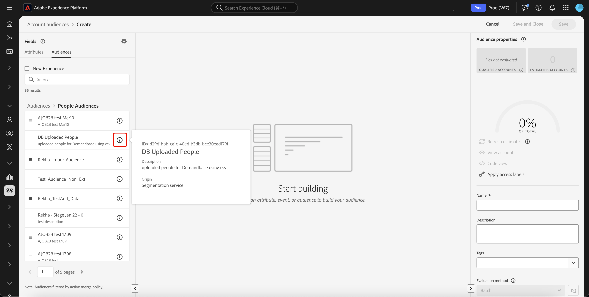

# Audience Builder in Real-Time Customer Data Platform

[!DNL Adobe Real-Time Customer Data Platform] is gebaseerd op Adobe Experience Platform en maakt gebruik van alle mogelijkheden van Audience Builder die deel uitmaken van [!DNL Experience Platform] . De werkruimte biedt intuïtieve besturingselementen voor het maken en bewerken van regels, zoals tegels voor slepen en neerzetten die worden gebruikt om gegevenseigenschappen te vertegenwoordigen.

{zoomable="yes"}

## Velden {#fields}

>[!CONTEXTUALHELP]
>id="platform_b2b_audiencebuilder_showfullxdmschema"
>title="Volledig XDM-schema weergeven"
>abstract="Standaard worden alleen velden weergegeven die gegevens bevatten. Schakel deze optie in om alle velden in het XDM-schema weer te geven."

>[!CONTEXTUALHELP]
>id="platform_b2b_audiencebuilder_showrelationselectors"
>title="Relatie-kiezers tonen"
>abstract="Standaard worden de standaardrelaties voor uw organisatie gebruikt. Schakel deze optie in om de gebruikte relatiekiezers weer te geven."

>[!CONTEXTUALHELP]
>id="platform_b2b_audiencebuilder_showconstrainedfields"
>title="Beperkte velden weergeven"
>abstract="Standaard worden alleen velden weergegeven waarvoor geen beperkingen gelden. Schakel deze optie in om velden weer te geven die er beperkingen op hebben."

Wanneer u Audience Builder gebruikt voor accounts, kunt u accountkenmerken of bestaande doelgroepen gebruiken als de velden van uw publiek.

U kunt het  selecteren om de montages voor de getoonde gebieden aan te passen.

{zoomable="yes"}

>[!NOTE]
>
>De sectie **[!UICONTROL Field options]** is momenteel in bèta en is alleen beschikbaar voor bepaalde klanten. Neem contact op met de klantenservice van Adobe voor meer informatie.

De sectie [!UICONTROL Settings] wordt weergegeven. In deze sectie kunt u bijwerken welke velden worden weergegeven en kunt u de relatie tussen de velden aanpassen.

Voor **[!UICONTROL Field options]**, kunt u of slechts de gebieden tonen die gegevens of het volledige schema XDM bevatten.

Voor **[!UICONTROL Relationship of fields]**, kunt u of de standaardverhoudingen voor uw organisatie gebruiken of u kunt de relatiekiezers tonen.

{width="300"}

### Attributen {#attributes}

Op het tabblad [!UICONTROL Attributes] kunt u zoeken naar accountkenmerken die horen bij de XDM Business Account-klasse, maar ook naar mogelijkheden en op mensen gebaseerde kenmerken. Elke omslag kan worden uitgebreid om extra attributen te openbaren, waar elk attribuut een tegel is die op het [&#x200B; canvas van de regelbouwer &#x200B;](#rule-builder-canvas) in het centrum van de werkruimte kan worden gesleept.

Wanneer het selecteren van een attribuut, kunt u summiere gegevens zien door het [&#x200B; informatiepictogram &#x200B;](../../images/icons/info.png) te selecteren. De summiere gegevens omvatten informatie zoals hoogste waarden, een verklaring van wat het gebied is, evenals het percentage rekeningen die waarden voor deze eigenschap bevatten.

{width="300"}

Als een attribuut door minder dan 25% van rekeningen wordt bevolkt, zal het  in plaats daarvan worden getoond. Dezelfde samenvattingsgegevens worden ongeacht het kenmerk weergegeven.

{width="300"}

>[!NOTE]
>
>De summiere gegevens zijn slechts beschikbaar als het attribuut tot de Account, Persoon, of schema van de Opportunity behoort. Bovendien, worden de hoogste waarden slechts getoond als het gebied **niet** teveel verschillende waarden bevat en als de waarden van dat gebied algemeen worden herhaald.
>
>Deze summiere gegevens worden bijgewerkt op a **dagelijks** basis.

Voor een meer gedetailleerde gids op de Bouwer van het Publiek, lees de [&#x200B; gebruikersgids van de Bouwer van de Publiek &#x200B;](../../segmentation/ui/segment-builder.md){target="_blank"}.

### Doelgroepen {#audiences}

Het tabblad **[!UICONTROL Audiences]** bevat een lijst met alle soorten publiek dat via een gebruikersaccount en een accountaccount beschikbaar is in Experience Platform.

U kunt over het  naast een publiek bewegen om informatie over het publiek met inbegrip van zijn identiteitskaart, beschrijving, en de omslaghiërarchie te bekijken om van het publiek de plaats te bepalen.

{zoomable="yes"}

## Rule builder canvas {#rule-builder-canvas}

Een publiek dat in de Bouwer van de Publiek wordt gecreeerd is een inzameling van regels die worden gebruikt om zeer belangrijke eigenschappen of gedrag van een doelpubliek te beschrijven. Deze regels worden gecreeerd gebruikend het canvas van de regelbouwer, dat in het centrum van de Bouwer van het Publiek wordt gevestigd.

Als u een nieuwe regel wilt toevoegen aan de segmentdefinitie, sleept u een tegel van de tab **[!UICONTROL Fields]** naar het canvas van de regelbuilder.

{zoomable="yes"}

Voor meer informatie bij het gebruiken van het canvas van de regelbouwer, lees de [&#x200B; documentatie van de Bouwer van het Segment &#x200B;](../../segmentation/ui/segment-builder.md#rule-builder-canvas){target="_blank"}.

### Containers {#containers}

De regels van het publiek worden geëvalueerd in de orde zij vermeld zijn. U kunt containers gebruiken om grotere controle over de orde van uitvoering, door het gebruik van genestelde vragen toe te staan.

Voor meer informatie over containers, lees de [&#x200B; documentatie van de Bouwer van het Segment &#x200B;](../../segmentation/ui/segment-builder.md#containers){target="_blank"}.

## Eigenschappen van publiek {#properties}

In de sectie **[!UICONTROL Audience properties]** wordt informatie over het publiek weergegeven, waaronder een geschatte grootte van het publiek. U kunt ook details over uw publiek opgeven, zoals de naam, beschrijving en tags.

{width="300"}

De **[!UICONTROL Qualified accounts]** geeft het werkelijke aantal accounts aan dat overeenkomt met de regels van het publiek. Dit aantal wordt elke 24 uur bijgewerkt, nadat de segmentatietaak is uitgevoerd.

**[!UICONTROL Estimated accounts]** geeft het geschatte aantal accounts aan dat is gebaseerd op de voorbeeldtaak. U kunt deze waarde bijwerken nadat u nieuwe regels of voorwaarden hebt toegevoegd en **[!UICONTROL Refresh estimate]** hebt geselecteerd.

{width="300"}

U kunt **[!UICONTROL View accounts]** selecteren om een steekproef van de rekeningen te zien die voor het publiek met de huidige regels in aanmerking zouden komen.

{width="300"}

**[!UICONTROL Code view]** verstrekt een op tekst-gebaseerde - codebeschrijving van de regels van het publiek.

U kunt **[!UICONTROL Apply access labels]** selecteren om de relevante toegangslabels voor het publiek toe te passen. Meer informatie over toegangslabels kan in [&#x200B; worden gevonden die etikettengids &#x200B;](../../access-control/abac/ui/labels.md){target="_blank"} leiden.

In de rest van de sectie met publiekseigenschappen kunt u details bewerken die betrekking hebben op het accountpubliek, zoals de naam, beschrijving en tags.

{width="300"}

U **kunt niet** de evaluatiemethode voor rekeningspubliek veranderen, aangezien al rekeningspubliek gebruikend partijsegmentatie wordt geëvalueerd.

## Volgende stappen {#next-steps}

De Bouwer van het publiek verstrekt een rijke werkstroom die u publiek van uw gegevens van de Zakelijke Rekening van XDM laat tot stand brengen.

Om meer over de Dienst van de Segmentatie voor de gegevens van het klantenprofiel te leren, te lezen gelieve het [&#x200B; overzicht van de Dienst van de Segmentatie &#x200B;](../../segmentation/home.md){target="_blank"}.
