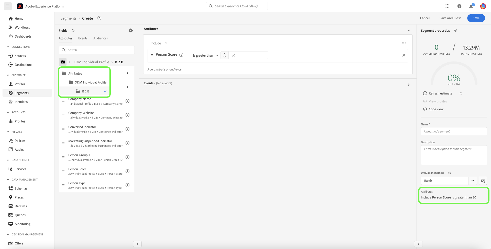

# Gebruiksscenario&#39;s voor segmentatie voor Real-time Customer Data Platform B2B Edition

Dit document bevat voorbeelden van segmentdefinities in Adobe Real-time Customer Data Platform B2B Edition en hoe verschillende typen kenmerken kunnen worden gecombineerd voor veelgebruikte B2B-toepassingen. Als u wilt weten hoe doelen in uw B2B-workflow passen, raadpleegt u de [end-to-end zelfstudie](../b2b-tutorial.md#create-a-segment-to-evaluate-your-data).

>[!NOTE]
>
>De kenmerken die vereist zijn voor deze segmentatieuse-gevallen zijn alleen beschikbaar voor Real-time Customer Data Platform B2B Edition-klanten. Als u Real-time Customer Data Platform B2B Edition niet gebruikt, raadpleegt u de [segmentatieoverzicht](./segmentation-overview.md) in plaats daarvan.

## Vereisten {#prerequisites}

Voordat u de segmentatiekenmerken voor B2B-klassen kunt gebruiken, moet u de volgende stappen uitvoeren:

1. Maak schema&#39;s waarin de B2B-klassen worden gebruikt. De klassen B2B Edition omvatten Account, Campagne, Opportunity, Marketing List en meer. Voor informatie over [hoe u schema&#39;s instelt voor gebruik met B2B-klassen](../schemas/b2b.md) raadpleeg de schemadocumentatie.
2. Maak relaties tussen uw XDM- (Experience Data Model) B2B-schema&#39;s. Het publiek dat op de attributen van de Uitgave B2B wordt gebaseerd vereist verband tussen de klassen om de uitgebreide functionaliteit van de Segmentatie B2B volledig te gebruiken. Zie de documentatie op [hoe te om een verband tussen twee B2B- schema&#39;s te bepalen](../../xdm/tutorials/relationship-b2b.md) voor meer informatie .
3. Samenvatting gegevens gebruikend datasets die op uw B2B- schema&#39;s worden gebaseerd. Raadpleeg de documentatie bij bronnen voor [informatie over hoe gegevens kunnen worden ingevoerd](../../sources/connectors/adobe-applications/marketo/marketo.md).
4. Lees de [Gebruikershandleiding voor Segment Builder](../../segmentation/ui/segment-builder.md) voor een gedetailleerdere leidraad voor het opbouwen van het publiek.

Als aan deze vereisten is voldaan, kunt u deze kenmerken combineren voor algemene B2B-gebruiksgevallen.

## Aan de slag {#getting-started}

Zodra de unieschema&#39;s voor de B2B-klassen relaties hebben vastgesteld en zijn gebruikt om gegevens in te voeren, worden hun kenmerken beschikbaar gesteld in de linkerspoorlijn van de Segment Builder.

B2B-klassen en hun kenmerken worden toegevoegd met een `B2B` in de segmentatiewerkruimte om deze te onderscheiden van de standaardwaarden in Real-time Customer Data Platform.

Om een publiek voor B2B gebruiksgevallen effectief tot stand te brengen, is het belangrijk om een intieme kennis van het schema te hebben en te begrijpen hoe het gegevensmodel eruit ziet. Het is ook handig om rekening te houden met het pad dat de gegevens van het ene gegevensobject naar het andere overnemen.

De onderstaande afbeelding illustreert de relaties tussen de B2B-klassen die beschikbaar zijn in Real-Time CDP B2B Edition.

Aangezien uw gegevensmodel gecompliceerd kan zijn, kunt u de interface van het Platform gebruiken om een meer gedetailleerde visuele vertegenwoordiging van uw gegevensmodel te bekijken om de relevante attributen voor uw gebruiksgeval te vinden. Ga om te beginnen naar de interface van het platform en selecteer Schema&#39;s in de linkernavigatie.

Selecteer het gewenste schema in de beschikbare lijst en selecteer de gewenste relatie in het menu [!UICONTROL Composition] zijspoor. In het onderstaande voorbeeld wordt door het selecteren van de relatie &quot;Persoon&quot; duidelijk welk kenmerk in het huidige schema verwijst naar het gerelateerde schema &quot;Persoon&quot; (als dit het bronschema in de relatie is) of dat naar het schema &quot;Persoon&quot; wordt verwezen (als dit het referentieschema in de relatie is).

Deze verhouding wordt weerspiegeld binnen de Bouwer van het Segment door het gebruik van `Key` mappen zoals weergegeven in de onderstaande afbeelding.

Raadpleeg de [schema&#39;s in Real-time Customer Data Platform B2B Edition-documentatie](../schemas/b2b.md) voor meer informatie over de beschikbare B2B-klassen.

De onderstaande gebruiksgevallen bevatten informatie over de klassen die worden gebruikt om relaties tussen de verschillende schema&#39;s tot stand te brengen om deze resultaten te bereiken. Deze voorbeelden kunnen u helpen uw eigen publiek tot stand brengen.

## Voorbeelden van gebruiksgevallen van verschillende segmentaties {#use-cases}

De volgende gebruiksgevallen zijn beschikbaar voor segmentatie met de B2B Edition. Elk voorbeeld bevat een beschrijving van wat de doelgroep doet en een beschrijving van de klassen die zijn gebruikt om deze te maken. De geleverde afbeeldingen markeren het bestandspad in het dialoogvenster [!UICONTROL Attributes] zijspoor dat de structuur van het schema weerspiegelt. De [!UICONTROL Segment properties] rechts van het scherm staat een schriftelijke uitsplitsing van de kenmerken van het publiek.

### Voorbeeld 1: Zoek naar &quot;besluitvormers&quot; voor B2B-mogelijkheden {#find-decision-maker}

Vind alle mensen die de &quot;Beslissingsmaker&quot;van om het even welke kans zijn. Voor dit publiek is een koppeling vereist tussen de [!UICONTROL XDM Individual Profile] en de [!UICONTROL XDM Business Opportunity Person Relation] klasse.

### Voorbeeld 2: B2B-profielen zoeken die zijn toegewezen aan mogelijkheden boven een bepaald dollarbedrag {#find-opportunities-amount}

Zoek alle mensen die rechtstreeks zijn toegewezen aan kansen waarvan het opportuniteitsbedrag hoger is dan het opgegeven bedrag ($ 1 miljoen). Voor dit publiek is een koppeling vereist tussen de [!UICONTROL XDM Individual Profile] klasse, [!UICONTROL XDM Business Opportunity Person Relation] klasse en [!UICONTROL XDM Business Opportunity] klasse.

### Voorbeeld 3: B2B-profielen zoeken die zijn toegewezen aan mogelijkheden per locatie {#find-opportunities-location}

Zoek alle personen die rechtstreeks zijn toegewezen aan kansen waar de account zich op een bepaalde locatie bevindt (Canada). Voor dit publiek is een koppeling vereist tussen de [!UICONTROL XDM Individual Profile] klasse, [!UICONTROL XDM Business Opportunity Person Relation] klasse, [!UICONTROL XDM Business Opportunity] klasse en [!UICONTROL XDM Business Account] klasse.

### Voorbeeld 4: Zoek naar &quot;besluitvormers&quot; voor mogelijkheden per bedrijfstak en browsergedrag {#find-industry-browsing-behavior}

Vind alle mensen die een &quot;Beslissingsmaker&quot;van om het even welke kans zijn waar de rekening in de &quot;Financiën&quot;industrie is, en bezocht de het tarief pagina in de laatste drie dagen. Voor dit publiek is een koppeling vereist tussen de [!UICONTROL XDM Individual Profile] klasse, [!UICONTROL XDM Business Opportunity Person Relation] klasse, [!UICONTROL XDM Business Opportunity] klasse en [!UICONTROL XDM Business Account] klasse en [!UICONTROL XDM ExperienceEvent] klasse.

### Voorbeeld 5: Zoek B2B-profielen voor mogelijkheden per afdelingsnaam en opportuniteitsbedrag {#find-department-opportunity-amount}

Vind alle mensen die in een afdeling van het Personeel (HR) werken en om het even welke rekening hebben die minstens één open kans heeft die het bepaalde bedrag ($1 miljoen) of meer waard is. Voor dit publiek is een koppeling vereist tussen de [!UICONTROL XDM Individual Profile] klasse, [!UICONTROL XDM Business Account] klasse en [!UICONTROL XDM Business Opportunity] klasse.

### Voorbeeld 6: Zoek naar B2B-profielen per functie en jaarrekening {#find-by-job-title-and-revenue}

Zoek alle personen van wie de functie Vice President is en die een rekening hebben met jaarinkomsten van het gegeven bedrag ($ 100 miljoen) of meer, en de prijspagina ten minste drie keer in de afgelopen maand hebben bezocht. Voor dit publiek is een koppeling vereist tussen de [!UICONTROL XDM Individual Profile] klasse, [!UICONTROL XDM Business Account] klasse en [!UICONTROL XDM ExperienceEvent] klasse.

### Voorbeeld 7: Zoek naar &quot;besluitvormers&quot; op opportuniteitsstatus en blader gedrag {#find-by-opportunity-status-and-browsing-behavior}

Zoek alle mensen die een &quot;Beslissingsmaker&quot;van om het even welke gesloten-verloren kans zijn, en bezocht de het tarief pagina in de vorige week. Voor dit publiek is een koppeling vereist tussen de [!UICONTROL XDM Individual Profile] klasse, [!UICONTROL XDM Business Opportunity Person Relation] klasse, [!UICONTROL XDM Business Opportunity] klasse en [!UICONTROL XDM ExperienceEvent] klasse.

### Voorbeeld 8: Verwante accounts gebruiken om het segmentatiebereik uit te breiden {#related-accounts}

Zoek alle mensen die in een afdeling Personeelszaken (HR) werken en die met om het even welke rekening verwant zijn *of een van de aan de rekening gerelateerde rekeningen* dat minstens één open kans heeft ter waarde van het gegeven bedrag ( $ 1 miljoen) of meer. Voor dit publiek is een koppeling vereist tussen de [!UICONTROL XDM Individual Profile] klasse, [!UICONTROL XDM Business Account] klasse en [!UICONTROL XDM Business Opportunity] klasse.

### Voorbeeld 9: Gebruik loodscores en/of accountscores om een profiel te kwalificeren {#account-scoring}

Alle profielen zoeken met een hoofdscore van meer dan 80.

### Voorbeeld 10: B2B-profielen zoeken die zijn gekoppeld aan accounts waarvan de bovenliggende org inkomsten heeft boven een bepaald dollarbedrag {#find-parent-org-amount}

Vind alle mensen die met rekeningen worden geassocieerd waarvan Parent Org een opbrengst meer dan het bepaalde bedrag ($100.000.000) heeft.

### Voorbeeld 11: B2B-profielen zoeken op basis van functie- en accountnaam met een actieve relatie {#find-by-job-title-and-account-name}

Vind alle mensen die een &quot;Manager&quot;op de rekening &quot;Acme&quot;zijn, waar de rekeningsverhouding &quot;Actief is.

### Voorbeeld 12: Zoek naar B2B-profielen voor campagnes waarbij de werkelijkeKosten hoger is dan de gebudgetteerdeKosten {#find-actualcost-exceed-budgetcost}

Vind alle mensen die voor campagnes worden gericht waar actualCost de budgetedCost overtrof.

### Voorbeeld 13: zoek B2B-profielen die bij een statische lijst van Marketo horen en isDelette=false {#find-marketo-static-list}

Vind alle mensen die tot de Statische lijst van Marketo &quot;Verherende gebruikers&quot;behoren waar isDelette=false.

## Volgende stappen {#next-steps}

Na het lezen van dit overzicht hebt u nu inzicht in de segmentatiemogelijkheden die beschikbaar zijn met Real-Time CDP, B2B Edition. Voor meer informatie over de Segmenteringsdienst, gelieve te lezen [Segmenteringsdocumentatie](../../segmentation/home.md).
