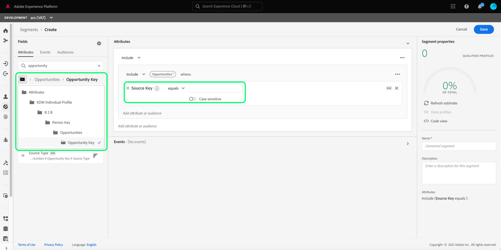
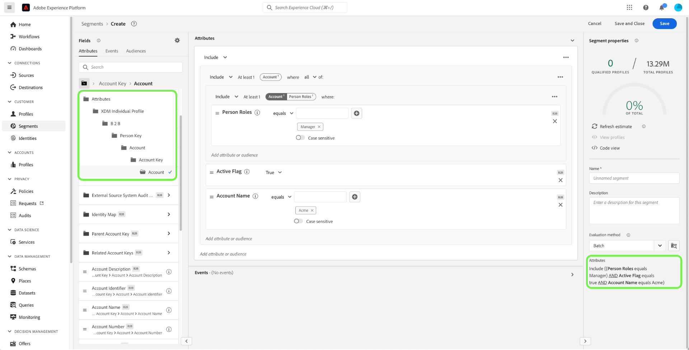
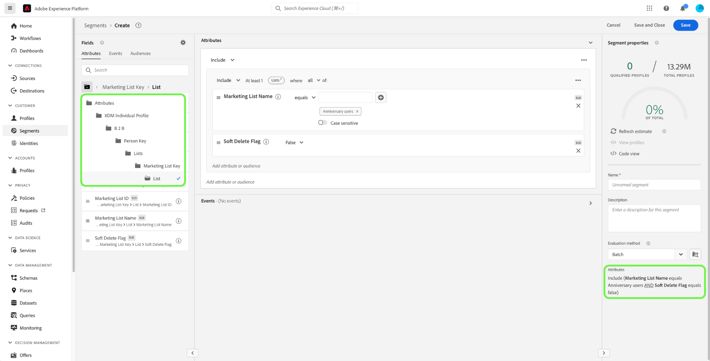

# Gebruiksgevallen voor segmentatie in Real-Time Customer Data Platform B2B edition

>[!IMPORTANT]
>
>Soorten publiek dat ervaringsgebeurtenissen bevat die verwijzen naar B2B-entiteiten (zoals campagnes en marketinglijsten), worden niet meer ondersteund. Voor meer informatie, lees het overzicht van de [&#x200B; de architectuurverbeteringen van B2B edition van Real-Time CDP &#x200B;](../../rtcdp/b2b-architecture-upgrade.md).

In dit document worden voorbeelden gegeven van segmentdefinities in Adobe Real-Time Customer Data Platform B2B edition en hoe verschillende typen kenmerken kunnen worden gecombineerd voor algemene B2B-gebruiksgevallen. Om te begrijpen hoe de bestemmingen in uw B2B- werkschema passen, gelieve te zien [&#x200B; leerprogramma van begin tot eind &#x200B;](../b2b-tutorial.md#create-a-segment-to-evaluate-your-data).

>[!NOTE]
>
>De kenmerken die vereist zijn voor deze segmentatieuse-gevallen zijn alleen beschikbaar voor Real-Time Customer Data Platform B2B edition-klanten. Als u Real-Time Customer Data Platform B2B edition niet gebruikt, zie in plaats daarvan het [&#x200B; segmentatieoverzicht &#x200B;](./segmentation-overview.md).

>[!BEGINSHADEBOX]

## Wijziging van beleid samenvoegen

Als onderdeel van de upgrades naar de Real-Time CDP B2B edition-architectuur, ondersteunen multi-entiteitsgroepen met B2B-kenmerken nu slechts één samenvoegbeleid (het standaardsamenvoegbeleid) in plaats van meerdere samenvoegbeleidsregels. Bovendien kunnen de veranderingen waarin profielen voor publiek in aanmerking kunnen komen voor stroomafwaartse workflows zoals activering, reisorchestratie en het richten van campagnes beïnvloeden. U wordt aangeraden het volgende uit te voeren om ervoor te zorgen dat uw gegevens naar behoren werken:

- U kunt alle soorten publiek die gebruikmaken van niet-standaard samenvoeglogica bekijken en testen om inzicht te krijgen in de mogelijke effecten van deze update.
- Evalueer de kwalificatiecriteria van het publiek voor zeer belangrijke publiek opnieuw om te begrijpen als de veranderingen in de fusielogica kwalificaties kunnen beïnvloeden.
- Controleer uw activeringsresultaten om eventuele verschuivingen in publieksresultaten te detecteren die worden veroorzaakt door de wijziging in het samenvoegbeleid.

>[!ENDSHADEBOX]

## Vereisten {#prerequisites}

Voordat u de segmentatiekenmerken voor B2B-klassen kunt gebruiken, moet u de volgende stappen uitvoeren:

1. Maak schema&#39;s waarin de B2B-klassen worden gebruikt. De B2B edition-klassen omvatten Account, Campagne, Opportunity, Marketing List en meer. Voor informatie over [&#x200B; hoe te opstellingsschema&#39;s voor gebruik met B2B klassen &#x200B;](../schemas/b2b.md) gelieve te zien de schemadocumentatie.
2. Maak relaties tussen uw XDM- (Experience Data Model) B2B-schema&#39;s. Het publiek dat op de attributen van B2B edition wordt gebaseerd vereist verband tussen de klassen om de uitgebreide functionaliteit van de Segmentatie B2B volledig te gebruiken. Zie de documentatie op [&#x200B; hoe te om een verband tussen twee schema&#39;s te bepalen B2B &#x200B;](../../xdm/tutorials/relationship-b2b.md) voor meer informatie.
3. Samenvatting gegevens gebruikend datasets die op uw B2B- schema&#39;s worden gebaseerd. Zie de brondocumentatie voor [&#x200B; informatie over hoe te om gegevens &#x200B;](../../sources/connectors/adobe-applications/marketo/marketo.md) in te voeren.
4. Lees de [&#x200B; gebruikersgids van de Bouwer van het Segment &#x200B;](../../segmentation/ui/segment-builder.md) voor een meer gedetailleerde begeleiding op hoe te om publiek te bouwen.

Als aan deze vereisten is voldaan, kunt u deze kenmerken combineren voor algemene B2B-gebruiksgevallen.

## Aan de slag {#getting-started}

Zodra de unieschema&#39;s voor de B2B-klassen relaties hebben vastgesteld en zijn gebruikt om gegevens in te voeren, worden hun kenmerken beschikbaar gesteld in de linkerspoorlijn van de Segment Builder.

B2B-klassen en hun kenmerken worden toegevoegd met een `B2B` -label in de segmentatiewerkruimte om ze te onderscheiden van de standaardklassen in Real-Time Customer Data Platform.

Om een publiek voor B2B gebruiksgevallen effectief tot stand te brengen, is het belangrijk om een intieme kennis van het schema te hebben en te begrijpen hoe het gegevensmodel eruit ziet. Het is ook handig om rekening te houden met het pad dat de gegevens van het ene gegevensobject naar het andere overnemen.

De onderstaande afbeelding illustreert de relaties tussen de B2B-klassen die beschikbaar zijn in Real-Time CDP B2B edition.

Aangezien uw gegevensmodel gecompliceerd kan zijn, kunt u de interface van het Platform gebruiken om een meer gedetailleerde visuele vertegenwoordiging van uw gegevensmodel te bekijken om de relevante attributen voor uw gebruiksgeval te vinden. Ga om te beginnen naar de interface van het platform en selecteer Schema&#39;s in de linkernavigatie.

Selecteer het gewenste schema in de beschikbare lijst en selecteer de gewenste relatie in de [!UICONTROL Composition] side rail. In het onderstaande voorbeeld wordt door het selecteren van de relatie &quot;Persoon&quot; duidelijk welk kenmerk in het huidige schema verwijst naar het gerelateerde schema &quot;Persoon&quot; (als dit het bronschema in de relatie is) of dat naar het schema &quot;Persoon&quot; wordt verwezen (als dit het referentieschema in de relatie is).

Deze relatie wordt weerspiegeld in de Segment Builder door het gebruik van `Key` mappen, zoals in de onderstaande afbeelding wordt getoond.

Gelieve te verwijzen naar de [&#x200B; schema&#39;s in de documentatie van B2B edition van Real-Time Customer Data Platform &#x200B;](../schemas/b2b.md) voor meer informatie over de beschikbare B2B klassen.

De onderstaande gebruiksgevallen bevatten informatie over de klassen die worden gebruikt om relaties tussen de verschillende schema&#39;s tot stand te brengen om deze resultaten te bereiken. Deze voorbeelden kunnen u helpen uw eigen publiek tot stand brengen.

## Voorbeelden van gebruiksgevallen van verschillende segmentaties {#use-cases}

De volgende gebruiksgevallen zijn beschikbaar voor segmentatie met de B2B edition. Elk voorbeeld bevat een beschrijving van wat de doelgroep doet en een beschrijving van de klassen die zijn gebruikt om deze te maken. De geleverde afbeeldingen markeren het bestandspad in de [!UICONTROL Attributes] side rail die de structuur van het schema weerspiegelt. De sectie [!UICONTROL Segment properties] rechts van de weergave bevat een schriftelijke uitsplitsing van de attributen van het publiek.

### Voorbeeld 1: Zoek naar &quot;besluitvormers&quot; voor B2B-mogelijkheden {#find-decision-maker}

Vind alle mensen die de &quot;Beslissingsmaker&quot;van om het even welke kans zijn. Dit publiek heeft een koppeling nodig tussen de klasse [!UICONTROL XDM Individual Profile] en de klasse [!UICONTROL XDM Business Opportunity Person Relation] .

 toont

### Voorbeeld 2: B2B-profielen zoeken die zijn toegewezen aan mogelijkheden boven een bepaald dollarbedrag {#find-opportunities-amount}

Zoek alle mensen die rechtstreeks zijn toegewezen aan kansen waarvan het opportuniteitsbedrag hoger is dan het opgegeven bedrag ($ 1 miljoen). Dit publiek heeft een koppeling nodig tussen de klasse [!UICONTROL XDM Individual Profile] , de klasse [!UICONTROL XDM Business Opportunity Person Relation] en de klasse [!UICONTROL XDM Business Opportunity] .

 toont

### Voorbeeld 3: B2B-profielen zoeken die zijn toegewezen aan mogelijkheden per locatie {#find-opportunities-location}

Zoek alle personen die rechtstreeks zijn toegewezen aan kansen waar de account zich op een bepaalde locatie bevindt (Canada). Dit publiek heeft een koppeling nodig tussen de klasse [!UICONTROL XDM Individual Profile] , de klasse [!UICONTROL XDM Business Opportunity Person Relation] , de klasse [!UICONTROL XDM Business Opportunity] en de klasse [!UICONTROL XDM Business Account] .

 toont

### Voorbeeld 4: Zoek naar &quot;besluitvormers&quot; voor mogelijkheden per bedrijfstak en browsergedrag {#find-industry-browsing-behavior}

Vind alle mensen die een &quot;Beslissingsmaker&quot;van om het even welke kans zijn waar de rekening in de &quot;Financiën&quot;industrie is, en bezocht de het tarief pagina in de laatste drie dagen.

Om dit publiek tot stand te brengen, moet u &quot;segmenten van segmenten&quot;gebruiken door een basispubliek van alle mensen te creëren die de het tarief pagina in de laatste drie dagen bezochten.

Na het creëren van het eerste publiek, kunt u dat met een ander publiek van mensen combineren die een &quot;Besluitvormer&quot;van om het even welke kans zijn waar de rekening in de &quot;Financiën&quot;industrie is.

 toont

### Voorbeeld 5: Zoek B2B-profielen voor mogelijkheden per afdelingsnaam en opportuniteitsbedrag {#find-department-opportunity-amount}

Vind alle mensen die in een afdeling van het Personeel (HR) werken en om het even welke rekening hebben die minstens één open kans heeft die het bepaalde bedrag ($1 miljoen) of meer waard is. Dit publiek heeft een koppeling nodig tussen de klasse [!UICONTROL XDM Individual Profile] , de klasse [!UICONTROL XDM Business Account] en de klasse [!UICONTROL XDM Business Opportunity] .

 toont

### Voorbeeld 6: Zoek naar B2B-profielen per functie en jaarrekening {#find-by-job-title-and-revenue}

Zoek alle personen van wie de functie Vice President is en die een rekening hebben met jaarinkomsten van het gegeven bedrag ($ 100 miljoen) of meer, en de prijspagina ten minste drie keer in de afgelopen maand hebben bezocht. Dit publiek heeft een koppeling nodig tussen de klasse [!UICONTROL XDM Individual Profile] , de klasse [!UICONTROL XDM Business Account] en de klasse [!UICONTROL XDM ExperienceEvent] .

 toont

### Voorbeeld 7: Zoek naar &quot;besluitvormers&quot; op opportuniteitsstatus en blader gedrag {#find-by-opportunity-status-and-browsing-behavior}

Zoek alle mensen die een &quot;Beslissingsmaker&quot;van om het even welke gesloten-verloren kans zijn, en bezocht de het tarief pagina in de laatste drie dagen.

Om dit publiek tot stand te brengen, moet u &quot;segmenten van segmenten&quot;gebruiken door een basispubliek van alle mensen te creëren die de het tarief pagina in de laatste drie dagen bezochten.

Na het creëren van het eerste publiek, kunt u dat met een ander publiek van mensen combineren die een &quot;Beslissingsmaker&quot;van om het even welke kans zijn waar zowel de &quot;Gesloten Vlag&quot;aan waar wordt geplaatst als de &quot;Verloren Vlag&quot;wordt geplaatst aan vals.

 toont

### Voorbeeld 8: Verwante accounts gebruiken om het segmentatiebereik uit te breiden {#related-accounts}

Vind alle mensen die in een afdeling van het Personeel (HR) werken en met om het even welke rekening *of om het even welke verwante rekeningen van de rekening* verwant zijn die minstens één open kans de bepaalde hoeveelheid ($1 miljoen) of meer heeft. Dit publiek heeft een koppeling nodig tussen de klasse [!UICONTROL XDM Individual Profile] , de klasse [!UICONTROL XDM Business Account] en de klasse [!UICONTROL XDM Business Opportunity] .

### Voorbeeld 9: Gebruik loodscores en/of accountscores om een profiel te kwalificeren {#account-scoring}

Alle profielen zoeken met een hoofdscore van meer dan 80.

 scoren

### Voorbeeld 10: B2B-profielen zoeken die zijn gekoppeld aan accounts waarvan de bovenliggende org inkomsten heeft boven een bepaald dollarbedrag {#find-parent-org-amount}

Vind alle mensen die met rekeningen worden geassocieerd waarvan Parent Org een opbrengst meer dan het bepaalde bedrag ($100.000.000) heeft.

### Voorbeeld 11: B2B-profielen zoeken op basis van functie- en accountnaam met een actieve relatie {#find-by-job-title-and-account-name}

Vind alle mensen die een &quot;Manager&quot;op de rekening &quot;Acme&quot;zijn, waar de rekeningsverhouding &quot;Actief is.

### Voorbeeld 12: Zoek naar B2B-profielen voor campagnes waarbij de werkelijkeKosten hoger is dan de gebudgetteerdeKosten {#find-actualcost-exceed-budgetcost}

Vind alle mensen die voor campagnes worden gericht waar actualCost de budgetedCost overtrof.

### Voorbeeld 13: zoek B2B-profielen die bij een statische lijst van Marketo horen en isDelette=false {#find-marketo-static-list}

Vind alle mensen die tot de Statische lijst van Marketo &quot;Verherende gebruikers&quot;behoren waar isDelette=false.

<!-- 
### Example 14: Find "decision makers" by opportunity status using streaming or edge segmentation {#find-decision-makers-personalization}

>[!NOTE]
>
>This example uses **streaming or edge** segmentation, as opposed to batch segmentation.

Find all the people who are a "Decision Maker" of any closed-lost opportunity and visited the pricing page in the last 24 hours. This example can be evaluated using streaming or edge segmentation, to support more real-time use cases.

To create this audience, you must use "segment of segments" by creating a base audience of all the people who visited the pricing page in the last 24 hours.

After creating the first audience, you can combine that with another audience of  people who are a "Decision Maker" of any opportunity where both the "Closed Flag" is set to true and the "Lost Flag" is set to false.

 -->

## Volgende stappen {#next-steps}

Na het lezen van dit overzicht hebt u nu inzicht in de segmentatiemogelijkheden die beschikbaar zijn in Real-Time CDP, B2B edition. Voor meer informatie over de Dienst van de Segmentatie, te lezen gelieve de [&#x200B; documentatie van de Segmentatie &#x200B;](../../segmentation/home.md).
