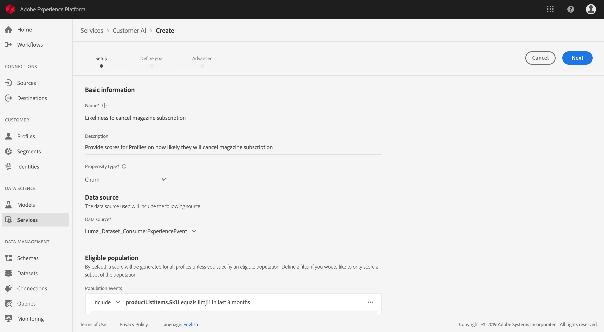

# Predict klant-waardigheidsscores met behulp van Customer AI (alpha)

>[!NOTE]
>De AI-functionaliteit van de Klant die in dit document wordt beschreven, staat in alfa. De documentatie en de functionaliteit kunnen worden gewijzigd.

Dankzij de Adobe Sensei-software van Customer AI in het Adobe Experience Platform kunt u aangepaste scores voor de dichtheid genereren zonder dat u zich zorgen hoeft te maken over de leeraspecten van computers.

In deze zelfstudie worden stappen beschreven voor het werken met de gebruikersinterface van het Experience Platform met de AI. De stappen worden verstrekt voor de volgende onderwerpen:

* [Een instantie configureren](#configure-an-instance)
* [Maak klantsegmenten met voorspelde scores](#create-customer-segments-with-predicted-scores)

## Aan de slag

Deze handleiding vereist een goed begrip van de verschillende platformservices die betrokken zijn bij het gebruik van de AI van de Klant. Lees de volgende documenten voordat u met deze zelfstudie begint:

* [Overzicht van het realtime klantprofiel](https://www.adobe.io/apis/experienceplatform/home/profile-identity-segmentation/profile-identity-segmentation-services.html#!api-specification/markdown/narrative/technical_overview/unified_profile_architectural_overview/unified_profile_architectural_overview.md)
* [Overzicht van segmentatieservice](https://www.adobe.io/apis/experienceplatform/home/profile-identity-segmentation/profile-identity-segmentation-services.html#!api-specification/markdown/narrative/technical_overview/segmentation/segmentation-overview.md)
* [Gebruikershandleiding voor Segment Builder](https://www.adobe.io/apis/experienceplatform/home/profile-identity-segmentation/profile-identity-segmentation-services.html#!api-specification/markdown/narrative/technical_overview/segmentation/segment-builder-guide.md)

## Een instantie configureren

Het Experience Platform biedt Customer AI eenvoudig om de Adobe Sensei-service te gebruiken die kan worden geconfigureerd voor verschillende gebruiksgevallen. De volgende secties bevatten stappen voor het configureren van een exemplaar van Customer AI.

### Instellen van de instantie

Klik in de interface Platform op **Services** in de linkernavigatie. De browser **Services** verschijnt en geeft alle beschikbare services weer die tot uw beschikking staan. Klik in de container voor Customer AI op **Openen**.

In het *AI* -scherm van de Klant worden alle bestaande AI-exemplaren van de Klant weergegeven. Klik op **Instantie** maken.

De workflow voor het maken van instanties wordt weergegeven, te beginnen bij de stap *Setup* .

Hieronder vindt u belangrijke informatie over waarden waarvoor u het exemplaar moet voorzien van:

* De naam van het exemplaar wordt gebruikt op alle plaatsen waar de AI-score van de Klant wordt weergegeven. Daarom moeten namen beschrijven wat de voorspellingsscores bijvoorbeeld vertegenwoordigen, &quot;Likeliability to cancel magazine subscription&quot;.

* Het type van aandrijving bepaalt de intentie van de score en metrische polariteit. U kunt **Churn** of **Conversie** kiezen.

* Gegevensbron verwijst naar de gegevensset die wordt gebruikt om scores te voorspellen. Door ontwerp gebruikt de AI van de Klant gegevens van de Gebeurtenis van de Ervaring van de Consumenten om volheidsscores te berekenen. Wanneer u een gegevensset selecteert in de keuzelijst, worden alleen gegevenssets weergegeven die compatibel zijn met Customer AI.

* Standaard worden voor alle profielen densiteitsscores gegenereerd, tenzij een in aanmerking komende populatie is opgegeven. U kunt een in aanmerking komende populatie opgeven door voorwaarden te definiëren voor het opnemen of uitsluiten van profielen op basis van gebeurtenissen.

Geef de vereiste waarden op en klik op **Volgende**.

### Een doel definiëren

De stap *Definiëren van doel* verschijnt en biedt een interactieve omgeving waarin u visueel een doel kunt definiëren. Een doel bestaat uit een of meer gebeurtenissen, waarbij het voorkomen van elke gebeurtenis is gebaseerd op de voorwaarde die deze bevat. Het doel van een AI-instantie van een klant is na te gaan of het waarschijnlijk is dat het doel binnen een bepaald tijdsbestek wordt bereikt.

Klik op Veldnaam **** invoeren en selecteer een veld in de vervolgkeuzelijst. Klik op de tweede invoer en selecteer een component voor de voorwaarde van de gebeurtenis. Geef vervolgens de doelwaarde op om de gebeurtenis te voltooien. Aanvullende gebeurtenissen kunnen worden geconfigureerd door op de gebeurtenis **** Toevoegen te klikken. Voltooi ten slotte het doel door een voorspeld tijdkader in aantal dagen toe te passen en klik vervolgens op **Volgende**.

### Een schema configureren *(optioneel)*

De *geavanceerde* stap wordt weergegeven. Deze facultatieve stap staat u toe om een programma te vormen om voorspellingslooppas te automatiseren, voorspellingsuitsluitingen te bepalen om bepaalde gebeurtenissen te filtreren, of **Afwerking** te klikken als niets nodig is.

Opstelling een het scoren programma door de het *Scoreren Frequentie* te vormen. De geautomatiseerde predikings kunnen worden gepland om of wekelijks of maandelijks te lopen.

Onder de planningsconfiguratie, hebt u de capaciteit om voorspellingsuitsluitingen te bepalen om gebeurtenissen te verhinderen die aan bepaalde voorwaarden worden geëvalueerd wanneer het produceren van scores. Deze functie kan worden gebruikt om irrelevante gegevensinvoer uit te filteren.

Als u bepaalde gebeurtenissen wilt uitsluiten, klikt u op Uitsluiting **** toevoegen en definieert u de gebeurtenis op dezelfde manier als waarop het doel wordt gedefinieerd. Als u een uitsluiting wilt verwijderen, klikt u op de ovalen (**...**) rechtsboven in de gebeurteniscontainer en klikt u vervolgens op Container **** verwijderen.

Sluit gebeurtenissen indien nodig uit en klik op **Voltooien** om de instantie te maken.

Als de instantie met succes wordt gecreeerd, zal een voorspelling in werking worden gesteld onmiddellijk en verdere degenen zullen volgens uw bepaald programma uitvoeren.

>   **Opmerking:** Afhankelijk van de grootte van de invoergegevens kan het voltooien van de voorspelling 24 uur duren.

Door deze sectie te volgen, hebt u een geval van AI van de Klant gevormd en een voorspellingslooppas werd uitgevoerd. Als de uitvoering is voltooid, worden profielen met voorspelde scores automatisch gehydrateerd door ingesneden inzichten. Wacht 24 uur voordat u doorgaat naar de volgende sectie van deze zelfstudie.

## Maak klantsegmenten met voorspelde scores

Wanneer een voorspelling is voltooid, worden voorspelde scores voor de dichtheid automatisch verbruikt door profielen. Door profielen te verrijken met AI-scores van de Klant, kunt u klantsegmenten maken die zijn gebaseerd op propensiteitsscores. Deze sectie verstrekt stappen voor het creëren van segmenten gebruikend de Bouwer van het Segment. Voor een robuustere zelfstudie over het maken van segmenten raadpleegt u de gebruikershandleiding [van](https://www.adobe.io/apis/experienceplatform/home/profile-identity-segmentation/profile-identity-segmentation-services.html#!api-specification/markdown/narrative/technical_overview/segmentation/segment-builder-guide.md)Segment Builder.

In Platform UI, klik **Segmenten** in de linkernavigatie, en klik dan **Create segment**.

De *Segment Builder* wordt weergegeven. Klik in de linkerkolom *Velden* en onder het tabblad *Kenmerken* op de map **XDM Individueel profiel** en klik vervolgens op de map met de naamruimte van uw organisatie. De map met de naam **Customer AI** bevat de resultaten van voorspellingen en krijgt de naam van de instantie waartoe de scores behoren. Klik op de resultaten van de gewenste instantie en open deze.

Bevestigd in het centrum van de Bouwer van het Segment, sleep en laat vallen de attributen van de **Score** op het canvas *van de* regelbouwer om een regel te bepalen.

Selecteer onder de rechterkolom *Segmenteigenschappen* een beleid *voor* samenvoegen en geef een naam voor het segment op. Klik vervolgens op **Opslaan** om het segment te maken.

## Volgende stappen

Door deze zelfstudie te volgen, hebt u met succes een geval van AI van de Klant gevormd, geproduceerde eigenschapscores, en een segment tot stand gebracht dat door volmachtsscores wordt afgedwongen gebruikend de Bouwer van het Segment. Uw klantensegment kan nu door geactiveerde bestemmingen worden gebruikt om uw publiek te richten. Zie het overzicht  Doelen voor meer informatie.
