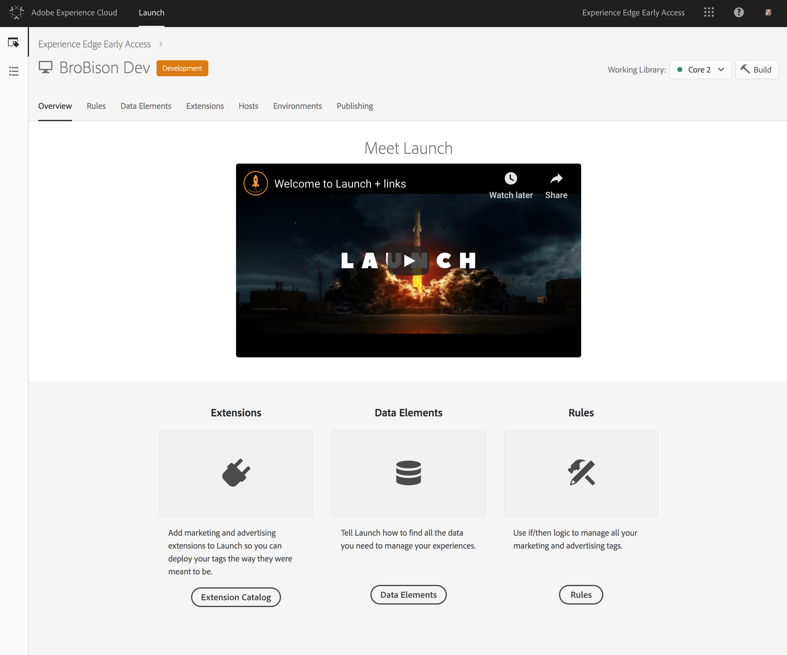

# Zelfstudie: Websitetags implementeren met Adobe Launch

In deze zelfstudie wordt uitgelegd hoe u uw websitetags kunt implementeren om gegevens via Adobe Launch naar het Adobe Experience Platform te verzenden.

## Vereisten

* Het noodzakelijke schema en de dataset worden gecreeerd in Platform.
* De noodzakelijke configuratie is opgesteld in de Rand van de Ervaring en heeft de passende identiteitskaart van de Configuratie en het domein van de Rand.
* Het bedrijf CMS is al geconfigureerd om een JavaScript-object op elke pagina te leveren met de gegevens die u naar Platform moet verzenden.

## Stappen

Deze zelfstudie bevat de volgende stappen:

1. Installeer de extensie Adobe Experience Platform Web SDK.
1. Maak een regel om te bepalen welke gegevens moeten worden verzonden bij Starten.
1. Bundel de extensie en regel in een bibliotheek.

## De extensie Adobe Experience Platform Web SDK installeren

Installeer eerst de extensie Adobe Experience Platform Web SDK.

1. Open in Launch het tabblad **[!UICONTROL Extensies]** .

   

1. Selecteer de extensie Adobe Experience Platform Web SDK in de catalogus Extensie starten Het configuratiescherm wordt geopend.

   

   Zie [Extensies](https://docs.adobe.com/content/help/en/launch/using/reference/manage-resources/extensions/overview.html) in de documentatie bij Starten voor meer informatie.

1. Configureer de extensie.

   U hebt nu alleen de volgende instellingen nodig:

   * **Configuratie-id:** Geef de configuratie-id op die u van uw Adobe-vertegenwoordiger hebt gekregen.
   * **Randdomein:** Geef het Edge-domein op dat u van uw Adobe-vertegenwoordiger hebt gekregen.

1. Klik op **[!UICONTROL Opslaan]** en ga verder met de volgende stap.

## Maak een regel om te bepalen welke gegevens moeten worden verzonden bij Starten

Maak vervolgens een regel om aan te geven welke gegevens u naar het Adobe Experience Platform wilt verzenden en wanneer u deze wilt verzenden.

1. Configureer op het tabblad **[!UICONTROL Regels]** een gebeurtenis die op elke nieuwe pagina van de website wordt geactiveerd wanneer de bibliotheek Starten wordt geladen.

   

1. Voeg een handeling toe.

   Om de actie te vormen, verkies Lancering waar om uw gegevenslaag te vinden. De gegevenslaag is een JavaScript-object dat op de pagina aanwezig is en wordt geleverd vanuit hetzelfde CMS dat de webpagina rendert. Geef het JavaScript-pad naar het gegevensobject op.

   

   Het gegevensvoorwerp u verzendt moet geldige XDM zijn die bevestiging tegen het schema zal overgaan dat door de dataset wordt gebruikt die met uw identiteitskaart van de Configuratie wordt verbonden.

1. Klik op Wijzigingen **[!UICONTROL behouden]**.

Voor meer informatie, zie [Regels](https://docs.adobe.com/content/help/en/launch/using/reference/manage-resources/rules.html) in de documentatie van de Lancering.

## De extensie en regel bundelen in een bibliotheek

Daarna, [bundel de uitbreiding](https://docs.adobe.com/content/help/en/launch/using/reference/publish/overview.html) en uw nieuwe regel samen in een bibliotheek en test die veranderingen in een ontwikkelomgeving.

Nadat u uw tests hebt voltooid, promoot u de bibliotheek via de workflow zodat deze op de productiesite kan worden geïmplementeerd. Er stromen nu gegevens van elke individuele gebruiker naar het Adobe Experience Platform.

Zie [Bibliotheken](https://docs.adobe.com/content/help/en/launch/using/reference/publish/libraries.html) in de documentatie bij Starten voor meer informatie.