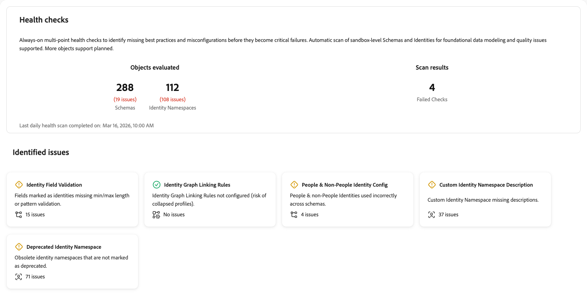

# Gezondheidscontroles

Met health checks worden uw schema&#39;s en identiteiten die in uw sandbox worden gebruikt, gescand en krijgt u een overzicht van de problemen die u kunt gebruiken om te verkennen en problemen op te lossen met [!UICONTROL AI Assistant] . In de toekomst kunnen meer objecten worden gescand voor een uitgebreider rapport.

Het slechte schema en de identiteitsconfiguraties leiden tot significante stroomafwaartse kwesties, met inbegrip van onjuiste profielverwezenlijking, ontbroken segmentkwalificatie, en onnauwkeurige activering. Deze problemen zijn moeilijk op te sporen en vereisen vaak gespecialiseerde expertise om een diagnose te stellen. Met health checks wordt uw aanpak verschoven van reactieve probleemoplossing naar proactief, preventief onderhoud.

Met gezondheidscontroles kunt u:

* **ontdekt configuratiekwesties vroeg**: Identificeer ontbrekende beste praktijken, misconfiguraties, en patronen die tot inefficiënties in verpersoonlijking, activering, en meer leiden.
* **ontvangt geleide sanering**: Krijg duidelijke begeleiding op wat elke kwestie is en wat om aan het te doen.
* **Ononderbroken Monitor**: Op dit ogenblik, stellen de gezondheidscontroles dagelijkse automatische scans in werking zodat u problemen kunt vangen alvorens zij kritieke mislukkingen worden. Het programma kan in toekomstige versies veranderen.

## Vereisten {#prerequisites}

Om tot gezondheidscontroles toegang te hebben, hebt u de **[!UICONTROL View Health Checks]** [&#x200B; toegangsbeheertoestemming &#x200B;](/help/access-control/home.md#permissions) nodig. Neem contact op met de systeembeheerder om ervoor te zorgen dat u over de juiste machtigingen beschikt.

## Toegang tot gezondheidscontroles {#access-health-checks}

Toegang krijgen tot health checks via de gebruikersinterface van [!UICONTROL Experience Platform] :

1. Selecteer **[!UICONTROL Run and Operate]** in de linkernavigatie.
1. Selecteer **[!UICONTROL Health Checks]**.

Op het dashboard voor gezondheidscontroles wordt een overzicht van de meest recente scanresultaten weergegeven.

## Het dashboard begrijpen {#understanding-dashboard}

Het dashboard voor gezondheidscontroles biedt drie informatiegebieden om u te helpen de staat van uw implementatie te beoordelen.

### Geevalueerde objecten {#objects-evaluated}

In de sectie **[!UICONTROL Objects evaluated]** ziet u het totale aantal gescande schema&#39;s en naamruimten en het aantal problemen dat voor elke categorie is gevonden. Dit geeft u een snelle mening van het werkingsgebied en de ernst van configuratieproblemen in uw zandbak.

### Scanresultaten {#scan-results}

In de sectie **[!UICONTROL Scan results]** wordt het aantal mislukte controles weergegeven. Een ontbroken controle wijst erop dat één of meerdere gezondheidscontroles configuratiekwesties ontdekten die aandacht vereisen. Het **laatste dagelijkse gezondheidsaftasten voltooide op** timestamp toont wanneer het meest recente aftasten liep.

### Geïdentificeerde problemen {#identified-issues}

In de sectie **[!UICONTROL Identified issues]** ziet u een kaart voor elke health check. Elke kaart wordt weergegeven:

* De naam van de gezondheidscontrole en een korte beschrijving van de kwestie.
* Het aantal gevonden problemen of een bevestiging dat er geen problemen zijn.
* Een statusindicator die aangeeft of de controle is geslaagd of aandacht vereist.

Selecteer een kaart om de details van die health check te bekijken.

## Beschikbare gezondheidscontroles {#available-health-checks}

De gezondheidscontroles evalueren momenteel vijf fundamentele gebieden van schema en identiteitsconfiguratie. Deze controles richten de meest impactful kwesties van de gegevensmodellering over het platform.

### Validatie van identiteitsveld {#identity-field-validation}

Scans om identiteitsgebieden te verzekeren hebben minimum en maximumlengtebeperkingen en regex patroonregels voor gegevensintegriteit.

| Detail | Beschrijving |
| --- | --- |
| **Uitgave** | Velden die als identiteiten zijn gemarkeerd, hebben geen minimale/maximale lengte- of patroonvalidatie. |
| **Gevolgen** | Zonder validatie kunnen opschoningswaarden [!UICONTROL Identity Service] invoeren. Waarden zoals &quot;0&quot;, &quot;Gast&quot; of niet-overeenkomende behuizing (bijvoorbeeld &quot;xyz123&quot; versus &quot;XYZ123&quot;) brengen de integriteit in gevaar van het profiel dat tijdens segmentatie en activering wordt samengesteld. |
| **Vergoeding** | Stel minimum-/maximumlengte- en patroonbeperkingen in voor aangepaste velden die zijn gemarkeerd als identiteiten. Gebruik reguliere expressies om regels zoals alleen cijfers, hoofdletters of kleine letters of specifieke tekencombinaties af te dwingen. |

Als u de **[!UICONTROL Identity Field Validation]** -kaart selecteert, wordt rechts een detailvenster geopend. Het deelvenster toont:

* **[!UICONTROL Description]**: Scans om ervoor te zorgen dat identiteitsvelden een minimale/maximale lengte en een regex-patroonregel voor gegevensintegriteit hebben. Hiermee geeft u de desbetreffende schema&#39;s en velden weer.
* **[!UICONTROL Impact]**: Als voor identiteitsvelden in schema&#39;s geen minimale/maximale lengte en patroonvalidatie is ingesteld, kan dit leiden tot inconsistente gegevens, wat nadelig kan zijn voor de integriteit en kwaliteit van de gegevens.
* **[!UICONTROL General areas of impact]**: id&#39;s van lage kwaliteit in [!UICONTROL Identity Service]; onbetrouwbare stitching.
* **[!UICONTROL Experience League Documentation]**: een koppeling naar aanbevolen procedures voor gegevensmodellering.
* **[!UICONTROL Affected Schemas]**: Een lijst met betrokken schema&#39;s, elk met een uitbreiding om meer details en een verbinding te bekijken om het schema te openen.

Voor meer informatie, zie de [&#x200B; uiteinden van de gegevensintegriteit &#x200B;](/help/xdm/schema/best-practices.md#data-integrity-tips) in de documentatie van schema beste praktijken.

### Koppelingsregels voor identiteitsgrafiek {#identity-graph-linking-rules}

Controleert dat de identiteitsgrafiek die regels verbindt voor een zandbak wordt gevormd om doen ineenstorten profielen te verhinderen.

| Detail | Beschrijving |
| --- | --- |
| **Uitgave** | Identiteitsgrafiek die regels verbindt wordt niet gevormd voor deze zandbak. |
| **Gevolgen** | Zonder koppelingsregels kunnen meerdere verschillende profielen worden samengevoegd tot één profiel (samenvouwen van grafiek). Bepaalde gegevens van gedeelde apparaten of niet-unieke identiteiten kunnen ongewenste samenvoegingen tot gevolg hebben, wat tot onnauwkeurige personalisatie leidt. |
| **Vergoeding** | Navigeer naar het menu **[!UICONTROL Identities]** , selecteer **[!UICONTROL Settings]** en selecteer ten minste één unieke identiteit per grafiek. Hierdoor worden koppelingsregels voor identiteitsgrafieken ingeschakeld en wordt voorkomen dat het profiel wordt samengevouwen. |

Als u de **[!UICONTROL Identity Graph Linking Rules]** -kaart selecteert, wordt rechts een detailvenster geopend. Het deelvenster toont:

* **[!UICONTROL Description]**: hiermee wordt gecontroleerd of juiste koppelingsregels zijn geconfigureerd om samengevouwen profielen te voorkomen. De huidige status van de regel en unieke id&#39;s per grafiek worden weergegeven.
* **[!UICONTROL Impact]**: Als er geen regels voor het koppelen van identiteitsgrafieken zijn ingesteld, kunnen bepaalde gegevens proberen meerdere verschillende profielen samen te voegen tot één profiel. Om ongewenste samenvoegingen te voorkomen, moeten configuraties die via koppelingsregels voor identiteitsgrafieken worden aangeboden, worden gebruikt.
* **[!UICONTROL General areas of impact]**: samengevouwen of samengevoegde profielen.
* **[!UICONTROL Experience League Documentation]**: Een koppeling naar het overzicht van de regels voor identiteitsgrafiek voor meer informatie.
* **[!UICONTROL Configure linking rules]**: Wanneer de controle ontbreekt, verschijnt een knoop zodat kunt u verbindingsregels direct van het paneel vormen.

Voor meer informatie, zie de [&#x200B; identiteitsgrafiek die regels verbindt overzicht &#x200B;](/help/identity-service/identity-graph-linking-rules/overview.md) en de [&#x200B; implementatiegids &#x200B;](/help/identity-service/identity-graph-linking-rules/implementation-guide.md).

### Identiteitsconfiguratie van personen en niet-personen {#people-non-people-identity}

Bevestigt het correcte gebruik van mensen en niet-mensen identiteitstypes over schemaklassen.

| Detail | Beschrijving |
| --- | --- |
| **Uitgave** | Niet-persoonlijke id&#39;s worden gebruikt op schema&#39;s van de klasse Individual Profile of Experience Event, of personen-id&#39;s worden gebruikt op opzoekschema&#39;s. |
| **Gevolgen** | Id&#39;s van andere personen op profielschema&#39;s nemen niet deel aan de identiteitsgrafiek, wat leidt tot een onvolledige identiteitsresolutie. De herkenningstekens van mensen op raadplegingsschema&#39;s lichten de profieltelling op en maken de gegevens niet verkiesbaar voor de gevallen van het raadplegingsgebruik. In beide gevallen bestaat het risico dat toekomstige productverbeteringen uw implementatie doorbreken. |
| **Vergoeding** | Controleer de gemarkeerde schema&#39;s en corrigeer de toewijzingen van het type identiteit. Verwijder indien mogelijk niet-persoonlijke id&#39;s uit de afzonderlijke profielschema&#39;s. Voor schema&#39;s reeds in gebruik door datasets, verwijs naar de [&#x200B; regels van de schemaevolutie &#x200B;](/help/xdm/schema/composition.md#evolution). |

Als u de **[!UICONTROL People & Non-People Identity Config]** -kaart selecteert, wordt rechts een detailvenster geopend. Het deelvenster toont:

* **[!UICONTROL Description]**: hiermee wordt het juiste gebruik van identiteitstypen in alle schemaklassen gevalideerd. Vermeldt onjuist geconfigureerde schema&#39;s en markeert onjuiste toewijzingen.
* **[!UICONTROL Impact]**: Als aan een niet-persoonlijke entiteit de identiteit van een persoon wordt gegeven, wordt het aantal profielen hierdoor verhoogd en worden deze gegevens niet in aanmerking genomen als een zoekopdracht. Als aan een personenentiteit een identiteit van een niet-persoon wordt gegeven, zijn de gegevens niet beschikbaar voor het stromen of randsegmentatie.
* **[!UICONTROL General areas of impact]**: onvolledige identiteitsgrafieken; opgepompte profielaantallen; opzoekfout.
* **[!UICONTROL Affected Schemas]**: Een lijst met schema&#39;s met problemen. Breid een schemarij uit om de weg, de identiteitsnaam, en het schematype voor elke misconfiguration te zien. Open het schema met het koppelingspictogram.

Voor meer informatie, zie de [&#x200B; documentatie van het identiteitstype &#x200B;](/help/identity-service/features/namespaces.md#identity-type) en [&#x200B; schema beste praktijken &#x200B;](/help/xdm/schema/best-practices.md).

### Beschrijving van aangepaste naamruimte {#namespace-missing-description}

Scant om ervoor te zorgen dat de metagegevens en beschrijvingen van aangepaste naamruimten zijn voltooid.

| Detail | Beschrijving |
| --- | --- |
| **Uitgave** | Naamruimten voor aangepaste identiteiten ontbreken het beschrijvingsveld. |
| **Gevolgen** | Ontbrekende beschrijvingen kunnen leiden tot verwarring tijdens het gebruik en foutopsporing. |
| **Vergoeding** | Documenteer elke aangepaste naamruimte door het beschrijvingsveld in te vullen. Voeg validatiecriteria (minimale/maximale lengte, patroon) en levenscyclusinformatie toe waarmee wordt aangegeven welk extern bronsysteem deze id&#39;s maakt. |

Als u de **[!UICONTROL Custom Identity Namespace Description]** -kaart selecteert, wordt rechts een detailvenster geopend. Het deelvenster toont:

* **[!UICONTROL Description]**: scant of de naamruimte-metagegevens en -beschrijvingen zijn voltooid. Hiermee geeft u naamruimten en eigenaars weer met lege beschrijvingsvelden.
* **[!UICONTROL Impact]**: als u een beschrijving instelt op een naamruimte van een aangepaste identiteit, wordt de helderheid verbeterd doordat de context van het doel van elke naamruimte wordt opgegeven. Dit helpt teamleden en stakeholders snel de functie van elke namespace zonder verwarring begrijpen.
* **[!UICONTROL General areas of impact]**: Foutopsporing of verwarring bij gebruik; onduidelijke validatieintentie.
* **[!UICONTROL Experience League Documentation]**: Een koppeling naar Aangepaste naamruimten maken voor meer informatie.
* **[!UICONTROL Affected namespaces]**: Een lijst met aangepaste naamruimten waarin beschrijvingen ontbreken. Gebruik het koppelingspictogram naast elke naamruimte om deze weer te geven of te bewerken.

Voor meer informatie, zie de documentatie bij [&#x200B; het creëren van douane namespaces &#x200B;](/help/identity-service/features/namespaces.md#create-namespaces).

### Vervangen naamruimte voor identiteit {#deprecated-namespace}

Detecteert verouderde of ongebruikte naamruimten die moeten worden gemarkeerd voor opschoonbewerking.

| Detail | Beschrijving |
| --- | --- |
| **Uitgave** | Verouderde naamruimten worden niet gemarkeerd als afgekeurd. |
| **Gevolgen** | Ongebruikte of verouderde naamruimten veroorzaken verwarring over wat actief in gebruik is en vergroten het risico van verkeerde labels voor identiteitsvelden. |
| **Vergoeding** | Wijzig ongebruikte naamruimten om een prefix &quot;niet te gebruiken&quot;te omvatten (bijvoorbeeld, &quot;gebruik niet - [ originele naam ]&quot;). Adobe Experience Platform biedt momenteel geen ondersteuning voor het verwijderen van naamruimten. Het is daarom aan te raden de naam te wijzigen. |

Als u de **[!UICONTROL Deprecated Identity Namespace]** -kaart selecteert, wordt rechts een detailvenster geopend. Het deelvenster toont:

* **[!UICONTROL Description]**: ontdekt verouderde of ongebruikte identiteitsnamespaces voor schoonmaakbeurt. Vermeldt ongebruikte naamruimten met de tijdstempel of schemaverwijzing voor het laatste gebruik.
* **[!UICONTROL Impact]**: Identiteitsnaamruimten die in geen enkel schema worden gebruikt, moeten worden gemarkeerd voor verwijdering door een tag &quot;GEDEPRECEERD&quot; of &quot;NIET GEBRUIKEN&quot; aan de namen toe te voegen. Verwijderen van naamruimten wordt momenteel niet ondersteund.
* **[!UICONTROL General areas of impact]**: risico van verwarring en verkeerde etikettering.
* **[!UICONTROL Experience League Documentation]**: Een koppeling naar Verouderde naamruimten voor meer documentatie.
* **[!UICONTROL Affected namespaces]**: Een lijst met verouderde of ongebruikte naamruimten. Gebruik het koppelingspictogram naast elke naamruimte om deze weer te geven of te beheren.

Voor meer informatie, zie het [&#x200B; de kennisbasisartikel van Experience Cloud op verouderde namespaces &#x200B;](https://experienceleague.adobe.com/nl/docs/experience-cloud-kcs/kbarticles/ka-18155){target="_blank"}.

## Volgende stappen {#next-steps}

Nadat u de resultaten van uw health check hebt bekeken, verkent u de volgende bronnen om uw inzicht te verdiepen:

* Leer over [&#x200B; schema beste praktijken &#x200B;](/help/xdm/schema/best-practices.md) voor het ontwerpen van betrouwbare gegevensmodellen.
* Begrijp [&#x200B; identiteitsgrafiek die regels &#x200B;](/help/identity-service/identity-graph-linking-rules/overview.md) verbindt om profielineenstorting te verhinderen.
* Herzie [&#x200B; documentatie van identiteitsnamespace &#x200B;](/help/identity-service/features/namespaces.md) voor namespace beheer beste praktijken.
* Onderzoek andere [&#x200B; looppas en voer hulpmiddelen &#x200B;](/help/run-and-operate/overview.md) met inbegrip van [[!UICONTROL Job Schedules]](/help/run-and-operate/job-schedules.md) voor het zicht van de partijverrichting in werking.
