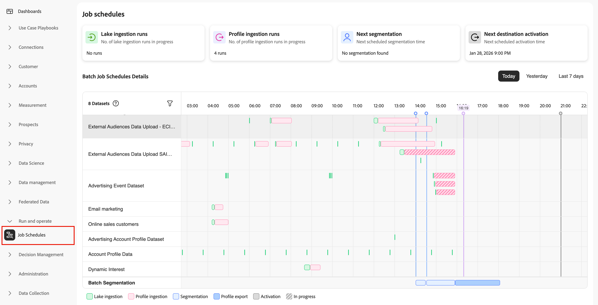
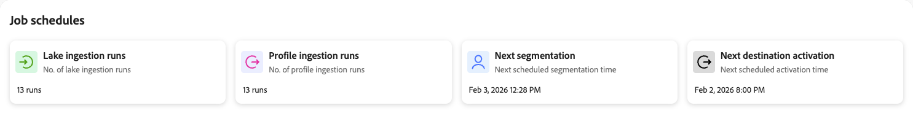
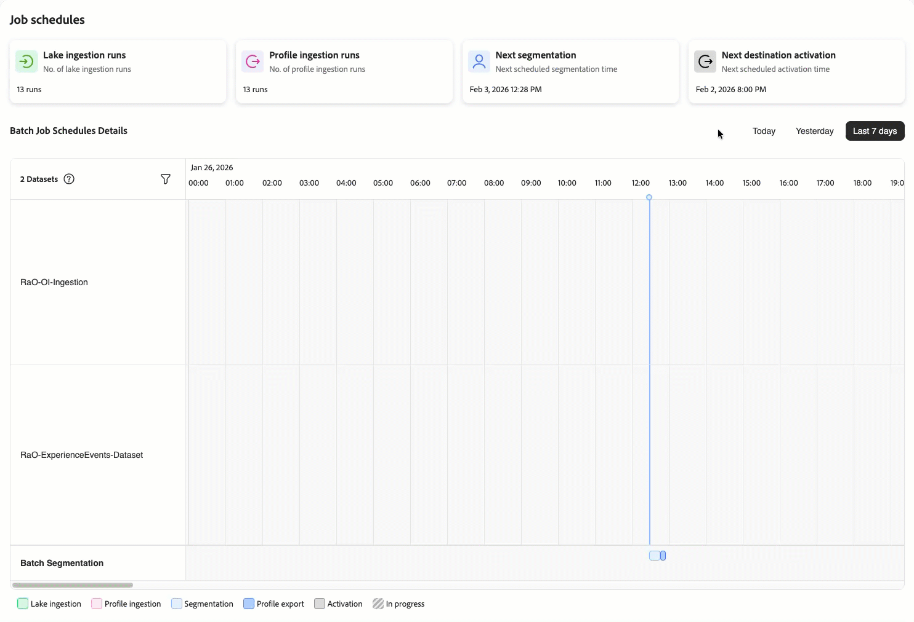

# Taakschema&#39;s controleren

>[!AVAILABILITY]
>
>[!UICONTROL Job schedules] zijn momenteel alleen beschikbaar als een beperkte release en voor de volgende Real-Time CDP-taken:
>
> * Batchgegevens
> * Inname van batchprofiel
> * Batchsegmentatie
> * Batchdoelactivering.

[!UICONTROL Job Schedules] verstrekt een verenigde mening van alle geplande batch verwerkingstaken over uw gegevenspijpleiding-van opname door bestemmingsactivering. Inspecteer uitvoeringsstatus, identificeer het plannen conflicten, en diagnoseer configuratiekwesties alvorens zij uw bedrijfsverrichtingen beïnvloeden.

Gebruik de Planningen van de Baan om mislukkingen te onderzoeken, baantiming te optimaliseren, en gebiedsdelen te begrijpen tussen het opnemen van gegevens, profielverwerking, segmentatie, en bestemmingsactivering. Voor begeleiding bij het oplossen van gemeenschappelijke configuratieproblemen, zie de documentatie bij [&#x200B; het identificeren van baanprogramma anti-patronen &#x200B;](job-schedules-anti-patterns.md).

## Vereisten {#prerequisites}

Om tot [!UICONTROL Job Schedules] toegang te hebben, hebt u **[!UICONTROL View Job Schedules]** en **[!UICONTROL View Profile Management]** [&#x200B; toegangsbeheertoestemmingen &#x200B;](/help/access-control/home.md#permissions) nodig.

Neem contact op met de systeembeheerder om ervoor te zorgen dat u over de juiste machtigingen beschikt.

## Aan de slag {#getting-started}

Voordat u [!UICONTROL Job Schedules] gaat gebruiken, moet u de volgende Experience Platform-concepten kennen:

* **[ingestie van de Partij](../ingestion/batch-ingestion/overview.md)**: Hoe het gegeven in het gegevensmeer en profielopslag op geplande intervallen wordt geladen.
* **[Segmentatie](../segmentation/home.md)**: Hoe het publiek wordt geëvalueerd en bijgewerkt gebaseerd op profielgegevens en segmentdefinities.
* **[Real-Time Profiel van de Klant](../profile/home.md)**: Hoe de profielgegevens worden verenigd en beschikbaar gemaakt voor segmentatie en activering.
* **[Doelen](../destinations/home.md)**: Waar en hoe het gegeven aan stroomafwaartse systemen en marketing platforms wordt geactiveerd.

Als u deze componenten begrijpt, kunt u patronen voor het uitvoeren van taken interpreteren en problemen vaststellen wanneer deze zich voordoen.

## De interface Taakplanningen begrijpen {#understanding-interface}

Ga als volgt te werk om [!UICONTROL Job Schedules] te openen:

1. Selecteer **[!UICONTROL Run and Operate]** in de gebruikersinterface van Experience Platform in de linkernavigatie.
2. Selecteer **[!UICONTROL Job Schedules]**.

De pagina [!UICONTROL Job Schedules] biedt een overzicht van al uw geplande batchverwerkingstaken.

 in werking

### Samenvattingskaarten {#summary-cards}

Bovenaan op de pagina ziet u overzichtskaarten die snel inzicht geven in de taken voor batchverwerking.

* **de looppas van de inname van het meer**: Het aantal banen van de inname van het gegevensmeer die in werking zijn gesteld.
* **het opnemen van het Profiel looppas**: Het aantal banen van de profielopname die in werking zijn gesteld.
* **Volgende segmentatie**: Wanneer de volgende geplande segmentatietaak zal lopen.
* **Volgende bestemmingsactivering**: Wanneer de volgende geplande baan van de bestemmingsactivering zal lopen.

Deze kaarten helpen u de activiteit en de aanstaande programma&#39;s over uw gegevenspijpleiding begrijpen. De waarden voor **het inslikken van het meer stelt** in werking en **het innemen van het Profiel stelt** verandering die op het geselecteerde tijdinterval (Vandaag, Gisteren, of Laatste 7 dagen) wordt gebaseerd; de volgende in werking gestelde kaarten (**Volgende segmentatie** en **Volgende bestemmingsactivering**) worden niet beïnvloed door de tijdselecteur.

### Tijdspanningskiezer {#time-period}

Gebruik de tijdspanneskiezers om te kiezen hoe ver u terug wilt kijken naar geplande taken.

* **vandaag**: De banen van de mening die voor vandaag (standaardmening) worden gepland.
* **Gisteren**: De banen van de mening die gisteren liep.
* **Afgelopen 7 dagen**: De banen van de mening van de afgelopen week.

### Details batchtaakplanning {#job-schedules-details}

In de hoofdweergave ziet u wanneer de batchtaken de hele dag moeten worden uitgevoerd. U kunt:

* **de banen van de Mening door dataset of entiteit**: De linkerkolom toont de namen van datasets of verwerkingstaken (bijvoorbeeld, innamesdatasets of segmentatietaken).
* **zie baantiming**: De chronologie toont wanneer elke baan om gepland is te lopen, met visuele indicatoren die de geplande tijd merken.
* **de banen van de Filter**: Gebruik het filterpictogram om te versmallen onderaan welke datasets in het rapport te omvatten.
* **Begrijp baantypes**: De kleur-gecodeerde legenda bij de bodem helpt u verschillende baantypes identificeren:
   * **Inname van het meer** (groen): Inname van gegevens in het gegevensmeer
   * **Inname van het Profiel** (roze): De inname van gegevens in de profielopslag
   * **Segmentatie** (lichtblauw): De banen van de evaluatie van het publiek
   * **de uitvoer van het Profiel** (blauw): de uitvoer van profielgegevens
   * **Activering** (donkergrijs): De banen van de activering van de bestemming
   * **lopend** (gestreept): Banen die momenteel lopen of een rij vormen

Deze tijdlijnweergave helpt u bij het opsporen van planningsconflicten, het begrijpen van afhankelijkheden tussen taken en het optimaliseren van uw batchverwerkingsprogramma&#39;s.

## Configuratieproblemen identificeren {#identifying-issues}

Terwijl u uw taakschema&#39;s bekijkt, ziet u mogelijk patronen die configuratieproblemen aangeven. Veelvoorkomende problemen zijn:

* Taken die te dicht bij elkaar zijn gepland, veroorzaken onenigheid over bronnen
* Te veel batches die binnen hetzelfde tijdvenster worden uitgevoerd
* Individuele gegevenssets met buitensporige dagelijkse batchtaken
* Ingestietaken die vlak voor de segmentatie worden gepland

Deze patronen kunnen leiden tot mislukte taken, onvolledige gegevensverwerking en slechte systeemprestaties. Leren om deze kwesties te identificeren en op te lossen, de documentatie over [&#x200B; identificerend baanprogramma anti-patronen &#x200B;](job-schedules-anti-patterns.md) zien.

Wanneer u specifieke datasets of baanlooppas moet onderzoeken, kunt u neer in gedetailleerde meningen boren om uitvoeringsgeschiedenis, foutenmeldingen, prestatiesmetriek, en gebiedsdelen te zien. Voor informatie bij het bekijken van deze gedetailleerde gegevens, zie de documentatie over [&#x200B; het bekijken baandetails &#x200B;](job-schedules-details.md).

## Volgende stappen {#next-steps}

Na het leren over baanprogramma&#39;s, kunt u deze verwante onderwerpen willen onderzoeken:

* [&#x200B; de baandetails van de Mening &#x200B;](job-schedules-details.md): Leer hoe te neer in individuele datasets en baanlooppas voor gedetailleerd onderzoek te boren.
* [&#x200B; identificeer baanprogramma anti-patronen &#x200B;](job-schedules-anti-patterns.md): Leer hoe te om gemeenschappelijke configuratiekwesties te steunen en op te lossen die pijpleidingsprestaties beïnvloeden.
* [&#x200B; Inname van de Partij &#x200B;](../ingestion/batch-ingestion/overview.md): Leer hoe te om gegevens in Experience Platform in te voeren gebruikend partijverwerking.
* [&#x200B; Segmentatie &#x200B;](../segmentation/home.md): Begrijp hoe het publiek op geplande intervallen wordt geëvalueerd en bijgewerkt.
* [&#x200B; dataflows van de Monitor voor bestemmingen &#x200B;](../dataflows/ui/monitor-destinations.md): Leer hoe te om dataflows van de bestemmingsactivering te controleren.
* [&#x200B; het publiek van het Plan voert &#x200B;](../destinations/ui/activate-batch-profile-destinations.md) uit: Leer hoe te om geplande de doelactiviteiten van de partijbestemming te vormen.
