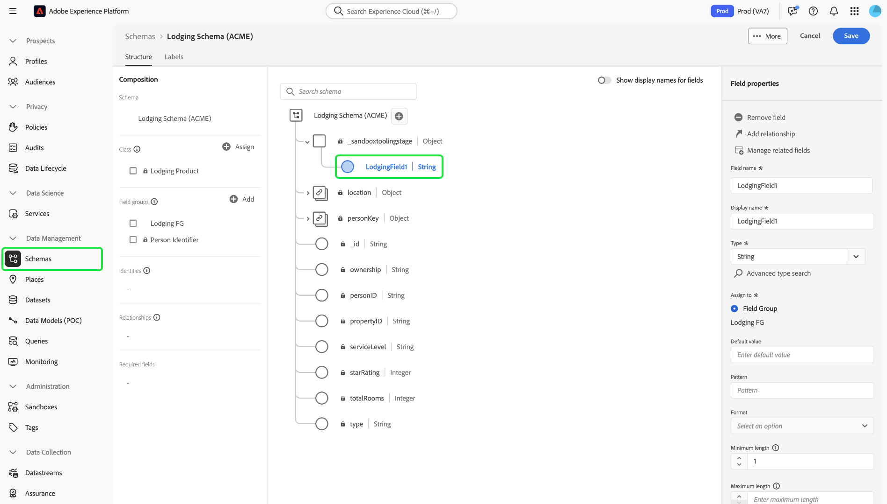

# Sandbox-tools

>[!NOTE]
>
>Gereedschap voor sandboxen is een basisfunctie die zowel [!DNL Real-Time Customer Data Platform] als [!DNL Journey Optimizer] ondersteunt om de efficiëntie van de ontwikkelingscyclus en de nauwkeurigheid van de configuratie te verbeteren.   u wordt vereist om de volgende twee op rol-gebaseerde toegangsbeheertoestemmingen te hebben om de zandbaktooling eigenschap te gebruiken:  - `manage-sandbox` of `view-sandbox`  - `manage-package`

Verbeter de configuratienauwkeurigheid over sandboxen en voer naadloos sandboxconfiguraties tussen sandboxen in met de functie voor het bewerken van sandboxen. Gebruik de gereedheid van de sandbox om de tijd die nodig is voor het implementatieproces te verkorten en geslaagde configuraties over de sandboxen te verplaatsen.

U kunt de functie voor gereedschappen in de sandbox gebruiken om verschillende objecten te selecteren en deze te exporteren naar een pakket. Een pakket kan uit één object of uit meerdere objecten bestaan. <!--or an entire sandbox.--> om het even welke voorwerpen die in een pakket inbegrepen zijn moeten van de zelfde zandbak zijn.

## Objecten ondersteund voor gereedmaken van sandbox {#supported-objects}

Met de functie voor het gereedmaken van de sandbox kunt u [!DNL Adobe Real-Time Customer Data Platform] - en [!DNL Adobe Journey Optimizer] -objecten exporteren naar een pakket.

### Real-time Customer Data Platform-objecten {#real-time-cdp-objects}

>[!BEGINSHADEBOX]

### Wijzigingen in de import van doelgroepen met meerdere entiteiten

Met de [&#x200B; B2B architectuurverbeteringen &#x200B;](../../rtcdp/b2b-architecture-upgrade.md), zult u multi-entiteitpubliek met B2B attributen en de Gebeurtenissen van de Ervaring niet meer kunnen invoeren als een pakket dat deze doelgroepen omvatte vóór de verbetering werd gepubliceerd. Deze doelgroepen kunnen niet worden geïmporteerd en kunnen niet automatisch worden geconverteerd naar de nieuwe architectuur.

Als u deze beperking wilt omzeilen, moet u een nieuw pakket maken met het bijgewerkte publiek en deze met behulp van sandboxgereedschappen importeren in de respectievelijke doelsandboxen.

>[!ENDSHADEBOX]

De onderstaande tabel bevat een lijst met [!DNL Adobe Real-Time Customer Data Platform] -objecten die momenteel worden ondersteund voor gereedschappen in sandboxen:

| Platform | Object | Details |
| --- | --- | --- |
| Klantgegevensplatform | Bronnen | <ul><li>De referenties van de bronaccount worden om beveiligingsredenen niet gerepliceerd in de doelsandbox en moeten handmatig worden bijgewerkt.</li><li>De brongegevensstroom wordt standaard gekopieerd in een conceptstatus.</li></ul> **NOTA:** momenteel, steunt het zandbak tooling slechts op batch-gebaseerde brondataflows. Op streaming gebaseerde brongegevensstromen worden niet ondersteund. |
| Klantgegevensplatform | Doelgroepen | <ul><li>Alleen het **[!UICONTROL Customer Audience]** type **[!UICONTROL Segmentation service]** wordt ondersteund.</li><li>Bestaande labels voor toestemming en bestuur worden in dezelfde importtaak gekopieerd.</li><li> Het systeem zal automatisch het Standaard Beleid van de Fusie in doelzandbak met de zelfde klasse selecteren XDM wanneer het controleren van de gebiedsdelen van het fusiebeleid.</li><li>Als bij het importeren van soorten publiek een bestaand object met dezelfde naam wordt gedetecteerd, wordt het bestaande object altijd opnieuw gebruikt met de functie Sandbox-gereedschappen, zodat objectproliferatie wordt voorkomen.</li></ul> |
| Klantgegevensplatform | Identiteiten | <ul><li>Het systeem dedupliceert standaard Adobe-naamruimten automatisch wanneer u deze maakt in de doelsandbox.</li><li>Het publiek kan slechts worden gekopieerd wanneer alle attributen in publieksregels in het unieschema worden toegelaten. De noodzakelijke schema&#39;s moeten eerst voor verenigd profiel worden bewogen en worden toegelaten.</li></ul> |
| Klantgegevensplatform | Schema&#39;s/veldgroepen/gegevenstypen | <ul><li>Bestaande labels voor toestemming en bestuur worden in dezelfde importtaak gekopieerd.</li><li>U hebt de flexibiliteit om schema&#39;s in te voeren zonder de Verenigde toegelaten optie van het Profiel. Het randgeval van de schema-relaties wordt niet opgenomen in het pakket.</li><li>Als bij het importeren van schema&#39;s/veldgroepen een bestaand object met dezelfde naam wordt gedetecteerd, wordt het bestaande object altijd opnieuw gebruikt met de functie Sandbox-gereedschappen, zodat objectproliferatie wordt voorkomen.</li></ul> |
| Klantgegevensplatform | Gegevenssets | Datasets worden gekopieerd met de instelling voor het uniforme profiel standaard uitgeschakeld. |
| Klantgegevensplatform | Beleid inzake instemming en bestuur | Voeg aangepast beleid dat door een gebruiker is gemaakt, toe aan een pakket en verplaats het naar andere sandboxen. |

De volgende objecten worden geïmporteerd, maar hebben een concept- of een uitgeschakelde status:

| Functie | Object | Status |
| --- | --- | --- |
| Importstatus | Source-dataflow | Concept |
| Importstatus | Reis | Concept |
| Verenigd profiel | Gegevensset | Verenigd profiel uitgeschakeld |
| Beleid | Beleid inzake gegevensbeheer | Uitgeschakeld |

### Adobe Journey Optimizer-objecten {#abobe-journey-optimizer-objects}

De onderstaande tabel bevat een lijst met [!DNL Adobe Journey Optimizer] -objecten die momenteel worden ondersteund voor het gebruik van sandboxgereedschappen en beperkingen. Voor een volledige lijst van beste praktijken, verwijs naar de [&#x200B; algemene best practices van Journey Optimizer &#x200B;](https://experienceleague.adobe.com/nl/docs/journey-optimizer/using/connect-systems/sandbox/copy-objects-to-sandbox?#global) gids.

| Platform | Object | Ondersteunde afhankelijke objecten | Details |
| --- | --- | --- | --- |
| [!DNL Adobe Journey Optimizer] | Doelgroep | | Een publiek kan als afhankelijk voorwerp van het reisvoorwerp worden gekopieerd. U kunt een nieuw publiek maken of een bestaand publiek in de doelsandbox opnieuw gebruiken. |
| [!DNL Adobe Journey Optimizer] | Schema | | De schema&#39;s die in de reis worden gebruikt kunnen als afhankelijke voorwerpen worden gekopieerd. U kunt een nieuw schema selecteren of een bestaand schema in de doelzandbak opnieuw gebruiken. |
| [!DNL Adobe Journey Optimizer] | Samenvoegbeleid | | Het samenvoegbeleid dat in de reis wordt gebruikt, kan als afhankelijke voorwerpen worden gekopieerd. In de doelzandbak, kunt u **niet** tot een nieuw fusiebeleid leiden, kunt u bestaande slechts gebruiken. |
| [!DNL Adobe Journey Optimizer] | Reis | De volgende objecten die tijdens de rit worden gebruikt, worden als afhankelijke objecten gekopieerd. Tijdens de importworkflow kunt u kiezen tussen **[!UICONTROL Create new]** en **[!UICONTROL Use existing]** voor elke optie: <ul><li>Doelgroepen</li><li>Canvasdetails</li><li>Contentsjablonen</li><li>Aangepaste acties</li><li>Gegevensbronnen</li><li>Gebeurtenissen</li><li>Veldgroepen</li><li>Fragmenten</li><li>Schema&#39;s</li></ul> | Wanneer u **[!UICONTROL Use existing]** tijdens het de invoerproces selecteert om een reis aan een andere zandbak te kopiëren, moeten de bestaande douaneacties u **&#x200B;**&#x200B;kiezen een nauwkeurige gelijke aan de brondouaneactie zijn. Als deze niet overeenkomen, leidt de nieuwe rit tot onoplosbare fouten.  het systeem kopieert de gebeurtenissen en gebeurtenisdetails die in de reis worden gebruikt en leidt tot een nieuwe versie in de doelzandbak. |
| [!DNL Adobe Journey Optimizer] | Actie | | E-mail- en pushberichten die tijdens de rit worden gebruikt, kunnen als afhankelijke objecten worden gekopieerd. De activiteiten van de kanaalactie die op de reisgebieden worden gebruikt, die voor verpersoonlijking in het bericht worden gebruikt, worden niet gecontroleerd op volledigheid. Inhoudsblokken worden niet gekopieerd.   de actie van het updateprofiel die in de reis wordt gebruikt kan worden gekopieerd. Aangepaste acties kunnen onafhankelijk van elkaar aan een pakket worden toegevoegd. De details van de actie die tijdens de reis worden gebruikt, worden ook gekopieerd. Er wordt altijd een nieuwe versie gemaakt in de doelsandbox. |
| [!DNL Adobe Journey Optimizer] | Aangepaste handelingen |  | Aangepaste acties kunnen onafhankelijk van elkaar aan een pakket worden toegevoegd. Wanneer een aangepaste handeling aan een reis is toegewezen, kan deze niet meer worden bewerkt. Als u aangepaste handelingen wilt bijwerken, moet u: <ul><li>aangepaste handelingen verplaatsen voordat u een reis maakt</li><li>updateconfiguraties (zoals aanvraagheaders, queryparameters en verificatie) voor aangepaste acties na migratie</li><li>Reisobjecten migreren met de aangepaste handelingen die u tijdens de eerste stap hebt toegevoegd</li></ul> |
| [!DNL Adobe Journey Optimizer] | Inhoudssjabloon | | Een inhoudssjabloon kan worden gekopieerd als een afhankelijk object van het reisobject. Met standalone sjablonen kunt u eenvoudig aangepaste inhoud hergebruiken voor Journey Optimizer-campagnes en -reizen. |
| [!DNL Adobe Journey Optimizer] | Fragment | Alle geneste fragmenten. | Een fragment kan worden gekopieerd als een afhankelijk object van het reisobject. Fragmenten zijn herbruikbare onderdelen waarnaar in een of meer e-mails van Journey Optimizer-campagnes en -reizen kan worden verwezen. |
| [!DNL Adobe Journey Optimizer] | Campagnes | De volgende objecten die in de campagne worden gebruikt, worden als afhankelijke objecten gekopieerd: <ul><li>Campagnes</li><li>Doelgroepen</li><li>Schema&#39;s</li><li>Contentsjablonen</li><li>Fragmenten</li><li>Bericht/inhoud</li><li>Kanaalconfiguratie</li><li>Verenigde beslissingsobjecten</li><li>Instellingen/varianten van experimenten</li></ul> | <ul><li>Campagnes kunnen samen met alle punten worden gekopieerd met betrekking tot het profiel, het publiek, het schema, de gealigneerde berichten, en afhankelijke voorwerpen. Sommige items worden niet gekopieerd, zoals labels voor gegevensgebruik en taalinstellingen. Voor een volledige lijst van voorwerpen die niet kunnen worden gekopieerd, verwijs naar de [&#x200B; exporterende voorwerpen aan een andere zandbak &#x200B;](https://experienceleague.adobe.com/nl/docs/journey-optimizer/using/configuration/copy-objects-to-sandbox) gids.</li><li>Het systeem zal automatisch een bestaand kanaalconfiguratievoorwerp in de doelzandbak ontdekken en opnieuw gebruiken als een identieke configuratie bestaat. Als er geen overeenkomende configuratie wordt gevonden, wordt de kanaalconfiguratie overgeslagen tijdens het importeren en moeten gebruikers de kanaalinstellingen in de doelsandbox voor deze reis handmatig bijwerken.</li><li>Gebruikers kunnen bestaande experimenten en doelgroepen in de doelsandbox opnieuw gebruiken als afhankelijke objecten van geselecteerde campagnes.</li></ul> |
| [!DNL Adobe Journey Optimizer] | Beslissing | De volgende objecten moeten aanwezig zijn in de doelsandbox voordat u beslissingsobjecten kopieert: <ul><li>Profielkenmerken die worden gebruikt voor beslissingsobjecten</li><li>De veldgroep aangepaste aanbiedingskenmerken</li><li>De schema&#39;s van gegevensstromen die voor de Attributen van de Context over Regels, het Rangschikken of het Kappen worden gebruikt.</li></ul> | <ul><li>Het kopiëren van rangschikkingsformules die gebruik maken van AI-modellen wordt momenteel niet ondersteund.</li><li>Beslissingsobjecten (aanbiedingen) worden niet automatisch opgenomen. Om ervoor te zorgen zij worden overgebracht, voeg hen manueel toe gebruikend **aan het Pakket** optie toevoegt.</li><li>Het beleid dat een selectiestrategie gebruikt vereist dat de bijbehorende besluitvormingspunten manueel tijdens het exemplaarproces worden toegevoegd. Het beleid dat handbediende of reserve besluitvormingspunten gebruikt zal die punten automatisch hebben inbegrepen als directe gebiedsdelen.</li><li>Beslissingsitems moeten eerst worden gekopieerd, vóór andere gerelateerde objecten.</li><li>Voor een volledige lijst van gesteunde voorwerpen, verwijs naar [&#x200B; het uitvoeren voorwerpen naar een andere zandbak &#x200B;](https://experienceleague.adobe.com/nl/docs/journey-optimizer/using/configuration/copy-objects-to-sandbox) gids.</li></ul> |

## Objecten exporteren naar een pakket {#export-objects}

>[!NOTE]
>
>Alle uitvoeracties worden in de auditlogboeken opgenomen.

>[!CONTEXTUALHELP]
>id="platform_sandbox_tooling_remove_object"
>title="Een object verwijderen"
>abstract="Als u een object uit het pakket wilt verwijderen, selecteert u de rij die u wilt verwijderen en gebruikt u vervolgens de verwijderoptie die bij de selectie beschikbaar wordt gemaakt. U kunt geen objecten verwijderen uit gepubliceerde pakketten."

>[!CONTEXTUALHELP]
>id="platform_sandbox_package_expiry"
>title="Vervalinstellingen van pakket"
>abstract="Pakketten verlopen na een periode van inactiviteit in de status van het concept. De standaarddatum is ingesteld op 90 dagen vanaf vandaag. Deze datum blijft wijzigen totdat het pakket is gepubliceerd. Als u het pakket morgen als concept-status bezoekt, wordt de datum met +1 dag verplaatst, tenzij u dit handmatig instelt."

>[!CONTEXTUALHELP]
>id="platform_sandbox_tooling_package_status"
>title="Pakketstatus"
>abstract="Standaard is de status ingesteld op concept. Nadat het pakket is gepubliceerd, wordt de status gewijzigd in gepubliceerd. Er kunnen geen wijzigingen worden aangebracht nadat het pakket is gepubliceerd."

>[!NOTE]
>
>U kunt een pakket alleen importeren als u toegangsrechten hebt voor de objecten.

In dit voorbeeld wordt het exporteren van een schema en het toevoegen aan een pakket gedocumenteerd. U kunt het zelfde proces gebruiken om andere voorwerpen, bijvoorbeeld, datasets, reizen, en vele anderen uit te voeren.

### Object toevoegen aan een nieuw pakket {#add-object-to-new-package}

Selecteer **[!UICONTROL Schemas]** in de linkernavigatie en selecteer vervolgens het tabblad **[!UICONTROL Browse]** , waarin de beschikbare schema&#39;s worden vermeld. Selecteer vervolgens de ellips (`...`) naast het geselecteerde schema en een vervolgkeuzelijst met besturingselementen. Selecteer **[!UICONTROL Add to package]** in de vervolgkeuzelijst.

![&#x200B; Lijst van schema&#39;s die het dropdown menu tonen dat de [!UICONTROL Add to package] controle benadrukt.](../images/ui/sandbox-tooling/add-to-package.png)

Selecteer de optie **[!UICONTROL Add to package]** in het dialoogvenster **[!UICONTROL Create new package]** . Geef een [!UICONTROL Name] voor het pakket op en een optioneel [!UICONTROL Description] en selecteer vervolgens **[!UICONTROL Add]** .

![&#x200B; de [!UICONTROL Add to package] dialoog met [!UICONTROL Create new package] geselecteerd en het benadrukken [!UICONTROL Add].](../images/ui/sandbox-tooling/create-new-package.png)

U wordt teruggestuurd naar de **[!UICONTROL Schemas]** -omgeving. U kunt nu extra objecten toevoegen aan het pakket dat u hebt gemaakt door de volgende stappen hieronder uit te voeren.

### Een object toevoegen aan een bestaand pakket en publiceren {#add-object-to-existing-package}

Als u een lijst met beschikbare schema&#39;s wilt weergeven, selecteert u **[!UICONTROL Schemas]** in de linkernavigatie en selecteert u vervolgens de tab **[!UICONTROL Browse]** . Selecteer vervolgens de ellips (`...`) naast het geselecteerde schema om de besturingsopties in een vervolgkeuzemenu weer te geven. Selecteer **[!UICONTROL Add to package]** in de vervolgkeuzelijst.

![&#x200B; Lijst van schema&#39;s die het dropdown menu tonen dat de [!UICONTROL Add to package] controle benadrukt.](../images/ui/sandbox-tooling/add-to-package.png)

Het dialoogvenster **[!UICONTROL Add to package]** wordt weergegeven. Selecteer de optie **[!UICONTROL Existing package]** , selecteer vervolgens het vervolgkeuzemenu **[!UICONTROL Package name]** en selecteer het vereiste pakket. Selecteer ten slotte **[!UICONTROL Add]** om uw keuzes te bevestigen.

![[!UICONTROL Add to package] , waarin een geselecteerd pakket uit het vervolgkeuzemenu wordt weergegeven. &#x200B;](../images/ui/sandbox-tooling/add-to-existing-package.png)

De lijst met objecten die aan het pakket zijn toegevoegd, wordt weergegeven. Selecteer **[!UICONTROL Publish]** als u het pakket wilt publiceren en het beschikbaar wilt maken voor import in sandboxen.

![&#x200B; een lijst van voorwerpen in het pakket, die de [!UICONTROL Publish] optie benadrukken.](../images/ui/sandbox-tooling/publish-package.png)

Selecteer **[!UICONTROL Publish]** om de publicatie van het pakket te bevestigen.

![&#x200B; publiceer de dialoog van de pakketbevestiging, die de [!UICONTROL Publish] optie benadrukt.](../images/ui/sandbox-tooling/publish-package-confirmation.png)

>[!NOTE]
>
>Nadat het pakket is gepubliceerd, kan de inhoud ervan niet meer worden gewijzigd. Om compatibiliteitsproblemen te voorkomen, moet u ervoor zorgen dat alle benodigde middelen zijn geselecteerd. Als er wijzigingen moeten worden aangebracht, moet u een nieuw pakket maken.

U keert terug naar het tabblad **[!UICONTROL Packages]** in de [!UICONTROL Sandboxes] -omgeving, waar u het nieuwe gepubliceerde pakket kunt zien.

## Een pakket importeren naar een doelsandbox {#import-package-to-target-sandbox}

>[!NOTE]
>
>Alle importacties worden vastgelegd in de auditlogboeken.

Als u het pakket in een doelsandbox wilt importeren, navigeert u naar het tabblad Sandboxen **[!UICONTROL Browse]** en selecteert u de plusoptie (+) naast de naam van de sandbox.

![&#x200B; de zandbakken **[!UICONTROL Browse]** lusje die de het invoerpakketselectie benadrukken.](../images/ui/sandbox-tooling/browse-sandboxes.png)

Selecteer in het vervolgkeuzemenu de **[!UICONTROL Package name]** die u wilt importeren in de doelsandbox. Voeg een **[!UICONTROL Job name]** toe die wordt gebruikt voor toekomstige controle. Standaard wordt het uniforme profiel uitgeschakeld wanneer de schema&#39;s van het pakket worden geïmporteerd. Wissel **toe laat schema&#39;s voor profiel** om dit toe te laten, dan selecteren **[!UICONTROL Next]**.

![&#x200B; de pagina van de invoerdetails die de [!UICONTROL Package name] dropdown selectie &#x200B;](../images/ui/sandbox-tooling/import-package-to-sandbox.png) toont

De pagina [!UICONTROL Package object and dependencies] bevat een lijst met alle elementen in dit pakket. Het systeem detecteert automatisch afhankelijke objecten die nodig zijn om geselecteerde bovenliggende objecten te kunnen importeren. Alle ontbrekende kenmerken worden boven aan de pagina weergegeven. Selecteer **[!UICONTROL View details]** voor een meer gedetailleerde uitsplitsing.

![&#x200B; de [!UICONTROL Package object and dependencies] pagina toont ontbrekende attributen.](../images/ui/sandbox-tooling/missing-attributes.png)

>[!NOTE]
>
>Afhankelijke objecten kunnen worden vervangen door bestaande objecten in de doelsandbox, zodat u bestaande objecten opnieuw kunt gebruiken in plaats van een nieuwe versie te maken. Wanneer u bijvoorbeeld een pakket met schema&#39;s importeert, kunt u de bestaande aangepaste veldgroep en naamruimten in de doelsandbox opnieuw gebruiken. U kunt ook bestaande segmenten in de doelsandbox opnieuw gebruiken wanneer u een pakket importeert, inclusief de stappen voor reizen.
>
>Sandbox-gereedschappen bieden momenteel geen ondersteuning voor het bijwerken of overschrijven van bestaande objecten. U kunt een nieuw object maken of het bestaande object zonder wijzigingen blijven gebruiken. Als een bestaand object met dezelfde naam wordt gedetecteerd, wordt het bestaande object altijd opnieuw gebruikt met de functie Sandbox, zelfs als u de optie [!UICONTROL Create new] selecteert om proliferatie van objecten te voorkomen.

Als u een bestaand object wilt gebruiken, selecteert u het potloodpictogram naast het afhankelijke object.

![&#x200B; de [!UICONTROL Package object and dependencies] pagina toont een lijst van activa inbegrepen in het pakket.](../images/ui/sandbox-tooling/package-objects-and-dependencies.png)

De opties voor het maken van nieuwe of het gebruik van bestaande bestanden worden weergegeven. Selecteer **[!UICONTROL Use existing]**.

![&#x200B; de [!UICONTROL Package object and dependencies] pagina die afhankelijke objecten opties [!UICONTROL Create new] en [!UICONTROL Use existing] tonen.](../images/ui/sandbox-tooling/use-existing-object.png)

Het dialoogvenster **[!UICONTROL Field group]** bevat een lijst met veldgroepen die beschikbaar zijn voor het object. Selecteer de gewenste veldgroepen en selecteer vervolgens **[!UICONTROL Save]** .

![&#x200B; een lijst van gebieden die op de [!UICONTROL Field group] dialoog worden getoond, die de [!UICONTROL Save] selectie benadrukken.](../images/ui/sandbox-tooling/field-group-list.png)

U wordt teruggestuurd naar de pagina [!UICONTROL Package object and dependencies] . Selecteer van hieruit **[!UICONTROL Finish]** om het importeren van het pakket te voltooien.

![&#x200B; de [!UICONTROL Package object and dependencies] pagina toont een lijst van activa inbegrepen in het pakket, benadrukkend [!UICONTROL Finish].](../images/ui/sandbox-tooling/finish-object-dependencies.png)

## Een volledige sandbox exporteren en importeren

>[!NOTE]
>
>Momenteel worden alleen Real-Time Customer Data Platform-objecten ondersteund bij het exporteren of importeren van een volledige sandbox. Adobe Journey Optimizer-objecten zoals reizen worden momenteel niet ondersteund.

U kunt alle ondersteunde objecttypen exporteren naar een volledig sandboxpakket en het pakket vervolgens in verschillende sandboxen importeren om objectconfiguraties te repliceren. Met deze functionaliteit kunt u bijvoorbeeld:

- Importeer een sandbox opnieuw om alle objectconfiguraties te reproduceren als u de sandbox opnieuw moet instellen
- Importeer het pakket in andere sandboxen en gebruik het als een blauwdruksandbox om het ontwikkelingsproces te versnellen.

### Een volledige sandbox exporteren {#export-entire-sandbox}

Als u een volledige sandbox wilt exporteren, navigeert u naar de tab [!UICONTROL Sandboxes] **[!UICONTROL Packages]** en selecteert u **[!UICONTROL Create package]** .

![&#x200B; het [!UICONTROL Sandboxes] **[!UICONTROL Packages]** lusje benadrukken [!UICONTROL Create package].](../images/ui/sandbox-tooling/create-sandbox-package.png)

Selecteer **[!UICONTROL Entire sandbox]** voor [!UICONTROL Type of package] in het dialoogvenster [!UICONTROL Create package] . Geef een [!UICONTROL Package name] op voor het nieuwe pakket en selecteer de **[!UICONTROL Sandbox]** in het vervolgkeuzemenu. Selecteer ten slotte **[!UICONTROL Create]** om uw gegevens te bevestigen.

![&#x200B; de dialoog die [!UICONTROL Create package] voltooide gebieden toont en [!UICONTROL Create] benadrukt.](../images/ui/sandbox-tooling/create-package-dialog.png)

Het pakket is gemaakt en selecteer **[!UICONTROL Publish]** om het pakket te publiceren.

U keert terug naar het tabblad **[!UICONTROL Packages]** in de [!UICONTROL Sandboxes] -omgeving, waar u het nieuwe gepubliceerde pakket kunt zien.

### Het volledige sandboxpakket importeren {#import-entire-sandbox-package}

>[!NOTE]
>
>Alle objecten worden als nieuwe objecten geïmporteerd in de doelsandbox. Het wordt aanbevolen een volledig sandboxpakket te importeren in een lege sandbox.

Als u het pakket in een doelsandbox wilt importeren, navigeert u naar het tabblad [!UICONTROL Sandboxes] **[!UICONTROL Browse]** en selecteert u de optie met het plusteken (+) naast de naam van de sandbox.

![&#x200B; de zandbakken **[!UICONTROL Browse]** lusje die de het invoerpakketselectie benadrukken.](../images/ui/sandbox-tooling/browse-entire-package-sandboxes.png)

Selecteer de volledige sandbox met behulp van het vervolgkeuzemenu **[!UICONTROL Package name]** . Voeg een **[!UICONTROL Job name]** toe, die wordt gebruikt voor toekomstige controle en een optioneel **[!UICONTROL Job description]** , en selecteer vervolgens **[!UICONTROL Next]** .

![&#x200B; de pagina van de invoerdetails die de [!UICONTROL Package name] dropdown selectie &#x200B;](../images/ui/sandbox-tooling/import-full-sandbox-package.png) toont

>[!NOTE]
>
>U moet volledige machtigingen hebben voor alle objecten die in het pakket zijn opgenomen. Als u geen machtigingen hebt, mislukt het importeren en verschijnen er foutberichten.

U gaat naar de pagina [!UICONTROL Package object and dependencies] waar u het aantal objecten en afhankelijkheden kunt zien die zijn geïmporteerd en uitgesloten. Selecteer van hieruit **[!UICONTROL Import]** om het importeren van het pakket te voltooien.

![&#x200B; de [!UICONTROL Package object and dependencies] pagina toont het gealigneerde bericht van objecten types niet gesteund, benadrukkend [!UICONTROL Import].](../images/ui/sandbox-tooling/finish-dependencies-entire-sandbox.png)

Zorg ervoor dat de importbewerking enige tijd duurt. De tijd die nodig is om te voltooien, is afhankelijk van het aantal objecten in het pakket. U kunt de importtaak controleren vanaf het tabblad [!UICONTROL Sandboxes] **[!UICONTROL Jobs]** .

## Importdetails controleren {#view-import-details}

Als u de geïmporteerde details wilt weergeven, navigeert u naar het tabblad [!UICONTROL Sandboxes] **[!UICONTROL Jobs]** en selecteert u het pakket in de lijst. U kunt ook de zoekbalk gebruiken om naar het pakket te zoeken.

![&#x200B; het lusje van zandbakken [!UICONTROL Jobs] benadrukt de het invoerpakketselectie.](../images/ui/sandbox-tooling/imports-tab.png)

<!--### View imported objects {#view-imported-objects}

On the **[!UICONTROL Jobs]** tab in the [!UICONTROL Sandboxes] environment, select **[!UICONTROL View imported objects]** from the right details pane.

Select **[!UICONTROL View imported objects]** from the right details pane on the **[!UICONTROL Jobs]** tab in the [!UICONTROL Sandboxes] environment.

![The sandboxes [!UICONTROL Imports] tab highlights the [!UICONTROL View imported objects] selection in the right pane.](../images/ui/sandbox-tooling/view-imported-objects.png)

Use the arrows to expand objects to view the full list of fields that have been imported into the package.

![The sandboxes [!UICONTROL Imported objects] showing a list of objects imported into the package.](../images/ui/sandbox-tooling/expand-imported-objects.png)-->

Selecteer **[!UICONTROL View import summary]** in het rechterdetailvenster op het tabblad **[!UICONTROL Jobs]** in de Sandboxomgeving.

![&#x200B; het zandbakken [!UICONTROL Imports] lusje benadrukt de [!UICONTROL View import details] selectie in de juiste ruit.](../images/ui/sandbox-tooling/view-import-details.png)

In het dialoogvenster **[!UICONTROL Import summary]** wordt een percentage weergegeven van de importbewerkingen.

>[!NOTE]
>
>U kunt een lijst met objecten weergeven door naar specifieke overzichtspagina&#39;s te navigeren.

![&#x200B; de dialoog die [!UICONTROL Import details] een gedetailleerde uitsplitsing van de invoer toont.](../images/ui/sandbox-tooling/import-details.png)

Wanneer het importeren is voltooid, ontvangt u een melding in de gebruikersinterface van Experience Platform. U kunt deze meldingen openen via het waarschuwingspictogram. U kunt hier naar probleemoplossing navigeren als een taak mislukt.

## Updates van iteratieve objectconfiguraties overbrengen naar andere sandboxen via sandboxgereedschappen {#move-configs}

U kunt sandboxgereedschappen gebruiken om objectconfiguraties tussen verschillende sandboxen over te brengen. Eerder moesten configuratieupdates voor uw objecten (zoals schema&#39;s, veldgroepen en gegevenstypen) handmatig opnieuw worden gemaakt of geïmporteerd om te kunnen worden overgebracht naar andere sandboxen. Met deze functie kunt u sandboxgereedschappen gebruiken om uw workflows te versnellen en potentiële fouten te beperken door uw configuratie-updates naadloos over te brengen naar verschillende sandboxen.

>[!TIP]
>
> Zorg ervoor dat u aan de volgende voorwaarden voldoet voordat u probeert objectconfiguraties over te brengen naar verschillende sandboxen.
>
>- De juiste machtigingen voor toegang tot gereedschappen in sandboxen.
>- Een nieuw gemaakt of bijgewerkt object (zoals een schema) in uw bronsandbox.

>[!BEGINSHADEBOX]

### Ondersteunde objecttypen voor updatebewerking

Hieronder vindt u ondersteunde objecttypen voor bijwerken:

- Schema&#39;s
- Veldgroepen
- Datatypen

| Ondersteunde updates | Niet-ondersteunde updates |
| --- | --- |
| <ul><li>Nieuwe velden/veldgroepen toevoegen aan de bron.</li><li>Een vereist veld optioneel maken.</li><li>Nieuwe vereiste velden introduceren.</li><li>Inleiding tot een nieuw relatieveld.</li><li>Introductie van een nieuw identiteitsveld.</li><li>De weergavenaam en beschrijving van de bron wijzigen.</li></ul> | <ul><li>Eerder gedefinieerde velden verwijderen.</li><li>Bestaande velden opnieuw definiëren wanneer het schema is ingeschakeld voor Real-Time Klantprofiel.</li><li>Eerder ondersteunde veldwaarden verwijderen of beperken.</li><li>Bestaande velden naar een andere locatie in de schemastructuur verplaatsen - hierdoor wordt een nieuw veld in de doelsandbox gemaakt, maar het vorige veld wordt niet verwijderd.</li><li>Het in- of uitschakelen van het schema om deel te nemen aan Profiel - deze bewerking wordt overgeslagen bij een diff-vergelijking.</li><li>Toegangsbeheerlabels.</li></ul> |

>[!ENDSHADEBOX]

Volg de onderstaande stappen om te leren hoe u sandboxgereedschappen kunt gebruiken om objectconfiguraties over verschillende sandboxen te verplaatsen.

### Eerder geïmporteerde objecten

Voer de volgende stappen uit als uw gebruiksscenario bestaande objecten in uw bronsandbox betreft waarvoor configuratieupdates nodig zijn, nadat deze al zijn verpakt en geïmporteerd naar andere sandboxen.

Werk eerst het object in de bronsandbox bij. Navigeer bijvoorbeeld naar de werkruimte van **[!UICONTROL Schemas]** , selecteer het schema en voeg een nieuwe veldgroep toe.

Nadat u het schema hebt bijgewerkt, navigeert u naar **[!UICONTROL Sandboxes]**, selecteert u **[!UICONTROL Packages]** en zoekt u het bestaande pakket.

Gebruik de interface van pakketten om uw veranderingen te verifiëren. Selecteer **[!UICONTROL Check for updates]** om eventuele wijzigingen in de artefacten in het pakket weer te geven. Selecteer vervolgens **[!UICONTROL View diff]** om een gedetailleerd overzicht te ontvangen van alle wijzigingen die zijn uitgevoerd op basis van uw artefacten.

De interface [!UICONTROL View diff] wordt weergegeven. Zie deze tol voor informatie over uw bron en doelartefacten, evenals de veranderingen die op hen moeten worden toegepast.

Tijdens deze stap kunt u ook [!UICONTROL Summarize with AI] selecteren voor een stapsgewijze samenvatting van alle wijzigingen.

Als u klaar bent, selecteert u **[!UICONTROL Update package]** en vervolgens **[!UICONTROL Confirm]** in het pop-upvenster dat wordt weergegeven. Nadat de taak is voltooid, kunt u de pagina vernieuwen en **[!UICONTROL View history]** selecteren om de versie van het pakket te verifiëren.

Als u uw wijzigingen wilt importeren, navigeert u terug naar de map [!UICONTROL Packages] en selecteert u de ovalen (`...` ) naast het pakket en selecteert u vervolgens **[!UICONTROL Import package]** . Experience Platform selecteert automatisch [!UICONTROL Update existing objects] . Controleer de wijzigingen en selecteer vervolgens **[!UICONTROL Finish]** .

>[!NOTE]
>
>Alle afhankelijke objecten worden automatisch bijgewerkt in de doelsandbox als onderdeel van deze workflow.

Navigeer naar de doelsandbox en bekijk het bijgewerkte object handmatig vanuit die sandbox om het importproces verder te valideren.

### Handmatig in doelsandbox gemaakte objecten

Voer de volgende stappen uit als uw gebruiksscenario configuratiewijzigingen toepast op objecten die handmatig in afzonderlijke sandboxen zijn gemaakt.

Maak en publiceer eerst een nieuw pakket met het bijgewerkte object.

Importeer vervolgens het pakket naar de doelsandbox met de objecten die u ook wilt bijwerken. Selecteer tijdens het importproces **[!UICONTROL Update existing objects]** en gebruik vervolgens de objectnavigator om handmatig de doelobjecten te selecteren waarop de updates moeten worden toegepast.

>[!NOTE]
>
>- Het is optioneel om een doeltoewijzing in een andere sandbox te selecteren voor afhankelijke objecten. Als er geen is geselecteerd, wordt er een nieuwe gemaakt.
>- Voor naamruimte voor identiteit detecteert het systeem automatisch of een nieuwe identiteit moet worden gemaakt als een bestaande identiteit opnieuw moet worden gebruikt in de doelsandbox.

Selecteer **[!UICONTROL Finish]** als u de doelobjecten hebt geïdentificeerd die u wilt bijwerken.

## Videotutorial

De volgende video is bedoeld ter ondersteuning van uw begrip van gereedschappen voor sandboxen en beschrijft hoe u een nieuw pakket kunt maken, een pakket kunt publiceren en importeren.

>[!VIDEO](https://video.tv.adobe.com/v/3424763/?learn=on)

## Volgende stappen

In dit document wordt getoond hoe u de functie voor het gereedmaken van de sandbox in de gebruikersinterface van Experience Platform kunt gebruiken. Voor informatie over zandbakken, zie de [&#x200B; gids van de zandbakgebruiker &#x200B;](../ui/user-guide.md).

Voor stappen bij het uitvoeren van verschillende verrichtingen die Sandbox API gebruiken, zie de [&#x200B; gids van de zandbakontwikkelaar &#x200B;](../api/getting-started.md). Voor een overzicht op hoog niveau van zandbakken in Experience Platform, verwijs naar de [&#x200B; overzichtsdocumentatie &#x200B;](../home.md).
