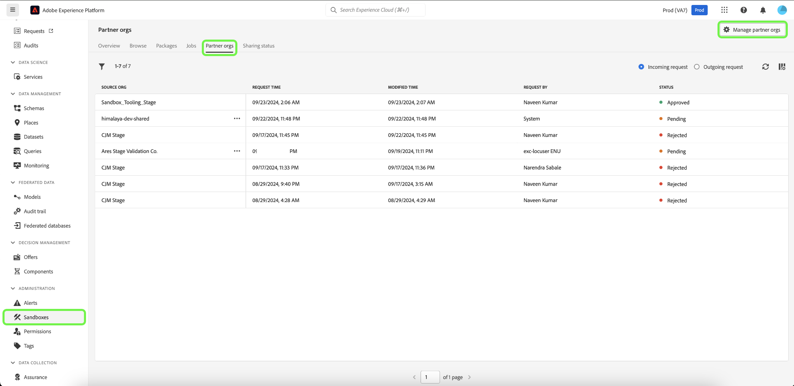

# Pakketten delen tussen organisaties met behulp van sandboxgereedschappen

>[!NOTE]
>
>Het delen van pakketten tussen organisaties vindt momenteel plaats in bèta en is alleen beschikbaar voor bepaalde bètaklanten.

In dit document wordt beschreven hoe u gereedschappen voor sandboxen in Adobe Experience Platform kunt gebruiken om pakketten te delen tussen verschillende organisaties.

Verbeter de configuratienauwkeurigheid over zandbakken en voer naadloos zandbakconfiguraties tussen zandbakken over verschillende organisaties uit met de zandbaktoolingeigenschap. Er zijn twee typen gedeelde pakketten:

**Privé pakket**

Privépakketten kunnen alleen worden gedeeld met organisaties die het verzoek om delen van de bronorganisatie hebben goedgekeurd via een opt-in-lijst van gewenste personen.

**Openbaar pakket**

Openbare pakketten kunnen zonder aanvullende goedkeuring worden geïmporteerd. Deze pakketten kunnen worden gedeeld op de website, de blog of het platform van een partner. Met de pakketlading kunnen pakketten van deze kanalen naar de doelorganisatie worden gekopieerd en geplakt.

## Privépakketten

>[!NOTE]
>
>Om een het delen verzoek in werking te stellen en goed te keuren en pakketten over organisaties te delen, zult u **pakket-aandeel** op rol-gebaseerde toegangsbeheertoestemming moeten hebben.

De sandbox tooling eigenschap voorziet u van de capaciteit om organisatiepartnerschappen tot stand te brengen, de status van een partnerschapverzoek te volgen, bestaande partnerschappen te beheren, en pakketten met partnerorganisaties te delen.

### Een aanvraag voor een partnerschap voor organisaties maken

Navigeer naar het tabblad [!UICONTROL Sandboxes] **[!UICONTROL Partner orgs]** als u een aanvraag voor een partnership voor organisatie wilt maken. Selecteer vervolgens **[!UICONTROL Manage partner orgs]** .

Voer in het dialoogvenster [!UICONTROL Package partner management] de organisatie-id in **[!UICONTROL Enter Org ID]** in en druk op Enter. De organisatie-id wordt weergegeven in de onderstaande sectie **[!UICONTROL Selected Org IDs]** . Selecteer **[!UICONTROL Confirm]** nadat u de id&#39;s hebt toegevoegd.

>[!TIP]
>
>U kunt meerdere organisatie-id&#39;s tegelijk invoeren met behulp van door komma&#39;s gescheiden lijsten of door elke organisatie-id in te voeren, gevolgd door Enter.

De aanvraag voor delen wordt naar de partnerorganisatie verzonden en u gaat terug naar het tabblad [!UICONTROL Sandboxes] **[!UICONTROL Partner orgs]** , dat de **[!UICONTROL Outgoing request]** weergeeft.

### Een partnerschapsverzoek autoriseren

Navigeer naar het tabblad [!UICONTROL Sandboxes] **[!UICONTROL Partner orgs]** als u een aanvraag voor een partnership voor organisatie wilt autoriseren. Selecteer vervolgens **[!UICONTROL Incoming request]** .

Het huidige **[!UICONTROL Status]** voor het verzoek is **in afwachting**. Als u de aanvraag wilt goedkeuren, selecteert u de ellips (`...`) naast de geselecteerde aanvraag en selecteert u vervolgens **[!UICONTROL Approve]** in de vervolgkeuzelijst.

Het dialoogvenster **[!UICONTROL Review partner org request]** bevat informatie over de aanvraag voor een partnerschap voor organisaties. Voer een [!UICONTROL Reason] in voor goedkeuring en selecteer vervolgens **[!UICONTROL Approve]** .

U gaat terug naar de pagina [!UICONTROL Incoming request] en de status van de aanvraag is bijgewerkt naar **[!UICONTROL Approved]** .

U kunt nu pakketten delen tussen uw organisatie en de bronorganisatie.

### Pakketten delen met partnerorganisaties

>[!NOTE]
>
>Slechts kunnen de pakketten met de status **Gepubliceerde** worden gedeeld.

Als u een pakket wilt delen met een erkende partnerorganisatie, navigeert u naar het tabblad [!UICONTROL Sandboxes] **[!UICONTROL Packages]** . Selecteer vervolgens de ellips (`...`) naast het pakket en selecteer **[!UICONTROL Share package]** in het vervolgkeuzemenu.

Selecteer in het dialoogvenster **[!UICONTROL Share package]** het pakket dat u wilt delen in de vervolgkeuzelijst **[!UICONTROL Share settings]** en selecteer vervolgens **[!UICONTROL Confirm]** .

>[!TIP]
>
>U kunt meerdere organisaties selecteren. Geselecteerde organisaties worden weergegeven onder de vervolgkeuzelijst [!UICONTROL Share settings] .

## Volgende stappen

In dit document wordt getoond hoe u de functie Sandbox-gereedschappen kunt gebruiken om pakketten te delen tussen verschillende organisaties. Voor extra informatie, verwijs naar de [ zandbak tooling gids ](../ui/sandbox-tooling.md).

Voor stappen bij het uitvoeren van verschillende verrichtingen die Sandbox API gebruiken, zie de [ gids van de zandbakontwikkelaar ](../api/getting-started.md). Voor een overzicht op hoog niveau van zandbakken in Experience Platform, verwijs naar de [ overzichtsdocumentatie ](../home.md).
