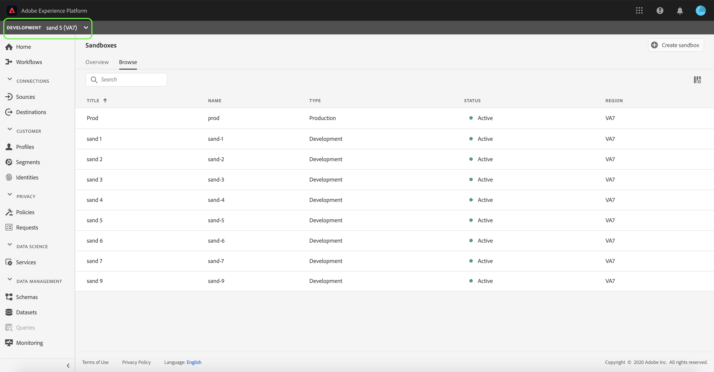

# Gebruiksaanwijzing voor sandbox

Dit document bevat stappen voor het uitvoeren van verschillende bewerkingen met betrekking tot sandboxen in de Adobe Experience Platform-gebruikersinterface.

## Sandboxen weergeven

Selecteer **[!UICONTROL Sandboxes]** in de gebruikersinterface van het Experience Platform in de linkernavigatie om het dashboard **[!UICONTROL Sandboxes]** te openen. Het dashboard bevat alle beschikbare sandboxen voor uw organisatie, inclusief het type sandbox (productie of ontwikkeling) en de status (actief, maken, verwijderen of mislukt).

## Schakelen tussen sandboxen

Met het besturingselement **sandboxswitch** linksboven in het scherm wordt de momenteel actieve sandbox weergegeven.

Als u wilt schakelen tussen sandboxen, selecteert u de sandboxschakelaar en selecteert u de gewenste sandbox in de vervolgkeuzelijst.

Als een sandbox is geselecteerd, wordt het scherm vernieuwd met de geselecteerde sandbox die nu is opgenomen in de sandbox-schakeloptie.

## Zoeken naar een sandbox

U kunt door de lijst van zandbakken navigeren beschikbaar aan u door de onderzoeksfunctie van het menu van de zandbakschakelaar te gebruiken. Typ de naam van de sandbox die u wilt gebruiken om te filteren via alle sandboxen die voor uw organisatie beschikbaar zijn.

## Een nieuwe sandbox maken

>[!NOTE]
>
>De functie Meerdere productiesandboxen is in bèta.

Gebruik de volgende video voor een snel overzicht van het gebruik van sandboxen in Experience Platform.

>[!VIDEO](https://video.tv.adobe.com/v/29838/?quality=12&learn=on)

Als u een nieuwe sandbox wilt maken, selecteert u de knop **[!UICONTROL Create Sandbox]** rechtsboven in het scherm.

Het dialoogvenster **[!UICONTROL Create Sandbox]** wordt weergegeven en u wordt gevraagd een type, een titel en een naam voor de sandbox op te geven. Als u een ontwikkelingssandbox maakt, selecteert u **[!UICONTROL Development]** in het vervolgkeuzevenster dat wordt weergegeven. Selecteer **[!UICONTROL Production]** als u een productiesandbox maakt.

De titel moet leesbaar zijn en moet beschrijvend genoeg zijn om gemakkelijk te kunnen worden herkend. De naam van de sandbox is een id in kleine letters voor gebruik in API-aanroepen en moet daarom uniek en beknopt zijn. De naam van de sandbox mag alleen bestaan uit alfanumerieke tekens en afbreekstreepjes (`-`), moet beginnen met een letter en mag niet langer zijn dan 256 tekens.

Selecteer **[!UICONTROL Create]** als u klaar bent.

Nadat u de sandbox hebt gemaakt, vernieuwt u de pagina en verschijnt de nieuwe sandbox in het dashboard **[!UICONTROL Sandboxes]** met de status &quot;[!UICONTROL Creating]&quot;. Nieuwe sandboxen nemen ongeveer 15 minuten in beslag om door het systeem te worden ingericht, waarna de status van deze sandboxen verandert in &quot;[!UICONTROL Active]&quot;.

## Een sandbox opnieuw instellen

>[!NOTE]
>
>U kunt elke productie- of ontwikkelingssandbox in uw organisatie opnieuw instellen, met uitzondering van de standaardproductiesandbox.

Als u een productie- of ontwikkelingssandbox opnieuw instelt, worden alle bronnen verwijderd die aan die sandbox zijn gekoppeld (schema&#39;s, gegevenssets, enzovoort), terwijl de naam van de sandbox en de bijbehorende machtigingen behouden blijven. Deze &#39;schone&#39; sandbox blijft onder dezelfde naam beschikbaar voor gebruikers die er toegang toe hebben.

Selecteer de sandbox die u wilt herstellen in de lijst met sandboxen. Selecteer **[!UICONTROL Sandbox reset]** in het rechternavigatievenster dat wordt weergegeven.

Er verschijnt een dialoogvenster waarin u wordt gevraagd uw keuze te bevestigen. Selecteer **[!UICONTROL Continue]** om door te gaan.

Voer in het laatste bevestigingsvenster de naam van de sandbox in het dialoogvenster in en selecteer **[!UICONTROL Reset]**

## Een sandbox verwijderen

>[!NOTE]
>
>U kunt elke productie- of ontwikkelingssandbox in uw organisatie verwijderen, met uitzondering van de standaardproductiesandbox.

Als u een productie- of ontwikkelingssandbox verwijdert, worden alle bronnen die aan die sandbox zijn gekoppeld, inclusief de machtigingen, permanent verwijderd.

Selecteer de sandbox die u wilt verwijderen uit de lijst met sandboxen. Selecteer **[!UICONTROL Delete]** in het rechternavigatievenster dat wordt weergegeven.

Er verschijnt een dialoogvenster waarin u wordt gevraagd uw keuze te bevestigen. Selecteer **[!UICONTROL Continue]** om door te gaan.

Voer in het laatste bevestigingsvenster de naam van de sandbox in het dialoogvenster in en selecteer **[!UICONTROL Delete]**

## Volgende stappen

Dit document laat zien hoe u sandboxen beheert in de gebruikersinterface van het Experience Platform. Zie de [handleiding voor sandboxontwikkelaars](../api/getting-started.md) voor informatie over het beheren van sandboxen met de sandbox-API.