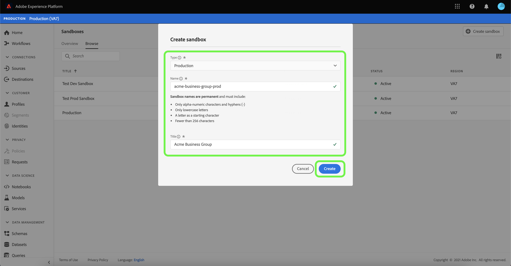
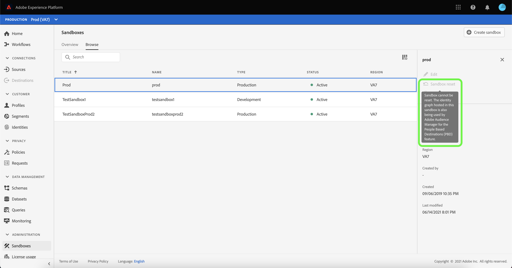

# Gebruiksaanwijzing voor sandbox

Dit document bevat stappen voor het uitvoeren van verschillende bewerkingen met betrekking tot sandboxen in de Adobe Experience Platform-gebruikersinterface.

## Sandboxen weergeven

Selecteer **[!UICONTROL Sandboxes]** in de linkernavigatie in de interface van het Platform om het dashboard [!UICONTROL Sandboxes] te openen. Het dashboard bevat alle beschikbare sandboxen voor uw organisatie, inclusief het type sandbox (productie of ontwikkeling) en de status (actief, maken, verwijderen of mislukt).

## Schakelen tussen sandboxen

Met het besturingselement **sandboxswitch** linksboven in het scherm wordt de momenteel actieve sandbox weergegeven.

Als u wilt schakelen tussen sandboxen, selecteert u de sandboxschakelaar en selecteert u de gewenste sandbox in de vervolgkeuzelijst.

Als een sandbox is geselecteerd, wordt het scherm vernieuwd met de geselecteerde sandbox die nu is opgenomen in de sandbox-schakeloptie.

## Zoeken naar een sandbox

U kunt door de lijst van zandbakken navigeren beschikbaar aan u door de onderzoeksfunctie van het menu van de zandbakschakelaar te gebruiken. Typ de naam van de sandbox die u wilt gebruiken om te filteren via alle sandboxen die voor uw organisatie beschikbaar zijn.

## Een nieuwe sandbox maken

Gebruik de volgende video voor een snel overzicht van het gebruik van sandboxen in Experience Platform.

>[!VIDEO](https://video.tv.adobe.com/v/29838/?quality=12&learn=on)

Als u een nieuwe sandbox wilt maken, selecteert u **[!UICONTROL Create sandbox]** in de rechterbovenhoek van het scherm.

Het dialoogvenster **[!UICONTROL Create sandbox]** wordt weergegeven. Als u een ontwikkelingssandbox maakt, selecteert u **[!UICONTROL Development]** in het vervolgkeuzevenster. Selecteer **[!UICONTROL Production]** om een nieuwe productiestandaard te maken.

Nadat u het type hebt geselecteerd, geeft u de sandbox een naam en een titel. De titel moet leesbaar zijn en moet beschrijvend genoeg zijn om gemakkelijk te kunnen worden herkend. De naam van de sandbox is een id in kleine letters voor gebruik in API-aanroepen en moet daarom uniek en beknopt zijn. De naam van de sandbox moet beginnen met een letter, maximaal 256 tekens bevatten en mag alleen bestaan uit alfanumerieke tekens en afbreekstreepjes (-).

Selecteer **[!UICONTROL Create]** als u klaar bent.

Nadat u de sandbox hebt gemaakt, vernieuwt u de pagina en verschijnt de nieuwe sandbox in het dashboard **[!UICONTROL Sandboxes]** met de status &quot;[!UICONTROL Creating]&quot;. Nieuwe sandboxen nemen ongeveer 30 seconden in beslag om door het systeem te worden ingericht, waarna hun status verandert in &quot;[!UICONTROL Active]&quot;.

## Een sandbox opnieuw instellen

>[!IMPORTANT]
>
>De standaardproductiefandbox kan niet worden teruggesteld als de identiteitsgrafiek binnen het ook door Adobe Analytics voor de [Cross-Device Analytics (CDA)](https://experienceleague.adobe.com/docs/analytics/components/cda/overview.html) eigenschap wordt ontvangen, of als de identiteitsgrafiek binnen het wordt ontvangen ook door Adobe Audience Manager voor de [Op mensen gebaseerde Doelen (PBD)](https://experienceleague.adobe.com/docs/audience-manager/user-guide/features/destinations/people-based/people-based-destinations-overview.html) eigenschap wordt gebruikt.

Als u een productie- of ontwikkelingssandbox opnieuw instelt, worden alle bronnen verwijderd die aan die sandbox zijn gekoppeld (schema&#39;s, gegevenssets, enzovoort), terwijl de naam van de sandbox en de bijbehorende machtigingen behouden blijven. Deze &#39;schone&#39; sandbox blijft onder dezelfde naam beschikbaar voor gebruikers die er toegang toe hebben.

Selecteer de sandbox die u wilt herstellen in de lijst met sandboxen. Selecteer **[!UICONTROL Sandbox reset]** in het rechternavigatievenster dat wordt weergegeven.

Er verschijnt een dialoogvenster waarin u wordt gevraagd uw keuze te bevestigen. Selecteer **[!UICONTROL Continue]** om door te gaan.

Voer in het laatste bevestigingsvenster de naam van de sandbox in het dialoogvenster in en selecteer **[!UICONTROL Reset]**

Na enkele ogenblikken wordt onder aan het scherm een bevestigingsvak weergegeven om te bevestigen dat het opnieuw instellen is gelukt.

### Waarschuwingen

Een standaardproductiesandbox die CDA-gegevens bevat, kan niet worden hersteld en retourneert de volgende waarschuwing.

Een standaardproductiesandbox die PBD-gegevens bevat, kan ook niet opnieuw worden ingesteld en retourneert de volgende waarschuwing.

Een standaardproductiesandbox die gegevens voor zowel CDA als PBD bevat kan ook niet worden teruggesteld en de volgende waarschuwing terugkeert.

U kunt een productiesandbox terugstellen die voor bidirectioneel segment het delen met [!DNL Audience Manager] of [!DNL Audience Core Service] wordt gebruikt. Selecteer [!UICONTROL Continue] om verder te gaan met het terugstellen.

## Een sandbox verwijderen

>[!IMPORTANT]
>
>De standaardproductiesandbox kan niet worden verwijderd.

Als u een productie- of ontwikkelingssandbox verwijdert, worden alle bronnen die aan die sandbox zijn gekoppeld, inclusief de machtigingen, permanent verwijderd.

Selecteer de sandbox die u wilt verwijderen uit de lijst met sandboxen. Selecteer **[!UICONTROL Delete]** in het rechternavigatievenster dat wordt weergegeven.

Er verschijnt een dialoogvenster waarin u wordt gevraagd uw keuze te bevestigen. Selecteer **[!UICONTROL Continue]** om door te gaan.

Voer in het laatste bevestigingsvenster de naam van de sandbox in het dialoogvenster in en selecteer **[!UICONTROL Continue]**

Een door de gebruiker gemaakte productiesandbox die wordt gebruikt voor bidirectioneel segmentdelen met [!DNL Audience Manager] of [!DNL Audience Core Service] kan na de volgende waarschuwing nog steeds worden verwijderd.

## Volgende stappen

Dit document laat zien hoe u sandboxen beheert in de gebruikersinterface van het Experience Platform. Zie de [handleiding voor sandboxontwikkelaars](../api/getting-started.md) voor informatie over het beheren van sandboxen met de sandbox-API.
