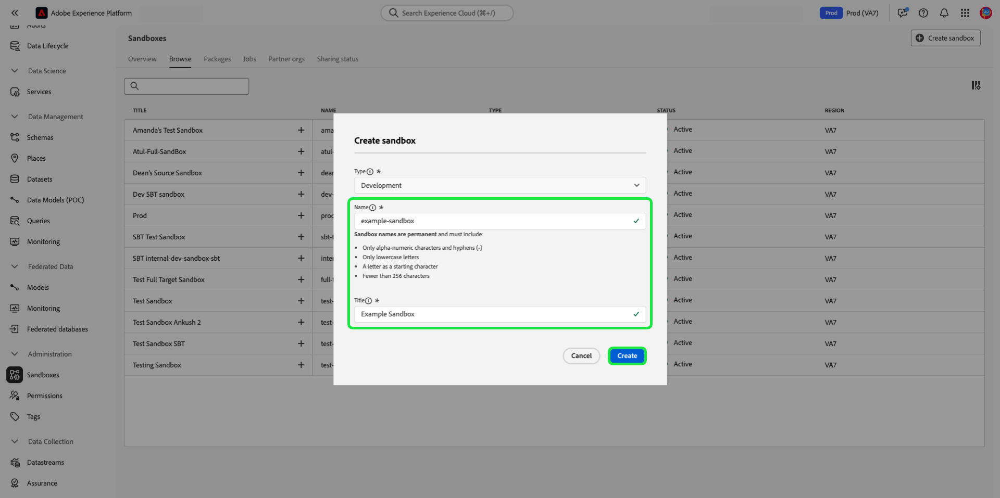

# Gebruiksaanwijzing voor sandbox

Dit document bevat stappen voor het uitvoeren van verschillende bewerkingen met betrekking tot sandboxen in de Adobe Experience Platform-gebruikersinterface.

## Sandboxen weergeven

Selecteer in de gebruikersinterface van het Platform de optie **[!UICONTROL Sandboxes]** in de linkernavigatie en selecteer vervolgens **[!UICONTROL Browse]** om de [!UICONTROL Sandboxes] dashboard. In het dashboard worden alle beschikbare sandboxen voor uw organisatie vermeld, inclusief de respectievelijke typen (productie of ontwikkeling).

## Schakelen tussen sandboxen

De sandboxindicator bevindt zich in de bovenste koptekst van de gebruikersinterface van het Platform en geeft de titel van de sandbox weer waarin u zich momenteel bevindt, het gebied en het type van de sandbox.

Als u wilt schakelen tussen sandboxen, selecteert u de sandboxindicator en selecteert u de gewenste sandbox in de vervolgkeuzelijst.

Als een sandbox is geselecteerd, wordt het scherm vernieuwd en wordt de door u geselecteerde sandbox bijgewerkt.

## Een nieuwe sandbox maken

>[!NOTE]
>
>Wanneer een nieuwe sandbox wordt gemaakt, moet u die nieuwe sandbox eerst aan uw productprofiel toevoegen in [Adobe Admin Console](https://adminconsole.adobe.com/) voordat u de nieuwe sandbox kunt gaan gebruiken. Zie de documentatie op [het beheren van toestemmingen voor een productprofiel](../../access-control/ui/permissions.md) voor informatie over hoe u een sandbox kunt toevoegen aan een productprofiel.

Gebruik de volgende video voor een snel overzicht van het gebruik van sandboxen in Experience Platform.

>[!VIDEO](https://video.tv.adobe.com/v/29838/?quality=12&learn=on)

Als u een nieuwe sandbox wilt maken, selecteert u **[!UICONTROL Create sandbox]** in de rechterbovenhoek van het scherm.

De **[!UICONTROL Create sandbox]** wordt weergegeven. Als u een ontwikkelingssandbox maakt, selecteert u **[!UICONTROL Development]** in het vervolgkeuzevenster. Selecteer **[!UICONTROL Production]**.

Nadat u het type hebt geselecteerd, geeft u de sandbox een naam en een titel. De titel moet leesbaar zijn en moet beschrijvend genoeg zijn om gemakkelijk te kunnen worden herkend. De naam van de sandbox is een id in kleine letters voor gebruik in API-aanroepen en moet daarom uniek en beknopt zijn. De naam van de sandbox moet beginnen met een letter, maximaal 256 tekens bevatten en mag alleen bestaan uit alfanumerieke tekens en afbreekstreepjes (-).

Als u klaar bent, selecteert u **[!UICONTROL Create]**.

Als u de sandbox hebt gemaakt, vernieuwt u de pagina en verschijnt de nieuwe sandbox in het dialoogvenster **[!UICONTROL Sandboxes]** dashboard met de status &quot;[!UICONTROL Creating]&quot;. Nieuwe sandboxen nemen ongeveer 30 seconden in beslag om te worden ingericht door het systeem, waarna hun status verandert in &quot;[!UICONTROL Active]&quot;.

## Een sandbox opnieuw instellen

>[!WARNING]
>
>Hieronder volgt een lijst met uitzonderingen die kunnen voorkomen dat u de standaardproductiessandbox of een door de gebruiker gemaakte productiesandbox opnieuw instelt: <ul><li>De standaardproductiesandbox kan niet opnieuw worden ingesteld als de identiteitsgrafiek die in de sandbox wordt gehost, ook door Adobe Analytics wordt gebruikt voor de [Cross-Device Analytics (CDA)](https://experienceleague.adobe.com/docs/analytics/components/cda/overview.html) gebruiken.</li><li>De standaardproductiesandbox kan niet opnieuw worden ingesteld als de identiteitsgrafiek die in de sandbox wordt gehost, ook door Adobe Audience Manager wordt gebruikt voor de [Op mensen gebaseerde Doelen (PBD)](https://experienceleague.adobe.com/docs/audience-manager/user-guide/features/destinations/people-based/people-based-destinations-overview.html).</li><li>De standaardproductiefandbox kan niet worden opnieuw ingesteld als het gegevens voor zowel eigenschappen CDA als PBD bevat.</li><li>Een door de gebruiker gemaakte productiesandbox die wordt gebruikt voor bidirectioneel segmentdelen met Adobe Audience Manager of de Dienst van de Kern van de Audience kan na een waarschuwingsbericht worden teruggesteld.</li></ul>

Als u een productie- of ontwikkelingssandbox opnieuw instelt, worden alle bronnen verwijderd die aan die sandbox zijn gekoppeld (schema&#39;s, gegevenssets, enzovoort), terwijl de naam van de sandbox en de bijbehorende machtigingen behouden blijven. Deze &#39;schone&#39; sandbox blijft onder dezelfde naam beschikbaar voor gebruikers die er toegang toe hebben.

Selecteer de sandbox die u wilt herstellen in de lijst met sandboxen. Selecteer in het rechternavigatievenster dat wordt weergegeven **[!UICONTROL Sandbox reset]**.

Er verschijnt een dialoogvenster waarin u wordt gevraagd uw keuze te bevestigen. Selecteren **[!UICONTROL Continue]** om verder te gaan.

Voer in het laatste bevestigingsvenster de naam van de sandbox in het dialoogvenster in en selecteer **[!UICONTROL Reset]**.

## Een sandbox verwijderen

>[!WARNING]
>
>U kunt de standaardproductiesandbox niet verwijderen. Nochtans, om het even welke user-created productiesandbox die voor bidirectioneel segment het delen met wordt gebruikt [!DNL Audience Manager] of [!DNL Audience Core Service] kan na een waarschuwingsbericht worden verwijderd.

Als u een productie- of ontwikkelingssandbox verwijdert, worden alle bronnen die aan die sandbox zijn gekoppeld, inclusief de machtigingen, permanent verwijderd.

Selecteer de sandbox die u wilt verwijderen uit de lijst met sandboxen. Selecteer in het rechternavigatievenster dat wordt weergegeven **[!UICONTROL Delete]**.

Er verschijnt een dialoogvenster waarin u wordt gevraagd uw keuze te bevestigen. Selecteren **[!UICONTROL Continue]** om verder te gaan.

Voer in het laatste bevestigingsvenster de naam van de sandbox in het dialoogvenster in en selecteer  **[!UICONTROL Continue]**.

## Volgende stappen

Dit document laat zien hoe u sandboxen beheert in de gebruikersinterface van het Experience Platform. Voor informatie over het beheren van sandboxen met de sandbox-API raadpleegt u de [sandboxontwikkelaarshandleiding](../api/getting-started.md).
