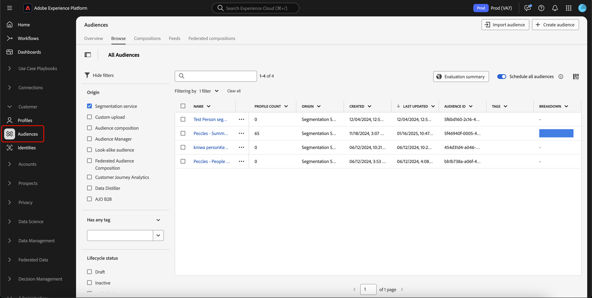

# Flexibele gids voor publieksevaluatie

>[!AVAILABILITY]
>
>De flexibele publieksevaluatie is **slechts** beschikbaar op instanties van Experience Platform die op [!DNL Microsoft Azure] lopen. Meer over de gesteunde infrastructuur van Experience Platform leren, zie het [ multi-wolkenoverzicht van Experience Platform ](../../landing/multi-cloud.md).
>
>Bovendien, is de flexibele publieksevaluatie **slechts** beschikbaar voor gebruik met Real-Time CDP B2C Edition.

Dankzij de flexibele publieksevaluatie kunt u een batchsegmentatietaak op aanvraag uitvoeren. Met flexibele publieksevaluatie, kunt u ad hoc campagnelanceringen, just-in-time mededelingen, of andere tijd-gevoelige activiteiten in werking stellen.

## Guardrails {#guardrails}

>[!CONTEXTUALHELP]
>id="platform_segmentation_browse_flexibleaudienceevaluation"
>title="Flexibele limieten voor publieksevaluatie"
>abstract="U kunt maximaal 20 soorten publiek evalueren in één flexibele evaluatieronde voor het publiek.<br/><br/> bovendien, terwijl de looppas van de evaluatietaak zo spoedig mogelijk is, kunnen er systeemvertragingen zijn die kunnen voorkomen aangezien de evaluaties op bestelling <b> niet </b> gelijktijdig met een andere op bestelling of partijevaluatie kunnen lopen."

Houd rekening met de volgende voorwaarden wanneer u een flexibele publieksevaluatie uitvoert:

- U kunt flexibele publieksevaluatie **tweemaal** per dag per zandbak slechts gebruiken. Deze limiet wordt opnieuw ingesteld op middernacht (UTC).
- U hebt a **maximum** van 50 flexibele de looppas van de publieksevaluatie per jaar per **productie** zandbak.
- U hebt a **maximum** van 100 flexibele de looppas van de publieksevaluatie per jaar per **ontwikkeling** zandbak.
- Al publiek **moet** een oorsprong van de &quot;Dienst van de Segmentatie&quot;hebben.
- Al publiek **moet** worden geëvalueerd gebruikend partijsegmentatie.
- Al publiek **moet** op mensen-gebaseerd publiek zijn.
- U kunt maximaal 20 soorten publiek selecteren per flexibele uitvoering van de publieksevaluatie.

>[!NOTE]
>
>U kunt extra flexibele evaluatierondes voor het publiek per jaar aanschaffen. Neem voor meer informatie contact op met de klantenservice van Adobe.

## Toegang {#access}

Om flexibele publieksevaluatie te gebruiken, moet u de volgende toestemming hebben:

- **[!UICONTROL Evaluate Segment to an Audience]** onder de **[!DNL Profile Management]** -sectie.

Voor meer informatie over op rol-gebaseerd toegangsbeheer, te lezen gelieve het [ overzicht van de toegangscontrole ](../../access-control/home.md).

## Flexibele publieksevaluatie uitvoeren

U kunt een flexibele publieksevaluatie uitvoeren met behulp van de Experience Platform API&#39;s of UI.

>[!BEGINTABS]

>[!TAB  Experience Platform APIs ]

Om een flexibele publieksevaluatie binnen Experience Platform APIs in werking te stellen, zult u een segmentbaan moeten creëren die identiteitskaarts van alle segmentdefinities (publiek) bevat u wilt evalueren.

>[!NOTE]
>
>U kunt a **maximum** van 20 segment slechts toevoegen definitie IDs per de vraag van de segmentbaan API.

U kunt een nieuwe segmentbaan tot stand brengen door een POST- verzoek aan het `/segment/jobs` eindpunt en met inbegrip van IDs van de segmentdefinities in het verzoeklichaam te doen.

+++Een voorbeeldverzoek om een nieuwe segmenttaak te maken

```shell
curl -X POST https://platform.adobe.io/data/core/ups/segment/jobs \
 -H 'Authorization: Bearer {ACCESS_TOKEN}' \
 -H 'Content-Type: application/json' \
 -H 'x-gw-ims-org-id: {ORG_ID}' \
 -H 'x-api-key: {API_KEY}' \
 -H 'x-sandbox-name: {SANDBOX_NAME}' \
 -d '[
    {
        "segmentId": "7863c010-e092-41c8-ae5e-9e533186752e"
    },
    {
        "segmentId": "07d39471-05d1-4083-a310-d96978fd7c85"
    }
 ]'
```

| Eigenschap | Beschrijving |
| -------- | ----------- |
| `segmentId` | De id van de segmentdefinitie die u wilt evalueren. Deze segmentdefinities kunnen tot verschillende samenvoegbeleidsregels behoren. |

+++

Een succesvolle reactie keert status 200 van HTTP met informatie over uw pas gecreëerde segmentbaan terug.

+++ Een voorbeeldreactie bij het maken van een nieuwe segmenttaak.

```json
{
    "id": "b31aed3d-b3b1-4613-98c6-7d3846e8d48f",
    "imsOrgId": "{ORG_ID}",
    "sandbox": {
        "sandboxId": "28e74200-e3de-11e9-8f5d-7f27416c5f0d",
        "sandboxName": "prod",
        "type": "production",
        "default": true
    },
    "profileInstanceId": "ups",
    "source": "api",
    "status": "PROCESSING",
    "batchId": "678f53bc-e21d-4c47-a7ec-5ad0064f8e4c",
    "computeJobId": 8811,
    "computeGatewayJobId": "9ea97b25-a0f5-410e-ae87-b2d85e58f399",
    "segments": [
        {
            "segmentId": "7863c010-e092-41c8-ae5e-9e533186752e",
            "segment": {
                "id": "7863c010-e092-41c8-ae5e-9e533186752e",
                "expression": {
                    "type": "PQL",
                    "format": "pql/json",
                    "value": "workAddress.country = \"US\""
                },
                "mergePolicyId": "25c548a0-ca7f-4dcd-81d5-997642f178b9",
                "mergePolicy": {
                    "id": "25c548a0-ca7f-4dcd-81d5-997642f178b9",
                    "version": 1
                }
            }
        },
        {
            "segmentId": "07d39471-05d1-4083-a310-d96978fd7c85",
            "segment": {
                "id": "07d39471-05d1-4083-a310-d96978fd7c85",
                "expression": {
                    "type": "PQL",
                    "format": "pql/json",
                    "value": "workAddress.country = \"US\""
                },
                "mergePolicyId": "25c548a0-ca7f-4dcd-81d5-997642f178b9",
                "mergePolicy": {
                    "id": "25c548a0-ca7f-4dcd-81d5-997642f178b9",
                    "version": 1
                }
            }
        }
    ],
    "metrics": {
        "totalTime": {
            "startTimeInMs": 1573203617195,
            "endTimeInMs": 1573204395655,
            "totalTimeInMs": 778460
        },
        "profileSegmentationTime": {
            "startTimeInMs": 1573204266727,
            "endTimeInMs": 1573204395655,
            "totalTimeInMs": 128928
        },
        "segmentedProfileCounter":{
            "7863c010-e092-41c8-ae5e-9e533186752e":1033
        },
        "segmentedProfileByNamespaceCounter":{
            "7863c010-e092-41c8-ae5e-9e533186752e":{
                "tenantiduserobjid":1033,
                "campaign_profile_mscom_mkt_prod2":1033
            }
        },
        "segmentedProfileByStatusCounter":{
            "7863c010-e092-41c8-ae5e-9e533186752e":{
                "exited":144646,
                "realized":2056
            }
        },
        "totalProfiles":13146432,
        "totalProfilesByMergePolicy":{
            "25c548a0-ca7f-4dcd-81d5-997642f178b9":13146432
        }
    },
    "requestId": "4e538382-dbd8-449e-988a-4ac639ebe72b-1573203600264",
    "schema": {
        "name": "_xdm.context.profile"
    },
    "properties": {
        "scheduleId": "4e538382-dbd8-449e-988a-4ac639ebe72b",
        "runId": "e6c1308d-0d4b-4246-b2eb-43697b50a149"
    },
    "_links": {
        "cancel": {
            "href": "/segment/jobs/b31aed3d-b3b1-4613-98c6-7d3846e8d48f",
            "method": "DELETE"
        },
        "checkStatus": {
            "href": "/segment/jobs/b31aed3d-b3b1-4613-98c6-7d3846e8d48f",
            "method": "GET"
        }
    },
    "updateTime": 1573204395000,
    "creationTime": 1573203600535,
    "updateEpoch": 1573204395
}
```

+++

Na het creëren van de segmentbaan, kunt u zijn status controleren door een GET- verzoek aan het `/segment/jobs` eindpunt te doen, die identiteitskaart van uw nieuw gecreëerde segmentbaan in de verzoekweg verstrekken.

+++Voorbeeldverzoek om een segmenttaak op te halen

```shell
curl -X GET https://platform.adobe.io/data/core/ups/segment/jobs/b31aed3d-b3b1-4613-98c6-7d3846e8d48f \
 -H 'Authorization: Bearer {ACCESS_TOKEN}' \
 -H 'x-gw-ims-org-id: {ORG_ID}' \
 -H 'x-api-key: {API_KEY}' \
 -H 'x-sandbox-name: {SANDBOX_NAME}'
```

+++

Een succesvolle reactie keert status 200 van HTTP met gedetailleerde informatie over de gespecificeerde segmentbaan terug.


+++ Een voorbeeldreactie voor het ophalen van een segmenttaak.

```json
{
    "id": "b31aed3d-b3b1-4613-98c6-7d3846e8d48f",
    "imsOrgId": "{ORG_ID}",
    "sandbox": {
        "sandboxId": "28e74200-e3de-11e9-8f5d-7f27416c5f0d",
        "sandboxName": "prod",
        "type": "production",
        "default": true
    },
    "profileInstanceId": "ups",
    "source": "api",
    "status": "SUCCEEDED",
    "batchId": "678f53bc-e21d-4c47-a7ec-5ad0064f8e4c",
    "computeJobId": 8811,
    "computeGatewayJobId": "9ea97b25-a0f5-410e-ae87-b2d85e58f399",
    "segments": [
        {
            "segmentId": "7863c010-e092-41c8-ae5e-9e533186752e",
            "segment": {
                "id": "7863c010-e092-41c8-ae5e-9e533186752e",
                "expression": {
                    "type": "PQL",
                    "format": "pql/text",
                    "value": "workAddress.country = \"US\""
                },
                "mergePolicyId": "25c548a0-ca7f-4dcd-81d5-997642f178b9",
                "mergePolicy": {
                    "id": "25c548a0-ca7f-4dcd-81d5-997642f178b9",
                    "version": 1
                }
            }
        },
        {
            "segmentId": "07d39471-05d1-4083-a310-d96978fd7c85",
            "segment": {
                "id": "07d39471-05d1-4083-a310-d96978fd7c85",
                "expression": {
                    "type": "PQL",
                    "format": "pql/json",
                    "value": "workAddress.country = \"US\""
                },
                "mergePolicyId": "25c548a0-ca7f-4dcd-81d5-997642f178b9",
                "mergePolicy": {
                    "id": "25c548a0-ca7f-4dcd-81d5-997642f178b9",
                    "version": 1
                }
            }
        }
    ],
    "metrics": {
        "totalTime": {
            "startTimeInMs": 1579304313411
        },
        "profileSegmentationTime": {}
    },
    "requestId": "4e538382-dbd8-449e-988a-4ac639ebe72b-1573203600264",
    "schema": {
        "name": "_xdm.context.profile"
    },
    "_links": {
        "cancel": {
            "href": "/segment/jobs/d3b4a50d-dfea-43eb-9fca-557ea53771fd",
            "method": "DELETE"
        },
        "checkStatus": {
            "href": "/segment/jobs/d3b4a50d-dfea-43eb-9fca-557ea53771fd",
            "method": "GET"
        }
    },
    "updateTime": 1579304339000,
    "creationTime": 1579304260897,
    "updateEpoch": 1579304339
}
```

+++

>[!TAB  UI van Experience Platform ]

Selecteer **[!UICONTROL Audiences]** in de sectie **[!UICONTROL Customers]** als u een flexibele publieksevaluatie wilt uitvoeren in de gebruikersinterface van Experience Platform.



Het Portaal van het Publiek wordt getoond, tonend een lijst van alle mensen publiek voor de organisatie. In het Portaal van de Publiek, kunt u de soorten publiek kiezen u evalueerde en selecteren **[!UICONTROL Evaluate audience]**.


Het pop-upmenu **[!UICONTROL Evaluate audiences on demand]** wordt weergegeven met de lijst met soorten publiek die worden geëvalueerd met de segmenttaak op aanvraag. Als een publiek niet in aanmerking komt om op verzoek te worden beoordeeld, zal het automatisch uit de evaluatietaak worden verwijderd. Bevestig dat het vermelde publiek het publiek is dat u wilt evalueren.


Nadat u hebt bevestigd dat het juiste publiek wordt vermeld, kunt u doorgaan met het verzoek en begint de flexibele publieksevaluatie. U kunt het statuut van deze publieksevaluatie in de [ controle van de evaluatietaak ](../../dataflows/ui/monitor-audiences.md#evaluation-job-details) bekijken.

>[!NOTE]
>
>De status van de segmenttaak kan worden gerapporteerd als in de status &quot;In wachtrij&quot; in het dashboard voor bewaking. U kunt de meest bijgewerkte status van de segmentbaan bekijken door een GET- verzoek aan het `/segment/jobs` eindpunt te doen, die identiteitskaart van de segmentbaan in de verzoekweg verstrekken. Meer informatie over het gebruik van dit eindpunt vindt u op het tabblad API.
>
>Als u een flexibele publieksevaluatie uitvoert en de evaluatie het publiek naar een bestemming wilt activeren, moet u ervoor zorgen dat de frequentie is ingesteld op **[!UICONTROL After segment evaluation]** . Het in werking stellen van flexibele publieksevaluatie op publiek die reeds om [ na segmentevaluatie ](../../destinations/ui/activate-batch-profile-destinations.md#export-full-files) worden geactiveerd, zal publiek activeren zodra de flexibele baan van de publieksevaluatie, ongeacht om het even welke vorige dagelijkse activeringstaken beëindigt.

>[!ENDTABS]

## Video {#video}

In de volgende video ziet u hoe u een flexibele publieksevaluatie in Experience Platform kunt openen en gebruiken.

>[!VIDEO](https://video.tv.adobe.com/v/3453640?)

## Veelgestelde vragen {#faq}

In de volgende sectie worden vaak gestelde vragen over een flexibele publieksevaluatie weergegeven.

### Hoe snel kan ik een publiek activeren met behulp van een flexibele publieksevaluatie?

+++ Antwoord

U kunt een publiek onmiddellijk na het maken activeren met behulp van een flexibele publieksevaluatie.

+++

### Hoe lang duurt een flexibele publieksevaluatie?

+++ Antwoord

Een flexibele evaluatietaak voor het publiek kan maximaal vier uur duren.

+++

### Kan ik het plannen met flexibele publieksevaluatie in werking stellen?

+++ Antwoord

Nr, is het plannen niet beschikbaar aan gebruik met flexibele publieksevaluatie.

+++

### Moet ik een extra uitvoerbaan in werking stellen wanneer het gebruiken van flexibele publieksevaluatie?

+++ Antwoord

Nee, de exporttaak wordt automatisch uitgevoerd nadat de bijbehorende segmenttaak is voltooid.

+++

### Welke diensten kan ik gebruiken publiek geëvalueerd met flexibele publieksevaluatie?

+++ Antwoord

U kunt het publiek gebruiken in alle downstreamdiensten, inclusief bestemmingen en Adobe Journey Optimizer-reizen.

+++

### Wanneer worden de grenzen van de flexibele publieksevaluatie opnieuw ingesteld?

+++ Antwoord

De daglimiet wordt ingesteld op middernacht (UTC). De jaarlijkse limiet wordt opnieuw ingesteld op de inschrijvingsdatum van uw contract.

+++

### Welke soorten publiek worden gesteund met flexibele publieksevaluatie?

+++ Antwoord

Alleen publiek met de oorsprong van Segmentation Service wordt ondersteund voor een flexibele publieksevaluatie. Andere doelgroepen, zoals composities, aangepaste upload of Data Distiller, worden niet ondersteund voor een flexibele publieksevaluatie.

+++

### Wat de looppas van de kijkcijfers van mijn flexibele publieksevaluatie bijdragen?

+++ Antwoord

De flexibele de looppas van de publieksevaluatie die of gebruikend API of de telling UI naar de maximumgrens werden gecreeerd. Nochtans, draagt de dagelijkse de baanlooppas van de partijsegmentatie die op een nachtelijke basis loopt **niet** aan deze grens bij.

+++

