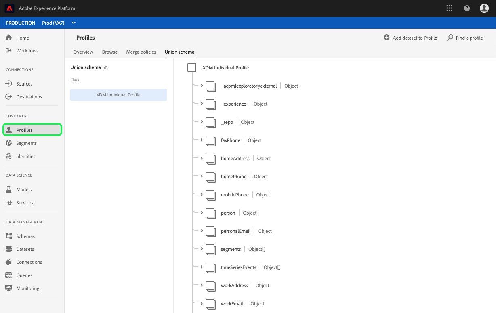
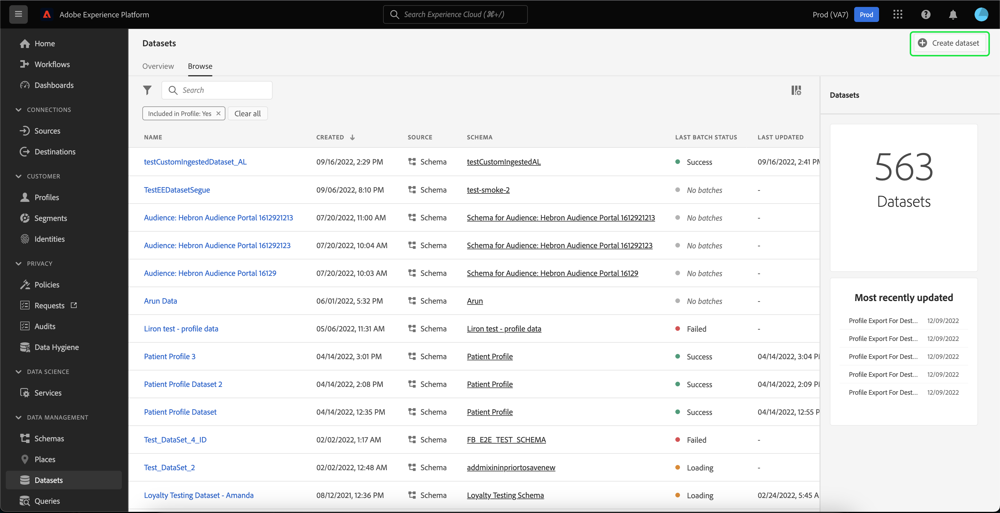
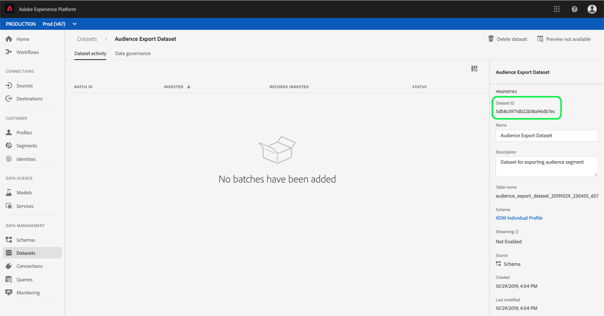

# Een dataset maken voor het exporteren van een publiekssegment

Met het Adobe Experience Platform kunt u klantprofielen eenvoudig segmenteren in soorten publiek op basis van specifieke kenmerken. Zodra de segmenten zijn gecreeerd, kunt u dat publiek naar een dataset uitvoeren waar het kan worden betreden en worden gehandeld. Opdat de uitvoer succesvol is, moet de dataset behoorlijk worden gevormd.

Deze zelfstudie doorloopt de stappen die nodig zijn om een dataset te maken die kan worden gebruikt voor het exporteren van een publiekssegment met behulp van de interface van het Experience Platform.

Deze zelfstudie houdt rechtstreeks verband met de stappen die in de zelfstudie worden beschreven voor het [evalueren van en het openen van segmentresultaten](./evaluate-a-segment.md). De evaluatie van een segmentleerprogramma verstrekt stappen voor het creëren van een dataset gebruikend de Catalogus API, terwijl dit leerprogramma schetst stappen om een dataset tot stand te brengen gebruikend het Platform van de Ervaring UI.

## Aan de slag

Om een segment uit te voeren, moet de dataset op het Schema van de Unie van het Individuele Profiel XDM worden gebaseerd. Een verenigingsschema is een systeem-geproduceerd, read-only schema dat de gebieden van alle schema&#39;s samenvoegt die de zelfde klasse delen, in dit geval dat de Individuele klasse van het Profiel XDM is. Voor meer informatie over de schema&#39;s van de verenigingsmening, te zien gelieve de sectie van het Profiel van de Klant in [real time van de Ontwikkelaar van het Registratie van het Schema gids](../../xdm/schema/composition.md#union).

Om verenigingsschema&#39;s in UI te bekijken, klik **Profielen** in de linkernavigatie, dan klik op het *Unieschema* tabel zoals hieronder getoond.

## Werkruimte Gegevensbestanden

De datasetwerkruimte binnen het Platform van de Ervaring UI staat u toe om alle datasets te bekijken en te beheren die uw organisatie IMS heeft gemaakt, evenals nieuwe te creëren.

Om de datasetwerkruimte te bekijken, klik **Datasets** in de linkernavigatie, dan klik op het *Browse* lusje. De werkruimte van datasets bevat een lijst van datasets, met inbegrip van kolommen die *Naam*, *Gemaakt* (datum en tijd), *Bron*, *Schema*, en de Status *van de*** Laatste Partij tonen, evenals de datum en de tijd de dataset werd Last Updated. Afhankelijk van de breedte van elke kolom moet u mogelijk naar links of rechts schuiven om alle kolommen weer te geven.

>[!NOTE] Klik op het filterpictogram naast de zoekbalk om filtermogelijkheden te gebruiken om alleen die datasets weer te geven die zijn ingeschakeld voor Real-time klantprofiel.

## Een gegevensset maken

Als u een gegevensset wilt maken, klikt u op Gegevensset **maken** in de rechterbovenhoek van de werkruimte Datasets.

Op het *Create scherm van de Dataset* , klik **Create Dataset van Schema** om verder te gaan.

## XDM Individueel profiel verenigingsschema selecteren

Als u het XDM Individual Profile Union-schema voor gebruik in uw gegevensset wilt selecteren, zoekt u het schema &quot;XDM Individual Profile&quot; met een type &quot;Union&quot; op het scherm *Select Schema* .

Selecteer het keuzerondje naast **XDM Individueel Profiel** en klik vervolgens op **Volgende** in de rechterbovenhoek.

## Gegevensset configureren

Op het **Configure scherm van de Dataset** , zult u uw dataset een *Naam* moeten geven en kan ook een *Beschrijving* van de dataset eveneens verstrekken.

**Opmerkingen over gegevenssetnamen:**
- De namen van gegevenssets moeten kort en beschrijvend zijn, zodat de gegevensset later gemakkelijk in de bibliotheek kan worden gevonden.
- Dataset-namen moeten uniek zijn, wat betekent dat ze ook specifiek genoeg moeten zijn om in de toekomst niet opnieuw te worden gebruikt.
- Het is beste praktijken om extra informatie over de dataset te verstrekken gebruikend het beschrijvingsgebied, aangezien het andere gebruikers kan helpen tussen datasets in de toekomst differentiëren.

Als de gegevensset een naam en een beschrijving heeft, klikt u op **Voltooien**.

## Gegevensactiviteit

Een lege dataset is nu gecreeerd en u bent teruggekeerd aan het lusje van de Activiteit *van de* Dataset in de werkruimte van Datasets. U zou de naam van de dataset in de upper-left hoek van de werkruimte, samen met een bericht moeten zien dat &quot;Geen partijen zijn toegevoegd.&quot; Dit moet worden verwacht aangezien u nog geen partijen aan deze dataset hebt toegevoegd.

Rechts in de werkruimte Datasets ziet u het tabblad **Info** met informatie over uw nieuwe gegevensset, zoals de id *van de* gegevensset, de *naam*, de *beschrijving*, de naam *van de* tabel, de naam ****** van deTabel, de combinatieSchema, de combinatieStreamingen deBron. Het tabblad Info bevat ook informatie over het tijdstip waarop de gegevensset is *gemaakt* en de datum waarop deze voor het *laatst is gewijzigd* .

Noteer de **gegevensset-id**, omdat deze waarde vereist is om de exportworkflow voor het publiekssegment te voltooien.

## Volgende stappen

Nu u een dataset hebt gecreeerd die op het Schema van de Vereniging van het Profiel van XDM Individueel wordt gebaseerd, kunt u identiteitskaart **van de** Dataset gebruiken om de [evaluatie voort te zetten en tot segment toegang te hebben resulterend](./evaluate-a-segment.md) leerprogramma.

Op dit ogenblik, gelieve terug te keren naar de evaluerende zelfstudie van segmentresultaten en uit XDM Individuele Profielen voor publieksleden [te](./evaluate-a-segment.md#generate-profiles-for-audience-members) produceren stap van het [uitvoeren van een segmentworkflow](./evaluate-a-segment.md#export-a-segment) op te halen.
