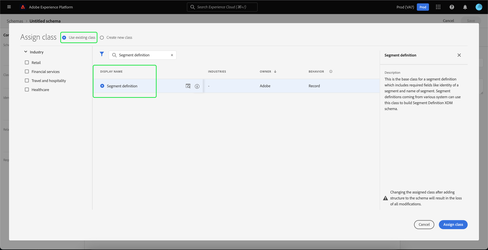

# Extern publiek importeren en gebruiken

Adobe Experience Platform ondersteunt de mogelijkheid om extern publiek te importeren. Dit kan vervolgens worden gebruikt als componenten voor een nieuwe segmentdefinitie. Dit document bevat een zelfstudie voor het instellen van een Experience Platform voor het importeren en gebruiken van externe doelgroepen.

## Aan de slag

- [Segmenteringsservice](../home.md): Staat u toe om publiekssegmenten van de gegevens van het Profiel van de Klant in real time te bouwen.
- [Klantprofiel](../../profile/home.md) in realtime: Verstrekt een verenigd, real-time consumentenprofiel dat op bijeengevoegde gegevens van veelvoudige bronnen wordt gebaseerd.
- [XDM (Experience Data Model)](../../xdm/home.md): Het gestandaardiseerde kader waardoor het Platform gegevens van de klantenervaring organiseert.
- [Gegevenssets](../../catalog/datasets/overview.md): De opslag- en beheerconstructie voor gegevenspersistentie in Experience Platform.
- [Streaming opname](../../ingestion/streaming-ingestion/overview.md): Hoe Experience Platform gegevens van client- en server-side apparaten in real-time opneemt en opslaat.

## Een naamruimte voor identiteit maken voor het externe publiek

De eerste stap voor het gebruik van externe doelgroepen is het maken van een naamruimte voor identiteiten. Identiteitsnaamruimten maken het Platform mogelijk te koppelen van waaruit een segment afkomstig is.

Als u een naamruimte voor identiteiten wilt maken, volgt u de instructies in de hulplijn [Naamnaamruimte](../../identity-service/namespaces.md#manage-namespaces). Wanneer het creëren van uw identiteitsnamespace, voeg de brondetails aan identiteitsnamespace toe, en merk zijn [!UICONTROL Type] als **[!UICONTROL Geen herkenningsteken]**.

## Een schema maken voor de metagegevens van het segment

Nadat u een naamruimte voor identiteiten hebt gemaakt, moet u een nieuw schema maken voor het segment dat u wilt maken.

Als u wilt beginnen met het samenstellen van een schema, selecteert u eerst **[!UICONTROL Schemas]** op de linkernavigatiebalk, gevolgd door **[!UICONTROL Schema maken]** in de rechterbovenhoek van de werkruimte Schemas. Van hier, uitgezocht **[!UICONTROL doorblader]** om een volledige selectie van de beschikbare types van Schema te zien.

Aangezien u een segmentdefinitie creeert, die een vooraf bepaalde klasse is, selecteer **[!UICONTROL Bestaande klasse gebruiken]**. Selecteer nu de **[!UICONTROL Segmentdefinitie]**-klasse, gevolgd door **[!UICONTROL Klasse toewijzen]**.

Nu uw schema is gecreeerd, zult u moeten specificeren welk gebied segmentidentiteitskaart zal bevatten. Dit veld moet worden gemarkeerd als de primaire identiteit en worden toegewezen aan de naamruimten die u eerder hebt gemaakt.

Nadat u het veld `_id` hebt gemarkeerd als de primaire identiteit, selecteert u de titel van het schema, gevolgd door de schakeloptie met het label **[!UICONTROL Profile]**. Selecteer **[!UICONTROL Inschakelen]** om het schema in te schakelen voor [!DNL Real-time Customer Profile].

Dit schema is nu ingeschakeld voor Profiel, waarbij de primaire identificatie is toegewezen aan de naamruimte voor niet-persoonlijke identiteit die u hebt gemaakt. Dientengevolge, betekent dit dat de segmentmeta-gegevens die in Platform worden ingevoerd gebruikend dit schema in Profiel zullen worden opgenomen zonder met andere op mensen betrekking hebbende gegevens van het Profiel worden samengevoegd.

## Creeer een dataset voor het schema

Na het vormen van het schema, zult u een dataset voor de segmentmeta-gegevens moeten tot stand brengen.

Om een dataset tot stand te brengen, volg de instructies in [dataset gebruikersgids](../../catalog/datasets/user-guide.md#create). U zult **[!UICONTROL dataset van schema]** optie willen volgen, gebruikend het schema u eerder creeerde.

Na het creëren van de dataset, volg de instructies in [dataset gebruikersgids](../../catalog/datasets/user-guide.md#enable-profile) om deze dataset voor het Profiel van de Klant in real time toe te laten.

## Gebruikersgegevens instellen en importeren

Met toegelaten dataset, kunnen de gegevens nu naar Platform of door UI of het gebruiken van Experience Platform APIs worden verzonden. Als u deze gegevens in het Platform wilt invoeren, moet u een streamingverbinding maken.

Als u een streamingverbinding wilt maken, volgt u de instructies in de [API-zelfstudie](../../sources/tutorials/api/create/streaming/http.md) of de [UI-zelfstudie](../../sources/tutorials/ui/create/streaming/http.md).

Nadat u een streamingverbinding hebt gemaakt, hebt u toegang tot het unieke streamingeindpunt waarnaar u de gegevens kunt verzenden. Lees de [zelfstudie over het streamen van recordgegevens](../../ingestion/tutorials/streaming-record-data.md#ingest-data) voor meer informatie over het verzenden van gegevens naar deze eindpunten.

## Segmenten samenstellen met behulp van geïmporteerde soorten publiek

Zodra het geïmporteerde publiek is ingesteld, kunnen deze worden gebruikt als onderdeel van het segmenteringsproces. Als u een extern publiek wilt zoeken, gaat u naar de Segment Builder en selecteert u **[!UICONTROL Soorten publiek]** tabblad in de sectie **[!UICONTROL Velden]**.

## Volgende stappen

Nu u externe doelgroepen in uw segmenten kunt gebruiken, kunt u de Bouwer van het Segment gebruiken om segmenten tot stand te brengen. Lees de [zelfstudie over het maken van segmenten](./create-a-segment.md) voor meer informatie over het maken van segmenten.