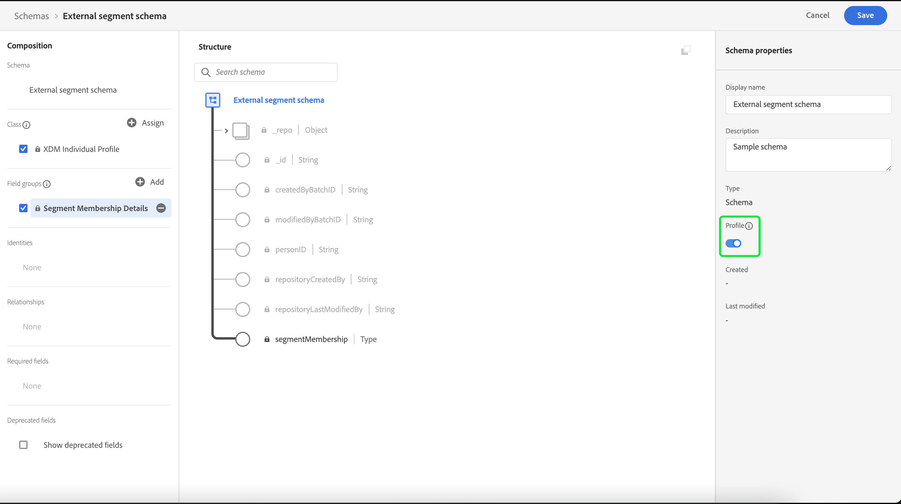

# Extern publiek importeren en gebruiken

>[!IMPORTANT]
>
>Deze documentatie bevat informatie uit een vorige versie van de documentatie van het publiek en is daarom verouderd.

Adobe Experience Platform ondersteunt de mogelijkheid om extern publiek te importeren. Dit kan vervolgens worden gebruikt als componenten voor een nieuw publiek. Dit document bevat een zelfstudie voor het instellen van Experience Platform voor het importeren en gebruiken van externe doelgroepen.

## Aan de slag

Deze zelfstudie vereist een goed begrip van de verschillende [!DNL Adobe Experience Platform] -services die betrokken zijn bij het maken van een publiek. Voordat u met deze zelfstudie begint, raadpleegt u de documentatie voor de volgende services:

- [ de Dienst van de Segmentatie ](../home.md): Staat u toe om publiek van de gegevens van het Profiel van de Klant in real time te bouwen.
- [ Real-Time Profiel van de Klant ](../../profile/home.md): Verstrekt een verenigd, real-time consumentenprofiel dat op samengevoegde gegevens van veelvoudige bronnen wordt gebaseerd.
- [ Model van de Gegevens van de Ervaring (XDM) ](../../xdm/home.md): Het gestandaardiseerde kader waardoor Experience Platform gegevens van de klantenervaring organiseert. Om het beste gebruik van Segmentatie te maken, gelieve te verzekeren uw gegevens als profielen en gebeurtenissen volgens de [ beste praktijken voor gegevens modellering ](../../xdm/schema/best-practices.md) worden opgenomen.
- [ Datasets ](../../catalog/datasets/overview.md): De opslag en beheersconstructie voor gegevenspersistentie in Experience Platform.
- [ Streaming opname ](../../ingestion/streaming-ingestion/overview.md): Hoe Experience Platform gegevens van cliënt en server-zijapparaten in real time opneemt en opslaat.

### Publiek versus segmentdefinities

Voordat u begint met het importeren en gebruiken van externe doelgroepen, is het belangrijk dat u het verschil begrijpt tussen publiek- en segmentdefinities.

Het publiek verwijst naar de groep profielen waarnaar u probeert te filteren. Wanneer het gebruiken van segmentdefinities, kunt u een publiek tot stand brengen door een segmentdefinitie te creëren die uw profielen aan de ondergroep filtert die aan de criteria van de segmentkwalificatie voldoet.

Segmentdefinities bevatten informatie zoals de naam, beschrijving, expressie (indien van toepassing), de aanmaakdatum, de laatst gewijzigde datum en een id. De id koppelt de segmentmetagegevens aan de afzonderlijke profielen die voldoen aan de segmentkwalificatie en die deel uitmaken van het resulterende publiek.

| Doelgroepen | Segmentdefinitie |
| --------- | ---------------- |
| De groep profielen die u zoekt. Wanneer het gebruiken van segmentdefinities, betekent dit dat het de groep profielen zal zijn die segmentkwalificatie ontmoeten. | De groep regels gebruikte om het publiek te segmenteren u zoekt. |

## Een naamruimte voor identiteit maken voor het externe publiek

De eerste stap voor het gebruik van externe doelgroepen is het maken van een naamruimte voor identiteiten. Met naamruimten kan Experience Platform aangeven waar een publiek vandaan komt.

Om een identiteit te creëren namespace, volg de instructies in de [ gids van identiteitskaart namespace ](../../identity-service/features/namespaces.md#manage-namespaces). Wanneer u uw naamruimte voor identiteiten maakt, voegt u de brongegevens toe aan de naamruimte identity en markeert u de naamruimte [!UICONTROL Type] als een **[!UICONTROL Non-people identifier]** .


## Een schema maken voor de metagegevens van het segment

Nadat u een naamruimte voor identiteiten hebt gemaakt, moet u een nieuw schema maken voor het segment dat u wilt maken.

Als u wilt beginnen met het samenstellen van een schema, selecteert u eerst **[!UICONTROL Schemas]** op de linkernavigatiebalk, gevolgd door **[!UICONTROL Create schema]** in de rechterbovenhoek van de werkruimte Schema. Selecteer **[!UICONTROL Browse]** om een volledige selectie van de beschikbare schematypen weer te geven.


Aangezien u een segmentdefinitie maakt, die een vooraf gedefinieerde klasse is, selecteert u **[!UICONTROL Use existing class]** . Selecteer nu de klasse **[!UICONTROL Segment definition]** , gevolgd door **[!UICONTROL Assign class]** .


Nu uw schema is gecreeerd, zult u moeten specificeren welk gebied segmentidentiteitskaart zal bevatten. Dit veld moet worden gemarkeerd als de primaire identiteit en worden toegewezen aan de naamruimten die u eerder hebt gemaakt.


Nadat u het veld `_id` hebt gemarkeerd als de primaire identiteit, selecteert u de titel van het schema, gevolgd door de schakeloptie met het label **[!UICONTROL Profile]** . Selecteer **[!UICONTROL Enable]** om het schema in te schakelen voor [!DNL Real-Time Customer Profile] .


Dit schema is nu ingeschakeld voor Profiel, waarbij de primaire identificatie is toegewezen aan de naamruimte voor niet-persoonlijke identiteit die u hebt gemaakt. Dit betekent dat segmentmetagegevens die met dit schema in Experience Platform zijn geïmporteerd, in het profiel worden opgenomen zonder te worden samengevoegd met andere gegevens van het profiel voor personen.

## Creeer een dataset voor het schema

Na het vormen van het schema, zult u een dataset voor de segmentmeta-gegevens moeten tot stand brengen.

Om een dataset tot stand te brengen, volg de instructies in de [ gids van de datasetgebruiker ](../../catalog/datasets/user-guide.md#create). Volg de optie **[!UICONTROL Create dataset from schema]** met het eerder gemaakte schema.


Na het creëren van de dataset, ga na de instructies in de [ gids van de datasetgebruiker ](../../catalog/datasets/user-guide.md#enable-profile) verder om deze dataset voor het Profiel van de Klant in real time toe te laten.


## Gebruikersgegevens instellen en importeren

Als de gegevensset is ingeschakeld, kunnen gegevens nu naar Experience Platform worden verzonden via de gebruikersinterface of met de Experience Platform API&#39;s. U kunt deze gegevens via een batch- of streamingverbinding invoeren.

### Gegevens opnemen met een batchverbinding

Om een partijverbinding tot stand te brengen, kunt u de instructies in de generische [ lokale gids van de dossierupload UI ](../../sources/tutorials/ui/create/local-system/local-file-upload.md) volgen. Voor een volledige lijst van beschikbare bronnen die u ingeste gegevens met kunt gebruiken, te lezen gelieve het [ overzicht van bronnen ](../../sources/home.md).

### Gegevens verzamelen met behulp van een streamingverbinding

Om een het stromen verbinding tot stand te brengen, kunt u de instructies in of het [ API leerprogramma ](../../sources/tutorials/api/create/streaming/http.md) of het [ leerprogramma UI ](../../sources/tutorials/ui/create/streaming/http.md) volgen.

Nadat u een streamingverbinding hebt gemaakt, hebt u toegang tot het unieke streamingeindpunt waarnaar u de gegevens kunt verzenden. Leren hoe te om gegevens naar deze eindpunten te verzenden, te lezen gelieve het [ leerprogramma op het stromen verslaggegevens ](../../ingestion/tutorials/streaming-record-data.md#ingest-data).


## Structuur van metagegevens voor het publiek

Nadat u een verbinding hebt gemaakt, kunt u uw gegevens nu opnemen in Experience Platform.

Hieronder ziet u een voorbeeld van de metagegevens van de externe doelgroep:

```json
{
    "header": {
        "schemaRef": {
            "id": "https://ns.adobe.com/{TENANT_ID}/schemas/{SCHEMA_ID}",
            "contentType": "application/vnd.adobe.xed-full+json;version=1"
        },
        "imsOrgId": "{ORG_ID}",
        "datasetId": "{DATASET_ID}",
        "source": {
            "name": "Sample External Audience"
        }
    },
    "body": {
        "xdmMeta": {
            "schemaRef": {
                "id": "https://ns.adobe.com/{TENANT_ID}/schemas/{SCHEMA_ID}",
                "contentType": "application/vnd.adobe.xed-full+json;version=1"
            }
        },
        "xdmEntity": {
            "_id": "{SEGMENT_ID}",
            "description": "Sample description",
            "identityMap": {
                "{IDENTITY_NAMESPACE}": [{
                    "id": "{}"
                }]
            },
            "segmentName" : "{SEGMENT_NAME}",
            "segmentStatus": "ACTIVE",
            "version": "1.0"
        }
    }
}
```

| Eigenschap | Beschrijving |
| -------- | ----------- |
| `schemaRef` | Het schema **moet** naar het eerder gecreeerde schema voor de segmentmeta-gegevens verwijzen. |
| `datasetId` | De dataset identiteitskaart **moet** naar de eerder gecreeerde dataset voor het schema verwijzen u enkel creeerde. |
| `xdmEntity._id` | Identiteitskaart **moet** naar zelfde segmentidentiteitskaart verwijzen u als uw extern publiek gebruikt. |
| `xdmEntity.identityMap` | Deze sectie **moet** het identiteitsetiket bevatten dat wanneer het creëren van eerder gecreeerde namespace wordt gebruikt. |
| `{IDENTITY_NAMESPACE}` | Dit is het label van de eerder gemaakte naamruimte voor identiteit. Als u bijvoorbeeld uw naamruimte ExternalAudience hebt aangeroepen, gebruikt u die als de sleutel van de array. |
| `segmentName` | De naam van het segment waarop u het externe publiek wilt segmenteren. |

## Segmenten samenstellen met behulp van geïmporteerde soorten publiek

Zodra het geïmporteerde publiek is ingesteld, kunnen deze worden gebruikt als onderdeel van het segmenteringsproces. Als u een extern publiek wilt zoeken, gaat u naar de Segment Builder en selecteert u de tab **[!UICONTROL Audiences]** in de sectie **[!UICONTROL Fields]** .


## Volgende stappen

Nu u externe doelgroepen in uw segmenten kunt gebruiken, kunt u de Bouwer van het Segment gebruiken om segmenten tot stand te brengen. Leren hoe te om segmenten tot stand te brengen, te lezen gelieve het [ leerprogramma bij het creëren van segmenten ](./create-a-segment.md).

## Bijlage

Naast het gebruik van geïmporteerde metagegevens voor het externe publiek en het gebruik ervan voor het maken van segmenten, kunt u ook externe segmentlidmaatschappen importeren naar Experience Platform.

### Een extern bestemmingsschema voor een segmentlidmaatschap instellen

Als u wilt beginnen met het samenstellen van een schema, selecteert u eerst **[!UICONTROL Schemas]** op de linkernavigatiebalk, gevolgd door **[!UICONTROL Create schema]** in de rechterbovenhoek van de werkruimte Schema. Selecteer **[!UICONTROL XDM Individual Profile]** van hier.


Nu het schema is gecreeerd, zult u de het gebiedsgroep van het segmentlidmaatschap als deel van het schema moeten toevoegen. Selecteer hiervoor [!UICONTROL Segment Membership Details], gevolgd door [!UICONTROL Add field groups] .


Controleer bovendien of het schema is gemarkeerd voor **[!UICONTROL Profile]** . Hiervoor moet u een veld markeren als de primaire identiteit.



### De gegevensset instellen

Na het creëren van uw schema, zult u een dataset moeten tot stand brengen.

Om een dataset tot stand te brengen, volg de instructies in de [ gids van de datasetgebruiker ](../../catalog/datasets/user-guide.md#create). Volg de optie **[!UICONTROL Create dataset from schema]** met het eerder gemaakte schema.


Na het creëren van de dataset, ga na de instructies in de [ gids van de datasetgebruiker ](../../catalog/datasets/user-guide.md#enable-profile) verder om deze dataset voor het Profiel van de Klant in real time toe te laten.


## Externe gegevens voor publieksleden instellen en importeren

Als de gegevensset is ingeschakeld, kunnen gegevens nu naar Experience Platform worden verzonden via de gebruikersinterface of met de Experience Platform API&#39;s. U kunt deze gegevens via een batch- of streamingverbinding invoeren.

### Gegevens opnemen met een batchverbinding

Om een partijverbinding tot stand te brengen, kunt u de instructies in de generische [ lokale gids van de dossierupload UI ](../../sources/tutorials/ui/create/local-system/local-file-upload.md) volgen. Voor een volledige lijst van beschikbare bronnen die u ingeste gegevens met kunt gebruiken, te lezen gelieve het [ overzicht van bronnen ](../../sources/home.md).

### Gegevens verzamelen met behulp van een streamingverbinding

Om een het stromen verbinding tot stand te brengen, kunt u de instructies in of het [ API leerprogramma ](../../sources/tutorials/api/create/streaming/http.md) of het [ leerprogramma UI ](../../sources/tutorials/ui/create/streaming/http.md) volgen.

Nadat u een streamingverbinding hebt gemaakt, hebt u toegang tot het unieke streamingeindpunt waarnaar u de gegevens kunt verzenden. Leren hoe te om gegevens naar deze eindpunten te verzenden, te lezen gelieve het [ leerprogramma op het stromen verslaggegevens ](../../ingestion/tutorials/streaming-record-data.md#ingest-data).


## Segmentlidmaatschapsstructuur

Nadat u een verbinding hebt gemaakt, kunt u uw gegevens nu opnemen in Experience Platform.

Hieronder ziet u een voorbeeld van de downloadbelasting voor het externe publiek:

```json
{
    "header": {
        "schemaRef": {
            "id": "https://ns.adobe.com/{TENANT_ID}/schemas/{SCHEMA_ID}",
            "contentType": "application/vnd.adobe.xed-full+json;version=1"
        },
        "imsOrgId": "{ORG_ID}",
        "datasetId": "{DATASET_ID}",
        "source": {
            "name": "Sample External Audience Membership"
        }
    },
    "body": {
        "xdmMeta": {
            "schemaRef": {
                "id": "https://ns.adobe.com/{TENANT_ID}/schemas/{SCHEMA_ID}",
                "contentType": "application/vnd.adobe.xed-full+json;version=1"
            }
        },
        "xdmEntity": {
            "_id": "{UNIQUE_ID}",
            "description": "Sample description",
            "{TENANT_NAME}": {
                "identities": {
                    "{SCHEMA_IDENTITY}": "sample-id"
                }
            },
            "personId" : "sample-name",
            "segmentMembership": {
                "{IDENTITY_NAMESPACE}": {
                    "{EXTERNAL_IDENTITY}": {
                        "status": "realized",
                        "lastQualificationTime": "2022-03-14T:00:00:00Z"
                    }
                }
            }
        }
    }
}
```

| Eigenschap | Beschrijving |
| -------- | ----------- |
| `schemaRef` | Het schema **moet** naar het eerder gecreeerde schema voor de gegevens van het segmentlidmaatschap verwijzen. |
| `datasetId` | Identiteitskaart van de dataset **moet** naar de eerder gecreeerde dataset voor het lidmaatschapsschema verwijzen u enkel creeerde. |
| `xdmEntity._id` | Een geschikte id die wordt gebruikt om de record in de gegevensset op unieke wijze te identificeren. |
| `{TENANT_NAME}.identities` | Deze sectie wordt gebruikt om de het gebiedsgroep van douaneidentiteiten met de gebruikers te verbinden u eerder invoerde. |
| `segmentMembership.{IDENTITY_NAMESPACE}` | Dit is het label van de eerder gemaakte naamruimte voor aangepaste identiteit. Als u bijvoorbeeld uw naamruimte ExternalAudience hebt aangeroepen, gebruikt u die als de sleutel van de array. |

>[!NOTE]
>
>Externe publieksleden worden standaard na 30 dagen verwijderd. Als u wilt voorkomen dat bestanden worden verwijderd en langer dan 30 dagen wilt behouden, gebruikt u het veld `validUntil` terwijl u uw publieksgegevens opneemt. Voor meer informatie over dit gebied, te lezen gelieve de gids over [ het schemagroepen van de Details van het Lidmaatschap van het Segment ](../../xdm/field-groups/profile/segmentation.md).
