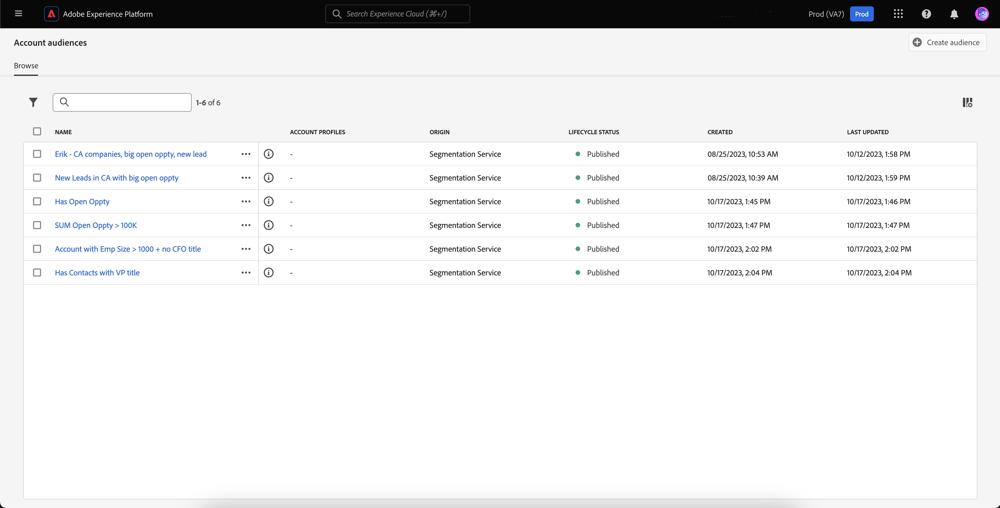
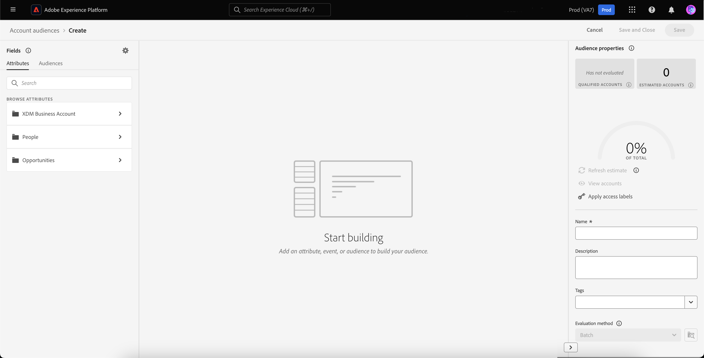

# Accountdoelgroepen

>[!AVAILABILITY]
>
>Het publiek van de rekening is slechts beschikbaar in [&#x200B; B2B edition van Real-Time Customer Data Platform &#x200B;](../../rtcdp/overview.md#rtcdp-b2b) en de [&#x200B; B2P Uitgave van Real-Time Customer Data Platform &#x200B;](../../rtcdp/overview.md#rtcdp-b2p).

Met de segmentatie van uw account kunt u in Adobe Experience Platform de volledige versnelling en verfijning van de segmentatieervaring van marketingmedewerkers van op mensen gebaseerde doelgroepen naar op account gebaseerde doelgroepen brengen.

Accountpubliek kan worden gebruikt als input voor op account gebaseerde bestemmingen, zodat u zich kunt richten op de personen binnen die accounts in downstreamservices. Bijvoorbeeld, kunt u op rekening-gebaseerde publiek gebruiken om verslagen van alle rekeningen terug te winnen die **&#x200B;**&#x200B;geen contactinformatie voor om het even welke mensen met de titel HoofdWerkende Functionaris (COO) of HoofdMarketingFunctionaris (CMO) hebben.

>[!NOTE]
>
>Als onderdeel van de B2B-architectuurupgrade worden de schattingen van de publieksgrootte voor soorten publiek met B2B-entiteiten nu precies berekend. Deze schattingen zijn beschikbaar tijdens de voorvertoning en bieden nauwkeurigere en betrouwbaardere inzichten voor het publiek dat complexe B2B-relaties omvat.   voor meer informatie, lees het [&#x200B; overzicht van de de architectuurverbeteringen van Real-Time CDP B2B edition &#x200B;](../../rtcdp/b2b-architecture-upgrade.md).

## Terminologie {#terminology}

Voordat u aan de slag gaat met het publiek van de account, bekijkt u eerst de verschillen tussen de verschillende soorten publiek:

- **publiek van de Rekening**: Een rekeningspubliek is een publiek dat gebruikend **rekening** profielgegevens wordt gecreeerd. Accountprofielgegevens kunnen worden gebruikt om een publiek te maken dat zich richt op personen binnen downstreamaccounts. Voor meer informatie over rekeningsprofielen, te lezen gelieve het [&#x200B; overzicht van het rekeningsprofiel &#x200B;](../../rtcdp/accounts/account-profile-overview.md).
- **publiek van Mensen**: Een publiek van de mensen is een publiek dat gebruikend **klant** profielgegevens wordt gecreeerd. De profielgegevens van de klant kunnen worden gebruikt om publiek tot stand te brengen dat op de klantenkring van uw zaken gericht is. Voor meer informatie over klantenprofielen, te lezen gelieve het [&#x200B; overzicht van het Profiel van de Klant in real time &#x200B;](../../profile/home.md).
- **het publiek van het Vooruitzicht**: Een perspectiefpubliek is een publiek dat gebruikend **het profielgegevens van het vooruitzicht** wordt gecreeerd. Met profielgegevens kan een publiek van niet-geverifieerde gebruikers worden gemaakt. Voor meer informatie over perspectiefprofielen, gelieve het [&#x200B; overzicht van het perspectiefprofiel &#x200B;](../../profile/ui/prospect-profile.md) te lezen.

## Toegang {#access}

Selecteer **[!UICONTROL Audiences]** in de **[!UICONTROL Accounts]** -sectie om toegang te krijgen tot het accountpubliek.

De pagina [!UICONTROL Browse] wordt weergegeven met een lijst van alle accountsoorten voor de organisatie.

Deze weergave bevat informatie over het publiek, zoals de naam, het aantal profielen, de oorsprong, de levenscyclusstatus, de datum waarop deze is gemaakt en de datum waarop deze voor het laatst is bijgewerkt.

U kunt ook de functie voor zoeken en filteren gebruiken om snel naar specifieke accountsoorten te zoeken en deze te sorteren. Meer informatie over deze eigenschap kan in het [&#x200B; Poortoverzicht van het Poort van het Publiek &#x200B;](../ui/audience-portal.md#manage-audiences) worden gevonden.

## publiek maken {#create}

>[!NOTE]
>
>Het publiek van de rekening wordt geëvalueerd gebruikend **partij** segmentatie, en zal om de 24 uur worden geëvalueerd.

Selecteer **[!UICONTROL Create audience]** op de [!UICONTROL Browse] -pagina om een accountpubliek te maken.

![&#x200B; de [!UICONTROL Create audience] knoop wordt benadrukt op het verslagpubliek doorbladert pagina.](../images/types/account/select-create-audience.png)

De Segment Builder wordt weergegeven. De accountkenmerken en het publiek worden weergegeven op de linkernavigatiebalk. Onder het tabblad [!UICONTROL Attributes] kunt u door Experience-Platform gemaakte en aangepaste kenmerken toevoegen.

Onder het tabblad [!UICONTROL Audiences] kunt u eerder gemaakte, op personen gebaseerde soorten publiek toevoegen om van af te bouwen bij het maken van uw eigen accountpubliek.

Voor meer informatie bij het gebruiken van de Bouwer van het Segment, te lezen gelieve de [&#x200B; gids UI van de Bouwer van het Segment &#x200B;](../ui/segment-builder.md).

### Relaties tot stand brengen {#relationships}

Door gebrek voor rekeningspubliek, toont de Bouwer UI van het Segment de directe verhouding tussen een rekening en een persoon. Andere relatietypen zijn echter beschikbaar voor accountpubliek.

Om de afwisselende relatietypen te gebruiken, selecteer .

Selecteer op het tabblad [!UICONTROL Settings] de optie **[!UICONTROL Show relationship selectors]** in de sectie **[!UICONTROL Relationship of fields]** .

Selecteer  opnieuw om aan het [!UICONTROL Fields] lusje terug te keren. U kunt nu de sectie **[!UICONTROL Establish relationships]** zien, waarmee u kunt bepalen hoe de account is verbonden met de persoon en hoe de persoon is verbonden met de mogelijkheid.

Wanneer u een verbinding maakt tussen de account en de persoon, kunt u uit de volgende opties kiezen:

| Optie | Beschrijving |
| ------ | ----------- |
| Directe relatie | De directe verbinding tussen de account en de persoon. Hiermee wordt opgegeven naar welke accounts elke persoon wordt gekoppeld via de array van `accountID` -waarden in de `personComponents` -array in het persoonlijke schema. Dit pad wordt het vaakst gebruikt. |
| Relatie tussen rekeninghouders | De relatie tussen de account en de persoon, die wordt gedefinieerd door het object `accountPersonRelation` . Met dit pad kan elke persoon ook verbinding maken met meerdere accounts. Het wordt gebruikt wanneer uw organisatie een expliciete relatietabel van uw brongegevens heeft bepaald. |
| Opportunity-relatie | De relatie tussen de opportuniteit en de persoon, die wordt gedefinieerd door het object `opportunityPersonRelation` . Dit verbindt de persoon met een rekening door van de opportuniteit naar de kans naar de rekening te gaan. Hier kunt u beschrijven bij welke bedrijven de persoon kansen heeft. |

Wanneer u de mogelijkheid verbindt met de persoon, kunt u uit de volgende opties kiezen:

| Optie | Beschrijving |
| ------ | ----------- |
| Account | De directe verbinding tussen de account en de opportunity. Wanneer u dit in een accountpubliek gebruikt, verbindt dit pad alle mensen in het bedrijf met de mogelijkheid. |
| Opportunity-relatie | De relatie tussen de opportuniteit en de persoon, die is gebaseerd op het opportuniteobject. Deze weg verbindt slechts mensen die specifiek als betrokken bij een kans aan die kans zijn geïdentificeerd. |

Na het vestigen van de gewenste verhouding, kunt u de vereiste mensen-publiek aan uw segmentdefinitie toevoegen.

## Het publiek activeren {#activate}

>[!NOTE]
>
>Slechts een beperkt aantal bestemmingen steunt rekeningspubliek. Zorg ervoor dat de bestemming die u wilt activeren, het accountpubliek ondersteunt voordat u doorgaat met dit proces.

Nadat u het publiek van uw account hebt gemaakt, kunt u het publiek activeren voor andere downstreamservices.

Selecteer het publiek dat u wilt activeren, gevolgd door **[!UICONTROL Activate to destination]** .

![&#x200B; de [!UICONTROL Activate to destination] knoop wordt benadrukt in het snelle actiemenu voor het geselecteerde publiek.](../images/types/account/activate.png)

De pagina [!UICONTROL Activate destination] wordt weergegeven. Voor meer informatie over het activeringsproces, met inbegrip van gesteunde bestemmingen en details op gebiedsafbeeldingen, te lezen gelieve [&#x200B; accountpubliek &#x200B;](/help/destinations/ui/activate-account-audiences.md) leerprogramma activeren.

## Volgende stappen {#next-steps}

Na het lezen van deze handleiding hebt u nu een beter inzicht in hoe u uw accountpubliek kunt maken en gebruiken in Adobe Experience Platform. Leren hoe te om andere soorten publiek in Experience Platform te gebruiken, te lezen gelieve het [&#x200B; overzicht van het publiekstype &#x200B;](./overview.md).

## Bijlage {#appendix}

In de volgende sectie vindt u aanvullende informatie over het accountpubliek.

### Validatie van accountsegmentatie {#validation}

>[!CONTEXTUALHELP]
>id="platform_audiences_account_constraint_eventLookbackWindow"
>title="Venster Opzoeken"
>abstract="Gebruik het terugkijkvenster om de volledige geschiedenis van persoon-vlakke gebeurtenissen te bekijken."

>[!CONTEXTUALHELP]
>id="platform_audiences_account_constraint_combinationMaxDepth"
>title="Maximale diepte van geneste container"
>abstract="De maximumdiepte van genestelde containers is **5**. Dit betekent dat u **niet** meer dan vijf genestelde containers kunt hebben wanneer het creëren van uw publiek."

>[!CONTEXTUALHELP]
>id="platform_audiences_account_constraint_combinationMaxBreadth"
>title="Fout in maximumaantal regels"
>abstract="Het maximumaantal regels binnen één enkele container is **5**. Dit betekent u dat u **niet** meer dan vijf regels binnen één enkele container kan hebben wanneer het creëren van uw publiek."

>[!CONTEXTUALHELP]
>id="platform_audiences_account_constraint_crossEntityMaxDepth"
>title="Fout in maximumbedrag van entiteit"
>abstract="Het maximumaantal dwars entiteiten die binnen één enkel publiek kunnen worden gebruikt is **5**. Een kruisentiteit is wanneer u tussen verschillende entiteiten in uw publiek verandert. Bijvoorbeeld, ga van een Rekening naar een Persoon aan een Lijst van de Marketing."

>[!CONTEXTUALHELP]
>id="platform_audiences_account_constraint_allowCustomEntity"
>title="Fout aangepaste entiteit"
>abstract="De entiteiten van de douane worden **niet** toegestaan."

>[!CONTEXTUALHELP]
>id="platform_audiences_account_constraint_b2bBuiltInEntities"
>title="Invalid B2B entity error"
>abstract="Alleen de volgende B2B-entiteiten mogen worden gebruikt: `_xdm.context.account`, `_xdm.content.opportunity`, `_xdm.context.profile`, `_xdm.context.experienceevent`, `_xdm.context.account-person`, `_xdm.classes.opportunity-person`, `_xdm.classes.marketing-list-member`, `_xdm.classes.marketing-list`, `_xdm.context.campaign-member` en `_xdm.classes.campaign`."

>[!CONTEXTUALHELP]
>id="platform_audiences_account_constraint_rhsMaxOptions"
>title="Fout in maximumwaarden"
>abstract="Het maximumaantal waarden dat voor één enkel gebied kan worden gecontroleerd is **50**."

>[!CONTEXTUALHELP]
>id="platform_audiences_account_constraint_allowInSegmentByReference"
>title="gebeurtenisfout in inSegment"
>abstract="inSegment worden de gebeurtenissen **niet** toegestaan."

>[!CONTEXTUALHELP]
>id="platform_audiences_account_constraint_allowInSegmentByValue"
>title="gebeurtenisfout in inSegment"
>abstract="inSegment worden de gebeurtenissen **niet** toegestaan."

>[!CONTEXTUALHELP]
>id="platform_audiences_account_constraint_allowSequentialEvents"
>title="Opeenvolgende gebeurtenisfout"
>abstract="De opeenvolgende gebeurtenissen worden **niet** toegestaan."

>[!CONTEXTUALHELP]
>id="platform_audiences_account_constraint_allowMaps"
>title="Eigenschappenfout toewijzen"
>abstract="De kaart-type eigenschappen zijn **niet** toegestaan."

>[!CONTEXTUALHELP]
>id="platform_audiences_account_constraint_maxNestedAggregationDepth"
>title="Maximale diepte van geneste entiteit"
>abstract="De maximumdiepte van genestelde series is **5**."

>[!CONTEXTUALHELP]
>id="platform_audiences_account_constraint_maxObjectNestingLevel"
>title="Maximale fout in aantal geneste objecten"
>abstract="Het maximumaantal genestelde toegelaten voorwerpen is **10**."

>[!CONTEXTUALHELP]
>id="platform_audiences_account_constraint_generic"
>title="Inbreuk op beperking"
>abstract="Het publiek schendt een beperking. Lees het gekoppelde document voor meer informatie."

Wanneer het gebruiken van rekeningspubliek, moet het publiek **&#x200B;**&#x200B;aan de volgende beperkingen voldoen:

- De maximumdiepte van genestelde containers is **5**.
   - Dit betekent dat u **niet** meer dan vijf genestelde containers kunt hebben wanneer het creëren van uw publiek.
- Het maximumaantal regels binnen één enkele container is **5**.
   - Dit betekent dat uw publiek **niet** meer dan vijf regels kan hebben die uw publiek samenstellen.
- Het maximumaantal dwars entiteiten die kunnen worden gebruikt is **5**.
   - Een kruisentiteit is wanneer u tussen verschillende entiteiten in uw publiek verandert. Bijvoorbeeld, ga van een Rekening naar een Persoon aan een Lijst van de Marketing.
- Het maximumaantal waarden dat voor één enkel gebied kan worden gecontroleerd is **50**.
   - Als u bijvoorbeeld een veld hebt met de naam &quot;City&quot;, kunt u die waarde controleren op 50 namen van steden.
- Het publiek van de rekening **kan** geen kaarten gebruiken.
- Het publiek van de rekening **kan niet** gebeurtenissen gebruiken.
- De maximumdiepte van genestelde series is **5**.
- Het maximumaantal genestelde voorwerpen is **10**.

<!-- - The maximum lookback window for Experience Events is **30 days**. -->
<!-- - Account audiences **cannot** use `inSegment` events. -->
<!-- - Custom entities **cannot** be used. -->