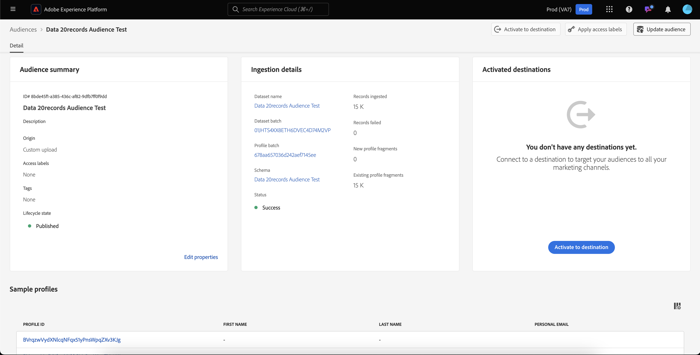

# Handleiding voor publiek

In Adobe Experience Platform kunt u met een publiek dat op mensen is gebaseerd, specifieke groepen mensen als doel instellen voor uw marketingcampagnes.

Mensen gebruiken klantprofielgegevens om specifieke markten als doel in te stellen, zodat u zich beter kunt richten op specifieke demografie die u wilt adverteren.

## Terminologie {#terminology}

Voordat u aan de slag gaat met het publiek, bekijkt u eerst de verschillen tussen de verschillende soorten publiek:

- **publiek van de Rekening**: Een rekeningspubliek is een publiek dat gebruikend **rekening** profielgegevens wordt gecreeerd. Accountprofielgegevens kunnen worden gebruikt om een publiek te maken dat zich richt op personen binnen downstreamaccounts. Voor meer informatie over rekeningspubliek, te lezen gelieve het [&#x200B; overzicht van het rekeningspubliek &#x200B;](./account-audiences.md).
- **publiek van Mensen**: Een publiek van de mensen is een publiek dat gebruikend **klant** profielgegevens wordt gecreeerd. De profielgegevens van de klant kunnen worden gebruikt om publiek tot stand te brengen dat op de klantenkring van uw zaken gericht is.
- **het publiek van het Vooruitzicht**: Een perspectiefpubliek is een publiek dat gebruikend **het profielgegevens van het vooruitzicht** wordt gecreeerd. Met profielgegevens kan een publiek van niet-geverifieerde gebruikers worden gemaakt. Voor meer informatie over perspectiefpubliek, te lezen gelieve het [&#x200B; overzicht van het perspectiefpubliek &#x200B;](./prospect-audiences.md).

## Toegang {#access}

Selecteer **[!UICONTROL Audiences]** in de **[!UICONTROL Customers]** -sectie om toegang te krijgen tot het publiek.

Het Portaal van het Publiek wordt getoond, tonend een lijst van alle mensen publiek voor de organisatie.

Deze weergave bevat informatie over het publiek, zoals de naam, het aantal profielen, de oorsprong, de levenscyclusstatus, de datum waarop deze is gemaakt en de datum waarop deze voor het laatst is bijgewerkt.

U kunt ook de functie voor zoeken en filteren gebruiken om snel naar specifieke accountsoorten te zoeken en deze te sorteren. Meer informatie over deze eigenschap kan in het [&#x200B; Poortoverzicht van het Poort van het Publiek &#x200B;](../ui/audience-portal.md#manage-audiences) worden gevonden.

## Details publiek {#details}

Om details over een specifiek publiek van mensen te bekijken, selecteer een publiek op de Portaal van de Publiek.

De pagina met publieksdetails wordt weergegeven. Informatie, zoals beschrijving, oorsprong en levenscyclusstatus, worden weergegeven.

Voor meer informatie over de pagina van de publieksdetails, gelieve de [&#x200B; sectie van publieksdetails van het Poortoverzicht van het Poort van het Publiek &#x200B;](../ui/audience-portal.md#audience-details) te lezen.

## publiek maken {#create}

U kunt een publiek tot stand brengen of gebruikend de Samensteller van de Publiek of de Bouwer van het Segment. Als u aan de slag wilt met het maken van een publiek voor personen, selecteert u publiek maken op de portal Publiek.

Er wordt een pop-up weergegeven, zodat u kunt kiezen tussen het samenstellen van een publiek of het samenstellen van regels.

Voor meer gedetailleerde informatie over het creëren van publiek, gelieve het [&#x200B; Poortoverzicht van het Poortpubliek van het Publiek &#x200B;](../ui/audience-portal.md#create-audience) te lezen.

## Het publiek activeren {#activate}

Na het creëren van uw publiek, kunt u dit publiek aan andere stroomafwaartse diensten activeren.

Selecteer het publiek dat u wilt activeren, gevolgd door **[!UICONTROL Activate to destination]** .

De pagina [!UICONTROL Activate destination] wordt weergegeven met de lijst met beschikbare doelen, afhankelijk van de updatefrequentie van het publiek. Voor meer informatie over het activeringsproces, te lezen gelieve het [&#x200B; activeringsoverzicht &#x200B;](../../destinations/ui/activation-overview.md).

## Volgende stappen

Na het lezen van deze handleiding weet u hoe u uw publiek in Adobe Experience Platform kunt maken en beheren. Om over de verschillende soorten publiek te leren, te lezen gelieve het [&#x200B; overzicht van publiekstypes &#x200B;](./overview.md).
