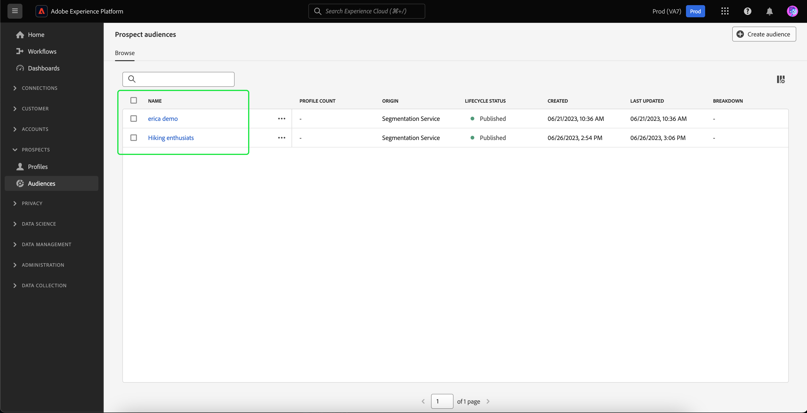

# Doelgroepen

Adobe Experience Platform staat u toe om het volledige gemak en de verfijning van de marketer-vriendschappelijke segmentatieervaring aan [ perspectiefprofielen ](../../profile/ui/prospect-profile.md) te brengen. U kunt de tijd die het assembleren van publiek wordt doorgebracht drastisch verminderen door uw eigen perspectiefpubliek te creëren terwijl het verantwoord gebruiken van partnergegevens.

## Toegang {#access}

Selecteer **[!UICONTROL Audiences]** in de **[!UICONTROL Prospects]** -sectie voor toegang tot mogelijke doelgroepen.

![ de [!UICONTROL Audiences] knoop wordt benadrukt binnen de [!UICONTROL Prospects] sectie.](../images/types/prospect/prospect-audiences.png)

Het Portaal van het Publiek wordt getoond, tonend een lijst van alle perspectiefpubliek voor de organisatie.

Deze weergave bevat informatie over het publiek, zoals de naam, het aantal profielen, de oorsprong, de levenscyclusstatus, de datum waarop het is gemaakt, de datum waarop het laatst is bijgewerkt en de indeling.

U kunt extra gebieden aan deze vertoning toevoegen door  te selecteren. Deze extra velden bevatten de updatefrequentie en de laatste update door.

Meer informatie over het Portaal van het Publiek, met inbegrip van gedetailleerde informatie over de vermelde gebieden, kan in het [ Poortoverzicht van het Poort van het Publiek ](../ui/audience-portal.md#list) worden gevonden.

## Details publiek {#details}

Om details over een specifiek perspectiefpubliek te bekijken, selecteer een publiek op het Portaal van het Publiek.

De pagina met informatie over het beoogde publiek wordt weergegeven. De informatie, met inbegrip van de samenvatting van het perspectiefpubliek, het publiekstotaal, en de geactiveerde bestemmingen worden getoond.

Voor meer informatie over de pagina van de publieksdetails, gelieve de [ sectie van publieksdetails van het Poortoverzicht van het Poort van het Publiek ](../ui/audience-portal.md#audience-details) te lezen.

## publiek maken {#create}

Selecteer **[!UICONTROL Create audience]** als u een publiek met perspectief wilt maken op de Poorten publiek.

![ de [!UICONTROL Create audience] knoop wordt benadrukt op het potentiële publiek doorbladert pagina.](../images/types/prospect/select-create-audience.png)

De Segment Builder wordt weergegeven. De kenmerken van het perspectiefprofiel worden weergegeven op de linkernavigatiebalk.

Voor meer informatie bij het gebruiken van de Bouwer van het Segment, te lezen gelieve de [ gids UI van de Bouwer van het Segment ](../ui/segment-builder.md).

## Aanbevolen gebruiksgevallen {#use-cases}

Lees de volgende documentatie over het gebruiksscenario voor meer informatie over het gebruik van de functie voor het potentiële publiek in Experience Platform in combinatie met andere platformfuncties:

- [Nieuwe klanten aantrekken en aanschaffen via de prospectieve functionaliteit](../../rtcdp/partner-data/prospecting.md)

## Volgende stappen

Nadat u deze handleiding hebt gelezen, weet u hoe u uw perspectiefpubliek in Adobe Experience Platform kunt maken en beheren. Leren hoe te om een perspectiefpubliek aan andere stroomafwaartse diensten te activeren, te lezen gelieve de gids op [ activerend perspectiefpubliek ](../../destinations/ui/activate-prospect-audiences.md).
