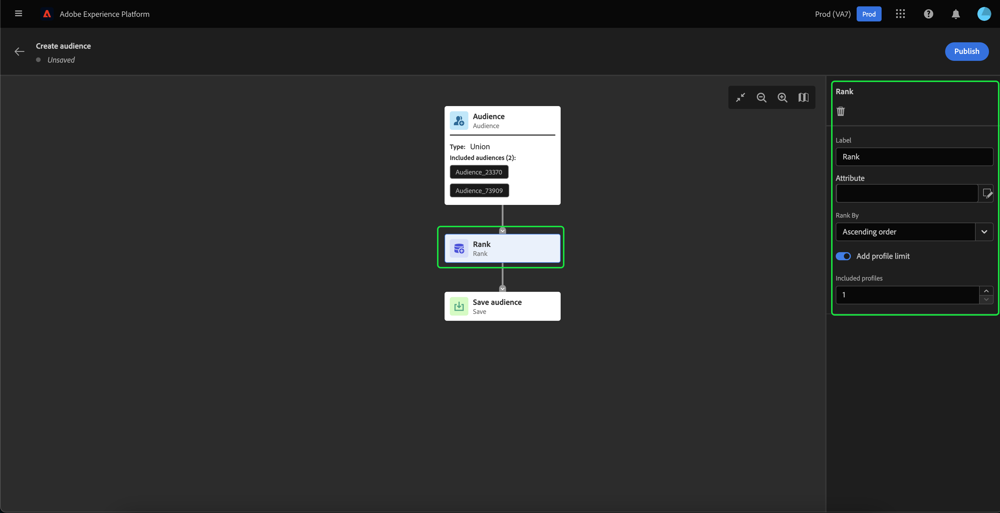
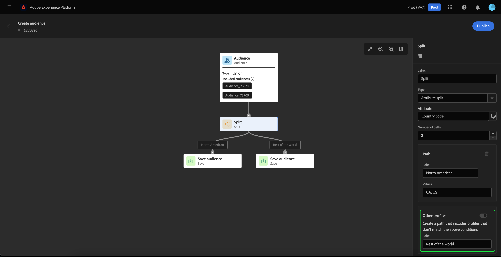

# Handleiding voor de gebruikersinterface van Audience Builder

>[!IMPORTANT]
>
>De Audience Builder is momenteel in bèta en is niet beschikbaar voor alle gebruikers. De documentatie en de functionaliteit kunnen worden gewijzigd.

De Audience Builder biedt een werkruimte voor het maken en bewerken van soorten publiek, met behulp van blokken die worden gebruikt om verschillende acties te vertegenwoordigen.

Het canvas van de publiekssamenstelling bestaat uit vijf verschillende types van blokken: **[[!UICONTROL Audience]](#audience-block)**, **[[!UICONTROL Exclude]](#exclude-block)**, **[[!UICONTROL Join]](#join-block)**, **[[!UICONTROL Rank]](#rank-block)**, en **[[!UICONTROL Split]](#split-block)**.

## [!UICONTROL Audience] {#audience-block}

De **[!UICONTROL Audience]** met bloktype kunt u de subdoelgroepen toevoegen die u wilt samenstellen voor een groter publiek. Standaard kunt u een **[!UICONTROL Audience]** blok is inbegrepen bij de bovenkant van het samenstellingscanvas.

Wanneer u **[!UICONTROL Audience]** blok, de juiste spoorstaaf toont controles voor etikettering en toevoegend publiek aan het blok.

Na het selecteren **[!UICONTROL Add Audience]**, wordt een lijst met doelgroepen weergegeven. Selecteer het publiek dat u wilt opnemen, gevolgd door **[!UICONTROL Add]** om ze toe te voegen aan uw publieksblok.

Uw geselecteerde publiek verschijnt nu binnen de juiste spoorlijn wanneer **[!UICONTROL Audience]** wordt geselecteerd. Vanaf hier kunt u het samenvoegingstype van het gecombineerde publiek wijzigen.

| Type samenvoegen | Beschrijving |
| ---------- | ----------- |
| [!UICONTROL Union] | Het publiek wordt in één publiek samengevoegd. Dit zou het equivalent van een OF verrichting zijn. |
| [!UICONTROL Intersection] | Het publiek wordt gecombineerd, met alleen het publiek dat wordt gedeeld in **alles** van de toegevoegde waarden. Dit zou het equivalent van een EN verrichting zijn. |
| [!UICONTROL Exclude overlap] | Het publiek wordt gecombineerd, met alleen het publiek dat wordt gedeeld in **één, maar niet alle** van de toegevoegde waarden. Dit is het equivalent van een XOR-bewerking. |

## [!UICONTROL Exclude] {#exclude-block}

De **[!UICONTROL Exclude]** met bloktype kunt u opgegeven deelsoorten of kenmerken uitsluiten van uw nieuwe grotere publiek.

Om een **[!UICONTROL Exclude]** blok, selecteer **+** pictogram, gevolgd door **[!UICONTROL Exclude]**.

De **[!UICONTROL Exclude]** wordt toegevoegd. Wanneer dit blok wordt geselecteerd, verschijnen de details over de uitsluiting in het juiste spoor. Dit geldt ook voor het label en uitsluitingstype van het blok. U kunt uitsluiten [op publiek](#exclude-audience) of [by, kenmerk](#exclude-attribute).

### Uitsluiten door publiek {#exclude-audience}

Als u uitsluiting door het publiek toepast, kunt u selecteren welk publiek u wilt uitsluiten door **[!UICONTROL Add Audience]**.

Er wordt een lijst met doelgroepen weergegeven. Selecteren **[!UICONTROL Add]** om het publiek toe te voegen u aan uw exclusief blok wilt uitsluiten.

### Uitsluiten op kenmerk {#exclude-attribute}

Als u per kenmerk uitschakelt, kunt u selecteren welke kenmerken u wilt uitsluiten door de optie  pictogram in de **[!UICONTROL Exclusion rule]** sectie.

Er wordt een lijst met profielkenmerken weergegeven. Selecteer het kenmerktype dat u wilt uitsluiten, gevolgd door **[!UICONTROL Select]** om deze aan uw uitsluitingsblok toe te voegen.

## [!UICONTROL Join] {#join-block}

De **[!UICONTROL Join]** het bloktype staat u toe om in extern publiek van datasets toe te voegen die nog niet door Adobe Experience Platform zijn verwerkt.

Als u een **[!UICONTROL Join]** blok, selecteer **+** pictogram, gevolgd door **[!UICONTROL Join]**.

Wanneer u het blok selecteert, worden de details over de verbinding getoond in het juiste spoor, met inbegrip van het etiket van het blok en de optie om publiek aan de verrijkingsdataset toe te voegen.

Na het selecteren **[!UICONTROL Add Audience]**, wordt een lijst met doelgroepen weergegeven. Selecteer het publiek dat u wilt opnemen, gevolgd door **[!UICONTROL Add]** om hen aan uw te toevoegen toetreedt blok.

Uw geselecteerde publiek verschijnt nu binnen de juiste spoorlijn wanneer **[!UICONTROL Join]** wordt geselecteerd.

## [!UICONTROL Rank] {#rank-block}

De **[!UICONTROL Rank]** met bloktype kunt u het publiek rangschikken en sorteren voordat het nieuwe publiek wordt gepubliceerd.

Als u een **[!UICONTROL Rank]** blok, selecteer **+** pictogram, gevolgd door **[!UICONTROL Rank]**.

Wanneer u het blok selecteert, worden de details over het rangschikken getoond in de juiste spoorstaaf, met inbegrip van het etiket van het blok, het attribuut aan rangschikking, de rangschikking, en een knevel om het aantal profielen te beperken tot rangschikking.

Als u wilt selecteren op welk kenmerk het publiek moet worden geplaatst, selecteert u de optie  pictogram.

Er wordt een lijst met profielkenmerken weergegeven. Op deze popover, kunt u het attributentype selecteren u uw publiek door wilt rangschikken. Selecteren **[!UICONTROL Select]** om het aan uw rangschikkingsblok toe te voegen. Let op: het geselecteerde kenmerk kan **alleen** van het type `int`.

Na het selecteren van de attributen, kunt u de orde selecteren om het door te rangschikken. Dit gebeurt in oplopende (van laagste naar hoogste) of aflopende (van hoogste naar laagste) volgorde.

Bovendien, kunt u het aantal teruggekeerde publiek beperken door toe te laten **[!UICONTROL Add profile limit]** schakelen. Wanneer deze schakeloptie is ingeschakeld, kunt u het maximale aantal keren instellen dat binnen het **[!UICONTROL Included profiles]** veld.

## [!UICONTROL Split] {#split-block}

De **[!UICONTROL Split]** met bloktype kunt u het nieuwe publiek opsplitsen in verschillende deelsoorten. U kunt dit publiek splitsen op basis van een percentage of op basis van een kenmerk.

Als u een **[!UICONTROL Split]** blok, selecteer **+** pictogram, gevolgd door **[!UICONTROL Split]**.

### Splitsen op percentage {#split-percentage}

Bij het splitsen naar percentage worden de doelgroepen willekeurig gesplitst op basis van het aantal beschikbare paden en percentages.

U kunt bijvoorbeeld drie paden hebben, elk met een ander percentage profielen.

Bovendien, kunt u één van de gespleten publiek merken om de controlegroep te zijn.

### Splitsen op kenmerk {#split-attribute}

Bij splitsen op kenmerk wordt het publiek gesplitst op basis van de opgegeven kenmerken. Selecteer het kenmerk waarop u wilt splitsen **[!UICONTROL Split]** blok, gevolgd door de  pictogram.

Er wordt een lijst met profielkenmerken weergegeven. Selecteer het kenmerktype, gevolgd door **[!UICONTROL Select]** om het toe te voegen aan uw gesplitste blok.

Nadat u het kenmerk hebt geselecteerd, kunt u kiezen tot welke profielen u wilt behoren door de waarden in het deelvenster **[!UICONTROL Values]** veld.

Daarnaast kunt u de opdracht **[!UICONTROL Other profiles]** Schakel deze optie in om een subpubliek te maken dat uit alle niet-geselecteerde profielen bestaat.

## Uw publiek publiceren

Nadat u de doelgroep hebt samengesteld, kunt u deze opslaan en publiceren door **[!UICONTROL Publish]**.

Als er fouten optreden bij het maken van het publiek, verschijnt er een waarschuwing met de informatie over het oplossen van het probleem.

## Volgende stappen

De Audience Builder biedt een rijke workflow waarmee u een publiek kunt maken van de verschillende bloktypen. Meer over andere delen van de Dienst UI van de Segmentatie leren, gelieve te lezen [Gebruikershandleiding voor segmentatieservice](./overview.md).