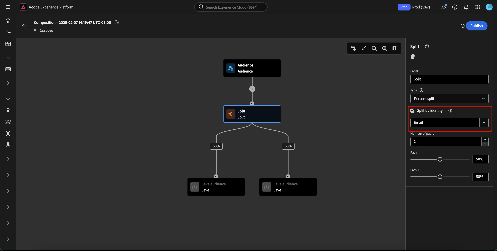

# Handleiding voor compositie van publiek

>[!BEGINSHADEBOX]

Als u een klant van Adobe Journey Optimizer bent, te lezen gelieve [ begonnen met de gids van de publiekssamenstelling ](https://experienceleague.adobe.com/docs/journey-optimizer/using/audiences-profiles-identities/audiences/audience-orchestration/get-started-audience-orchestration.html) in de documentatie van Adobe Journey Optimizer voor meer informatie bij het werken met publiekssamenstelling in die context.

>[!ENDSHADEBOX]

>[!AVAILABILITY]
>
>U moet over de volgende machtigingen beschikken om deze functie te kunnen gebruiken:
>
>- Segmenten beheren
>- Profielen beheren
>- Beleid voor samenvoegen beheren
>
>Meer informatie over toestemmingen binnen Experience Platform kan in het [ overzicht van de toegangscontrole ](../../access-control/home.md#permissions) worden gevonden.

>[!NOTE]
>
>Deze gids verklaart hoe te om publiek tot stand te brengen gebruikend de Samenstelling van het Publiek. Leer hoe te om publiek door segmentdefinities tot stand te brengen gebruikend de Bouwer van het Segment gelieve de [ gids UI van de Bouwer van het Segment ](./segment-builder.md) te lezen.

De Samenstelling van het publiek verstrekt een werkruimte om publiek te bouwen en uit te geven, gebruikend blokken die worden gebruikt om verschillende acties te vertegenwoordigen.

Om de details van de samenstelling, met inbegrip van de titel en de beschrijving te veranderen, selecteer de  knoop.

De pop-up **[!UICONTROL Composition properties]** wordt weergegeven. U kunt hier details van uw samenstelling, met inbegrip van de titel en de beschrijving opnemen.

>[!NOTE]
>
>Als u **niet** uw samenstelling een titel geeft, zal het een titel van &quot;Samenstelling&quot;hebben die door de aanmaakdatum en de tijd door gebrek wordt gevolgd. Bovendien, moet elke samenstelling **** zijn eigen unieke naam hebben.

Nadat u de details van uw compositie hebt bijgewerkt, selecteert u **[!UICONTROL Save]** om deze updates te bevestigen. Het canvas van de publiekscompositie verschijnt opnieuw.

Het canvas met publiekscompositie bestaat uit vier verschillende typen blokken: **[[!UICONTROL Audience]](#audience-block)** , **[[!UICONTROL Exclude]](#exclude-block)** , **[[!UICONTROL Rank]](#rank-block)** en **[[!UICONTROL Split]](#split-block)** .

## [!UICONTROL Audience] {#audience-block}

>[!CONTEXTUALHELP]
>id="platform_segmentation_ao_audience"
>title="Poortblok"
>abstract="Met het blok Publiek kunt u het subpubliek toevoegen dat u wilt gebruiken om uw nieuwe publiek samen te stellen."

>[!CONTEXTUALHELP]
>id="platform_segmentation_ao_merge_types"
>title="Typen samenvoegen"
>abstract="De fusietypes bepalen hoe de geselecteerde sub-publiek wordt gecombineerd. Tot de ondersteunde waarden behoren Vereniging, Doorsnede en Overlap uitsluiten."

Met het bloktype **[!UICONTROL Audience]** kunt u de subsoorten toevoegen die u wilt gebruiken om uw nieuwe, grotere doelgroep samen te stellen. Standaard wordt een **[!UICONTROL Audience]** -blok boven aan het compositicanvas weergegeven.

Wanneer u het blok **[!UICONTROL Audience]** selecteert, worden in de rechtertrack besturingselementen weergegeven voor het labelen van het publiek, het toevoegen van een publiek aan het blok en het maken van aangepaste regels voor het blok publiek.

>[!NOTE]
>
>U kunt of publiek **toevoegen of** een douaneregel creëren. Deze twee functies **kunnen niet** samen worden gebruikt.

### [!UICONTROL Add audience] {#add-audience}

Om publiek aan het blok van het Publiek toe te voegen. Selecteer **[!UICONTROL Add Audience]** .

>[!IMPORTANT]
>
>Gelieve te merken op dat **slechts** publiek dat gebruikend het standaardsamenvoegbeleid wordt bepaald zal verschijnen.
>
>Bovendien, slechts **gepubliceerde** publiek dat gebruikend de Bouwer van het Segment wordt gecreeerd kan worden gebruikt. Het publiek dat gebruikend de Samenstelling van het Publiek en extern geproduceerde publiek wordt gecreeerd is **niet** beschikbaar.

Er wordt een lijst met doelgroepen weergegeven. Selecteer het publiek dat u wilt opnemen, gevolgd door **[!UICONTROL Add]** om deze aan het blok met doelgroepen toe te voegen.

Het geselecteerde publiek wordt nu weergegeven in de rechtertrack wanneer het **[!UICONTROL Audience]** -blok wordt geselecteerd. Vanaf hier kunt u het samenvoegingstype van het gecombineerde publiek wijzigen.

| Type samenvoegen | Beschrijving |
| ---------- | ----------- |
| [!UICONTROL Union] | De doelgroepen worden in één publiek samengevoegd. Dit zou het equivalent van een OF verrichting zijn. |
| [!UICONTROL Intersection] | Het publiek wordt gecombineerd, met slechts het publiek dat in **allen** van hen wordt gedeeld die worden toegevoegd. Dit zou het equivalent van een EN verrichting zijn. |
| [!UICONTROL Exclude overlap] | Het publiek wordt gecombineerd, met slechts het publiek dat in **wordt gedeeld, maar niet allen** van hen die worden toegevoegd. Dit is het equivalent van een XOR-bewerking. |

### [!UICONTROL Build rule] {#build-rule}

>[!CONTEXTUALHELP]
>id="platform_segmentation_ao_rule_builder"
>title="Segment Builder"
>abstract="U kunt de Bouwer van het Segment gebruiken om een douaneregel voor uw samenstelling toe te voegen."

Selecteer **[!UICONTROL Build rule]** als u een aangepaste regel wilt toevoegen aan het blok Publiek.

De Segment Builder wordt weergegeven. U kunt de Bouwer van het Segment gebruiken om een douaneregel tot stand te brengen voor het publiek te volgen. Meer informatie over het gebruiken van de Bouwer van het Segment kan in de [ gids van de Bouwer van het Segment ](./segment-builder.md) worden gevonden.

Nadat u een aangepaste regel hebt toegevoegd, selecteert u **[!UICONTROL Save]** om de regel aan uw publiek toe te voegen.

## [!UICONTROL Exclude] {#exclude-block}

>[!CONTEXTUALHELP]
>id="platform_segmentation_ao_exclude"
>title="Blok uitsluiten"
>abstract="Met het blok Uitsluiten kunt u opgegeven soorten publiek of kenmerken uitsluiten van uw compositie."

>[!CONTEXTUALHELP]
>id="platform_segmentation_ao_exclude_type"
>title="Type uitsluiten"
>abstract="U kunt profielen uitsluiten die tot een specifiek publiek behoren (uitsluiten door het publiek) of profielen uitsluiten die op een specifiek kenmerk zijn gebaseerd (uitsluiten door kenmerk)."

Met het bloktype **[!UICONTROL Exclude]** kunt u een opgegeven subpubliek of kenmerken uitsluiten van een nieuw, groter publiek.

Als u een **[!UICONTROL Exclude]** -blok wilt toevoegen, selecteert u het pictogram **+** , gevolgd door **[!UICONTROL Exclude]** .

Het blok **[!UICONTROL Exclude]** wordt toegevoegd. Wanneer dit blok wordt geselecteerd, verschijnen de details over de uitsluiting in het juiste spoor. Dit geldt ook voor het label en uitsluitingstype van het blok. U kunt [ door publiek ](#exclude-audience) uitsluiten of [ door attribuut ](#exclude-attribute).

### Uitsluiten door publiek {#exclude-audience}

Als u uitsluiting instelt voor het publiek, kunt u selecteren welk publiek u wilt uitsluiten door **[!UICONTROL Add Audience]** te selecteren.

![ wordt de [!UICONTROL Add audience] knoop geselecteerd, die u laat kiezen welk publiek u wilt uitsluiten.](../images/ui/audience-composition/add-excluded-audience.png)

>[!IMPORTANT]
>
>Slechts **gepubliceerde** publiek dat gebruikend de Bouwer van het Segment wordt gecreeerd kan worden gebruikt. Het publiek dat gebruikend de Samenstelling van het Publiek en extern geproduceerde publiek wordt gecreeerd is **niet** beschikbaar.

Er wordt een lijst met doelgroepen weergegeven. Selecteer **[!UICONTROL Add]** om het publiek toe te voegen u aan uw uitsluitingsblok wilt uitsluiten.

### Uitsluiten op kenmerk {#exclude-attribute}

>[!CONTEXTUALHELP]
>id="platform_segmentation_ao_exclude_attribute"
>title="Uitsluiten op kenmerk"
>abstract="Wanneer u per attribuut uitsluit, kunt u specifieke profielen uitsluiten van verschijnen in uw samenstelling die op de geselecteerde attributen wordt gebaseerd."

Als u door attribuut uitsluit, kunt u selecteren welke attributen u wilt uitsluiten door het  pictogram binnen de **[!UICONTROL Exclusion rule]** sectie te selecteren. Door het kenmerk uit te sluiten, kunt u elk profiel dat dit kenmerk bevat, uitsluiten van het resulterende publiek.

Er wordt een lijst met profielkenmerken weergegeven. Selecteer het kenmerktype dat u wilt uitsluiten, gevolgd door **[!UICONTROL Select]** om deze toe te voegen aan het uitsluitingsblok.

>[!IMPORTANT]
>
>Wanneer exclusief door attribuut, kunt u **slechts één** waarde specificeren om uit te sluiten. Als u een scheidingsteken gebruikt, zoals een komma of puntkomma, wordt die exacte waarde alleen uitgesloten. Bijvoorbeeld, zal het plaatsen van de waarde als `red, blue` in het uitsluiten van de termijn `red, blue` van de attributen resulteren, maar zal **** niet in het uitsluiten van of de termijn `red` of `blue` resulteren.

## [!UICONTROL Enrich] {#enrich-block}

>[!CONTEXTUALHELP]
>id="platform_segmentation_ao_enrich"
>title="Blok vergroten"
>abstract="Met het blok Verrijken kunt u het publiek verrijken met extra kenmerken die afkomstig zijn uit Adobe Experience Platform-gegevenssets."

>[!CONTEXTUALHELP]
>id="platform_segmentation_ao_dataset"
>title="Verrijkingsgegevens"
>abstract="De verrijkingsdataset bevat de gegevens u met de samenstelling wilt associëren."

>[!CONTEXTUALHELP]
>id="platform_segmentation_ao_enrich_criteria"
>title="Verrijkingscriteria"
>abstract="De verrijkingscriteria omvatten de Source-verbindingssleutel en de samenvoegingsdataset. Deze twee sleutels combineren de brondataset en de verrijkingsdataset."

>[!CONTEXTUALHELP]
>id="platform_segmentation_ao_enrich_attributes"
>title="Verrijkingskenmerken"
>abstract="De verrijkingskenmerken zijn de kenmerken die u aan de compositie wilt koppelen."

>[!IMPORTANT]
>
>Op dit punt in tijd, kunnen de verrijkingsattributen **slechts** in stroomafwaartse scenario&#39;s van Adobe Journey Optimizer worden gebruikt.

Met het bloktype **[!UICONTROL Enrich]** kunt u het publiek verrijken met extra kenmerken uit een gegevensset. U kunt deze kenmerken gebruiken in gevallen van verpersoonlijkingsgebruik.

Als u een **[!UICONTROL Enrich]** -blok wilt toevoegen, selecteert u het pictogram **+** , gevolgd door **[!UICONTROL Enrich]** .

![ de [!UICONTROL Enrich] optie wordt geselecteerd.](../images/ui/audience-composition/add-enrich-block.png)

Het blok **[!UICONTROL Enrich]** wordt toegevoegd. Wanneer dit blok wordt geselecteerd, verschijnen de details over de verrijking in het juiste spoor. Dit omvat het etiket van het blok en de verrijkingsdataset.

Om de dataset te selecteren om het publiek met te verrijken, selecteer het  pictogram.

![ de filterknoop wordt benadrukt. Als u dit selecteert, gaat u naar de [!UICONTROL Select dataset] popover. ](../images/ui/audience-composition/enrich-select-dataset.png)

De pop-up **[!UICONTROL Select dataset]** wordt weergegeven. Selecteer de dataset die u voor verrijking wilt toevoegen, die door **[!UICONTROL Select]** wordt gevolgd om de dataset voor verrijking toe te voegen.

>[!IMPORTANT]
>
>De geselecteerde dataset **moet** aan de volgende criteria voldoen:
>
>- De dataset **moet** van verslagtype zijn.
>   - De dataset **kan** niet van gebeurtenistype zijn, systeem-geproduceerd zijn, of voor Profiel duidelijk zijn.
>- De dataset **moet** 1 GB of kleiner zijn.

Het gedeelte **[!UICONTROL Enrichment criteria]** wordt nu weergegeven op de rechterrails. In deze sectie kunt u **[!UICONTROL Source join key]** en **[!UICONTROL Enrichment dataset join key]** selecteren, waarmee u de verrijkingsdataset kunt koppelen aan het publiek dat u probeert te maken.

![ het [!UICONTROL Enrichment criteria] gebied wordt benadrukt.](../images/ui/audience-composition/enrichment-criteria.png)

Om **[!UICONTROL Source join key]** te selecteren, selecteer het  pictogram.

De pop-up **[!UICONTROL Select a profile attribute]** wordt weergegeven. Selecteer het profielkenmerk dat u als de bronverbindingssleutel wilt gebruiken, gevolgd door **[!UICONTROL Select]** om dat kenmerk als uw bronverbindingssleutel te kiezen.

Om **[!UICONTROL Enrichment dataset join key]** te selecteren, selecteer het  pictogram.

De pop-up **[!UICONTROL Enrichment attributes]** wordt weergegeven. Selecteer het attribuut u als de de verbindingssleutel van de verrijkingsdataset wilt gebruiken, die door **[!UICONTROL Select]** wordt gevolgd om dat attribuut te kiezen aangezien uw de verbindingssleutel van de verrijkingsdataset.

Nu u beide verbindingssleutels hebt toegevoegd, wordt de sectie **[!UICONTROL Enrichment attributes]** weergegeven. U kunt nu het kenmerk toevoegen waarmee u het publiek wilt verfraaien. Selecteer **[!UICONTROL Add attribute]** als u deze kenmerken wilt toevoegen.

De pop-up **[!UICONTROL Enrichment attributes]** wordt weergegeven. U kunt de attributen van de dataset selecteren om uw publiek met te verrijken, gevolgd door **[!UICONTROL Select]** om de attributen aan uw publiek toe te voegen.

<!-- ## [!UICONTROL Join] {#join-block}

The **[!UICONTROL Join]** block type allows you to add in external audiences from datasets that have not yet been processed by Adobe Experience Platform.

To add a **[!UICONTROL Join]** block, select the **+** icon, followed by **[!UICONTROL Join]**.

When you select the block, details about the join are shown in the right rail, including the block's label and the option to add audiences to the enrichment dataset.

After selecting **[!UICONTROL Add Audience]**, a list of audiences appears. Select the audiences you want to include, followed by **[!UICONTROL Add]** to add them to your join block.

Your selected audiences now appear within the right rail when the **[!UICONTROL Join]** block is selected. 

 -->

## [!UICONTROL Rank] {#rank-block}

>[!CONTEXTUALHELP]
>id="platform_segmentation_ao_ranking"
>title="Rank blok"
>abstract="Met het blok Rank kunt u profielen rangschikken op basis van een specifiek kenmerk en deze opnemen in uw compositie."

>[!CONTEXTUALHELP]
>id="platform_segmentation_ao_rank_profilelimit_text"
>title="Profiellimiet toevoegen"
>abstract="Met de schakeloptie Profielbeperking toevoegen kunt u een maximumaantal profielen opgeven dat u wilt opnemen in de rangschikking."

Met het bloktype **[!UICONTROL Rank]** kunt u profielen rangschikken en sorteren op basis van een opgegeven kenmerk en deze gerangschikte profielen opnemen in uw compositie.

Als u een **[!UICONTROL Rank]** -blok wilt toevoegen, selecteert u het pictogram **+** , gevolgd door **[!UICONTROL Rank]** .

Wanneer u het blok selecteert, worden de details over het rangschikken getoond in de juiste spoorstaaf, met inbegrip van het etiket van het blok, het attribuut aan rangschikking, de rangschikking, en een knevel om het aantal profielen te beperken tot rangschikking.

Om te selecteren welk attribuut om het publiek door te rangschikken, selecteer het  pictogram.

Er wordt een lijst met profielkenmerken weergegeven. Op deze popover, kunt u het attributentype selecteren u uw publiek door wilt rangschikken. Selecteer **[!UICONTROL Select]** om het aan uw rangtelblok toe te voegen. Gelieve te merken op dat het geselecteerde attribuut **slechts** aantallen kan zijn.

Na het selecteren van de attributen, kunt u de orde selecteren om het door te rangschikken. Dit gebeurt in oplopende (van laagste naar hoogste) of aflopende (van hoogste naar laagste) volgorde.

Bovendien kunt u het aantal geretourneerde profielen beperken door de schakeloptie **[!UICONTROL Add profile limit]** in te schakelen. Wanneer deze schakeloptie is ingeschakeld, kunt u het maximumaantal profielen instellen dat wordt geretourneerd binnen het veld **[!UICONTROL Included profiles]** .

## [!UICONTROL Split] {#split-block}

>[!CONTEXTUALHELP]
>id="platform_segmentation_ao_split"
>title="Blok splitsen"
>abstract="Met het gesplitste blok kunt u de compositie opsplitsen in meerdere paden."

>[!CONTEXTUALHELP]
>id="platform_segmentation_ao_split_type"
>title="Tekst splitsen"
>abstract="U kunt uw compositie splitsen op basis van de splitsing Percentage of Kenmerk. Percentage van de splitsing splitst willekeurig profielen in meerdere paden. Met de splitsing van kenmerken kunt u profielen splitsen op basis van een opgegeven kenmerk."

>[!CONTEXTUALHELP]
>id="platform_segmentation_ao_split_otherprofiles_text"
>title="Andere profielen"
>abstract="Met de schakeloptie Andere profielen kunt u een extra pad maken met de resterende profielen die niet overeenkomen met de opgegeven voorwaarden van de andere paden."

>[!NOTE]
>
>Om het **[!UICONTROL Split]** blok te gebruiken, moet u **** minstens 10 profielen in uw publiek hebben.

Met het bloktype **[!UICONTROL Split]** kunt u uw nieuwe publiek opsplitsen in verschillende deelsoorten. U kunt dit publiek splitsen op basis van een percentage of op basis van een kenmerk.

Als u een **[!UICONTROL Split]** -blok wilt toevoegen, selecteert u het pictogram **+** , gevolgd door **[!UICONTROL Split]** .

Wanneer u het publiek splitst, kunt u splitsen op percentage of splitsen op kenmerk.

### Splitsen op percentage {#split-percentage}

>[!CONTEXTUALHELP]
>id="platform_segmentation_ao_split_percentage"
>title="Splitsen op percentage"
>abstract="U kunt het publiek willekeurig opsplitsen in meerdere soorten publiek op basis van het aantal beschikbare paden en percentages."

>[!CONTEXTUALHELP]
>id="platform_segmentation_ao_split_persistent"
>title="Permanente splitsing"
>abstract="U kunt de percentagesplitsing blijvend maken door deze optie in te schakelen en een naamruimte voor identiteit te selecteren."

Bij het splitsen naar percentage worden de doelgroepen willekeurig gesplitst op basis van het aantal beschikbare paden en percentages.

U kunt ook een identiteit opgeven, waardoor de op percentage gebaseerde splitsing blijvend wordt. Tot de beschikbare identiteitstypen behoren alle naamruimten die beschikbaar zijn in uw organisatie.

### Splitsen op kenmerk {#split-attribute}

Bij splitsen op kenmerk wordt het publiek gesplitst op basis van de opgegeven kenmerken. Om de attributen te selecteren door te splitsen, selecteer het **[!UICONTROL Split]** blok, dat door het  pictogram wordt gevolgd.

Er wordt een lijst met profielkenmerken weergegeven. Selecteer het kenmerktype, gevolgd door **[!UICONTROL Select]** om het aan uw gesplitste blok toe te voegen.

Nadat u het kenmerk hebt geselecteerd, kunt u kiezen tot welke profielen u wilt behoren door de waarden in het veld **[!UICONTROL Values]** toe te voegen.

Bovendien kunt u de schakeloptie **[!UICONTROL Other profiles]** inschakelen om een subpubliek te maken dat bestaat uit alle niet-geselecteerde profielen.

## Uw publiek publiceren {#publish}

>[!CONTEXTUALHELP]
>id="platform_segmentation_ao_publish"
>title="Publiceren"
>abstract="U kunt uw compositie publiceren om het(de) resulterende publiek(en) in Adobe Experience Platform te maken."

>[!IMPORTANT]
>
>Wanneer u de publiekscompositie publiceert, moet u er rekening mee houden dat het maximaal 48 uur kan duren voordat de compositie wordt geëvalueerd en geactiveerd voor gebruik in downstreamservices zoals een Real-Time CDP-bestemming of Adobe Journey Optimizer-kanaal.

Nadat u de compositie hebt gemaakt, kunt u deze opslaan en publiceren door **[!UICONTROL Publish]** te selecteren.

Als er fouten optreden bij het maken van het publiek, verschijnt er een waarschuwing met de informatie over het oplossen van het probleem.

## Volgende stappen

De Samenstelling van het publiek verstrekt een rijke werkschema toelatend u om samenstellingen van de verschillende bloktypes tot stand te brengen. Om meer over andere delen van de Dienst UI van de Segmentatie te leren, te lezen gelieve de [ gebruikersgids van de Dienst van de Segmentatie ](./overview.md).
