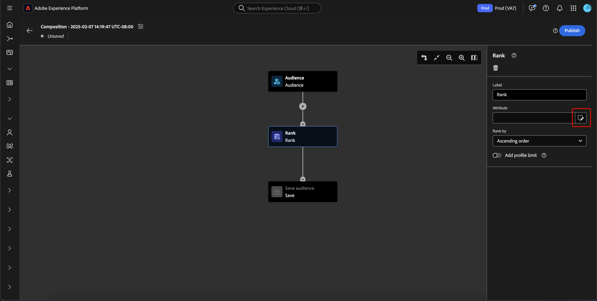

# Handleiding voor compositie van publiek

>[!NOTE]
>
>Deze gids verklaart hoe te om publiek tot stand te brengen gebruikend de Samenstelling van het Publiek. Als u wilt leren hoe u publiek kunt maken met segmentdefinities met de Segment Builder, leest u de [Handleiding voor de gebruikersinterface van Segment Builder](./segment-builder.md).

De Samenstelling van het publiek verstrekt een werkruimte om publiek te bouwen en uit te geven, gebruikend blokken die worden gebruikt om verschillende acties te vertegenwoordigen.

Als u de details van de compositie wilt wijzigen, inclusief de titel en beschrijving, selecteert u de optie  knop.

De **[!UICONTROL Composition properties]** wordt weergegeven. U kunt hier details van uw samenstelling, met inbegrip van de titel en de beschrijving opnemen.

>[!NOTE]
>
>Als u **niet** Als u de compositie een titel geeft, krijgt deze de titel &quot;Compositie&quot;, gevolgd door de datum en tijd waarop de compositie wordt gemaakt. Bovendien, elke samenstelling **moet** hebben een eigen unieke naam.

Nadat u de details van uw compositie hebt bijgewerkt, selecteert u **[!UICONTROL Save]** om deze updates te bevestigen. Het canvas van de publiekscompositie verschijnt opnieuw.

Het canvas van de publiekssamenstelling bestaat uit vier verschillende types van blokken: **[[!UICONTROL Audience]](#audience-block)**, **[[!UICONTROL Exclude]](#exclude-block)**, **[[!UICONTROL Rank]](#rank-block)**, en **[[!UICONTROL Split]](#split-block)**.

## [!UICONTROL Audience] {#audience-block}

De **[!UICONTROL Audience]** met bloktype kunt u de subdoelgroepen toevoegen die u wilt samenstellen voor een groter publiek. Standaard kunt u een **[!UICONTROL Audience]** blok is inbegrepen bij de bovenkant van het samenstellingscanvas.

Wanneer u **[!UICONTROL Audience]** blok, de juiste spoorvertoningen controles voor het etiketteren van het publiek, toevoegend publiek aan het blok, en bouwend douaneregels voor het publieksblok.

>[!NOTE]
>
>U kunt een publiek toevoegen **of** een aangepaste regel maken. Deze twee functies **kan** samen worden gebruikt.

### [!UICONTROL Add audience] {#add-audience}

Om publiek aan het blok van het Publiek toe te voegen. selecteren **[!UICONTROL Add Audience]**.

>[!IMPORTANT]
>
>Houd er rekening mee dat **alleen** publiek dat met het standaardsamenvoegbeleid is gedefinieerd, wordt weergegeven.

Er wordt een lijst met doelgroepen weergegeven. Selecteer het publiek dat u wilt opnemen, gevolgd door **[!UICONTROL Add]** om ze toe te voegen aan uw publieksblok.

Uw geselecteerde publiek verschijnt nu binnen de juiste spoorlijn wanneer **[!UICONTROL Audience]** wordt geselecteerd. Vanaf hier kunt u het samenvoegingstype van het gecombineerde publiek wijzigen.

| Type samenvoegen | Beschrijving |
| ---------- | ----------- |
| [!UICONTROL Union] | De doelgroepen worden in één publiek samengevoegd. Dit zou het equivalent van een OF verrichting zijn. |
| [!UICONTROL Intersection] | Het publiek wordt gecombineerd, met alleen het publiek dat wordt gedeeld in **alles** van de toegevoegde waarden. Dit zou het equivalent van een EN verrichting zijn. |
| [!UICONTROL Exclude overlap] | Het publiek wordt gecombineerd, met alleen het publiek dat wordt gedeeld in **één, maar niet alle** van de toegevoegde waarden. Dit is het equivalent van een XOR-bewerking. |

### [!UICONTROL Build rule] {#build-rule}

Als u een aangepaste regel wilt toevoegen aan het blok Publiek, selecteert u **[!UICONTROL Build rule]**.

De Segment Builder wordt weergegeven. U kunt de Bouwer van het Segment gebruiken om een douaneregel tot stand te brengen voor het publiek te volgen. Meer informatie over het gebruik van de Segment Builder vindt u in de [Handleiding Segment Builder](./segment-builder.md).

Nadat u een aangepaste regel hebt toegevoegd, selecteert u **[!UICONTROL Save]** om de regel aan uw publiek toe te voegen.

## [!UICONTROL Exclude] {#exclude-block}

De **[!UICONTROL Exclude]** met bloktype kunt u opgegeven deelsoorten of kenmerken uitsluiten van het nieuwe, grotere publiek.

Om een **[!UICONTROL Exclude]** blok, selecteer **+** pictogram, gevolgd door **[!UICONTROL Exclude]**.

De **[!UICONTROL Exclude]** wordt toegevoegd. Wanneer dit blok wordt geselecteerd, verschijnen de details over de uitsluiting in het juiste spoor. Dit geldt ook voor het label en uitsluitingstype van het blok. U kunt uitsluiten [op publiek](#exclude-audience) of [by, kenmerk](#exclude-attribute).

### Uitsluiten door publiek {#exclude-audience}

Als u uitsluiting door het publiek toepast, kunt u selecteren welk publiek u wilt uitsluiten door **[!UICONTROL Add Audience]**.

![De [!UICONTROL Add audience] is geselecteerd, waarmee u kunt kiezen welk publiek u wilt uitsluiten.](../images/ui/audience-composition/add-excluded-audience.png)

Er wordt een lijst met doelgroepen weergegeven. Selecteren **[!UICONTROL Add]** om het publiek toe te voegen u aan uw exclusief blok wilt uitsluiten.

### Uitsluiten op kenmerk {#exclude-attribute}

Als u per kenmerk uitschakelt, kunt u selecteren welke kenmerken u wilt uitsluiten door de optie  pictogram in het deelvenster **[!UICONTROL Exclusion rule]** sectie.

Er wordt een lijst met profielkenmerken weergegeven. Selecteer het kenmerktype dat u wilt uitsluiten, gevolgd door **[!UICONTROL Select]** om deze aan uw uitsluitingsblok toe te voegen.

>[!IMPORTANT]
>
>Als u deze optie niet instelt op kenmerk, kunt u alleen **één** waarde die moet worden uitgesloten. Als u een scheidingsteken gebruikt, zoals een komma of puntkomma, wordt die exacte waarde alleen uitgesloten. Stel de waarde bijvoorbeeld in als `red, blue` leidt tot uitsluiting van de term `red, blue` van het kenmerk, maar **niet** resulteert in het uitsluiten van de term `red` of `blue`.

## [!UICONTROL Enrich] {#enrich-block}

>[!IMPORTANT]
>
>Op dit moment kunnen verrijkingskenmerken **alleen** worden gebruikt in downstreamscenario&#39;s van Adobe Journey Optimizer.

De **[!UICONTROL Enrich]** het bloktype staat u toe om uw publiek met extra attributen van een dataset te verrijken. U kunt deze kenmerken gebruiken in gevallen van verpersoonlijkingsgebruik.

Om een **[!UICONTROL Enrich]** blok, selecteer **+** pictogram, gevolgd door **[!UICONTROL Enrich]**.

![De [!UICONTROL Enrich] is geselecteerd.](../images/ui/audience-composition/add-enrich-block.png)

De **[!UICONTROL Enrich]** wordt toegevoegd. Wanneer dit blok wordt geselecteerd, verschijnen de details over de verrijking in het juiste spoor. Dit omvat het etiket van het blok en de verrijkingsdataset.

Als u de gegevensset wilt selecteren waarmee u het publiek wilt verrijken, selecteert u de  pictogram.

![De filterknop wordt gemarkeerd. Als u dit selecteert, gaat u naar de [!UICONTROL Select dataset] popover.](../images/ui/audience-composition/enrich-select-dataset.png)

De **[!UICONTROL Select dataset]** wordt weergegeven. Selecteer de dataset die u voor verrijking wilt toevoegen, die door wordt gevolgd **[!UICONTROL Select]** toevoegen van de gegevensset voor verrijking.

>[!IMPORTANT]
>
>De geselecteerde dataset **moet** voldoen aan de volgende criteria:
>
>- De dataset **moet** van recordtype zijn.
>   - De dataset **kan** van het gebeurtenistype zijn, door het systeem worden gegenereerd of zijn gemarkeerd voor Profiel.
>- De dataset **moet** 1 GB of kleiner zijn.

De **[!UICONTROL Enrichment criteria]** nu wordt dit gedeelte op de rechterspoorlijn weergegeven . In deze sectie kunt u de optie **[!UICONTROL Source join key]** en de **[!UICONTROL Enrichment dataset join key]**, waarmee u de verrijkingsdataset kunt koppelen aan het publiek dat u probeert te maken.

![De [!UICONTROL Enrichment criteria] gemarkeerd.](../images/ui/audience-composition/enrichment-criteria.png)

Als u de optie **[!UICONTROL Source join key]**, selecteert u de  pictogram.

![Het filterpictogram voor de [!UICONTROL Source join key] wordt gemarkeerd.](../images/ui/audience-composition/enrich-select-source-join-key.png)

De **[!UICONTROL Select a profile attribute]** wordt weergegeven. Selecteer het profielattribuut u als bron verbindt sleutel wilt gebruiken, die door wordt gevolgd **[!UICONTROL Select]** om dat attribuut als uw bron te kiezen sluit zich bij sleutel aan.

Als u de optie **[!UICONTROL Enrichment dataset join key]**, selecteert u de  pictogram.

![Het filterpictogram voor de [!UICONTROL Enrichment dataset join key] wordt gemarkeerd.](../images/ui/audience-composition/enrich-select-enrichment-dataset-join-key.png)

De **[!UICONTROL Enrichment attributes]** wordt weergegeven. Selecteer de attributen u als de de verbindingssleutel van de verrijkingsdataset wilt gebruiken, die door wordt gevolgd **[!UICONTROL Select]** om dat attribuut te kiezen aangezien uw verrijkingsdataset zich bij sleutel aansluit.

Nu u beide verbindingssleutels hebt toegevoegd, de **[!UICONTROL Enrichment attributes]** wordt weergegeven. U kunt nu het kenmerk toevoegen waarmee u het publiek wilt verfraaien. Als u deze kenmerken wilt toevoegen, selecteert u **[!UICONTROL Add attribute]**.

![De [!UICONTROL Add attribute] wordt gemarkeerd.](../images/ui/audience-composition/enrich-select-add-attribute.png)

De **[!UICONTROL Enrichment attributes]** wordt weergegeven. U kunt de attributen van de dataset selecteren om uw publiek te verrijken met, gevolgd door **[!UICONTROL Select]** om de kenmerken aan uw publiek toe te voegen.

<!-- ## [!UICONTROL Join] {#join-block}

The **[!UICONTROL Join]** block type allows you to add in external audiences from datasets that have not yet been processed by Adobe Experience Platform.

To add a **[!UICONTROL Join]** block, select the **+** icon, followed by **[!UICONTROL Join]**.

When you select the block, details about the join are shown in the right rail, including the block's label and the option to add audiences to the enrichment dataset.

After selecting **[!UICONTROL Add Audience]**, a list of audiences appears. Select the audiences you want to include, followed by **[!UICONTROL Add]** to add them to your join block.

Your selected audiences now appear within the right rail when the **[!UICONTROL Join]** block is selected. 

 -->

## [!UICONTROL Rank] {#rank-block}

De **[!UICONTROL Rank]** het bloktype staat u toe om profielen te rangschikken en te sorteren die op een gespecificeerd attribuut worden gebaseerd en deze gerangschikte profielen aan uw samenstelling te omvatten.

Als u een **[!UICONTROL Rank]** blok, selecteer **+** pictogram, gevolgd door **[!UICONTROL Rank]**.

Wanneer u het blok selecteert, worden de details over het rangschikken getoond in de juiste spoorstaaf, met inbegrip van het etiket van het blok, het attribuut aan rangschikking, de rangschikking, en een knevel om het aantal profielen te beperken tot rangschikking.

Als u wilt selecteren op welk kenmerk het publiek moet worden geplaatst, selecteert u de optie  pictogram.

Er wordt een lijst met profielkenmerken weergegeven. Op deze popover, kunt u het attributentype selecteren u uw publiek door wilt rangschikken. Selecteren **[!UICONTROL Select]** om het aan uw rangschikkingsblok toe te voegen. Let op: het geselecteerde kenmerk kan **alleen** zijn getallen.

Na het selecteren van de attributen, kunt u de orde selecteren om het door te rangschikken. Dit gebeurt in oplopende (van laagste naar hoogste) of aflopende (van hoogste naar laagste) volgorde.

Bovendien kunt u het aantal geretourneerde profielen beperken door de optie **[!UICONTROL Add profile limit]** schakelen. Wanneer deze schakeloptie is ingeschakeld, kunt u het maximumaantal profielen instellen dat wordt geretourneerd in het dialoogvenster **[!UICONTROL Included profiles]** veld.

## [!UICONTROL Split] {#split-block}

De **[!UICONTROL Split]** met bloktype kunt u het nieuwe publiek opsplitsen in verschillende deelsoorten. U kunt dit publiek splitsen op basis van een percentage of op basis van een kenmerk.

Als u een **[!UICONTROL Split]** blok, selecteer **+** pictogram, gevolgd door **[!UICONTROL Split]**.

Wanneer u het publiek splitst, kunt u splitsen op percentage of splitsen op kenmerk.

### Splitsen op percentage {#split-percentage}

Bij het splitsen naar percentage worden de doelgroepen willekeurig gesplitst op basis van het aantal beschikbare paden en percentages.

U kunt bijvoorbeeld drie paden hebben, elk met een ander percentage profielen.

### Splitsen op kenmerk {#split-attribute}

Bij splitsen op kenmerk wordt het publiek gesplitst op basis van de opgegeven kenmerken. Selecteer het kenmerk waarop u wilt splitsen **[!UICONTROL Split]** blok, gevolgd door de  pictogram.

Er wordt een lijst met profielkenmerken weergegeven. Selecteer het kenmerktype, gevolgd door **[!UICONTROL Select]** om het toe te voegen aan uw gesplitste blok.

Nadat u het kenmerk hebt geselecteerd, kunt u kiezen tot welke profielen u wilt behoren door de waarden in het deelvenster **[!UICONTROL Values]** veld.

Daarnaast kunt u de opdracht **[!UICONTROL Other profiles]** Schakel deze optie in om een subpubliek te maken dat uit alle niet-geselecteerde profielen bestaat.

## Uw publiek publiceren

Nadat u de doelgroep hebt samengesteld, kunt u deze opslaan en publiceren door **[!UICONTROL Publish]**.

Als er fouten optreden bij het maken van het publiek, verschijnt er een waarschuwing met de informatie over het oplossen van het probleem.

## Volgende stappen

De Samenstelling van het publiek verstrekt een rijke werkschema toelatend u om publiek van de verschillende bloktypes tot stand te brengen. Meer over andere delen van de Dienst UI van de Segmentatie leren, gelieve te lezen [Gebruikershandleiding voor segmentatieservice](./overview.md).
