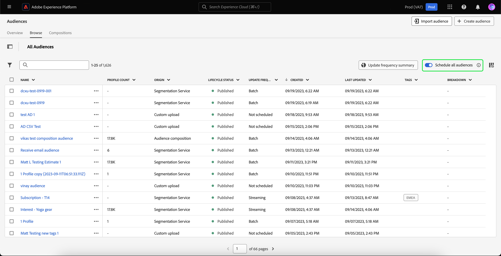

# Overzicht van het portal Publiek

Het Portaal van het publiek is een centrale hub, binnen Adobe Experience Platform, die u toestaat om, publiek te bekijken te beheren en te creëren.

Binnen het Portaal van de Publiek, kunt u de volgende taken verwezenlijken:

>[!BEGINSHADEBOX]

- [Een lijst met uw publiek weergeven](#list)
   - [Snelle acties gebruiken voor uw publiek](#quick-actions)
   - [De eigenschappen aanpassen die worden weergegeven in de lijst met soorten publiek](#customize)
   - [Filters, mappen en tags gebruiken om uw publiek te ordenen](#manage-audiences)
- [Details van uw publiek weergeven](#audience-details)
   - [Een overzicht van uw publiek weergeven](#audience-summary)
- [Uw publiek toestaan voor geplande segmentatie](#scheduled-segmentation)
- [Een publiek maken](#create-audience)
   - [Gebruik Segment Builder om een publiek te maken](#segment-builder)
   - [Gebruik Audience Composition om een publiek te maken](#audience-composition)
   - [De Federale Samenstelling van de Publiek van het gebruik om een publiek tot stand te brengen gebruikend gegevens van uw bestaand gegevenspakhuis](#fac)
   - [Data Distiller gebruiken om een publiek te maken](#data-distiller)
- [Extern gegenereerde doelgroepen importeren](#import-audience)

>[!ENDSHADEBOX]

Als u Poort publiek wilt openen, selecteert u het tabblad **[!UICONTROL Browse]** in de sectie Segmentatie.

## Poortlijst {#list}

>[!CONTEXTUALHELP]
>id="platform_segments_browse_churncolumnname"
>title="Churn"
>abstract="Het churn vertegenwoordigt het percentage profielen dat binnen een publiek in vergelijking met de laatste tijd verandert de segmentbaan liep."

>[!CONTEXTUALHELP]
>id="platform_segments_browse_evaluationmethodcolumnname"
>title="Evaluatiemethode"
>abstract="Tot de evaluatiemethoden voor het publiek behoren batch, streaming en edge."

Standaard wordt in het Poort Publiek een lijst weergegeven met alle soorten publiek in uw organisatie en sandbox, inclusief het aantal profielen, de oorsprong, de gemaakte datum, de laatst gewijzigde datum, de codes en de indeling.

### Snelle acties {#quick-actions}

Naast elk publiek bevindt zich een ellipspictogram. Als u deze optie selecteert, wordt een lijst weergegeven met beschikbare snelle acties voor de doelgroep. Deze lijst met acties verschilt, afhankelijk van de oorsprong van het publiek.

![&#x200B; de snelle actielijst wordt getoond voor publiek met de oorsprong van [!UICONTROL Audience composition].](../images/ui/audience-portal/browse-audience-composition-details.png)

| Actie | Oorsprong | Beschrijving |
| ------ | ------- | ----------- |
| [!UICONTROL Edit] | Segmentatieservice | Opent de Bouwer van het Segment om uw publiek uit te geven. Gelieve te merken op dat als uw publiek door API werd gecreeerd, u **niet** het zal kunnen uitgeven gebruikend de Bouwer van het Segment. Voor meer informatie bij het gebruiken van de Bouwer van het Segment, te lezen gelieve de [&#x200B; gids UI van de Bouwer van het Segment &#x200B;](./segment-builder.md). |
| [!UICONTROL Open composition] | Samenstelling publiek | Opent de samenstelling van het Publiek om uw publiek te zien. Voor meer informatie over de samenstelling van het Publiek, te lezen gelieve de [&#x200B; gids UI van de publiekssamenstelling &#x200B;](./audience-composition.md). |
| [!UICONTROL Activate to destination] | Segmentatieservice | Hiermee activeert u het publiek naar een doel. Voor meer gedetailleerde informatie bij het activeren van een publiek aan een bestemming, gelieve het [&#x200B; activeringsoverzicht &#x200B;](../../destinations/ui/activation-overview.md) te lezen. |
| [!UICONTROL Share with partners] | Auditie, Aangepaste upload, Segmentatieservice | Deelt uw publiek met andere gebruikers van Experience Platform. Voor meer informatie over deze eigenschap, te lezen gelieve het [&#x200B; overzicht van de Gelijke van het Segment &#x200B;](./segment-match/overview.md). |
| [!UICONTROL Manage tags] | Auditie, Aangepaste upload, Segmentatieservice | Beheert de door de gebruiker gedefinieerde tags die bij het publiek horen. Voor meer informatie over deze eigenschap, te lezen gelieve de sectie over [&#x200B; het filtreren en het etiketteren &#x200B;](#manage-audiences). |
| [!UICONTROL Move to folder] | Auditie, Aangepaste upload, Segmentatieservice | Beheert tot welke map het publiek behoort. Voor meer informatie over deze eigenschap, te lezen gelieve de sectie over [&#x200B; het filtreren en het etiketteren &#x200B;](#manage-audiences). |
| [!UICONTROL Copy] | Segmentatieservice | Hiermee dupliceert u het geselecteerde publiek. Meer informatie over deze functie kan in [&#x200B; Veelgestelde vragen van de Segmentatie worden gevonden &#x200B;](../faq.md#copy). |
| [!UICONTROL Apply access labels] | Auditie, Aangepaste upload, Segmentatieservice | Beheert de toegangslabels die bij het publiek horen. Voor meer informatie over toegangslabels, te lezen gelieve de documentatie over [&#x200B; het leiden etiketten &#x200B;](../../access-control/abac/ui/labels.md). |
| [!UICONTROL Publish] | Aangepaste upload, segmentatieservice | Hiermee publiceert u het geselecteerde publiek. Voor meer informatie over het beheer van de levenscyclusstatus, te lezen gelieve de [&#x200B; sectie van de levenscyclusstaat van FAQ van de Segmentatie &#x200B;](../faq.md#lifecycle-states). |
| [!UICONTROL Deactivate] | Aangepaste upload, segmentatieservice | Hiermee deactiveert u het geselecteerde publiek. Gelieve te merken op dat om een publiek te deactiveren, het **niet** in **kan worden geactiveerd om het even welke** bestemming (met inbegrip van niet-Experience Platform bestemmingen) of deel van **uitmaken om het even welk** andere publiek. Voor meer informatie over het beheer van de levenscyclusstatus, te lezen gelieve de [&#x200B; sectie van de levenscyclusstaat van FAQ van de Segmentatie &#x200B;](../faq.md#lifecycle-states). |
| [!UICONTROL Delete] | Auditie, Aangepaste upload, Segmentatieservice | Hiermee verwijdert u het geselecteerde publiek. Het publiek dat in stroomafwaartse bestemmingen wordt gebruikt of gebiedsdelen in andere soorten publiek **zijn kan** niet worden geschrapt. Voor meer informatie over publieksschrapping, te lezen gelieve [&#x200B; segmentatie FAQ &#x200B;](../faq.md#lifecycle-states). |
| [!UICONTROL Add to package] | Auditie, Aangepaste upload, Segmentatieservice | Hiermee verplaatst u het publiek tussen sandboxen. Voor meer informatie over deze eigenschap, te lezen gelieve de [&#x200B; zandbak het tooling gids &#x200B;](../../sandboxes/ui/sandbox-tooling.md). |

>[!IMPORTANT]
>
>Alvorens uw publiek te schrappen, gelieve ervoor te zorgen dat het publiek **niet** als component in een op rekening-gebaseerd publiek wordt gebruikt of in Adobe Journey Optimizer wordt gebruikt.

Boven aan de pagina staan opties voor het toevoegen van alle soorten publiek aan een programma, het importeren van een publiek, het maken van een nieuw publiek en het weergeven van een samenvatting van de publieksevaluatie.

Door **[!UICONTROL Schedule all audiences]** in-/uitschakelen wordt geplande segmentatie ingeschakeld. Meer informatie over geplande segmentatie kan in de [&#x200B; geplande segmentatiesectie van deze gebruikersgids &#x200B;](#scheduled-segmentation) worden gevonden.

Als u **[!UICONTROL Import audience]** selecteert, kunt u een extern gegenereerd publiek importeren. Om meer over het invoeren van publiek te leren, te lezen gelieve de sectie over [&#x200B; het invoeren van een publiek in de gebruikersgids &#x200B;](#import-audience).

Als u **[!UICONTROL Create audience]** selecteert, kunt u een publiek maken. Om meer over het creëren van publiek te leren, te lezen gelieve de sectie op [&#x200B; creërend een publiek in de gebruikersgids &#x200B;](#create-audience).

U kunt **[!UICONTROL Evaluation summary]** selecteren om een cirkeldiagram te tonen dat een samenvatting van de publieksevaluaties toont.

Het cirkeldiagram wordt weergegeven met een uitsplitsing van het publiek naar publieksevaluatie. De grafiek toont het totale aantal publiek in het midden, en de dagelijkse tijd van de partijevaluatie in UTC bij de bodem. Als u de muisaanwijzer boven de verschillende delen van het publiek houdt, wordt het aantal soorten publiek weergegeven dat tot elk type updatefrequentie behoort.

### Aanpassen {#customize}

U kunt extra gebieden aan het Portaal van het Publiek toevoegen door  te selecteren. Deze extra velden bevatten de levenscyclusstatus, updatefrequentie, laatst bijgewerkt door, beschrijving, gemaakt door en toegangslabels.

| Veld | Beschrijving |
| ----- | ----------- |
| [!UICONTROL Name] | De naam van het publiek. |
| [!UICONTROL Profile count] | Het totale aantal profielen dat voor het publiek in aanmerking komt. |
| [!UICONTROL Origin] | De oorsprong van het publiek. Dit geeft aan waar het publiek vandaan komt. De mogelijke waarden omvatten [&#x200B; Dienst van de Segmentatie &#x200B;](#segment-builder), [&#x200B; Douane uploadt &#x200B;](#import-audience), [&#x200B; compositie van het publiek &#x200B;](#audience-composition), [&#x200B; Audience Manager &#x200B;](https://experienceleague.adobe.com/nl/docs/audience-manager/user-guide/aam-home), [&#x200B; look-alike publiek &#x200B;](../types/lookalike-audiences.md), [&#x200B; Federated Audience Composition &#x200B;](#fac), [&#x200B; Customer Journey Analytics &#x200B;](https://experienceleague.adobe.com/nl/docs/analytics-platform/using/cja-overview/cja-overview), [&#x200B; Distiller van Gegevens &#x200B;](#data-distiller). [&#x200B; AJO B2B, en &#x200B;](https://experienceleague.adobe.com/nl/docs/journey-optimizer-b2b/user/guide-overview) Real-Time CDP Collaboration [.](https://experienceleague.adobe.com/nl/docs/real-time-cdp-collaboration/using/destinations/experience-platform#audience-portal) |
| [!UICONTROL Lifecycle status] | De status van het publiek. Mogelijke waarden voor dit veld zijn `Draft` , `Inactive` en `Published` . Meer informatie over levenscyclusstatussen, met inbegrip van wat de verschillende staten betekenen en hoe te om publiek naar verschillende levenscyclusstaten te bewegen, lees de [&#x200B; sectie van de levenscyclusstatus van de Segmentatie FAQ &#x200B;](../faq.md#lifecycle-status). |
| [!UICONTROL Update frequency] | Een waarde die aangeeft hoe vaak de gegevens van het publiek worden bijgewerkt. Mogelijke waarden voor dit veld zijn [!UICONTROL Batch] , [!UICONTROL Streaming] , [!UICONTROL Edge] en [!UICONTROL Not Scheduled] . |
| [!UICONTROL Last updated by] | De naam van de persoon die het publiek het laatst heeft bijgewerkt. |
| [!UICONTROL Created] | De datum en tijd, in UTC, dat het publiek werd gecreeerd. |
| [!UICONTROL Last updated] | De datum en tijd, in UTC, waarop het publiek voor het laatst is bijgewerkt. |
| [!UICONTROL Tags] | De door de gebruiker gedefinieerde labels die bij het publiek horen. Meer informatie over deze markeringen kan in de [&#x200B; sectie op markeringen &#x200B;](#tags) worden gevonden. |
| [!UICONTROL Description] | De beschrijving van het publiek. |
| [!UICONTROL Created by] | De naam van de persoon die het publiek heeft gemaakt. |
| [!UICONTROL Access labels] | De toegangslabels voor het publiek. De etiketten van de toegang staan u toe om datasets en gebieden volgens gebruiksbeleid te categoriseren dat op die gegevens van toepassing is. Deze labels kunnen op elk gewenst moment worden toegepast, zodat u op flexibele wijze gegevens kunt beheren. Voor meer informatie over toegangslabels, te lezen gelieve de documentatie over [&#x200B; het leiden etiketten &#x200B;](../../access-control/abac/ui/labels.md). |
| [!UICONTROL Breakdown] | De indeling van de profielstatus voor het publiek. Hieronder vindt u een gedetailleerdere beschrijving van deze uitsplitsing naar profielstatus. |

Als er een splitsing is geselecteerd, wordt in de weergave een staafgrafiek weergegeven waarin het percentage van de profielen wordt weergegeven dat tot elk van de volgende berekende profielstatussen behoort: [!UICONTROL Realized], [!UICONTROL Existing] en [!UICONTROL Exiting] . Bovendien is de uitsplitsing die wordt weergegeven op het tabblad [!UICONTROL Browse] de nauwkeurigste uitsplitsing van de status van de segmentdefinitie. Als dit getal verschilt van wat wordt vermeld op het tabblad [!UICONTROL Overview] , moet u de nummers op het tabblad [!UICONTROL Browse] gebruiken als de juiste bron van informatie, aangezien de tabnummers van [!UICONTROL Overview] slechts eenmaal per dag worden bijgewerkt.

| Status | Beschrijving |
| ------ | ----------- |
| [!UICONTROL Realized] | De telling van profielen die **&#x200B;**&#x200B;voor het publiek in de laatste 24 uren kwalificeerde sinds de laatste baan van het partijsegment liep. |
| [!UICONTROL Existing] | De telling van profielen die **&#x200B;**&#x200B;in het publiek in de laatste 24 uren sinds de laatste baan van het partijsegment bleven lopen. Dit gebied wordt berekend **&#x200B;**&#x200B;en verschijnt niet in het [`segmentMembership` voorwerp &#x200B;](../../xdm/field-groups/profile/segmentation.md). |
| [!UICONTROL Exiting] | De telling van profielen die **&#x200B;**&#x200B;het publiek in de laatste 24 uren sinds de laatste baan van het partijsegment verliet. |

Nadat u de velden hebt geselecteerd die u wilt weergeven, kunt u ook de breedte van de weergegeven kolommen vergroten of verkleinen. U kunt of dit doen door het gebied tussen de kolommen te slepen of door het  van de kolom te selecteren u wilt re-size, die door **[!UICONTROL Resize column]** wordt gevolgd.

### Filteren, mappen en coderen {#manage-audiences}

Om uw werkefficiëntie te verbeteren, kunt u zoeken naar bestaand publiek, door de gebruiker gedefinieerde labels toevoegen aan het publiek, het publiek in mappen plaatsen en het weergegeven publiek filteren.

#### Zoeken {#searching}

U kunt uw bestaande publiek in maximaal 9 verschillende talen zoeken met [!DNL Unified Search] .

Als u [!DNL Unified Search] wilt gebruiken, voegt u de term die u wilt zoeken toe aan de gemarkeerde zoekbalk.

Voor meer informatie over [!DNL Unified Search], met inbegrip van gesteunde eigenschappen, te lezen gelieve de [&#x200B; Verenigde documentatie van het Onderzoek &#x200B;](https://experienceleague.adobe.com/docs/core-services/interface/services/search-experience-cloud.html?lang=nl-NL).

#### Tags {#tags}

U kunt door de gebruiker gedefinieerde tags toevoegen om uw publiek beter te beschrijven, te zoeken en te beheren.

Als u een tag wilt toevoegen, selecteert u **[!UICONTROL Manage tags]** voor het publiek waarop u een tag wilt toepassen.

![&#x200B; de [!UICONTROL Manage tags] knoop wordt geselecteerd voor een gespecificeerd publiek.](../images/ui/audience-portal/browse-manage-tags.png)

De pop-up **[!UICONTROL Manage tags]** wordt weergegeven. In deze pop-up kunt u een gecategoriseerde tag of een niet-gecategoriseerde tag selecteren.

| Type code | Beschrijving |
| -------- | ----------- |
| Gecategoriseerd | Een tag die wordt gemaakt en beheerd door de beheerders van uw organisatie. |
| Niet gecategoriseerd | Een tag die wordt gemaakt in de pop-up [!UICONTROL Manage tags] . Iedereen kan deze typen tags maken of beheren. |

![&#x200B; popover [!UICONTROL Manage tags] wordt getoond. De opties om gecategoriseerde of uncategorized te kiezen worden benadrukt.](../images/ui/audience-portal/create-tag.png)

Selecteer **[!UICONTROL Save]** nadat u alle tags hebt toegevoegd die u aan het publiek wilt koppelen.

![&#x200B; op [!UICONTROL Manage tags] popover, worden de toegevoegde markeringen benadrukt.](../images/ui/audience-portal/created-tags.png)

Voor meer informatie bij het creëren van en het leiden van markeringen, te lezen gelieve de [&#x200B; Leidende gids van Markeringen &#x200B;](../../administrative-tags/ui/managing-tags.md).

#### Mappen {#folders}

U kunt een publiek in mappen plaatsen voor een beter publieksbeheer.

Selecteer **[!UICONTROL Create folder]** als u een map wilt maken waarin uw publiek zich kan bevinden.

>[!NOTE]
>
>U kunt alleen een map maken als u zich in een andere map bevindt. Dit betekent u **niet** een omslag kan tot stand brengen als u **[!UICONTROL All Audiences]** op de linkernavigatiebar hebt geselecteerd.

Er wordt een pop-up weergegeven, waarin u de nieuwe map een naam kunt geven. Selecteer **[!UICONTROL Save]** na de naam van de map om het maken van de map te voltooien. Gelieve te merken op dat de namen **&#x200B;**&#x200B;aan de ouderomslag uniek moeten zijn.

Als u een publiek naar een map wilt verplaatsen, selecteert u **[!UICONTROL Move to folder]** voor het publiek dat u wilt verplaatsen.

![&#x200B; de [!UICONTROL Move to folder] knoop wordt geselecteerd voor een specifiek publiek.](../images/ui/audience-portal/browse-move-to-folder.png)

Het **publiek van de Beweging aan omslag** popover verschijnt. Selecteer de map waarnaar u het publiek wilt verplaatsen en selecteer vervolgens **[!UICONTROL Save]** .

Als het publiek zich in een map bevindt, kunt u ervoor kiezen alleen het publiek weer te geven dat tot een specifieke map behoort.

#### Filter {#filter}

U kunt uw publiek ook filteren op basis van verschillende instellingen.

Om het beschikbare publiek te filtreren, selecteer het .

De lijst met beschikbare filters wordt weergegeven.

| Filter | Beschrijving |
| ------ | ----------- |
| [!UICONTROL Origin] | Hiermee kunt u filteren op basis van de oorsprong van het publiek. De mogelijke waarden omvatten [&#x200B; Dienst van de Segmentatie &#x200B;](#segment-builder), [&#x200B; Douane uploadt &#x200B;](#import-audience), [&#x200B; compositie van het publiek &#x200B;](#audience-composition), [&#x200B; Audience Manager &#x200B;](https://experienceleague.adobe.com/nl/docs/audience-manager/user-guide/aam-home), [&#x200B; look-alike publiek &#x200B;](../types/lookalike-audiences.md), [&#x200B; Federated Audience Composition &#x200B;](#fac), [&#x200B; Customer Journey Analytics &#x200B;](https://experienceleague.adobe.com/nl/docs/analytics-platform/using/cja-overview/cja-overview), [&#x200B; Distiller van Gegevens &#x200B;](#data-distiller). [&#x200B; AJO B2B, en &#x200B;](https://experienceleague.adobe.com/nl/docs/journey-optimizer-b2b/user/guide-overview) Real-Time CDP Collaboration [.](https://experienceleague.adobe.com/nl/docs/real-time-cdp-collaboration/using/destinations/experience-platform#audience-portal) |
| [!UICONTROL Has any tag] | Hiermee kunt u filteren op tags. U kunt kiezen tussen **[!UICONTROL Has any tag]** en **[!UICONTROL Has all tags]** . Wanneer **[!UICONTROL Has any tag]** wordt geselecteerd, zal het gefiltreerde publiek **om het even welk** van de markeringen omvatten u hebt toegevoegd. Wanneer **[!UICONTROL Has all tags]** wordt geselecteerd, moet het gefiltreerde publiek **alle** van de markeringen omvatten u hebt toegevoegd. |
| [!UICONTROL Lifecycle status] | Hiermee kunt u filteren op basis van de levenscyclusstatus van de doelgroep. Beschikbare opties zijn [!UICONTROL Deleted] , [!UICONTROL Draft] , [!UICONTROL Inactive] en [!UICONTROL Published] . |
| [!UICONTROL Update frequency] | Hiermee kunt u filteren op basis van de updatefrequentie van het publiek (evaluatiemethode). Beschikbare opties zijn [!UICONTROL Batch] , [!UICONTROL Streaming] en [!UICONTROL Edge] |
| [!UICONTROL Created by] | Hiermee kunt u filteren op basis van de persoon die het publiek heeft gemaakt. |
| [!UICONTROL Creation date] | Hiermee kunt u filteren op basis van de aanmaakdatum van het publiek. U kunt een datumbereik kiezen dat u wilt filteren wanneer het publiek is gemaakt. |
| [!UICONTROL Modified date] | Hiermee kunt u filteren op basis van de laatste gewijzigde datum van het publiek. U kunt een datumbereik kiezen waarop u wilt filteren wanneer het publiek voor het laatst is gewijzigd. |

### Bulkacties {#bulk-actions}

Bovendien kunt u maximaal 25 verschillende soorten publiek selecteren en verschillende handelingen op deze doelgroepen uitvoeren. Deze acties omvatten [&#x200B; het bewegen aan een omslag &#x200B;](#folders), [&#x200B; het uitgeven of het toepassen van een markering &#x200B;](#tags), [&#x200B; het evalueren publiek &#x200B;](#flexible-audience-evaluation), [&#x200B; het toepassen van toegangslabels &#x200B;](../../access-control/abac/ui/labels.md), en [&#x200B; het schrappen &#x200B;](#browse).

Wanneer u acties in grote hoeveelheden toepast op soorten publiek, gelden de volgende voorwaarden:

- U **kunt** publiek van verschillende pagina&#39;s selecteren.
- U **kunt niet** een publiek schrappen dat in een bestemmingsactivering wordt gebruikt.
- Als u een filter selecteert, zal het geselecteerde publiek **&#x200B;**&#x200B;terugstellen.

#### Flexibele publieksevaluatie {#flexible-audience-evaluation}

Dankzij de flexibele publieksevaluatie kunt u een segmentatietaak uitvoeren wanneer u dat wilt. Meer over flexibele publieksevaluatie leren, lees de [&#x200B; flexibele gids van de publieksevaluatie &#x200B;](../methods/flexible-audience-evaluation.md).

## Details publiek {#audience-details}

Als u meer details over een specifiek publiek wilt zien, selecteert u de naam van een publiek in het tabblad **[!UICONTROL Browse]** .

De pagina met publieksdetails wordt weergegeven. Bovenaan, is er een samenvatting van het publiek, informatie over de gekwalificeerde publieksgrootte, evenals bestemmingen het segment wordt geactiveerd voor.

### Overzicht van publiek {#audience-summary}

De sectie **[!UICONTROL Audience summary]** bevat informatie zoals de id, naam, beschrijving, oorsprong en details van de kenmerken.

Daarnaast kunt u het publiek activeren, toegangslabels toepassen of het publiek bewerken/bijwerken.

Als u **[!UICONTROL Activate to destination]** selecteert, kunt u het publiek activeren naar een doel. Voor meer gedetailleerde informatie bij het activeren van een publiek aan een bestemming, gelieve het [&#x200B; activeringsoverzicht &#x200B;](../../destinations/ui/activation-overview.md) te lezen.

Als u **[!UICONTROL Apply access labels]** selecteert, kunt u de toegangslabels beheren die bij het publiek horen. Voor meer informatie over toegangslabels, te lezen gelieve de documentatie over [&#x200B; het leiden etiketten &#x200B;](../../access-control/abac/ui/labels.md).

>[!BEGINTABS]

>[!TAB  de samenstelling van het publiek ]

![&#x200B; de pagina van publieksdetails wordt getoond, met de [!UICONTROL Open composition] benadrukte knoop.](../images/ui/audience-portal/audience-details-open-composition.png)

Als u **[!UICONTROL Open composition]** selecteert, kunt u uw publiek weergeven in Audience Composition. Voor meer informatie over de Samenstelling van het Publiek, te lezen gelieve de [&#x200B; gids UI van de Samenstelling van het Publiek &#x200B;](./audience-composition.md).

>[!TAB  Douane uploadt ]

![&#x200B; de pagina van publieksdetails wordt getoond, met de [!UICONTROL Update audience] benadrukte knoop.](../images/ui/audience-portal/audience-details-update-audience.png)

Als u **[!UICONTROL Update audience]** selecteert, kunt u een extern gegenereerd publiek opnieuw uploaden. Voor meer informatie bij het invoeren van een extern geproduceerd publiek, te lezen gelieve de sectie over [&#x200B; het invoeren van een publiek &#x200B;](#import-audience).

Als uw publiek zich binnen zeven dagen na afloop bevindt, kunt u **[!UICONTROL Refresh data expiration]** selecteren om de laatste succesvolle batch voor het publiek opnieuw in te voeren.

![&#x200B; de [!UICONTROL Refresh data expiration] knoop wordt benadrukt binnen de pagina van publieksdetails.](../images/ui/audience-portal/refresh-data-expiration.png)

Hierdoor wordt de gegevensvervaldatum verlengd met het aantal dagen dat is gedefinieerd voor de eerste upload en worden dezelfde metagegevens voor het publiek gebruikt. Als de gegevensvervaldatum niet eerder is gedefinieerd, wordt de gegevensvervaldatum met 30 dagen verlengd. Nadat u op de knop hebt geklikt, kunt u deze niet nog eens 20 minuten selecteren.

Deze knoop zal **&#x200B;**&#x200B;niet selecteerbaar in de volgende situaties zijn:

- Er zijn geen succesvolle batches voor het publiek
- De eerste vernieuwing is mislukt
- De gegevensvervaldatum is langer dan zeven dagen
- Het publiek is al verstreken

>[!TAB  de Dienst van de Segmentatie ]

![&#x200B; de pagina van publieksdetails wordt getoond, met de [!UICONTROL Edit audience] benadrukte knoop.](../images/ui/audience-portal/audience-details-edit-audience.png)

Als u **[!UICONTROL Edit audience]** selecteert, kunt u uw publiek bewerken in de Segment Builder. Voor meer gedetailleerde informatie over het gebruiken van de [!DNL Segment Builder] werkruimte, gelieve de [[!DNL Segment Builder]  gebruikersgids &#x200B;](./segment-builder.md) te lezen.

>[!ENDTABS]

Als u **[!UICONTROL Edit properties]** selecteert, kunt u de basisgegevens van het publiek bewerken, zoals de naam, beschrijving en tags.

### Totaal publiek {#audience-total}

Voor publiek en composities die via Experience-Platform worden gegenereerd, geeft de sectie **[!UICONTROL Audience total]** het totale aantal profielen weer dat in aanmerking komt voor het publiek.

>[!NOTE]
>
>Het kan tot 30 minuten duren voordat het totale aantal gebruikers is bijgewerkt nadat de exporttaak is voltooid.

Schattingen worden gegenereerd door gebruik te maken van een steekproefgrootte van de samplegegevens van die dag. Als uw profielarchief minder dan 1 miljoen entiteiten bevat, wordt de volledige gegevensset gebruikt; voor 1 tot 20 miljoen entiteiten worden 1 miljoen entiteiten gebruikt; en voor meer dan 20 miljoen entiteiten wordt 5% van de totale entiteiten gebruikt. Meer informatie over het produceren van ramingen kan in de [&#x200B; sectie van de schatingengeneratie &#x200B;](../tutorials/create-a-segment.md#estimate-and-preview-an-audience) van het leerprogramma van de publieksverwezenlijking worden gevonden.

### Opnamegegevens {#ingestion-details}

Voor soorten publiek met de oorsprong **[!UICONTROL Custom upload]** geeft de sectie **[!UICONTROL Ingestion details]** zowel het totale profiel als de gegevens van de gegevensset weer waarin het extern gegenereerde publiek werd opgenomen.

>[!NOTE]
>
>Het kan tot 30 minuten na de exporttaak duren voordat het aantal profielen van het publiek volledig is bijgewerkt.

| Eigenschap | Beschrijving |
| -------- | ----------- |
| Aantal profielen | Het totale aantal profielen dat voor het publiek in aanmerking komt. |
| Naam gegevensset | De naam van de dataset waarin het publiek werd opgenomen. U kunt de naam van de dataset voor meer informatie over de dataset selecteren. Meer over datasets leren, leest de [&#x200B; gids UI van de dataset &#x200B;](../../catalog/datasets/user-guide.md). |
| Gegevenssetbatch | De id van de gegevensset waarin het publiek werd ingesloten. U kunt de id van de batch selecteren voor meer informatie over de batch. Meer over partijen leren, lees de [&#x200B; gids van de controlegegevensopname &#x200B;](../../ingestion/quality/monitor-data-ingestion.md#viewing-batches). |
| Profielbatch | De id van de batch waarmee de profielen zijn gemaakt op Experience Platform. U kunt de id van de batch selecteren voor meer informatie over de batch. Meer over partijen leren, lees de [&#x200B; gids van de controlegegevensopname &#x200B;](../../ingestion/quality/monitor-data-ingestion.md#viewing-batches). |
| Schema | De naam van het schema waartoe het publiek behoort. U kunt de naam van het schema selecteren om informatie over de structuur van het schema te bekijken en labels voor gegevensgebruik toe te passen. Voor meer informatie, lees [&#x200B; de etiketten van het gegevensgebruik voor een schemagids &#x200B;](../../xdm/tutorials/labels.md) leiden. |
| Opgenomen records | Het aantal verslagen die in de dataset worden opgenomen. |
| Records mislukt | Het aantal verslagen die niet in de dataset konden worden opgenomen. |
| Nieuwe profielfragmenten | Het aantal nieuwe profielen dat is gemaakt. |
| Bestaande profielfragmenten | Het aantal bestaande profielen dat is bijgewerkt. |

>[!NOTE]
>
>Het toepassen van labels voor gegevensgebruik op het schema is de beste manier. U **kunt niet** een etiket van het gegevensgebruik rechtstreeks op het publiek toepassen.

### Geactiveerde doelen {#activated-destinations}

In de sectie **[!UICONTROL Activated destinations]** ziet u de doelen waarvoor dit publiek is geactiveerd.

>[!NOTE]
>
> Doelen zijn een functie die beschikbaar is in [!DNL Adobe Real-Time Customer Data Platform] en waarmee u gegevens kunt exporteren naar externe platforms. Voor meer informatie over bestemmingen, te lezen gelieve het [&#x200B; overzicht van bestemmingen &#x200B;](../../destinations/home.md). Leren hoe te om een segment aan een bestemming te activeren, zie [&#x200B; activeringsoverzicht &#x200B;](../../destinations/ui/activation-overview.md).

### Profielvoorbeelden {#profile-samples}

Hieronder ziet u een voorbeeld van profielen die in aanmerking komen voor het segment. Hier ziet u gedetailleerde informatie over de [!DNL Profile] -id, voornaam, achternaam en persoonlijke e-mail.

De manier waarop gegevensbemonstering wordt geactiveerd, is afhankelijk van de innamemethode.

Voor batch-opname wordt de Profile Store automatisch elke 15 minuten gescand om te zien of een nieuwe batch is opgenomen sinds de laatste samplingtaak is uitgevoerd. Als dat het geval is, wordt de opslag van het Profiel gescand om te zien of is er minstens een 3% verandering in het aantal verslagen geweest. Als aan deze voorwaarden wordt voldaan, wordt een nieuwe steekproefbaan teweeggebracht.

Voor het stromen opname, wordt de opslag van het Profiel automatisch gescand elk uur om te zien of is er minstens een 3% verandering in het aantal verslagen geweest. Als aan deze voorwaarde wordt voldaan, wordt een nieuwe steekproefbaan teweeggebracht.

De voorbeeldgrootte van de scan is afhankelijk van het totale aantal entiteiten in de profielopslag. Deze steekproefgrootte wordt vertegenwoordigd in de volgende lijst:

| Entiteiten in de profielopslag | Voorbeeldformaat |
| ------------------------- | ----------- |
| Minder dan 1 miljoen | Volledige gegevensset |
| 1 tot 20 miljoen | 1 miljoen |
| Meer dan 20 miljoen | 5% van het totaal |

Meer gedetailleerde informatie over elke [!DNL Profile] kunt u zien door de [!DNL Profile] -id te selecteren. Om meer over de details van een profiel te leren, te lezen gelieve de [[!DNL Real-Time Customer Profile]  gebruikersgids &#x200B;](../../profile/ui/user-guide.md#profile-detail).

## Geplande segmentatie {#scheduled-segmentation}

>[!CONTEXTUALHELP]
>id="platform_segments_browse_addallsegmentstoschedule"
>title="Alle soorten publiek aan planning toevoegen"
>abstract="Schakel deze optie in om alle beoordeelde soorten publiek op te nemen met behulp van batchsegmentatie in de geplande dagelijkse update. Uitschakelen om alle soorten publiek uit de geplande update te verwijderen."

Zodra het publiek is gecreeerd, kunt u hen dan evalueren door op bestelling of geplande (ononderbroken) evaluatie. Evaluatie houdt in dat [!DNL Real-Time Customer Profile] -gegevens worden verplaatst door segmenttaken om het overeenkomstige publiek te produceren. Nadat het publiek is gemaakt, wordt het opgeslagen en opgeslagen zodat het kan worden geëxporteerd met API&#39;s van het type [!DNL Experience Platform] .

De evaluatie op bestelling impliceert het gebruiken van API om evaluatie uit te voeren en publiek te bouwen zoals nodig, terwijl de geplande evaluatie (die ook als &quot;geplande segmentatie&quot;wordt bekend) u toestaat om een terugkerend programma tot stand te brengen om publiek op een specifiek tijdstip (bij een maximum, eenmaal per dag) te evalueren.

### Geplande segmentatie inschakelen {#enable-scheduled-segmentation}

Het toelaten van uw publiek voor geplande evaluatie kan worden gedaan gebruikend UI of API. Ga in de gebruikersinterface terug naar de tab **[!UICONTROL Browse]** in **[!UICONTROL Audiences]** en schakel in **[!UICONTROL Schedule all audiences]** . Hierdoor worden alle soorten publiek geëvalueerd op basis van het schema dat door uw organisatie is ingesteld.

>[!NOTE]
>
>Een geplande evaluatie kan worden ingeschakeld voor sandboxen met maximaal vijf (5) samenvoegbeleidsregels voor [!DNL XDM Individual Profile] . Als uw organisatie meer dan vijf samenvoegbeleidsregels voor [!DNL XDM Individual Profile] heeft binnen één sandbox-omgeving, kunt u geen geplande evaluatie gebruiken.

Planningen kunnen momenteel alleen worden gemaakt met de API. Voor gedetailleerde stappen bij het creëren van, het uitgeven van, en het werken met programma&#39;s die API gebruiken, te volgen gelieve het leerprogramma voor het evalueren van en de toegang tot van segmenteringsresultaten, specifiek de sectie op [&#x200B; geplande evaluatie gebruikend API &#x200B;](../tutorials/evaluate-a-segment.md#scheduled-evaluation).

## Een publiek maken {#create-audience}

U kunt **[!UICONTROL Create audience]** selecteren om een publiek te maken.

Er wordt een pop-up weergegeven, zodat u kunt kiezen tussen het samenstellen van een publiek of het samenstellen van regels.

### Samenstelling publiek {#audience-composition}

Als u **[!UICONTROL Compose audiences]** selecteert, gaat u naar Audience Composition. Deze werkruimte biedt intuïtieve besturingselementen voor het maken en bewerken van soorten publiek, zoals tegels voor slepen en neerzetten die worden gebruikt om verschillende handelingen weer te geven. Om meer over het creëren van publiek te leren, te lezen gelieve de [&#x200B; gids van de Samenstelling van het publiek &#x200B;](./audience-composition.md).

### Segment Builder {#segment-builder}

Als u **[!UICONTROL Build rule]** selecteert, gaat u naar de Segment Builder. Deze werkruimte biedt intuïtieve besturingselementen voor het maken en bewerken van segmentdefinities, zoals tegels voor slepen en neerzetten die worden gebruikt om gegevenseigenschappen te vertegenwoordigen. Om meer over het creëren van segmentdefinities te leren, te lezen gelieve de [&#x200B; gids van de Bouwer van het Segment &#x200B;](./segment-builder.md)

### Samenstelling van Federated-doelgroep {#fac}

Met Adobe Federated Audience Composition kunt u nieuwe soorten publiek maken van bedrijfsgegevenssets zonder onderliggende gegevens te kopiëren en die soorten publiek op te slaan in Adobe Experience Platform Audience Portal.

U kunt bestaande soorten publiek in Adobe Experience Platform ook verrijken door samengestelde publieksgegevens te gebruiken die van het entrepot van ondernemingsgegevens zijn gefedereerd. Gelieve te lezen de gids op [&#x200B; Federated de Samenstelling van het Publiek &#x200B;](https://experienceleague.adobe.com/nl/docs/federated-audience-composition/using/home).

### Data Distiller {#data-distiller}

U kunt de uitbreiding van Distiller van Gegevens gebruiken SQL om publiek van het gegevensmeer te bouwen. Deze gegevens omvatten bestaande dimensie-entiteiten zoals klantkenmerken of productinformatie.

Meer informatie over Gegevens Distiller kan in het [&#x200B; bouwpubliek worden gevonden gebruikend SQL gids &#x200B;](../../query-service/data-distiller-audiences/overview.md).

## Een publiek importeren {#import-audience}

>[!CONTEXTUALHELP]
>id="platform_segmentation_importaudience_dataexpiration"
>title="Vervaldatum gegevens"
>abstract="Het aantal dagen dat het lidmaatschap van het publiek verloopt. Deze waarde kan worden ingesteld van 1 dag tot 90 dagen. Zodra het publiekslidmaatschap verloopt, wordt de evaluatie beëindigd en zullen alle profielen het publiekslidmaatschap weggaan. U kunt het verloopvenster vernieuwen wanneer er minder dan 7 dagen resteren in het publiekslidmaatschap. Als er echter nog 0 dagen over zijn, kunt u het verloopvenster niet vernieuwen."

>[!IMPORTANT]
>
>Om een extern geproduceerd publiek in te voeren, moet u **&#x200B;**&#x200B;de volgende toestemmingen hebben: [!UICONTROL View segments], [!UICONTROL Manage segments], en [!UICONTROL Import audience]. Voor meer informatie over deze toestemming, lees het [&#x200B; overzicht van de toegangscontrole &#x200B;](../../access-control/home.md#permissions).

U kunt **[!UICONTROL Import audience]** selecteren om een extern gegenereerd publiek te importeren.

De **[!UICONTROL Import audience CSV]** -workflow wordt weergegeven. U kunt een CSV-bestand selecteren om te importeren als een extern gegenereerd publiek.

![&#x200B; in het [!UICONTROL Import audience CSV] werkschema, wordt de [!UICONTROL Drag and drop files] doos benadrukt, die toont waar u uw extern geproduceerd publiek kunt uploaden.](../images/ui/audience-portal/import-audience-csv.png)

>[!NOTE]
>
>Het externe geproduceerde publiek **moet** in formaat CSV zijn, a **maximum** van 25 kolommen hebben, en zijn minder dan 1GB.
>
>Bovendien, kunt u **niet** ruimten of streepjes in de eerste rij of de bijbehorende kolommen van CSV gebruiken.
>
>De waarde van de eerste rij kan bijvoorbeeld &quot;FirstName&quot; of &quot;First_Name&quot; zijn, maar dit kan niet &quot;First Name&quot; of &quot;First-Name&quot; zijn.

Nadat u het CSV-bestand hebt geselecteerd dat u wilt importeren, wordt een lijst met voorbeeldgegevens weergegeven voor dit extern gegenereerde publiek. Selecteer **[!UICONTROL Next]** nadat u hebt bevestigd dat de voorbeeldgegevens juist zijn.

De pagina **[!UICONTROL Audience details]** wordt weergegeven. U kunt informatie over uw publiek, met inbegrip van zijn naam, beschrijving, primaire identiteit, en de waarde van identiteitskaart toevoegen namespace.

Wanneer u het extern gegenereerde publiek importeert, moet u een van de kolommen selecteren als primair identiteitsveld en de naamruimtewaarde opgeven. Gelieve te merken op dat alle resterende gebieden als **ladingsattributen** zullen worden beschouwd. Deze attributen worden beschouwd als **niet-duurzaam**, aangezien zij slechts met dit publiek voor verpersoonlijking zullen worden geassocieerd, en **&#x200B;**&#x200B;niet &lbrace;met het profiel verbonden zijn.

![&#x200B; de [!UICONTROL Audience details] pagina wordt getoond.](../images/ui/audience-portal/import-audience-audience-details.png)

U kunt ook desgewenst extra details toevoegen aan uw extern gegenereerde publiek, zoals een externe id, het samenvoegbeleid definiëren, het gegevenstype van de kolom bewerken of een vervaldatum van aangepaste gegevens toepassen.

+++ Aangepaste id voor extern publiek

>[!NOTE]
>
>Als u een aangepaste externe publieks-id gebruikt, moet deze aan de volgende richtlijnen voldoen:
>
> - Het **moet** met een brief (a-z of a-z), onderstrepingsteken (_), of een dollarteken ($) beginnen.
> - Alle volgende tekens kunnen alfanumeriek zijn (a-z, A-Z, 0-9), onderstrepingstekens (_) of dollartekens ($).

+++

>[!NOTE]
>
>De vervaldatum van douanegegevens plaatst het aantal dagen dat de profielen **&#x200B;**&#x200B;in het publiekslidmaatschap zullen blijven. Nadat de gegevensvervaldatum is verstreken, sluiten de profielen het publiekslidmaatschap. Deze waarde kan worden ingesteld van 1 tot 90 dagen.

Selecteer **[!UICONTROL Next]** nadat u de publieksdetails hebt ingevuld.

![&#x200B; de [!UICONTROL Next] knoop wordt benadrukt op de [!UICONTROL Audience details] pagina.](../images/ui/audience-portal/import-audience-filled-details.png)

De pagina **[!UICONTROL Review]** wordt weergegeven. U kunt de details van uw onlangs ingevoerde extern geproduceerde publiek herzien.

![&#x200B; de [!UICONTROL Review] pagina wordt getoond, tonend details van uw onlangs ingevoerd extern geproduceerd publiek.](../images/ui/audience-portal/import-audience-review-details.png)

Nadat u hebt bevestigd dat de gegevens juist zijn, selecteert u **[!UICONTROL Finish]** om uw extern gegenereerde publiek te importeren in Adobe Experience Platform.

>[!IMPORTANT]
>
>Extern gegenereerde doelgroepen hebben standaard een gegevensvervaldatum van 30 dagen. De gegevensvervaldatum wordt opnieuw ingesteld als het publiek op om het even welke manier wordt bijgewerkt of gewijzigd.
>
>Bovendien, als uw extern geproduceerd publiek gevoelige en/of op gezondheidszorg betrekking hebbende informatie bevat, moet u **&#x200B;**&#x200B;de noodzakelijke etiketten van het gegevensgebruik toepassen alvorens het aan om het even welke bestemming te activeren. Aangezien de variabelen van extern geproduceerd publiek in het gegevensmeer eerder dan binnen het Profiel van de Klant in real time worden opgeslagen, zou u **niet** toestemmingsgegevens binnen uw Csv- dossier moeten omvatten.
>
>Voor meer informatie bij het toepassen van de etiketten van het gegevensgebruik, te lezen gelieve de documentatie over [&#x200B; het leiden etiketten &#x200B;](../../access-control/abac/ui/labels.md). Om over de etiketten van het gegevensgebruik op Experience Platform in het algemeen te leren, te lezen gelieve het [&#x200B; overzicht van de etiketten van het gegevensgebruik &#x200B;](../../data-governance/labels/overview.md). Om over te leren hoe de toestemming in extern geproduceerd publiek werkt, te lezen gelieve [&#x200B; FAQ van het publiek &#x200B;](../faq.md#consent).

## Volgende stappen

Na het lezen van dit overzicht, zou u het Portaal van het Publiek moeten kunnen gebruiken om, publiek in Adobe Experience Platform effectief te beheren tot stand te brengen en in te voeren.

Voor meer informatie bij het gebruiken van de Dienst UI van de Segmentatie, te lezen gelieve het [&#x200B; overzicht UI van de Dienst van de Segmentatie &#x200B;](./overview.md).

Om veelgestelde vragen over het Portaal van de Poorten van het Publiek te weten te komen, gelieve [&#x200B; vaak gestelde vragen &#x200B;](../faq.md) te lezen.
