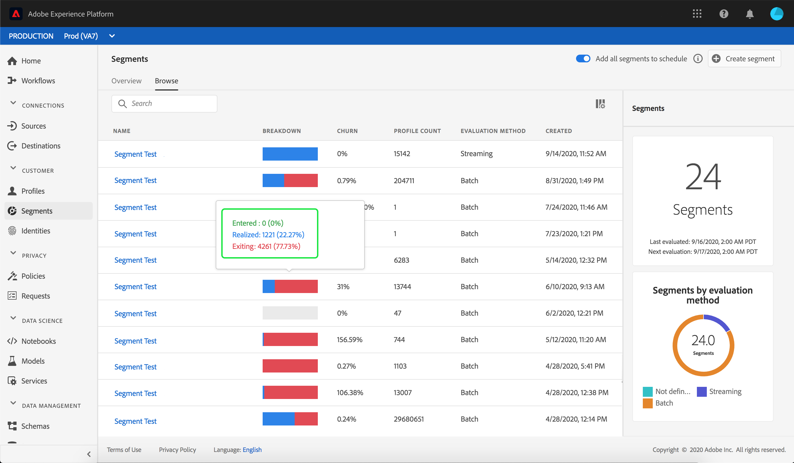
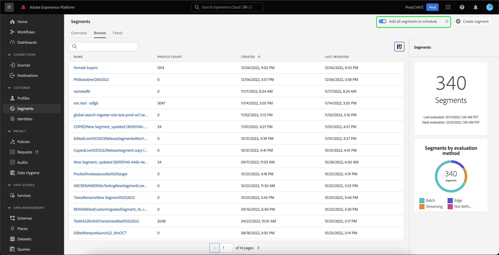

# Handleiding voor segmentatieservice

[!DNL Adobe Experience Platform Segmentation Service] biedt een gebruikersinterface voor het maken en beheren van segmentdefinities.

## Aan de slag

Het werken met segmentdefinities vereist een begrip van de diverse [!DNL Experience Platform] diensten betrokken bij segmentatie. Lees de documentatie voor de volgende services voordat u deze gebruikershandleiding leest:

- [[!DNL Segmentation Service]](../home.md):  [!DNL Segmentation Service] staat u toe om gegevens te verdelen die in  [!DNL Experience Platform] die individuen (zoals klanten, vooruitzichten, gebruikers, of organisaties) worden opgeslagen in kleinere groepen.
- [[!DNL Real-time Customer Profile]](../../profile/home.md): Verstrekt een verenigd, real-time consumentenprofiel dat op bijeengevoegde gegevens van veelvoudige bronnen wordt gebaseerd.
- [[!DNL Adobe Experience Platform Identity Service]](../../identity-service/home.md): Maakt het mogelijk om klantprofielen te maken door identiteiten te overbruggen van verschillende gegevensbronnen waarin ze worden opgenomen  [!DNL Platform].
- [[!DNL Experience Data Model (XDM)]](../../xdm/home.md): Het gestandaardiseerde kader waardoor de gegevens van de  [!DNL Platform] klantenervaring worden georganiseerd.

Het is ook belangrijk om twee belangrijke termen te kennen die in dit document worden gebruikt en het verschil tussen hen te begrijpen:
- **Segmentdefinitie**: De regelreeks die wordt gebruikt om zeer belangrijke eigenschappen of gedrag van een doelpubliek te beschrijven.
- **Publiek**: De resulterende set profielen die voldoen aan de criteria van een segmentdefinitie.

## Overzicht

Selecteer **[!UICONTROL Segments]** in de linkernavigatie in [[!DNL Experience Platform] UI](http://platform.adobe.com/) om het tabblad **[!UICONTROL Overview]** te openen. Dit tabblad bevat koppelingen naar documentatie en video&#39;s waarmee u segmenten kunt begrijpen en bewerken.

## Bladeren

Selecteer het tabblad **[!UICONTROL Browse]** om een lijst weer te geven met alle segmentdefinities voor uw IMS-organisatie.

Deze mening maakt een lijst van informatie over de segmentdefinitie met inbegrip van de uitsplitsing, de koeling, de profieltelling, de evaluatiemethode, gecreeerd datum, en laatst gewijzigde datum.

De uitsplitsing toont een staafgrafiek die het percentage van profielen schetst die tot elk van de volgende statussen behoren: [!UICONTROL Entered], [!UICONTROL Realized] en [!UICONTROL Exiting].

| Status | Beschrijving |
| ------ | ----------- |
| Ingegaan | Een nieuw profiel binnen het segment. |
| Gerealiseerd | Een bestaand profiel dat binnen het segment is gebleven. |
| Afsluiten | Een bestaand profiel dat het segment verlaat. |

De kolom vertegenwoordigt het percentage profielen die binnen een segmentdefinitie in vergelijking met de laatste tijd veranderen de segmentbaan liep, terwijl de profieltelling het totale aantal profielen vertegenwoordigt die voor het segment kwalificeren.

De evaluatiemethode kan streaming of batch zijn. Streaming segmenten worden voortdurend geëvalueerd terwijl gegevens in het systeem worden ingevoerd. De segmenten van de partij worden geëvalueerd volgens een vastgesteld programma.

Boven aan de pagina staan opties voor het toevoegen van alle segmenten aan een schema en het maken van een nieuw segment.

Als u **[!UICONTROL Add all segments to schedule]** in-/uitschakelt, wordt de geplande segmentatie ingeschakeld. Meer informatie over geplande segmentatie kan in [geplande segmenteringssectie van dit gebruikershandboek](#scheduled-segmentation) worden gevonden.

Als u **[!UICONTROL Create segment]** selecteert, gaat u naar de Segment Builder. Lees voor meer informatie over het maken van segmenten de sectie over [het maken van een segment in de gebruikershandleiding](#create-segment).

De rechterzijbalk bevat informatie over alle segmenten binnen de IMS-organisatie, met een overzicht van het totale aantal segmenten, de laatste evaluatiedatum, de volgende evaluatiedatum en een uitsplitsing van de segmenten naar evaluatiemethode.

Het selecteren van de rij van de segmentdefinitie verstrekt een samenvatting van de segmentdefinitie, met inbegrip van opties om of het segment uit te geven of te schrappen, het gekwalificeerde publiek voor het segment, de totale publieksgrootte, naast de naam van het segment, beschrijving, evaluatiemethode, gecreeerd datum, en laatst gewijzigde datum.

## Details segmentdefinitie {#segment-details}

Om meer details over een specifieke segmentdefinitie te zien, selecteer de naam van een segment binnen **[!UICONTROL Browse]** tabel.

De pagina met segmentdetails wordt weergegeven. Bovenaan, is er een samenvatting van de segmentdefinitie, informatie over de gekwalificeerde publieksgrootte, evenals bestemmingen het segment voor wordt geactiveerd.

### Overzicht van segment

De sectie **[!UICONTROL Segment summary]** bevat informatie zoals de id, naam, beschrijving en details van de kenmerken.

Bovendien kunt u het segment bewerken. Als u **[!UICONTROL Edit segment]** selecteert, wordt de [!DNL Segment Builder] weergegeven. Lees de [[!DNL Segment Builder] gebruikershandleiding](./segment-builder.md) voor meer informatie over het gebruik van de [!DNL Segment Builder]-werkruimte.

### Totaal aantal deelnemers in segment

In de sectie **[!UICONTROL Total audience in segment]** wordt het totale aantal profielen weergegeven dat in aanmerking komt voor het segment.

Schattingen worden gegenereerd door gebruik te maken van een steekproefgrootte van de samplegegevens van die dag. Als uw profielarchief minder dan 1 miljoen entiteiten bevat, wordt de volledige gegevensset gebruikt. voor tussen 1 en 20 miljoen entiteiten worden 1 miljoen entiteiten gebruikt; en voor meer dan 20 miljoen entiteiten wordt 5 % van de totale entiteiten gebruikt . Meer informatie over het produceren van segmentramingen kan in [schattingsgeneratiesectie](../tutorials/create-a-segment.md#estimate-and-preview-an-audience) van het de schepingsleerprogramma van het segment worden gevonden.

### Geactiveerde doelen

De **[!UICONTROL Activated destinations]** sectie toont de bestemmingen dat dit segment voor wordt geactiveerd.

>[!NOTE]
>
> Doelen zijn een functie die beschikbaar is bij [!DNL Real-time Customer Data Platform] en waarmee u gegevens kunt exporteren naar externe platforms. Voor meer informatie over bestemmingen, te lezen gelieve [bestemmingen overzicht](../../destinations/home.md). Om te leren hoe te om een segment aan een bestemming te activeren, te lezen gelieve [gids op het activeren van segmenten aan een bestemming](../../destinations/ui/activate-destinations.md).

### Profielvoorbeelden

Hieronder ziet u een voorbeeld van profielen die in aanmerking komen voor het segment, met gedetailleerde informatie zoals de [!DNL Profile]-id, voornaam, achternaam en persoonlijke e-mail.

De manier waarop gegevensbemonstering wordt geactiveerd, is afhankelijk van de innamemethode.

Voor batch-opname wordt de profielopslag automatisch elke 15 minuten gescand om te zien of een nieuwe batch is opgenomen sinds de laatste samplingtaak is uitgevoerd. Als dat het geval is, wordt de profielopslag gescand om te zien of is er minstens een 5% verandering in het aantal verslagen. Als aan deze voorwaarden wordt voldaan, wordt een nieuwe steekproefbaan teweeggebracht.

Voor het stromen opname, wordt de profielopslag automatisch gescand elk uur om te zien of is er minstens een 5% verandering in het aantal verslagen geweest. Als aan deze voorwaarde wordt voldaan, wordt een nieuwe steekproefbaan teweeggebracht.

De voorbeeldgrootte van de scan is afhankelijk van het totale aantal entiteiten in de profielopslag. Deze steekproefgrootte wordt vertegenwoordigd in de volgende lijst:

| Entiteiten in profielopslag | Voorbeeldformaat |
| ------------------------- | ----------- |
| Minder dan 1 miljoen | Volledige gegevensset |
| 1 tot 20 miljoen | 1 miljoen |
| Meer dan 20 miljoen | 5% van het totaal |

Meer gedetailleerde informatie over elke [!DNL Profile] kan worden gezien door [!DNL Profile] identiteitskaart te selecteren. Lees de [[!DNL Real-time Customer Profile] gebruikershandleiding](../../profile/ui/user-guide.md#profile-detail) voor meer informatie over de details van een profiel.

## Segment maken {#create-segment}

Als u **[!UICONTROL Create segment]** in de rechterbovenhoek selecteert, wordt de werkruimte [!DNL Segment Builder] geopend, waar u kunt beginnen met het maken van een segmentdefinitie.

### [!DNL Segment Builder] werkruimte

[!DNL Segment Builder] biedt een rijke werkruimte waarmee u kunt werken met  [!DNL Profile] gegevenselementen. De werkruimte biedt intuïtieve besturingselementen voor het maken en bewerken van regels, zoals tegels voor slepen en neerzetten die worden gebruikt om gegevenseigenschappen te vertegenwoordigen.

Lees de [[!DNL Segment Builder] gebruikershandleiding](./segment-builder.md) voor meer informatie over het gebruik van de [!DNL Segment Builder]-werkruimte.

## Geplande segmentatie {#scheduled-segmentation}

Zodra de segmentdefinities zijn gecreeerd, kunt u hen door op bestelling of geplande (ononderbroken) evaluatie dan evalueren. Evaluatie houdt in dat gegevens [!DNL Real-time Customer Profile] door segmentdefinities worden verplaatst om het overeenkomstige publiek te bereiken. Nadat het publiek is gemaakt, worden het opgeslagen en opgeslagen zodat het kan worden geëxporteerd met API&#39;s van [!DNL Experience Platform].

De evaluatie op bestelling impliceert het gebruiken van API om evaluatie uit te voeren en publiek te bouwen zoals nodig, terwijl de geplande evaluatie (die ook als &quot;geplande segmentatie&quot;wordt bekend) u toestaat om een terugkerend programma tot stand te brengen om segmentdefinities op een specifieke tijd (bij een maximum, eenmaal per dag) te evalueren.

### Geplande segmentatie {#enable-scheduled-segmentation} inschakelen

Het toelaten van uw segmentdefinities voor geplande evaluatie kan worden gedaan gebruikend UI of API. Ga in de gebruikersinterface terug naar het tabblad **[!UICONTROL Browse]** in **[!UICONTROL Segments]** en schakel **[!UICONTROL Add all segments to schedule]** in. Dit zal ertoe leiden dat alle segmenten worden geëvalueerd gebaseerd op het programma dat door uw organisatie wordt geplaatst.

>[!NOTE]
>
>De geplande evaluatie kan voor zandbakken met een maximum van vijf (5) fusiebeleid voor [!DNL XDM Individual Profile] worden toegelaten. Als uw organisatie meer dan vijf samenvoegingsbeleid voor [!DNL XDM Individual Profile] binnen één enkele zandbakmilieu heeft, zult u geen geplande evaluatie kunnen gebruiken.

Planningen kunnen momenteel alleen worden gemaakt met behulp van de API. Voor gedetailleerde stappen bij het creëren van, het uitgeven van, en het werken met programma&#39;s die API gebruiken, te volgen gelieve de zelfstudie voor het evalueren van en de toegang tot van segmentresultaten, specifiek de sectie over [geplande evaluatie gebruikend API](../tutorials/evaluate-a-segment.md#scheduled-evaluation).

## Streaming segmentatie {#streaming-segmentation}

Streaming segmentatie is de mogelijkheid om segmentatie uit te voeren op [!DNL Platform] in bijna realtime, terwijl de nadruk ligt op gegevensrijkdom. Met het stromen segmentatie, gebeurt de segmentkwalificatie nu aangezien de gegevens in [!DNL Platform] landen, die de behoefte verlichten om segmentatietaken te plannen en in werking te stellen.

Meer informatie over streamingsegmentatie vindt u in de [gebruikershandleiding voor streamingsegmentatie](./streaming-segmentation.md).

>[!NOTE]
>
>Opdat het stromen segmentatie aan het werk is, zult u geplande segmentatie voor de organisatie moeten toelaten. Voor meer informatie over het inschakelen van geplande segmentatie raadpleegt u [de sectie over streamingsegmentatie in deze gebruikershandleiding](#scheduled-segmentation).

## Randsegmentatie {#edge-segmentation}

De segmentatie van de rand is de capaciteit om segmenten in Platform op de rand onmiddellijk te evalueren, toelatend de zelfde pagina en volgende de gebruikscituaties van de paginagrootte.

Meer informatie over randsegmentatie vindt u in de [UI-hulplijn voor segmentatie van randen](./edge-segmentation.md)

## Beleidsovertredingen

>[!NOTE]
>
>Beleidsovertredingen zijn alleen van toepassing als u een segment maakt dat aan een doel is toegewezen.

Als u klaar bent met het maken van uw segment, wordt het segment geanalyseerd door Adobe Experience Platform Data Governance om ervoor te zorgen dat er geen beleidsovertredingen binnen het segment plaatsvinden. Zie [[!DNL Data Governance] overzicht](../../data-governance/home.md) voor meer informatie.

## Volgende stappen en extra bronnen {#next-steps}

De interface [!DNL Segmentation Service] biedt een rijke workflow waarmee u verhandelbare doelgroepen kunt isoleren van [!DNL Real-time Customer Profile]-gegevens.

Voor meer informatie over [!DNL Segmentation Service] leest u de documentatie. Lees de [[!DNL Segmentation Service] handleiding voor ontwikkelaars](../api/overview.md) voor meer informatie over het gebruik van de [!DNL Segmentation Service]-API.
