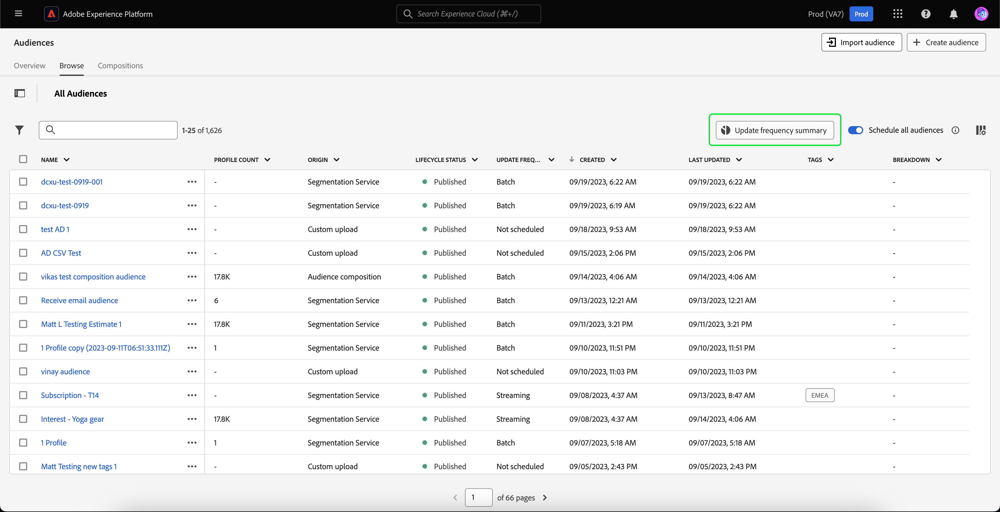
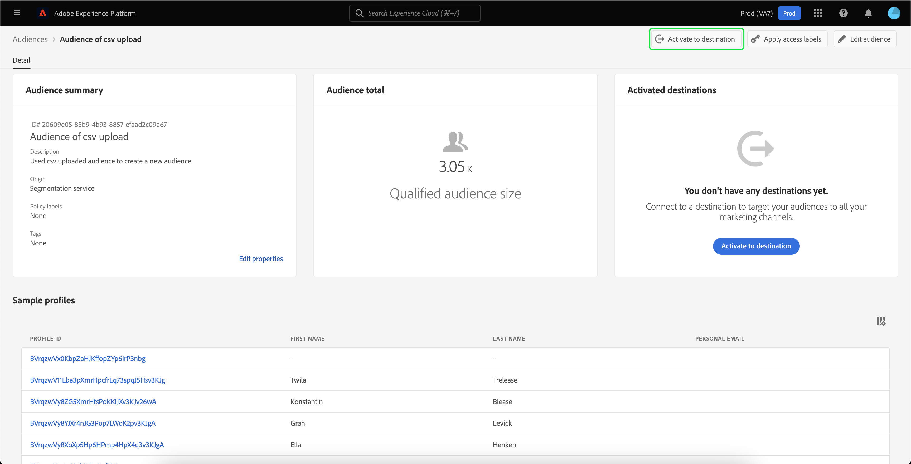

# Handleiding voor segmentatieservice

[!DNL Adobe Experience Platform Segmentation Service] biedt een gebruikersinterface voor het maken en beheren van publiek- en segmentdefinities.

## Aan de slag

Om met het publiek en de segmentdefinities te kunnen werken, is een goed begrip van de verschillende [!DNL Experience Platform] diensten in verband met segmentatie. Lees de documentatie voor de volgende services voordat u deze gebruikershandleiding leest:

- [[!DNL Segmentation Service]](../home.md): [!DNL Segmentation Service] staat u toe om gegevens te segmenteren die in worden opgeslagen [!DNL Experience Platform] dat betrekking heeft op individuen (zoals klanten, vooruitzichten, gebruikers, of organisaties) in kleinere groepen.
- [[!DNL Real-Time Customer Profile]](../../profile/home.md): Biedt een uniform, real-time consumentenprofiel dat is gebaseerd op geaggregeerde gegevens van meerdere bronnen.
- [[!DNL Adobe Experience Platform Identity Service]](../../identity-service/home.md): Schakelt het maken van klantprofielen in door identiteiten te overbruggen van verschillende gegevensbronnen waarin deze worden opgenomen [!DNL Platform].
- [[!DNL Experience Data Model (XDM)]](../../xdm/home.md): Het gestandaardiseerde kader waarbinnen [!DNL Platform] organiseert de gegevens van de klantenervaring. Als u de segmentatie het beste wilt gebruiken, moet u ervoor zorgen dat uw gegevens als profielen en gebeurtenissen worden opgenomen volgens de [best practices voor gegevensmodellering](../../xdm/schema/best-practices.md).

U zou twee zeer belangrijke termijnen ook moeten begrijpen die door dit document worden gebruikt en het verschil tussen hen begrijpen:

- **Publiek**: Een set personen met vergelijkbare gedragingen en/of kenmerken. Deze verzameling personen kan door Adobe Experience Platform worden gegenereerd met behulp van segmentdefinities of publiekscompositie (publiek dat door het platform wordt gegenereerd) of met behulp van externe bronnen, zoals aangepaste uploads (extern gegenereerd publiek).
- **Segmentdefinitie**: De regels die Adobe Experience Platform gebruikt om sleutelkenmerken of gedrag van een doelpubliek te beschrijven.
- **Segment**: Het scheiden van profielen in publiek.

## Overzicht

Selecteer in de gebruikersinterface van het Experience Platform de optie **[!UICONTROL Audiences]** in de linkernavigatie om de **[!UICONTROL Overview]** tabblad met het tabblad [!UICONTROL Audiences] dashboard.

>[!NOTE]
>
>Als uw organisatie nieuw aan Platform is en nog geen actieve datasets van het Profiel of gecreeerd samenvoegbeleid heeft, [!UICONTROL Audiences] het dashboard is niet zichtbaar. In plaats daarvan [!UICONTROL Overview] op het tabblad vindt u koppelingen en documentatie waarmee u aan de slag kunt gaan met het publiek.

### [!UICONTROL Audiences] dashboard {#segments-dashboard}

De **[!UICONTROL Audiences]** het dashboard schetst belangrijke metriek met betrekking tot de publieksgegevens van uw organisatie.

Ga voor meer informatie naar de [gebruikershandleiding in dashboard](../../dashboards/guides/audiences.md).

## Bladeren {#browse}

>[!CONTEXTUALHELP]
>id="platform_segments_browse_churncolumnname"
>title="Churn"
>abstract="Het churn vertegenwoordigt het percentage profielen dat binnen een publiek in vergelijking met de laatste tijd verandert de segmentbaan liep."

>[!CONTEXTUALHELP]
>id="platform_segments_browse_evaluationmethodcolumnname"
>title="Evaluatiemethode"
>abstract="Tot de evaluatiemethoden voor het publiek behoren batch, streaming en edge."

>[!CONTEXTUALHELP]
>id="platform_segments_browse_addallsegmentstoschedule"
>title="Alle soorten publiek aan planning toevoegen"
>abstract="Schakel deze optie in om alle beoordeelde soorten publiek op te nemen met behulp van batchsegmentatie in de geplande dagelijkse update. Uitschakelen om alle soorten publiek uit de geplande update te verwijderen."

Selecteer de **[!UICONTROL Browse]** tabblad om een lijst weer te geven met alle soorten publiek voor uw organisatie. Deze weergave bevat informatie over het publiek, zoals het aantal profielen, de oorsprong, de gemaakte datum, de datum waarop het laatst is gewijzigd, de codes en de indeling.

Naast elk publiek bevindt zich een ellipspictogram. Als u deze optie selecteert, wordt een lijst weergegeven met beschikbare snelle acties voor de doelgroep. Deze lijst met acties verschilt, afhankelijk van de oorsprong van het publiek.

![De lijst met snelle acties wordt weergegeven voor gebruikers met de oorsprong van [!UICONTROL Audience composition].](../images/ui/overview/browse-audience-composition-details.png)

| Actie | Oorsprong | Beschrijving |
| ------ | ------- | ----------- |
| [!UICONTROL Edit] | Segmenteringsservice | Hiermee kunt u Segment Builder openen om uw publiek te bewerken. Voor meer informatie over het gebruik van de Segment Builder leest u de [Handleiding voor de gebruikersinterface van Segment Builder](./segment-builder.md). |
| [!UICONTROL Open composition] | Samenstelling publiek | Hiermee kunt u de compositie van het publiek openen om uw publiek te zien. Lees voor meer informatie over de samenstelling van het publiek de [gebruikerscompositie-gebruikersgids](./audience-composition.md). |
| [!UICONTROL Activate to destination] | Segmenteringsservice | Hiermee activeert u het publiek naar een bestemming. Voor meer gedetailleerde informatie over het activeren van een publiek naar een bestemming, gelieve te lezen [activeringsoverzicht](../../destinations/ui/activation-overview.md). |
| [!UICONTROL Share with partners] | Auditie, Aangepaste upload, Segmentatieservice | Hiermee kunt u uw publiek delen met andere platformgebruikers. Lees voor meer informatie over deze functie de [Overzicht van afstemming van segment](./segment-match/overview.md). |
| [!UICONTROL Manage tags] | Auditie, Aangepaste upload, Segmentatieservice | Hiermee kunt u de door de gebruiker gedefinieerde tags beheren die bij het publiek horen. Lees voor meer informatie over deze functie de sectie over [filteren en labelen](#manage-audiences). |
| [!UICONTROL Move to folder] | Auditie, Aangepaste upload, Segmentatieservice | Hiermee kunt u bepalen tot welke map het publiek behoort. Lees voor meer informatie over deze functie de sectie over [filteren en labelen](#manage-audiences). |
| [!UICONTROL Copy] | Auditie, Aangepaste upload, Segmentatieservice | Hiermee dupliceert u het geselecteerde publiek. |
| [!UICONTROL Apply access labels] | Auditie, Aangepaste upload, Segmentatieservice | Hiermee kunt u de toegangslabels beheren die bij het publiek horen. Voor meer informatie over toegangslabels, te lezen gelieve de documentatie over [beheren, labels](../../access-control/abac/ui/labels.md). |
| [!UICONTROL Archive] | Aangepaste upload | Hiermee archiveert u het geselecteerde publiek. |
| [!UICONTROL Delete] | Auditie, Aangepaste upload, Segmentatieservice | Hiermee verwijdert u het geselecteerde publiek. |
| [!UICONTROL Add to package] | Auditie, Aangepaste upload, Segmentatieservice | Hiermee kunt u het publiek tussen sandboxen verplaatsen. Lees voor meer informatie over deze functie de [gereedschapshandleiding voor sandbox](../../sandboxes/ui/sandbox-tooling.md). |

>[!NOTE]
>
> U zult **niet** een publiek kunnen schrappen dat in een bestemmingsactivering wordt gebruikt.

Boven aan de pagina vindt u opties voor het toevoegen van alle soorten publiek aan een schema, het importeren van een publiek, het maken van een nieuw publiek en het weergeven van een uitsplitsing van de updatefrequentie.

Toggling **[!UICONTROL Schedule all audiences]** zal geplande segmentatie toelaten. Meer informatie over geplande segmentatie vindt u in de [geplande segmentatiesectie van deze gebruikershandleiding](#scheduled-segmentation).

Selecteren **[!UICONTROL Import audience]** Hiermee kunt u een extern gegenereerd publiek importeren. Meer informatie over het importeren van soorten publiek vindt u in de sectie over [een publiek importeren in de gebruikershandleiding](#import-audience).

Selecteren **[!UICONTROL Create audience]** Hiermee kunt u een publiek maken. Meer informatie over het maken van soorten publiek vindt u in de sectie [een publiek maken in de gebruikershandleiding](#create-audience).

U kunt **[!UICONTROL Update frequency summary]** om een cirkeldiagram te tonen dat de updatefrequentie toont.

Het cirkeldiagram wordt weergegeven met een uitsplitsing van het publiek naar updatefrequentie. In het diagram wordt het totale aantal doelgroepen in het midden weergegeven. Als u de muisaanwijzer boven de verschillende delen van het publiek houdt, wordt het aantal soorten publiek weergegeven dat tot elk type updatefrequentie behoort.

### Aanpassen {#customize}

U kunt extra velden toevoegen aan de [!UICONTROL Browse] pagina door . Deze extra velden bevatten de levenscyclusstatus, updatefrequentie, laatst bijgewerkt door, beschrijving, gemaakt door en toegangslabels.

| Veld | Beschrijving |
| ----- | ----------- |
| [!UICONTROL Name] | De naam van het publiek. |
| [!UICONTROL Profile count] | Het totale aantal profielen dat voor het publiek in aanmerking komt. |
| [!UICONTROL Origin] | De oorsprong van het publiek. Dit geeft aan waar het publiek vandaan komt. Mogelijke waarden zijn Segmentatieservice, Aangepast uploaden, Audience-compositie en Audience Manager. |
| [!UICONTROL Lifecycle status] | De status van het publiek. Mogelijke waarden voor dit veld zijn `Draft`, `Published`, en `Archived`. |
| [!UICONTROL Update frequency] | Een waarde die aangeeft hoe vaak de gegevens van het publiek worden bijgewerkt. Mogelijke waarden voor dit veld zijn [!UICONTROL Batch], [!UICONTROL Streaming], [!UICONTROL Edge], en [!UICONTROL Not Scheduled]. |
| [!UICONTROL Last updated by] | De naam van de persoon die het publiek het laatst heeft bijgewerkt. |
| [!UICONTROL Created] | De datum en tijd, in UTC, dat het publiek werd gecreeerd. |
| [!UICONTROL Last updated] | De datum en tijd, in UTC, waarop het publiek voor het laatst is bijgewerkt. |
| [!UICONTROL Tags] | De door de gebruiker gedefinieerde labels die bij het publiek horen. Meer informatie over deze tags vindt u in het gedeelte [sectie over tags](#tags). |
| [!UICONTROL Description] | De beschrijving van het publiek. |
| [!UICONTROL Created by] | De naam van de persoon die het publiek heeft gemaakt. |
| [!UICONTROL Access labels] | De toegangslabels voor het publiek. De etiketten van de toegang staan u toe om datasets en gebieden volgens gebruiksbeleid te categoriseren dat op die gegevens van toepassing is. Deze labels kunnen op elk gewenst moment worden toegepast, zodat u op flexibele wijze gegevens kunt beheren. Voor meer informatie over toegangslabels, te lezen gelieve de documentatie over [beheren, labels](../../access-control/abac/ui/labels.md). |
| [!UICONTROL Breakdown] | De indeling van de profielstatus voor het publiek. Hieronder vindt u een gedetailleerdere beschrijving van deze uitsplitsing naar profielstatus. |

Als de indeling is geselecteerd, wordt in het scherm een staafgrafiek weergegeven met het percentage profielen dat tot elk van de volgende berekende profielstatussen behoort: [!UICONTROL Realized], [!UICONTROL Existing], en [!UICONTROL Exiting]. Daarnaast wordt de uitsplitsing in de [!UICONTROL Browse] tab is de nauwkeurigste uitsplitsing van de status van de segmentdefinitie. Als dit getal afwijkt van wat staat vermeld op de knop [!UICONTROL Overview] gebruikt u de nummers op het tabblad [!UICONTROL Browse] als de juiste bron van informatie, aangezien [!UICONTROL Overview] tabnummers worden slechts eenmaal per dag bijgewerkt.

| Status | Beschrijving |
| ------ | ----------- |
| [!UICONTROL Realized] | Het aantal profielen dat **gekwalificeerd** voor het segment in de laatste 24 uur sinds de laatste batchsegmentbaan liep. |
| [!UICONTROL Existing] | Het aantal profielen dat **bleven** in het segment in de laatste 24 uur sinds de laatste batchsegmentbaan liep. |
| [!UICONTROL Exiting] | Het aantal profielen dat **verlaten** het segment in de laatste 24 uur sinds de laatste batchsegmentbaan liep. |

Nadat u de velden hebt geselecteerd die u wilt weergeven, kunt u ook de breedte van de weergegeven kolommen wijzigen. U kunt dit doen door het gebied tussen de kolommen te slepen of door het  van de kolom waarvan u het formaat wilt wijzigen, gevolgd door **[!UICONTROL Resize column]**.

### Filteren, mappen en coderen {#manage-audiences}

Om uw werkefficiëntie te verbeteren, kunt u zoeken naar bestaand publiek, door de gebruiker gedefinieerde labels toevoegen aan het publiek, het publiek in mappen plaatsen en het weergegeven publiek filteren.

**Zoeken** {#search}

U kunt uw bestaande publiek in maximaal 9 verschillende talen zoeken met [!DNL Unified Search].

Te gebruiken [!DNL Unified Search]voegt u de term die u wilt zoeken toe aan de gemarkeerde zoekbalk.

Voor meer informatie over [!DNL Unified Search], inclusief ondersteunde functies, kunt u de [Unified Search-documentatie](https://experienceleague.adobe.com/docs/core-services/interface/services/search-experience-cloud.html).

**Tags** {#tags}

U kunt door de gebruiker gedefinieerde tags toevoegen om uw publiek beter te beschrijven, te zoeken en te beheren.

Als u een tag wilt toevoegen, selecteert u **[!UICONTROL Manage tags]** voor het publiek dat u wilt labelen.

![De [!UICONTROL Manage tags] wordt geselecteerd voor een bepaald publiek.](../images/ui/overview/browse-manage-tags.png)

De **[!UICONTROL Manage tags]** wordt weergegeven. In deze pop-up kunt u een gecategoriseerde tag of een niet-gecategoriseerde tag selecteren.

| Type code | Beschrijving |
| -------- | ----------- |
| Gecategoriseerd | Een tag die wordt gemaakt en beheerd door de beheerders van uw organisatie. |
| Niet gecategoriseerd | Een tag die binnen het [!UICONTROL Manage tags] popover. Iedereen kan deze typen tags maken of beheren. |

![De [!UICONTROL Manage tags] popover wordt weergegeven. De opties voor het kiezen van een gecategoriseerde of niet-gecategoriseerde indeling worden gemarkeerd.](../images/ui/overview/create-tag.png)

Nadat u alle tags hebt toegevoegd die u aan het publiek wilt koppelen, selecteert u **[!UICONTROL Save]**.

![Op de [!UICONTROL Manage tags] popover, worden de toegevoegde markeringen benadrukt.](../images/ui/overview/created-tags.png)

Lees voor meer informatie over het maken en beheren van tags de [Handleiding voor tags beheren](../../administrative-tags/ui/managing-tags.md).

**Mappen** {#folders}

U kunt een publiek in mappen plaatsen voor een beter publieksbeheer.

Als u een publiek naar een map wilt verplaatsen, selecteert u **[!UICONTROL Move to folder]** voor het publiek dat u wilt verplaatsen.

![De [!UICONTROL Move to folder] wordt geselecteerd voor een specifiek publiek.](../images/ui/overview/browse-move-to-folder.png)

De **Publiek naar map verplaatsen** wordt weergegeven. Selecteer de map waarnaar u het publiek wilt verplaatsen en selecteer **[!UICONTROL Save]**.

Als het publiek zich in een map bevindt, kunt u ervoor kiezen alleen het publiek weer te geven dat tot een specifieke map behoort.

**Filter** {#filter}

U kunt uw publiek ook filteren op basis van verschillende instellingen.

Als u het beschikbare publiek wilt filteren, selecteert u de .

De lijst met beschikbare filters wordt weergegeven.

| Filter | Beschrijving |
| ------ | ----------- |
| [!UICONTROL Origin] | Hiermee kunt u filteren op basis van de oorsprong van het publiek. Beschikbare opties zijn onder andere Segmentatieservice, Aangepast uploaden, Audience-compositie en Audience Manager. |
| [!UICONTROL Has any tag] | Hiermee kunt u filteren op tags. U kunt kiezen tussen **[!UICONTROL Has any tag]** en **[!UICONTROL Has all tags]**. Wanneer **[!UICONTROL Has any tag]** geselecteerd is, omvat het gefilterde publiek **alle** van de tags die u hebt toegevoegd. Wanneer **[!UICONTROL Has all tags]** geselecteerd is, moet het gefilterde publiek **alles** van de tags die u hebt toegevoegd. |
| [!UICONTROL Lifecycle status] | Hiermee kunt u filteren op basis van de levenscyclusstatus van de doelgroep. Beschikbare opties zijn [!UICONTROL Active], [!UICONTROL Archived], [!UICONTROL Deleted], [!UICONTROL Draft], [!UICONTROL Inactive], en [!UICONTROL Published]. |
| [!UICONTROL Update frequency] | Hiermee kunt u filteren op basis van de updatefrequentie van de doelgroep. Beschikbare opties zijn [!UICONTROL Scheduled], [!UICONTROL Continuous], en [!UICONTROL On Demand]. |
| [!UICONTROL Created by] | Hiermee kunt u filteren op basis van de persoon die het publiek heeft gemaakt. |
| [!UICONTROL Creation date] | Hiermee kunt u filteren op basis van de aanmaakdatum van het publiek. U kunt een datumbereik kiezen dat u wilt filteren wanneer het publiek is gemaakt. |
| [!UICONTROL Modified date] | Hiermee kunt u filteren op basis van de laatste gewijzigde datum van het publiek. U kunt een datumbereik kiezen waarop u wilt filteren wanneer het publiek voor het laatst is gewijzigd. |

### Details publiek {#audience-details}

Als u meer details over een specifiek publiek wilt zien, selecteert u de naam van een publiek in het dialoogvenster **[!UICONTROL Browse]** tab.

De pagina met publieksdetails wordt weergegeven. Bovenaan, is er een samenvatting van het publiek, informatie over de gekwalificeerde publieksgrootte, evenals bestemmingen het segment wordt geactiveerd voor.

**Overzicht van publiek** {#segment-summary}

De **[!UICONTROL Audience summary]** bevat informatie zoals de id, naam, beschrijving, oorsprong en details van de kenmerken.

Daarnaast kunt u het publiek activeren, toegangslabels toepassen of het publiek bewerken/bijwerken.

Selecteren **[!UICONTROL Activate to destination]** Hiermee activeert u het publiek naar een bestemming. Voor meer gedetailleerde informatie over het activeren van een publiek naar een bestemming, gelieve te lezen [activeringsoverzicht](../../destinations/ui/activation-overview.md).

Selecteren **[!UICONTROL Apply access labels]** Hiermee kunt u de toegangslabels beheren die bij het publiek horen. Voor meer informatie over toegangslabels, te lezen gelieve de documentatie over [beheren, labels](../../access-control/abac/ui/labels.md).

>[!BEGINTABS]

>[!TAB Samenstelling publiek]

![De pagina met publieksdetails wordt weergegeven met de [!UICONTROL Open composition] gemarkeerd.](../images/ui/overview/audience-details-open-composition.png)

Selecteren **[!UICONTROL Open composition]** Hiermee kunt u uw publiek weergeven in Audience Composition. Lees voor meer informatie over Audience Composition de [Handleiding voor compositie van publiek](./audience-composition.md).

>[!TAB Aangepaste upload]

![De pagina met publieksdetails wordt weergegeven met de [!UICONTROL Update audience] gemarkeerd.](../images/ui/overview/audience-details-update-audience.png)

Selecteren **[!UICONTROL Update audience]** Hiermee kunt u een extern gegenereerd publiek opnieuw uploaden. Lees de sectie over het importeren van een extern gegenereerd publiek voor meer informatie over het importeren van [een publiek importeren](#import-audience).

>[!TAB Segmenteringsservice]

![De pagina met publieksdetails wordt weergegeven met de [!UICONTROL Edit audience] gemarkeerd.](../images/ui/overview/audience-details-edit-audience.png)

Selecteren **[!UICONTROL Edit audience]** Hiermee kunt u uw publiek bewerken in de Segment Builder. Voor meer informatie over het gebruik van de [!DNL Segment Builder] werkruimte, lees de [[!DNL Segment Builder] gebruikershandleiding](./segment-builder.md).

>[!ENDTABS]

Selecteren **[!UICONTROL Edit properties]** Hiermee kunt u de basisgegevens van het publiek bewerken, zoals de naam, beschrijving en tags.

**Totaal publiek** {#audience-total}

De **[!UICONTROL Audience total]** wordt het totale aantal profielen weergegeven dat voor het publiek in aanmerking komt.

Schattingen worden gegenereerd door gebruik te maken van een steekproefgrootte van de samplegegevens van die dag. Als uw profielarchief minder dan 1 miljoen entiteiten bevat, wordt de volledige gegevensset gebruikt; voor 1 tot 20 miljoen entiteiten worden 1 miljoen entiteiten gebruikt; en voor meer dan 20 miljoen entiteiten wordt 5% van de totale entiteiten gebruikt. Meer informatie over het genereren van schattingen vindt u in de [schatting van generatiesectie](../tutorials/create-a-segment.md#estimate-and-preview-an-audience) van de zelfstudie over het maken van een publiek.

**Geactiveerde doelen** {#activated-destinations}

De **[!UICONTROL Activated destinations]** toont de bestemmingen waarvoor dit publiek wordt geactiveerd.

>[!NOTE]
>
> Doelen zijn een functie die beschikbaar is bij [!DNL Adobe Real-Time Customer Data Platform]en kunt u gegevens exporteren naar externe platforms. Lees voor meer informatie over bestemmingen de [Overzicht van doelen](../../destinations/home.md). Leren hoe te om een segment aan een bestemming te activeren, zie [activeringsoverzicht](../../destinations/ui/activation-overview.md).

**Profielvoorbeelden** {#profile-samples}

Hieronder ziet u een voorbeeld van profielen die in aanmerking komen voor het segment, met gedetailleerde informatie zoals de [!DNL Profile] ID, voornaam, achternaam en persoonlijke e-mail.

De manier waarop gegevensbemonstering wordt geactiveerd, is afhankelijk van de innamemethode.

Voor batch-opname wordt de profielopslag automatisch elke 15 minuten gescand om te zien of een nieuwe batch is opgenomen sinds de laatste samplingtaak is uitgevoerd. Als dat het geval is, wordt de profielopslag gescand om te zien of is er minstens een 5% verandering in het aantal verslagen. Als aan deze voorwaarden wordt voldaan, wordt een nieuwe steekproefbaan teweeggebracht.

Voor het stromen opname, wordt de profielopslag automatisch gescand elk uur om te zien of is er minstens een 5% verandering in het aantal verslagen geweest. Als aan deze voorwaarde wordt voldaan, wordt een nieuwe steekproefbaan teweeggebracht.

De voorbeeldgrootte van de scan is afhankelijk van het totale aantal entiteiten in de profielopslag. Deze steekproefgrootte wordt vertegenwoordigd in de volgende lijst:

| Entiteiten in profielopslag | Voorbeeldformaat |
| ------------------------- | ----------- |
| Minder dan 1 miljoen | Volledige gegevensset |
| 1 tot 20 miljoen | 1 miljoen |
| Meer dan 20 miljoen | 5% van het totaal |

Meer gedetailleerde informatie over elk [!DNL Profile] kunt u zien door de [!DNL Profile] ID. Als u meer wilt weten over de details van een profiel, leest u de [[!DNL Real-Time Customer Profile] gebruikershandleiding](../../profile/ui/user-guide.md#profile-detail).

### Een publiek maken {#create-audience}

U kunt **[!UICONTROL Create audience]** om een publiek te maken.

Er wordt een pop-up weergegeven, zodat u kunt kiezen tussen het samenstellen van een publiek of het samenstellen van regels.

**Samenstelling publiek** {#audience-composition}

Selecteren **[!UICONTROL Compose audiences]** Hiermee gaat u naar Audience Composition. Deze werkruimte biedt intuïtieve besturingselementen voor het maken en bewerken van soorten publiek, zoals tegels voor slepen en neerzetten die worden gebruikt om verschillende handelingen weer te geven. Lees voor meer informatie over het maken van soorten publiek de [Hulplijn Audience Composition](./audience-composition.md).

**Segment Builder** {#segment-builder}

Selecteren **[!UICONTROL Build rule]** gaat u naar de Segment Builder. Deze werkruimte biedt intuïtieve besturingselementen voor het maken en bewerken van segmentdefinities, zoals tegels voor slepen en neerzetten die worden gebruikt om gegevenseigenschappen te vertegenwoordigen. Lees voor meer informatie over het maken van segmentdefinities de [Handleiding Segment Builder](./segment-builder.md)

### Een publiek importeren {#import-audience}

U kunt **[!UICONTROL Import audience]** een extern gegenereerd publiek importeren.

De **[!UICONTROL Import audience CSV]** wordt weergegeven. U kunt een CSV-bestand selecteren om te importeren als een extern gegenereerd publiek.

![In de [!UICONTROL Import audience CSV] werkschema, de [!UICONTROL Drag and drop files] wordt gemarkeerd en toont waar u uw extern gegenereerde publiek kunt uploaden.](../images/ui/overview/import-audience-csv.png)

>[!NOTE]
>
>Het externe gegenereerde publiek **moet** zijn in CSV-indeling, hebben een **maximum** van 11 kolommen en kleiner dan 1 GB.

Nadat u het CSV-bestand hebt geselecteerd dat u wilt importeren, wordt een lijst met voorbeeldgegevens weergegeven voor dit extern gegenereerde publiek. Nadat u hebt bevestigd dat de voorbeeldgegevens juist zijn, selecteert u **[!UICONTROL Next]**.

De **[!UICONTROL Audience details]** wordt weergegeven. U kunt informatie over uw publiek, met inbegrip van zijn naam, beschrijving, primaire identiteit, en de waarde van identiteitskaart toevoegen namespace.

Wanneer u het extern gegenereerde publiek importeert, moet u een van de kolommen selecteren als primair identiteitsveld en de naamruimtewaarde opgeven. Houd er rekening mee dat alle overige velden in aanmerking worden genomen **payload-kenmerken**. Deze kenmerken worden in overweging genomen **niet duurzaam**, aangezien zij alleen voor personalisatie met dit publiek in verband worden gebracht, en **niet** is verbonden met het profiel.

![De pagina [!UICONTROL Audience details] wordt weergegeven.](../images/ui/overview/import-audience-audience-details.png)

Nadat u de publieksdetails hebt ingevuld, selecteert u **[!UICONTROL Next]**.

![De [!UICONTROL Next] wordt gemarkeerd op de knop [!UICONTROL Audience details] pagina.](../images/ui/overview/import-audience-filled-details.png)

De pagina **[!UICONTROL Review]** wordt weergegeven. U kunt de details van uw onlangs ingevoerde extern geproduceerde publiek herzien.

![De [!UICONTROL Review] wordt weergegeven, met daarin details over het nieuwe, extern gegenereerde publiek.](../images/ui/overview/import-audience-review-details.png)

Nadat u hebt bevestigd dat de details juist zijn, selecteert u **[!UICONTROL Finish]** om uw extern gegenereerde publiek te importeren in Adobe Experience Platform.

>[!IMPORTANT]
>
>Extern gegenereerde doelgroepen hebben standaard een gegevensvervaldatum van 30 dagen. De gegevensvervaldatum wordt opnieuw ingesteld als het publiek op om het even welke manier wordt bijgewerkt of gewijzigd.
>
>Als uw extern gegenereerde publiek bovendien gevoelige en/of aan de gezondheidszorg gerelateerde informatie bevat, **moet** pas de noodzakelijke etiketten van het gegevensgebruik toe alvorens het op om het even welke bestemming te activeren. Voor meer informatie over het toepassen van labels voor gegevensgebruik leest u de documentatie op [beheren, labels](../../access-control/abac/ui/labels.md).

## Geplande segmentatie {#scheduled-segmentation}

Zodra het publiek is gecreeerd, kunt u hen dan evalueren door op bestelling of geplande (ononderbroken) evaluatie. Evaluatie betekent verplaatsen [!DNL Real-Time Customer Profile] gegevens door segmentbanen om overeenkomstige publiek te produceren. Nadat het publiek is gemaakt, wordt het opgeslagen en opgeslagen zodat het de doelgroep kan exporteren [!DNL Experience Platform] API&#39;s.

De evaluatie op bestelling impliceert het gebruiken van API om evaluatie uit te voeren en publiek te bouwen zoals nodig, terwijl de geplande evaluatie (die ook als &quot;geplande segmentatie&quot;wordt bekend) u toestaat om een terugkerend programma tot stand te brengen om publiek op een specifiek tijdstip (bij een maximum, eenmaal per dag) te evalueren.

### Geplande segmentatie inschakelen {#enable-scheduled-segmentation}

Het toelaten van uw publiek voor geplande evaluatie kan worden gedaan gebruikend UI of API. Ga in de gebruikersinterface terug naar de **[!UICONTROL Browse]** tab within **[!UICONTROL Audiences]** en inschakelen **[!UICONTROL Schedule all audiences]**. Hierdoor worden alle soorten publiek geëvalueerd op basis van het schema dat door uw organisatie is ingesteld.

>[!NOTE]
>
>De geplande evaluatie kan voor zandbakken met een maximum van vijf (5) fusiebeleid voor worden toegelaten [!DNL XDM Individual Profile]. Als uw organisatie meer dan vijf samenvoegbeleidsregels heeft voor [!DNL XDM Individual Profile] binnen één sandboxomgeving kunt u geen geplande evaluatie gebruiken.

Planningen kunnen momenteel alleen worden gemaakt met de API. Voor gedetailleerde stappen bij het maken, bewerken en werken met planningen met behulp van de API, volgt u de zelfstudie voor het evalueren van en het openen van segmentatieresultaten, met name de sectie over [geplande evaluatie met behulp van de API](../tutorials/evaluate-a-segment.md#scheduled-evaluation).

## Composities {#compositions}

Selecteer de **[!UICONTROL Compositions]** om een lijst van alle publiek te zien dat door de Samenstelling van het Publiek voor uw organisatie wordt geproduceerd.

Standaard wordt in deze weergave informatie weergegeven over het publiek, zoals de naam, status, gemaakte datum, gemaakt op, laatst bijgewerkte datum en laatst bijgewerkt op.

U kunt de  om te wijzigen welke velden worden weergegeven.

Er wordt een pop-up weergegeven met alle velden die in de tabel kunnen worden weergegeven.

| Veld | Beschrijving |
| ----- | ----------- | 
| [!UICONTROL Name] | De naam van het publiek. |
| [!UICONTROL Status] | De status van het publiek. Mogelijke waarden voor dit veld zijn `Draft`, `Published`, en `Archived`. |
| [!UICONTROL Created] | De tijd en datum waarop het publiek is gemaakt. |
| [!UICONTROL Created by] | De naam van de persoon die het publiek heeft gemaakt. |
| [!UICONTROL Updated] | De tijd en datum waarop het publiek voor het laatst is bijgewerkt. |
| [!UICONTROL Updated by] | De naam van de persoon die het publiek het laatst heeft bijgewerkt. |

Als u wilt zien hoe het publiek wordt samengesteld, selecteert u de naam van een publiek in het dialoogvenster [!UICONTROL Audiences] tab.

De pagina van de Samenstelling van het Publiek verschijnt met de bouwstenen die uw publiek vormen. Voor meer informatie over het gebruik van Audience Composition raadpleegt u de [Handleiding voor compositie van publiek](./audience-composition.md).

## Streaming segmentering {#streaming-segmentation}

Streaming segmentatie is de mogelijkheid om segmentatie uit te voeren op [!DNL Platform] in bijna real time, terwijl het concentreren op gegevensrijkdom. Met streamingsegmentatie gebeurt kwalificatie voor segmentatie nu als gegevens binnenkomen [!DNL Platform], om de noodzaak om segmentatietaken te plannen en uit te voeren te verlichten.

Meer informatie over streamingsegmentatie vindt u in het gedeelte [gebruikershandleiding voor streamingsegmentatie](./streaming-segmentation.md).

>[!NOTE]
>
>Opdat het stromen segmentatie aan het werk is, zult u geplande segmentatie voor de organisatie moeten toelaten. Raadpleeg voor meer informatie over het inschakelen van geplande segmentatie [het gedeelte voor streamingsegmentatie in deze gebruikershandleiding](#scheduled-segmentation).

## Randsegmentatie {#edge-segmentation}

De segmentatie van de rand is de capaciteit om publiek in Platform ogenblikkelijk op de rand te evalueren, toelatend de zelfde pagina en volgende het verpersoonlijkingsgebruiksgevallen van de paginagrootte.

Meer informatie over de segmentatie van de randen vindt u in de [gebruikersgids voor randsegmentatie](./edge-segmentation.md)

## Beleidsovertredingen

>[!NOTE]
>
>Beleidsovertredingen zijn alleen van toepassing als u een publiek maakt dat aan een doel is toegewezen.

Als u klaar bent met het maken van uw publiek, wordt het publiek geanalyseerd door Adobe Experience Platform Data Governance om ervoor te zorgen dat er geen beleidsovertredingen binnen het publiek plaatsvinden. Zie de [Overzicht van gegevensbeheer](../../data-governance/home.md) voor meer informatie .

## Volgende stappen en extra bronnen {#next-steps}

De [!DNL Segmentation Service] UI verstrekt een rijk werkschema dat u toestaat om verhandelbare soorten publiek van te creëren [!DNL Real-Time Customer Profile] gegevens.

Meer informatie over [!DNL Segmentation Service], doorgaat u met het lezen van de documentatie. Leren hoe u de [!DNL Segmentation Service] API, lees de [[!DNL Segmentation Service] ontwikkelaarsgids](../api/overview.md).
