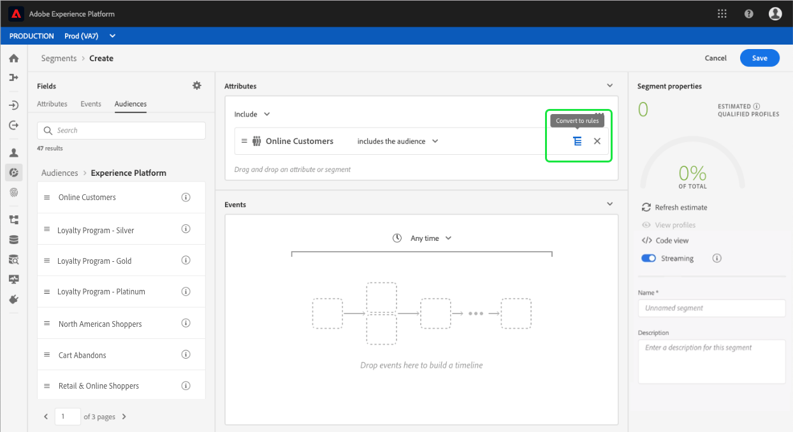
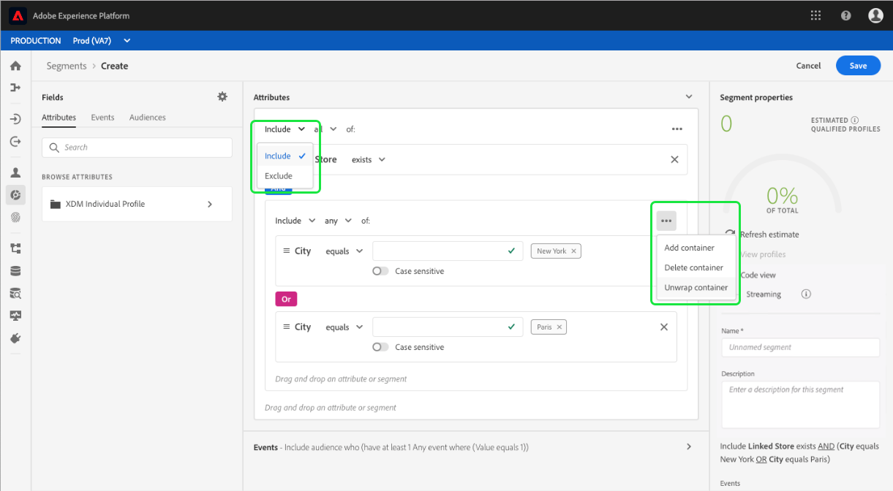
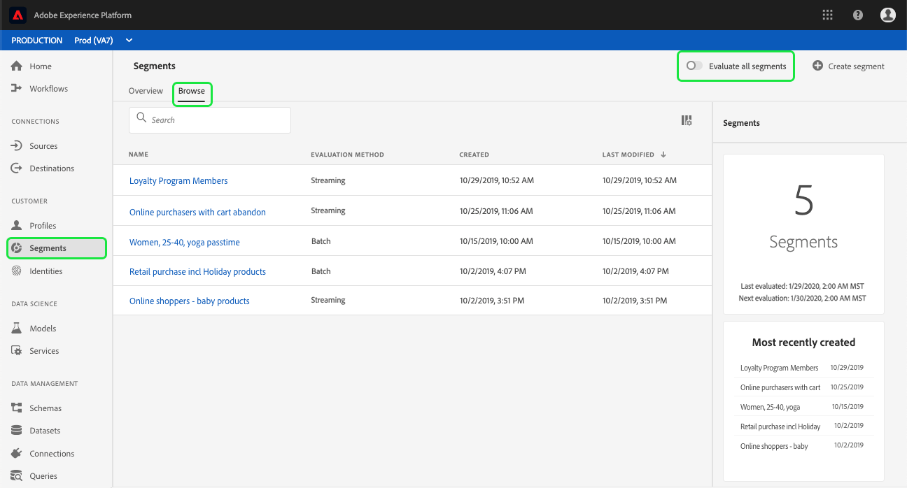

# [!UICONTROL Gebruikershandleiding voor Segment Builder]

[!DNL Adobe Experience Platform Segmentation Service] verstrekt een RESTful API en gebruikersinterface voor het creëren van segmentdefinities van [!DNL Real-time Customer Profile] gegevens.

## Aan de slag

Het werken met segmentdefinities vereist een begrip van de diverse [!DNL Experience Platform] diensten betrokken bij segmentatie. Lees de documentatie voor de volgende services voordat u deze gebruikershandleiding leest:

- [!DNL Segmentation Service](../home.md): De Dienst van de segmentatie staat u gegevens toe die in worden opgeslagen [!DNL Experience Platform] die op individuen (zoals klanten, vooruitzichten, gebruikers, of organisaties) betrekking hebben in kleinere groepen die gelijkaardige eigenschappen delen en op gelijkaardige marketing strategieën zullen antwoorden.
- [!DNL Real-time Customer Profile](../../profile/home.md): Verstrekt een verenigd, real-time consumentenprofiel dat op bijeengevoegde gegevens van veelvoudige bronnen wordt gebaseerd.
- [!DNL Identity Service](../../identity-service/home.md): Schakelt [!DNL Real-time Customer Profile] het overbruggen van identiteiten uit verschillende gegevensbronnen die in Platform worden opgenomen.
- [!DNL Experience Data Model (XDM)](../../xdm/home.md): Het gestandaardiseerde kader waardoor de gegevens van de klantenervaring worden [!DNL Platform] georganiseerd.

Het is ook belangrijk om twee belangrijke termen te kennen die in dit document worden gebruikt en het verschil tussen hen te begrijpen:
- **Segmentdefinitie**: De regelreeks die wordt gebruikt om zeer belangrijke eigenschappen of gedrag van een doelpubliek te beschrijven.
- **Publiek**: De resulterende set profielen die voldoen aan de criteria van een segmentdefinitie.

## Toegang tot segmentdefinities

Als u met segmentdefinities in wilt gaan werken, klikt u op [!DNL Adobe Experience Platform]Segmenten **** in de linkernavigatie. Om alle segmentdefinities voor uw organisatie te zien, klik op het *[!UICONTROL Browse]* lusje. Deze mening maakt een lijst van informatie over de segmentdefinitie met inbegrip van de evaluatiemethode, gecreeerd datum, en laatst gewijzigde datum.

De evaluatiemethode kan streaming of batch zijn. Streaming segmenten worden voortdurend geëvalueerd terwijl gegevens in het systeem worden ingevoerd. De segmenten van de partij worden geëvalueerd volgens een vastgesteld programma.

De segmenten van de partij hebben extra informatie getoond, die zowel de laatste evaluatiedatum als de volgende evaluatiedatum voor de partij tonen.

Als u in de rechterbovenhoek op Segment maken klikt, wordt de werkruimte van Segment Builder geopend. Hier kunt u een segmentdefinitie maken. ****

## [!UICONTROL De werkruimte van Segment Builder]

[!UICONTROL De Bouwer] van het segment verstrekt een rijke werkruimte die u toestaat om met [!DNL Profile] gegevenselementen in wisselwerking te staan. De werkruimte biedt intuïtieve besturingselementen voor het maken en bewerken van regels, zoals tegels voor slepen en neerzetten die worden gebruikt om gegevenseigenschappen te vertegenwoordigen.

## Bouwstenen voor segmentdefinitie

De basisbouwstenen van segmentdefinities zijn **[!UICONTROL Attributen]** en **[!UICONTROL Gebeurtenissen]**. Daarnaast kunnen de kenmerken en gebeurtenissen in het bestaande **[!UICONTROL publiek]** ook worden gebruikt als componenten voor nieuwe definities.

U kunt deze bouwstenen in de sectie van *Gebieden* op de linkerkant van de [!UICONTROL werkruimte van de Bouwer] van het Segment zien. *[!UICONTROL De gebieden]* bevatten een lusje voor elk van de belangrijkste bouwstenen: **[!UICONTROL Kenmerken]**, **[!UICONTROL Gebeurtenissen]** en **[!UICONTROL Soorten publiek]**.

### Attributen

Op het tabblad **[!UICONTROL Kenmerken]** kunt u door [!DNL Profile] kenmerken bladeren die tot de [!DNL XDM Individual Profile] klasse behoren. Elke map kan worden uitgevouwen om extra kenmerken weer te geven. Elk kenmerk is een tegel die naar het canvas voor regelbuilders in het midden van de werkruimte kan worden gesleept. Het canvas van de [regelbouwer](#rule-builder-canvas) wordt meer in detail besproken later in deze gids.

### Gebeurtenissen

Op het tabblad **[!UICONTROL Gebeurtenissen]** kunt u een publiek maken op basis van gebeurtenissen of acties die hebben plaatsgevonden met XDM ExperienceEvent-gegevenselementen. U kunt gebeurtenistypen ook vinden op het tabblad **[!UICONTROL Gebeurtenissen]** . Dit is een verzameling veelgebruikte gebeurtenissen waarmee u uw segmenten sneller kunt maken.

U kunt niet alleen naar [!DNL ExperienceEvent] elementen bladeren, maar ook naar gebeurtenistypen zoeken. Gebeurtenistypen gebruiken dezelfde coderingslogica als [!DNL ExperienceEvents], zonder dat u door de [!DNL XDM ExperienceEvent] klasse hoeft te zoeken om de juiste gebeurtenis te zoeken. Als u bijvoorbeeld met de zoekbalk zoekt naar &quot;winkelwagentje&quot;, worden de gebeurtenistypen &quot;[!UICONTROL AddCart]&quot; en &quot;[!UICONTROL RemoveCart]&quot; geretourneerd. Dit zijn twee veelgebruikte tekenacties bij het samenstellen van segmentdefinities.

Elk type component kan worden gezocht door zijn naam in de onderzoeksbar te typen, die de onderzoekssyntaxis [van](https://docs.microsoft.com/en-us/azure/search/query-lucene-syntax)Lucene gebruikt. De zoekresultaten beginnen te vullen wanneer hele woorden worden ingevoerd. Als u bijvoorbeeld een regel wilt maken die is gebaseerd op het XDM-veld, `ExperienceEvent.commerce.productViews`typt u &quot;productweergaven&quot; in het zoekveld. Nadat u het woord &quot;product&quot; hebt getypt, worden de zoekresultaten weergegeven. Elk resultaat bevat de objecthiërarchie waartoe het behoort.

>[!NOTE] De het schemagebieden van de douane die door uw organisatie worden bepaald kunnen tot 24 uren aan verschijnen en beschikbaar voor gebruik in het bouwen van regels vergen.

U kunt dan gemakkelijk slepen en laten vallen [!DNL ExperienceEvents] en de Types [!UICONTROL van] Gebeurtenis in uw segmentdefinitie.

Standaard worden alleen gevulde schemavelden uit de gegevensopslag weergegeven. Dit geldt ook voor [!UICONTROL gebeurtenistypen]. Als de lijst [!UICONTROL Gebeurtenistypen] niet zichtbaar is of u alleen &quot;[!UICONTROL Willekeurig]&quot; als [!UICONTROL gebeurtenistype]kunt selecteren, klikt u op het tandwielpictogram naast *[!UICONTROL Velden]* en selecteert u Volledig XDM-schema **** ** tonen onder Beschikbare velden. Klik nogmaals op het tandwielpictogram om terug te keren naar het tabblad *[!UICONTROL Velden]* en u moet nu meerdere [!UICONTROL gebeurtenistypen] en schemavelden kunnen weergeven, ongeacht of deze gegevens bevatten of niet.

### Soorten publiek

Op het tabblad **[!UICONTROL Soorten publiek]** worden alle soorten publiek weergegeven die zijn geïmporteerd uit externe bronnen, zoals Adobe Audience Manager, en ook het publiek dat binnen is gemaakt [!DNL Experience Platform].

Op het tabblad [!UICONTROL Soorten publiek] ziet u alle beschikbare bronnen als een groep mappen. Terwijl u in deze mappen klikt, zijn de beschikbare submappen en doelgroepen zichtbaar. Bovendien kunt u op het mappictogram (zoals getoond in uiterst rechtse beeld) klikken om de omslagstructuur (een vinkje wijst op de omslag u momenteel in bent) en gemakkelijk terug door omslagen te navigeren door op de naam van een omslag in de boom te klikken.

U kunt de muisaanwijzer boven de ⓘ naast een doelgroep houden om informatie over het publiek weer te geven, zoals de id, beschrijving en maphiërarchie, om het publiek te zoeken.

U kunt ook naar [!UICONTROL Soorten publiek] zoeken met de zoekbalk, die de zoeksyntaxis [van](https://docs.microsoft.com/en-us/azure/search/query-lucene-syntax)Lucene gebruikt. Als u op het tabblad *[!UICONTROL Soorten publiek]* een map op hoofdniveau selecteert, wordt de zoekbalk weergegeven, zodat u in die map kunt zoeken. Zoekresultaten beginnen pas te worden gevuld wanneer hele woorden zijn ingevoerd. Als u bijvoorbeeld een [!UICONTROL publiek] wilt zoeken met de naam `Online Shoppers`, typt u &quot;Online&quot; in de zoekbalk. Nadat het woord &quot;Online&quot; volledig is getypt, worden zoekresultaten met het woord &quot;Online&quot; weergegeven.

## Rule builder canvas {#rule-builder-canvas}

Een segmentdefinitie is een inzameling van regels die worden gebruikt om zeer belangrijke kenmerken of gedrag van een doelpubliek te beschrijven. Deze regels worden gecreeerd gebruikend het canvas *[!UICONTROL van de]* regelbouwer, dat in het centrum van de Bouwer [!UICONTROL van het]Segment wordt gevestigd.

Als u een nieuwe regel wilt toevoegen aan de segmentdefinitie, sleept u een tegel van het tabblad *[!UICONTROL Velden]* en zet u deze neer op het canvas van de regelbuilder. Vervolgens krijgt u contextspecifieke opties, afhankelijk van het type gegevens dat u wilt toevoegen. Beschikbare gegevenstypen zijn: tekenreeksen, datums, [!DNL ExperienceEvents], [!UICONTROL gebeurtenistypen]en [!UICONTROL Soorten publiek].

### Soorten publiek toevoegen

U kunt een publiek van het lusje van het *[!UICONTROL Publiek]* op het canvas van de regelbouwer slepen en laten vallen om publiekslidmaatschap in de nieuwe segmentdefinitie te verwijzen. Dit staat u toe om publiekslidmaatschap als attribuut in de nieuwe segmentregel te omvatten of uit te sluiten.

Voor [!DNL Platform] publiek dat gebruikend de Bouwer [!UICONTROL van het]Segment wordt gecreeerd, krijgt u de optie om het publiek in de reeks regels om te zetten die in de segmentdefinitie voor dat publiek werden gebruikt. Deze omzetting maakt een exemplaar van de regellogica, die dan kan worden gewijzigd zonder de originele segmentdefinitie te beïnvloeden. Zorg ervoor dat u recente wijzigingen in de segmentdefinitie hebt opgeslagen voordat u deze omzet in regellogica.

>[!NOTE] Wanneer u een publiek uit een externe bron toevoegt, wordt alleen verwezen naar het publiekslidmaatschap. U kunt het publiek niet in regels omzetten, en daarom kunnen de regels die worden gebruikt om het originele publiek tot stand te brengen niet in de nieuwe segmentdefinitie worden gewijzigd.

Als er conflicten optreden wanneer een publiek wordt omgezet in regels, probeert [!UICONTROL Segment Builder] de bestaande opties optimaal te behouden.

### Codeweergave

Alternatief, kunt u een code-gebaseerde versie van een regel bekijken die in de Bouwer [!UICONTROL van het]Segment wordt gecreeerd. Zodra u uw regel binnen het canvas van de regelbouwer hebt gecreeerd, kunt u de mening **[!UICONTROL van de]** Code selecteren om uw segment als PQL te zien.

De mening van de code verstrekt een knoop die u toestaat om de waarde van het segment in API vraag te kopiëren. Om de recentste versie van het segment te krijgen, zorg ervoor u uw recentste veranderingen in het segment hebt bewaard.

## Containers

Segmentregels worden geëvalueerd in de volgorde waarin ze worden weergegeven. De containers staan controle over de orde van uitvoering door het gebruik van genestelde vragen toe.

Zodra u minstens één tegel aan het canvas van de regelbouwer hebt toegevoegd, kunt u beginnen om containers toe te voegen. Als u een nieuwe container wilt maken, klikt u op de ovalen (...) in de rechterbovenhoek van de tegel en klikt u op Container **** toevoegen.

Een nieuwe container wordt weergegeven als het onderliggende element van de eerste container, maar u kunt de hiërarchie aanpassen door de containers te slepen en te verplaatsen. Het standaardgedrag van een container is om het kenmerk, de gebeurtenis of het publiek dat wordt geleverd, op te[!UICONTROL nemen]. U kunt de regel instellen op Profielen[!UICONTROL uitsluiten]die voldoen aan de containercriteria door te klikken op **[!UICONTROL Opnemen]** in de linkerbovenhoek van de tegel en vervolgens &quot;[!UICONTROL Uitsluiten]&quot; te selecteren.

Een onderliggende container kan ook inline worden geëxtraheerd en toegevoegd aan de bovenliggende container door op de onderliggende container op de knop &#39;container opheffen&#39; te klikken. Klik op de ovalen (...) in de rechterbovenhoek van de onderliggende container om deze optie te openen.

Nadat u op **[!UICONTROL Omloopcontainer]** ongedaan maken hebt geklikt, wordt de onderliggende container verwijderd en worden de criteria inline weergegeven.

>[!NOTE] Wanneer het unwrapping containers, zorg ervoor dat de logica de gewenste segmentdefinitie blijft ontmoeten.

## Beleid samenvoegen

[!DNL Experience Platform] laat u toe om gegevens uit veelvoudige bronnen te brengen en het te combineren om een volledige mening van elk van uw individuele klanten te zien. Wanneer het samenbrengen van deze gegevens, is het fusiebeleid de regels die [!DNL Platform] gebruiken om te bepalen hoe de gegevens aan voorrang zullen worden gegeven en welke gegevens zullen worden gecombineerd om een profiel tot stand te brengen.

U kunt een samenvoegbeleid selecteren dat overeenkomt met uw marketingdoel voor dit publiek of het standaardsamenvoegbeleid gebruiken dat wordt geboden door [!DNL Platform]. U kunt meerdere samenvoegbeleidsregels maken die uniek zijn voor uw organisatie, waaronder het maken van uw eigen standaardbeleid voor samenvoegen. Voor geleidelijke instructies bij het creëren van fusiebeleid voor uw organisatie, te zien gelieve de zelfstudie over het [werken met fusiebeleid gebruikend UI](../../profile/ui/merge-policies.md).

Als u een samenvoegbeleid voor uw segmentdefinitie wilt selecteren, klikt u op het tandwielpictogram op het tabblad *[!UICONTROL Velden]* en gebruikt u het vervolgkeuzemenu *[!UICONTROL Beleid]*samenvoegen om het samenvoegbeleid te selecteren dat u wilt gebruiken.

## Segmenteigenschappen

Wanneer het bouwen van een segmentdefinitie, toont de sectie van de Eigenschappen *[!UICONTROL van het]* Segment op de rechterkant van de werkruimte een schatting van de grootte van het resulterende segment, toestaand u om uw segmentdefinitie zonodig aan te passen alvorens het publiek zelf te bouwen.

In de sectie *[!UICONTROL Segmenteigenschappen]* kunt u ook belangrijke informatie over de segmentdefinitie opgeven, zoals de *[!UICONTROL naam]* en de *[!UICONTROL beschrijving]*. De definitienamen van het segment worden gebruikt om uw segment onder die te identificeren die door uw organisatie worden bepaald en zouden daarom beschrijvend, beknopt, en uniek moeten zijn.

Terwijl u de segmentdefinitie verder ontwikkelt, kunt u een gepagineerde voorvertoning van het publiek weergeven door Profielen **** weergeven te selecteren.

>[!NOTE] De schattingen van het publiek worden geproduceerd door een steekproefgrootte van de steekproefgegevens van die dag te gebruiken. Als uw profielarchief minder dan 1 miljoen entiteiten bevat, wordt de volledige gegevensset gebruikt. voor tussen 1 en 20 miljoen entiteiten worden 1 miljoen entiteiten gebruikt; en voor meer dan 20 miljoen entiteiten wordt 5 % van de totale entiteiten gebruikt . Meer informatie over het produceren van segmentramingen kan in de sectie [van de de](../tutorials/create-a-segment.md#estimate-and-preview-an-audience) schattingsproductie van de sectievan de segmentverwezenlijking worden gevonden.

## Geplande segmentatie inschakelen {#enable-scheduled-segmentation}

Zodra de segmentdefinities zijn gecreeerd, kunt u hen door op bestelling of geplande (ononderbroken) evaluatie dan evalueren. Evaluatie houdt in dat [!DNL Real-time Customer Profile] gegevens door segmentdefinities worden verplaatst om het overeenkomstige publiek te bereiken. Nadat het publiek is gemaakt, wordt het opgeslagen en opgeslagen zodat het kan worden geëxporteerd met [!DNL Experience Platform] API&#39;s.

De evaluatie op bestelling impliceert het gebruiken van API om evaluatie uit te voeren en publiek te bouwen zoals nodig, terwijl de geplande evaluatie (die ook als &quot;geplande segmentatie&quot;wordt bekend) u toestaat om een terugkerend programma tot stand te brengen om segmentdefinities op een specifieke tijd (bij een maximum, eenmaal per dag) te evalueren.

Het toelaten van uw segmentdefinities voor geplande evaluatie kan worden gedaan gebruikend UI of API. In UI, terugkeer naar het *[!UICONTROL Browse]* lusje binnen **[!UICONTROL Segmenten]** en knevel op **[!UICONTROL Evaluate alle segmenten]**. Dit zal ertoe leiden dat alle segmenten worden geëvalueerd gebaseerd op het programma dat door uw organisatie wordt geplaatst.

>[!NOTE] De geplande evaluatie kan voor zandbakken met een maximum van vijf (5) fusiebeleid voor worden toegelaten [!DNL XDM Individual Profile]. Als uw organisatie meer dan vijf samenvoegingsbeleid voor [!DNL XDM Individual Profile] binnen één enkele zandbakmilieu heeft, zult u geen geplande evaluatie kunnen gebruiken.

Planningen kunnen momenteel alleen worden gemaakt met behulp van de API. Voor gedetailleerde stappen bij het creëren van, het uitgeven van, en het werken met programma&#39;s die API gebruiken, te volgen gelieve de leerprogramma&#39;s voor het evalueren van en de toegang tot van segmentresultaten, specifiek de sectie over [geplande evaluatie gebruikend API](../tutorials/evaluate-a-segment.md#scheduled-evaluation).

## Streaming segmentering {#streaming-segmentation}

>[!NOTE] Opdat het stromen segmentatie aan het werk is, zal de klant geplande segmentatie voor de organisatie moeten toelaten. Raadpleeg voor meer informatie over het inschakelen van geplande segmentatie [de vorige sectie in deze gebruikershandleiding](#enable-scheduled-segmentation).

Een query wordt automatisch geëvalueerd met streaming segmentatie als deze aan een van de volgende criteria voldoet:

| Type query | Details | Voorbeeld |
| ---------- | ------- | ------- |
| Binnenkomende hit | Elke segmentdefinitie die verwijst naar één binnenkomende gebeurtenis zonder tijdbeperking. |  |
| Binnenkomende hit binnen relatief tijdvenster | Elke segmentdefinitie die verwijst naar één binnenkomende gebeurtenis **in de laatste zeven dagen**. |  |
| Binnenkomende hit die verwijst naar een profiel | Elke segmentdefinitie die verwijst naar één binnenkomende gebeurtenis, zonder tijdbeperking, en een of meer profielkenmerken. |  |
| Binnenkomende hit die verwijst naar een profiel binnen een relatief tijdvenster | Elke segmentdefinitie die verwijst naar één binnenkomende gebeurtenis en een of meer profielkenmerken, **binnen de afgelopen zeven dagen**. |  |
| Meerdere gebeurtenissen die naar een profiel verwijzen | Elke segmentdefinitie die verwijst naar meerdere gebeurtenissen **in de afgelopen 24 uur** en (optioneel), heeft een of meer profielkenmerken. |  |

In de volgende sectie worden voorbeelden van segmentdefinities weergegeven die **niet** zijn ingeschakeld voor streamingsegmentatie.

| Type query | Details |
| ---------- | ------- | 
| Binnenkomende hit binnen relatief tijdvenster | Als de segmentdefinitie naar een inkomende gebeurtenis verwijst die **niet** binnen de **laatste zeven-dagperiode** valt. Bijvoorbeeld binnen de **laatste twee weken**. |  |
| Binnenkomende hit die verwijst naar een profiel binnen een relatief venster | De volgende opties bieden **geen** ondersteuning voor streamingsegmentatie:<ul><li>Een binnenkomende gebeurtenis **die zich niet** binnen de **laatste periode** van zeven dagen bevindt.</li><li>Een segmentdefinitie die [!DNL Adobe Audience Manager (AAM)] segmenten of kenmerken bevat.</li></ul> |  |
| Meerdere gebeurtenissen die naar een profiel verwijzen | De volgende opties bieden **geen** ondersteuning voor streamingsegmentatie:<ul><li>Een gebeurtenis die **niet** optreedt binnen **de laatste 24 uur**.</li><li>Een segmentdefinitie die Adobe Audience Manager (AAM) segmenten of eigenschappen omvat.</li></ul> |  |
| Vragen over meerdere entiteiten | Vraagstukken met meerdere entiteiten worden over het geheel genomen **niet** ondersteund door streamingsegmentatie. |  |

Daarnaast zijn enkele richtlijnen van toepassing wanneer streamingsegmentatie wordt uitgevoerd:

| Type query | Richtsnoer |
| ---------- | -------- |
| Query voor één gebeurtenis | Het terugkijkvenster is beperkt tot **zeven dagen**. |
| Query uitvoeren met gebeurtenisgeschiedenis | <ul><li>Het terugkijkvenster is beperkt tot **één dag**.</li><li>Tussen de gebeurtenissen **moet** een strikte voorwaarde voor de tijdvolgorde bestaan.</li><li>Slechts worden de eenvoudige tijdorden (vóór en na) tussen de gebeurtenissen toegestaan.</li><li>De afzonderlijke gebeurtenissen **kunnen niet** worden genegeerd. De gehele query **kan** echter worden genegeerd.</li></ul> |

### Segmentering van streaming controleren

Nadat u een segment hebt gemaakt dat geschikt is voor streaming, kunt u de details van dat segment controleren.

Specifiek, worden de details over de *[!UICONTROL totale gekwalificeerde publieksgrootte]* getoond. Als een baan binnen de laatste 24 uren in werking is gesteld, wordt de **[!UICONTROL Totale Grootte]** van de Publiek van de baan getoond, naast een lijngrafiek voor het toegevoegde publiek. Anders wordt naast een trendlijn voor visualisatie ook de **[!UICONTROL geschatte grootte]** van het publiek weergegeven.

De extra informatie over de laatste segmentevaluatie kan worden gevonden door de informatiebel te klikken.

## Beleidsovertredingen DULE

>[!NOTE] De DULE beleidsschendingen zijn slechts van toepassing als u een segment creeert dat aan een bestemming is toegewezen.

Zodra u klaar bent creërend uw segment, zal het segment door worden geanalyseerd [!DNL Data Governance] om ervoor te zorgen dat er geen beleidsschendingen binnen het segment zijn. Voor meer informatie over DULE en beleidsovertredingen raadpleegt u het overzicht [van de](../../data-governance/labels/overview.md)gegevensgebruikslabel.

## Volgende stappen

De Bouwer van het segment verstrekt een rijk werkschema toelatend u om verhandelbare doelgroepen van [!DNL Real-time Customer Profile] gegevens te isoleren. Na het lezen van deze handleiding moet u nu in staat zijn om:

- Maak segmentdefinities met een combinatie van kenmerken, gebeurtenissen en bestaand publiek als bouwstenen.
- Gebruik het canvas en de containers van de regelbouwer om de orde te controleren waarin de segmentregels worden uitgevoerd.
- De schattingen van de mening van uw potentiële publiek, toestaand u om uw segmentdefinities zonodig aan te passen.
- Schakel alle segmentdefinities in voor geplande segmentatie.
- Hiermee kunt u opgegeven segmentdefinities voor streaming segmentatie inschakelen.

Zie de zelfstudie voor het [!DNL Segmentation Service] maken van publiekssegmenten met behulp van API&#39;s voor stapsgewijze instructies voor het werken met [!DNL Segmentation Service] de [APIs](../tutorials/create-a-segment.md) .