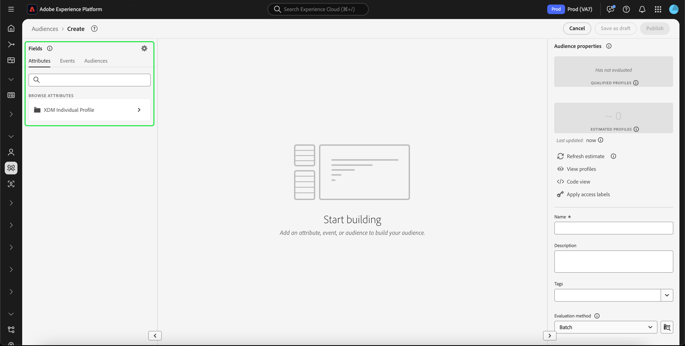

# [!DNL Segment Builder] UI-hulplijn

>[!NOTE]
>
>Deze gids verklaart hoe te om publiek door **segmentdefinities** tot stand te brengen gebruikend de Bouwer van het Segment. Leren hoe te om publiek tot stand te brengen gebruikend de Samenstelling van het Publiek, te lezen gelieve de [ gids UI van de Samenstelling van het Publiek ](./audience-composition.md).

[!DNL Segment Builder] biedt een rijke werkruimte waarmee u kunt werken met [!DNL Profile] -gegevenselementen. De werkruimte biedt intuïtieve besturingselementen voor het maken en bewerken van regels, zoals tegels voor slepen en neerzetten die worden gebruikt om gegevenseigenschappen te vertegenwoordigen.

## Bouwstenen voor segmentdefinitie {#building-blocks}

>[!CONTEXTUALHELP]
>id="platform_segments_createsegment_segmentbuilder_fields"
>title="Velden"
>abstract="De drie veldtypen waaruit een segmentdefinitie bestaat, zijn kenmerken, gebeurtenissen en doelgroepen. Met kenmerken kunt u Profielkenmerken gebruiken die horen bij de klasse Individueel profiel XDM, gebeurtenissen kunt u een publiek maken op basis van handelingen of gebeurtenissen die plaatsvinden met XDM ExperienceEvent-gegevenselementen en publiek kunt geïmporteerde soorten publiek uit externe bronnen gebruiken."

De basisbouwstenen van segmentdefinities zijn attributen en gebeurtenissen. Daarnaast kunnen de kenmerken en gebeurtenissen in bestaande doelgroepen worden gebruikt als componenten voor nieuwe definities.

U kunt deze bouwstenen zien in de sectie **[!UICONTROL Fields]** aan de linkerkant van de [!DNL Segment Builder] -werkruimte. **[!UICONTROL Fields]** bevat een lusje voor elk van de belangrijkste bouwstenen: &quot;[!UICONTROL Attributes]&quot;, &quot;[!UICONTROL Events]&quot;, en &quot;[!UICONTROL Audiences]&quot;.

### Attributen

Op het tabblad **[!UICONTROL Attributes]** kunt u door [!DNL Profile] -kenmerken bladeren die tot de klasse [!DNL XDM Individual Profile] behoren. Elke map kan worden uitgevouwen om extra kenmerken weer te geven. Elk kenmerk is een tegel die naar het canvas voor regelbuilders in het midden van de werkruimte kan worden gesleept. Het [ canvas van de regelbouwer ](#rule-builder-canvas) wordt besproken meer in detail later in deze gids.

### Gebeurtenissen

Op het tabblad **[!UICONTROL Events]** kunt u een publiek maken op basis van gebeurtenissen of acties die hebben plaatsgevonden met behulp van [!DNL XDM ExperienceEvent] -gegevenselementen. U kunt gebeurtenistypen ook vinden op het tabblad **[!UICONTROL Events]** . Dit zijn een verzameling veelgebruikte gebeurtenissen waarmee u uw segmentdefinities sneller kunt maken.

U kunt niet alleen zoeken naar [!DNL ExperienceEvent] -elementen, maar ook naar gebeurtenistypen. Gebeurtenistypen gebruiken dezelfde coderingslogica als [!DNL ExperienceEvents], zonder dat u door de klasse [!DNL XDM ExperienceEvent] hoeft te zoeken om de juiste gebeurtenis te vinden. Bijvoorbeeld, die de onderzoeksbar gebruiken om &quot;wortel&quot;te zoeken keert de Types &quot;[!UICONTROL AddCart]&quot;van Gebeurtenis en &quot;[!UICONTROL RemoveCart] terug, die twee zeer vaak gebruikte kartacties zijn wanneer het bouwen van segmentdefinities.

Om het even welk type van component kan worden gezocht door zijn naam in de onderzoeksbar te typen, die [ het onderzoekssyntaxis van Lucene ](https://docs.microsoft.com/en-us/azure/search/query-lucene-syntax) gebruikt. De zoekresultaten beginnen te vullen wanneer hele woorden worden ingevoerd. Als u bijvoorbeeld een regel wilt maken op basis van het XDM-veld `ExperienceEvent.commerce.productViews` , typt u &quot;productweergaven&quot; in het zoekveld. Nadat u het woord &quot;product&quot; hebt getypt, worden de zoekresultaten weergegeven. Elk resultaat bevat de objecthiërarchie waartoe het behoort.

>[!NOTE]
>
>De het schemagebieden van de douane die door uw organisatie worden bepaald kunnen tot 24 uren aan verschijnen en beschikbaar voor gebruik in het bouwen van regels vergen.

Vervolgens kunt u [!DNL ExperienceEvents] en &quot;[!UICONTROL Event Types]&quot; eenvoudig naar uw segmentdefinitie slepen.

Standaard worden alleen gevulde schemavelden uit de gegevensopslag weergegeven. Dit omvat &quot;[!UICONTROL Event Types]&quot;. Als &quot;[!UICONTROL Event Types]&quot;lijst niet zichtbaar is, of u slechts &quot; [!UICONTROL Any]&quot;als &quot;[!UICONTROL Event Type]&quot;kunt selecteren, selecteer het **tandwielpictogram** naast **[!UICONTROL Fields]**, dan uitgezocht **[!UICONTROL Show full XDM schema]** onder **[!UICONTROL Available Fields]**. Selecteer het **tandwielpictogram** opnieuw om aan het **[!UICONTROL Fields]** lusje terug te keren en u zou veelvoudige &quot;[!UICONTROL Event Types]&quot;en schemagebieden nu moeten kunnen bekijken, ongeacht of zij gegevens bevatten of niet.

#### Gegevenssets van Adobe Analytics-rapportsuite

U kunt gegevens uit één of meerdere Adobe Analytics-rapportreeksen gebruiken als gebeurtenissen binnen de segmentatie.

Wanneer het gebruiken van gegevens van één enkele het rapportreeks van Analytics, zal Platform automatisch beschrijvers en vriendschappelijke namen aan Vars toevoegen, die het gemakkelijker maken om die gebieden binnen [!DNL Segment Builder] te vinden.

Wanneer het gebruiken van gegevens van de veelvoudige het rapportreeksen van de Analyse, kan het Platform **niet** automatisch beschrijvers of vriendschappelijke namen aan eVars toevoegen. Dientengevolge, alvorens de gegevens van Analytics rapportreeksen te gebruiken, moet u aan XDM gebieden in kaart brengen. Meer informatie over de variabelen van de afbeeldingsanalyse aan XDM kan in de [ bron van Adobe Analytics verbindingsgids ](../../sources/tutorials/ui/create/adobe-applications/analytics.md#mapping) worden gevonden.

Neem bijvoorbeeld een situatie waarin u twee rapportsuites met de volgende variabelen had:

| Veld | Report Suite Schema A | Report Suite Schema B |
| ----- | --------------------- | --------------------- |
| eVar1 | Referentiedomein | Aangemeld in Y/N |
| eVar2 | Paginanaam | Lidmaatschap-ID |
| eVar3 | URL | Paginanaam |
| eVar4 | Zoekvoorwaarden | Productnaam |
| event1 | Klikken | Paginaweergaven |
| event2 | Paginaweergaven | Extra winkelwagentjes |
| event3 | Extra winkelwagentjes | Afbeeldingen |
| event4 | Aankopen | Aankopen |

In dit geval, kon u de twee rapportreeksen met het volgende schema in kaart brengen:

>[!NOTE]
>
>Terwijl de generische waarden van eVar nog bevolkt worden, zou u **niet** hen in uw segmentdefinities (als mogelijk) moeten gebruiken, aangezien de waarden verschillende dingen konden betekenen dan wat zij oorspronkelijk in hun rapporten waren.

Zodra de rapportsuites in kaart zijn gebracht, kunt u deze onlangs in kaart gebrachte gebieden binnen uw op profiel-betrekking hebbende werkschema&#39;s en segmentatie gebruiken.

| Scenario | Unieschema-ervaring | Segmentatie generieke variabele | Aan segment toegewezen variabele |
| -------- | ----------------------- | ----------------------------- | ---------------------------- |
| Single-rapportenpakket | Beschrijvende naam wordt opgenomen in algemene variabelen.   **Voorbeeld:** Naam van de Pagina (eVar2) | <ul><li>Beschrijvende naam opgenomen met algemene variabelen</li><li>De vraag gebruikt gegevens van de specifieke dataset, aangezien het de enige is</li></ul> | Query&#39;s kunnen gebruikmaken van Adobe Analytics-gegevens en mogelijk andere bronnen. |
| Meerdere rapportsuites | Bij generieke variabelen worden geen beschrijvingen van vriendelijke namen opgenomen.   **Voorbeeld:** eVar2 | <ul><li>Elk veld met meerdere beschrijvingen wordt algemeen weergegeven. Dit betekent dat er geen vriendelijke namen worden weergegeven in de gebruikersinterface.</li><li>De vragen kunnen gegevens van om het even welke datasets gebruiken die de eVar bevatten, die in gemengde of onjuiste resultaten kunnen resulteren.</li></ul> | De vraag gebruikt correct gecombineerde resultaten van veelvoudige datasets. |

### Doelgroepen

>[!NOTE]
>
>Voor publiek dat binnen Platform wordt gecreeerd, slechts zal het publiek dat het **zelfde** fusiebeleid heeft worden getoond.

Het tabblad **[!UICONTROL Audiences]** bevat een lijst met alle soorten publiek die zijn geïmporteerd uit externe bronnen, zoals Adobe Audience Manager of Customer Journey Analytics, en alle soorten publiek die zijn gemaakt in [!DNL Experience Platform] .

Op het tabblad **[!UICONTROL Audiences]** kunt u alle beschikbare bronnen weergeven als een groep mappen. Terwijl u de mappen selecteert, zijn de beschikbare submappen en doelgroepen zichtbaar. Bovendien kunt u het mappictogram (zoals weergegeven in de afbeelding uiterst rechts) selecteren om de mapstructuur weer te geven (een vinkje geeft de map aan die u momenteel in hebt) en eenvoudig terug te navigeren door de mappen door de naam van een map in de boomstructuur te selecteren.

U kunt de muisaanwijzer boven de ⓘ naast een doelgroep houden om informatie over het publiek weer te geven, zoals de id, beschrijving en maphiërarchie, om het publiek te zoeken.

U kunt naar publiek ook zoeken gebruikend de onderzoeksbar, die [ het onderzoekssyntaxis van Lucene ](https://docs.microsoft.com/en-us/azure/search/query-lucene-syntax) gebruikt. Als u op het tabblad **[!UICONTROL Audiences]** een map op hoofdniveau selecteert, wordt de zoekbalk weergegeven, zodat u in die map kunt zoeken. Zoekresultaten beginnen pas te worden gevuld wanneer hele woorden zijn ingevoerd. Als u bijvoorbeeld een publiek zoekt met de naam `Online Shoppers` , typt u &quot;Online&quot; in de zoekbalk. Nadat het woord &quot;Online&quot; volledig is getypt, worden zoekresultaten met het woord &quot;Online&quot; weergegeven.

## Rule builder canvas {#rule-builder-canvas}

>[!IMPORTANT]
>
>Vanaf de release van juni 2024 vertegenwoordigen de tijdbeperkingen &quot;Deze maand&quot; en &quot;Dit jaar&quot; respectievelijk &quot;maand-tot-datum&quot; en &quot;jaar-tot-datum&quot;. Als u bijvoorbeeld op 18 juli een publiek hebt gemaakt dat op zoek was naar &quot;alle klanten van wie de verjaardag deze maand plaatsvindt&quot;, krijgt het publiek alle klanten van wie de verjaardagen tussen 1 juli en 31 juli hebben plaatsgevonden. Op 1 augustus, zou dit publiek alle klanten krijgen van wie verjaardag van 1 augustus aan 31 augustus voorkomt.
>
>Eerder vertegenwoordigden &quot;Deze maand&quot; en &quot;dit jaar&quot; respectievelijk 30 dagen en 365 dagen, die geen rekening hielden voor maanden met 31 dagen en schrikkeljaren.
>
>Als u de logica van uw publiek wilt bijwerken, slaat u het eerder gemaakte publiek opnieuw op.

Een segmentdefinitie is een inzameling van regels die worden gebruikt om zeer belangrijke kenmerken of gedrag van een doelpubliek te beschrijven. Deze regels worden gecreeerd gebruikend het canvas van de regelbouwer, dat in het centrum van [!DNL Segment Builder] wordt gevestigd.

Als u een nieuwe regel wilt toevoegen aan de segmentdefinitie, sleept u een tegel van de tab **[!UICONTROL Fields]** naar het canvas van de regelbuilder. Vervolgens krijgt u contextspecifieke opties, afhankelijk van het type gegevens dat u wilt toevoegen. Beschikbare gegevenstypen zijn: tekenreeksen, datums, [!DNL ExperienceEvents] , &quot;[!UICONTROL Event Types]&quot; en soorten publiek.

>[!IMPORTANT]
>
>De meest recente wijzigingen in Adobe Experience Platform hebben het gebruik van de logische operatoren `OR` en `AND` tussen gebeurtenissen bijgewerkt. Deze updates zijn niet van invloed op bestaande segmentdefinities. Nochtans, zullen alle verdere updates aan bestaande segmentdefinities en pas gecreëerde segmentdefinities door deze veranderingen worden beïnvloed. Gelieve te lezen de [ update van tijdconstanten ](./segment-refactoring.md) voor meer informatie.

Wanneer u een waarde voor het kenmerk selecteert, wordt een lijst met opsommingswaarden weergegeven die het kenmerk kan bevatten.

Als u een waarde in deze lijst met nummers selecteert, krijgt de waarde een effen rand. Nochtans, voor gebieden die `meta:enum` (zachte) opsommingen gebruiken, kunt u een waarde ook selecteren die **niet** van de lijst van lijsten is. Als u uw eigen waarde maakt, krijgt deze de omtrek met een gestippelde rand en een waarschuwing dat deze waarde niet in de opsommingslijst voorkomt.

Als u meerdere waarden maakt, kunt u deze allemaal tegelijk toevoegen door de bulkupload te gebruiken. Selecteer het  om **[!UICONTROL Add values in bulk]** popover te tonen.

In de pop-up **[!UICONTROL Add values in bulk]** kunt u een CSV- of TSV-bestand uploaden.

U kunt ook handmatig door komma&#39;s gescheiden waarden toevoegen.

Er zijn maximaal 250 waarden toegestaan. Als u deze hoeveelheid overschrijdt, moet u enkele waarden verwijderen voordat u meer waarden toevoegt.

### Soorten publiek toevoegen

U kunt een publiek van het **[!UICONTROL Audience]** lusje op het canvas van de regelbouwer slepen en laten vallen om publiekslidmaatschap in de nieuwe segmentdefinitie te verwijzen. Dit staat u toe om publiekslidmaatschap als attribuut in de nieuwe regels van de segmentdefinitie te omvatten of uit te sluiten.

Voor [!DNL Platform] publiek dat met [!DNL Segment Builder] wordt gecreeerd, krijgt u de optie om het publiek in de reeks regels om te zetten die in de segmentdefinitie voor dat publiek werden gebruikt. Deze omzetting maakt een exemplaar van de regellogica, die dan kan worden gewijzigd zonder de originele segmentdefinitie te beïnvloeden. Zorg ervoor dat u recente wijzigingen in de segmentdefinitie hebt opgeslagen voordat u deze omzet in regellogica.

>[!NOTE]
>
>Wanneer u een publiek uit een externe bron toevoegt, wordt alleen verwezen naar het publiekslidmaatschap. U kunt het publiek niet in regels omzetten, en daarom kunnen de regels die worden gebruikt om het originele publiek tot stand te brengen niet in de nieuwe segmentdefinitie worden gewijzigd.

Als er conflicten optreden wanneer een publiek wordt omgezet in regels, probeert [!DNL Segment Builder] de bestaande opties zo goed mogelijk te behouden.

### Codeweergave

U kunt ook een op code gebaseerde versie weergeven van een regel die is gemaakt in de [!DNL Segment Builder] . Zodra u uw regel binnen het canvas van de regelbouwer hebt gecreeerd, kunt u selecteren **[!UICONTROL Code view]** om uw segmentdefinitie als PQL te zien.

De mening van de code verstrekt een knoop die u toestaat om de waarde van de segmentdefinitie aan gebruik in API vraag te kopiëren. Om de recentste versie van de segmentdefinitie te krijgen, zorg ervoor u uw recentste veranderingen in de segmentdefinitie hebt bewaard.

### Samenvoegingsfuncties

Een aggregatie in [!DNL Segment Builder] is een berekening op een groep XDM-kenmerken waarvan het gegevenstype een getal is (een getal of een geheel getal). De vier gesteunde samenvoegingsfuncties binnen de Bouwer van het Segment zijn SUM, GEMIDDELD, MIN, en MAX.

Als u een aggregatiefunctie wilt maken, selecteert u een gebeurtenis in de linkertrack en voegt u deze in de container van [!UICONTROL Events] in.

Nadat u de gebeurtenis in de container Gebeurtenissen hebt geplaatst, selecteert u het pictogram Ovalen (...), gevolgd door **[!UICONTROL Aggregate]** .

De samenvoeging wordt nu toegevoegd. U kunt nu de aggregatiefunctie selecteren, kiezen welk kenmerk wordt geaggregeerd, de gelijkheidsfunctie en de waarde. In het onderstaande voorbeeld zou deze segmentdefinitie elk profiel kwalificeren dat een som aangekochte waarden heeft die groter is dan $100, zelfs als elke afzonderlijke aankoop minder dan $100 is.

### Telfuncties {#count-functions}

De functies van de telling in de Bouwer van het Segment worden gebruikt om gespecificeerde gebeurtenissen te zoeken en het aantal tijden te tellen zij worden gedaan. De gesteunde telfuncties in de Bouwer van het Segment zijn &quot;minstens&quot;, &quot;hoogstens&quot;, &quot;Precies&quot;, &quot;tussen&quot;, en &quot;allen&quot;.

Als u een telfunctie wilt maken, selecteert u een gebeurtenis in de linkertrack en voegt u deze in de container van [!UICONTROL Events] in.

Nadat u de gebeurtenis in de container Gebeurtenissen hebt geplaatst, selecteert u de knop [!UICONTROL At least 1] .

De telfunctie wordt nu toegevoegd. U kunt nu de telfunctie en de waarde van de functie selecteren. In het onderstaande voorbeeld ziet u hoe u elke gebeurtenis met ten minste één klik opneemt.

## Containers

Segmentregels worden geëvalueerd in de volgorde waarin ze worden weergegeven. De containers staan controle over de orde van uitvoering door het gebruik van genestelde vragen toe.

Zodra u minstens één tegel aan het canvas van de regelbouwer hebt toegevoegd, kunt u beginnen om containers toe te voegen. Als u een nieuwe container wilt maken, selecteert u de ellipsen (...) in de rechterbovenhoek van de tegel en selecteert u vervolgens **[!UICONTROL Add container]** .

Een nieuwe container wordt weergegeven als het onderliggende element van de eerste container, maar u kunt de hiërarchie aanpassen door de containers te slepen en te verplaatsen. Het standaardgedrag van een container is &quot;[!UICONTROL Include]&quot;de attributen, de gebeurtenis, of het publiek verstrekte. U kunt de regel aan &quot;[!UICONTROL Exclude]&quot;profielen plaatsen die de containercriteria door **[!UICONTROL Include]** in de linkerbovenhoek van de tegel te selecteren en &quot;[!UICONTROL Exclude]&quot;te selecteren.

Een onderliggende container kan ook inline worden geëxtraheerd en toegevoegd aan de bovenliggende container door &quot;container opheffen&quot; te selecteren in de onderliggende container. Selecteer de ellipsen (...) in de hoger-juiste hoek van de kindcontainer om tot deze optie toegang te hebben.

Nadat u **[!UICONTROL Unwrap container]** hebt geselecteerd, wordt de onderliggende container verwijderd en worden de criteria inline weergegeven.

>[!NOTE]
>
>Wanneer het unwrapping containers, zorg ervoor dat de logica de gewenste segmentdefinitie blijft ontmoeten.

## Beleid samenvoegen

>[!CONTEXTUALHELP]
>id="platform_segmentation_createSegment_segmentBuilder_mergePolicies"
>title="Beleid samenvoegen"
>abstract="Met een samenvoegbeleid kunt u verschillende gegevenssets samenvoegen tot uw profiel. Platform heeft een standaardbeleid voor samenvoeging verschaft of u kunt een nieuw standaardbeleid voor samenvoegen maken in profielen. Kies een samenvoegbeleid dat overeenkomt met uw marketingdoel voor dit publiek."

Met [!DNL Experience Platform] kunt u gegevens uit meerdere bronnen samenvoegen en combineren om een volledige weergave van elk van uw individuele klanten weer te geven. Wanneer u deze gegevens samenbrengt, worden in [!DNL Platform] regels gebruikt voor het samenvoegen van gegevens om te bepalen hoe de prioriteit van gegevens wordt bepaald en welke gegevens worden gecombineerd om een profiel te maken.

U kunt een samenvoegbeleid selecteren dat aansluit bij uw marketingdoel voor dit publiek of het standaardsamenvoegbeleid gebruiken dat wordt geboden door [!DNL Platform] . U kunt meerdere samenvoegbeleidsregels maken die uniek zijn voor uw organisatie, waaronder het maken van uw eigen standaardbeleid voor samenvoegen. Voor geleidelijke instructies bij het creëren van fusiebeleid voor uw organisatie, gelieve te beginnen door het [ overzicht van het samenvoegingsbeleid ](../../profile/merge-policies/overview.md) te lezen.

Als u een samenvoegbeleid voor uw segmentdefinitie wilt selecteren, selecteert u het tandwielpictogram op het tabblad **[!UICONTROL Fields]** en selecteert u het samenvoegbeleid dat u wilt gebruiken in het vervolgkeuzemenu **[!UICONTROL Merge Policy]** .

## Eigenschappen voor segmentdefinitie {#segment-properties}

>[!CONTEXTUALHELP]
>id="platform_segments_createsegment_segmentbuilder_segmentproperties"
>title="Eigenschappen voor segmentdefinitie"
>abstract="In de sectie Eigenschappen van segmentdefinitie wordt een schatting weergegeven van de grootte van de resulterende segmentdefinitie, waarbij het aantal gekwalificeerde profielen wordt weergegeven in vergelijking met het totale aantal profielen. Dit staat u toe om uw segmentdefinitie zonodig aan te passen alvorens het publiek zelf te bouwen."

>[!CONTEXTUALHELP]
>id="platform_segments_createsegment_segmentbuilder_refreshestimate"
>title="Ramingen vernieuwen"
>abstract="U kunt de ramingen van uw segmentdefinitie verfrissen om onmiddellijk een voorproef van te zien hoeveel profielen voor de voorgestelde segmentdefinitie zouden kwalificeren. De schattingen van het publiek worden geproduceerd door een steekproefgrootte van de steekproefgegevens van die dag te gebruiken."
>additional-url="https://experienceleague.adobe.com/docs/experience-platform/segmentation/tutorials/create-a-segment.html#estimate-and-preview-an-audience" text="Een publiek schatten en voorvertonen"

Wanneer het bouwen van een segmentdefinitie, **[!UICONTROL Audience properties]** sectie op de rechterkant van de werkruimte toont een schatting van de grootte van de resulterende segmentdefinitie, die u toestaat om uw segmentdefinitie aan te passen zoals nodig alvorens het publiek zelf te bouwen.

**[!UICONTROL Qualified Profiles]** wijst op het **daadwerkelijke** aantal profielen die de regels van de segmentdefinitie aanpassen. Dit aantal werkt om de 24 uur bij, nadat de baan van de segmentevaluatie is gelopen.

De timestamp voor gekwalificeerde profielen wijst op de meest recente **partij** baan van de segmentevaluatie en **** getoond niet {voor gesegmenteerde definities gebruikend het stromen of randsegmentatie. Als u de segmentdefinitie uitgeeft, zal het aantal gekwalificeerde profielen het zelfde blijven tot de volgende baan van de segmentevaluatie in werking wordt gesteld.

**[!UICONTROL Estimated Profiles]** wijst op een **benaderend** aantal profielen die van de **steekproefbaan** worden gebaseerd. U kunt een bijgewerkte versie van deze waarde zien nadat u de nieuwe regels of voorwaarden hebt toegevoegd en **[!UICONTROL Refresh estimate]** hebt geselecteerd. Als u de informatiballon selecteert, krijgt u de foutdrempel en de meest recente tijd van de voorbeeldtaak.

In de sectie **[!UICONTROL Audience properties]** kunt u ook belangrijke informatie over de segmentdefinitie opgeven, zoals de naam, beschrijving en evaluatietype. De definitienamen van het segment worden gebruikt om uw segmentdefinitie onder die te identificeren die door uw organisatie worden bepaald en zouden daarom beschrijvend, beknopt, en uniek moeten zijn.

Terwijl u de segmentdefinitie verder ontwikkelt, kunt u een gepagineerde voorvertoning van het publiek weergeven door **[!UICONTROL View Profiles]** te selecteren.

>[!NOTE]
>
>De schattingen van het publiek worden geproduceerd door een steekproefgrootte van de steekproefgegevens van die dag te gebruiken. Als uw profielarchief minder dan 1 miljoen entiteiten bevat, wordt de volledige gegevensset gebruikt; voor 1 tot 20 miljoen entiteiten worden 1 miljoen entiteiten gebruikt; en voor meer dan 20 miljoen entiteiten wordt 5% van de totale entiteiten gebruikt.
>
>Bovendien is deze schatting gebaseerd op het tijdstip waarop de laatste voorbeeldtaak voor het profiel is uitgevoerd. Dit betekent dat als u een relatieve datumfunctie zoals &quot;Vandaag&quot;of &quot;Deze week&quot;gebruikt, de schatting zijn berekeningen van de laatste runtime van de profielsteekproefbaan zal baseren. Als vandaag bijvoorbeeld 24 januari is en de laatste voorbeeldtaak voor het profiel op 22 januari is uitgevoerd, wordt de relatieve datumfunctie &#39;Gisteren&#39; gebaseerd op 21 januari en niet op 23 januari.
>
>Meer informatie over het produceren van ramingen voor segmentdefinities kan in de [ sectie van de schatingengeneratie ](../tutorials/create-a-segment.md#estimate-and-preview-an-audience) van het de creatieleerprogramma van de segmentdefinitie worden gevonden.

U kunt ook uw evaluatiemethode selecteren. Als u weet welke evaluatiemethode u wilt gebruiken, kunt u de gewenste evaluatiemethode selecteren of gebruikend dropdown lijst. Als u wilt weten welke evaluatietypen deze segmentdefinitie voor kwalificeert, kunt u het doorbladerpictogram  selecteren om een lijst van de beschikbare de evaluatiemethodes van de segmentdefinitie te zien.

De pop-up [!UICONTROL Evaluation method eligibility] wordt weergegeven. Deze popover toont de beschikbare evaluatiemethodes, die partij, het stromen, en rand zijn. Uit de pop-up blijkt welke evaluatiemethoden subsidiabel en niet-subsidiabel zijn. Afhankelijk van de parameters u in uw segmentdefinitie gebruikte, kan het niet voor bepaalde evaluatiemethodes kwalificeren. Voor meer informatie over de vereisten voor elke evaluatiemethode, te lezen gelieve de [ het stromen segmentatie ](./streaming-segmentation.md#query-types) of de [ randsegmentatie ](./edge-segmentation.md#query-types) overzichten.

U kunt de evaluatiemethode van de segmentdefinitie ook veranderen nadat u klaar bent met het creëren van het. Als u de evaluatiemethode van Edge of het Streamen in Partij verandert, zult u **** niet het terug naar Edge of het Streamen kunnen veranderen. De verandering in de evaluatiemethode zal **slechts** van kracht worden zodra u **[!UICONTROL Save]** in popover selecteert. Het annuleren van de dialoog zal **** de originele evaluatiemethode handhaven.

Als u een ongeldige evaluatiemethode selecteert, zult u worden ertoe aangezet om of uw regels van de segmentdefinitie te veranderen of de evaluatiemethode te veranderen.

Meer informatie over de verschillende de evaluatiemethodes van de segmentdefinitie kan in het [ segmentatieoverzicht ](../home.md#evaluate-segments) worden gevonden.

## Volgende stappen {#next-steps}

Segment Builder biedt een rijke workflow waarmee u verkoopbare soorten publiek kunt isoleren van [!DNL Real-Time Customer Profile] -gegevens. Na het lezen van deze handleiding moet u nu in staat zijn om:

- Maak segmentdefinities met een combinatie van kenmerken, gebeurtenissen en bestaand publiek als bouwstenen.
- Gebruik het canvas en de containers van de regelbouwer om de orde te controleren waarin de segmentregels worden uitgevoerd.
- De schattingen van de mening van uw potentiële publiek, toestaand u om uw segmentdefinities zonodig aan te passen.
- Schakel alle segmentdefinities in voor geplande segmentatie.
- Hiermee kunt u opgegeven segmentdefinities voor streaming segmentatie inschakelen.

Als u meer wilt weten over [!DNL Segmentation Service] , leest u de documentatie en vult u deze aan door de verwante video&#39;s te bekijken. Meer over de andere delen van [!DNL Segmentation Service] UI leren, te lezen gelieve de [[!DNL Segmentation Service]  gebruikersgids ](./overview.md)
