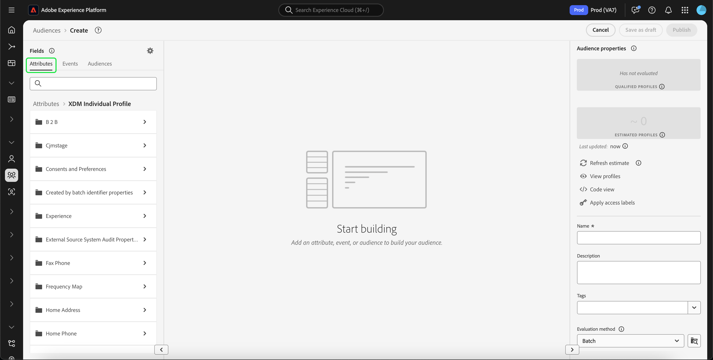

# [!DNL Segment Builder] UI-hulplijn

[!DNL Segment Builder] biedt een rijke werkruimte waarmee u kunt werken met [!DNL Profile] gegevenselementen. De werkruimte biedt intuïtieve besturingselementen voor het maken en bewerken van regels, zoals tegels voor slepen en neerzetten die worden gebruikt om gegevenseigenschappen te vertegenwoordigen.

## Bouwstenen voor segmentdefinitie

De basisbouwstenen van segmentdefinities zijn attributen en gebeurtenissen. Daarnaast kunnen de kenmerken en gebeurtenissen in bestaande doelgroepen ook worden gebruikt als componenten voor nieuwe definities.

U kunt deze bouwstenen zien in de **[!UICONTROL Fields]** aan de linkerkant van het dialoogvenster [!DNL Segment Builder] werkruimte. **[!UICONTROL Fields]** bevat een tab voor elk van de belangrijkste bouwstenen: &quot;[!UICONTROL Attributes]&quot;, &quot;[!UICONTROL Events]&quot;, en &quot;[!UICONTROL Audiences]&quot;.

### Attributen

De **[!UICONTROL Attributes]** kunt u bladeren [!DNL Profile] kenmerken van de [!DNL XDM Individual Profile] klasse. Elke map kan worden uitgevouwen om extra kenmerken weer te geven. Elk kenmerk is een tegel die naar het canvas voor regelbuilders in het midden van de werkruimte kan worden gesleept. De [regelbouwcanvas](#rule-builder-canvas) wordt later in deze handleiding gedetailleerder besproken.

### Gebeurtenissen

De **[!UICONTROL Events]** kunt u een publiek maken op basis van gebeurtenissen of acties die hebben plaatsgevonden via [!DNL XDM ExperienceEvent] gegevenselementen. U kunt gebeurtenistypen ook vinden op het tabblad **[!UICONTROL Events]** tab, een verzameling veelgebruikte gebeurtenissen waarmee u sneller uw segmenten kunt maken.

Niet alleen kunnen bladeren naar [!DNL ExperienceEvent] U kunt ook naar gebeurtenistypen zoeken. Gebeurtenistypen gebruiken dezelfde coderingslogica als [!DNL ExperienceEvents], zonder dat u door de [!DNL XDM ExperienceEvent] klasse die de juiste gebeurtenis zoekt. Als u bijvoorbeeld op de zoekbalk zoekt naar &quot;winkelwagentje&quot;, worden de gebeurtenistypen &quot;[!UICONTROL AddCart]&quot; en &quot;[!UICONTROL RemoveCart]&quot;, die twee zeer vaak gebruikte acties van het karretje zijn wanneer het bouwen van segmentdefinities.

Elk type component kan worden gezocht door zijn naam in de onderzoeksbar te typen, die gebruikt [Zoeksyntaxis van Lucene](https://docs.microsoft.com/en-us/azure/search/query-lucene-syntax). De zoekresultaten beginnen te vullen wanneer hele woorden worden ingevoerd. Bijvoorbeeld, om een regel te bouwen die op het XDM gebied wordt gebaseerd `ExperienceEvent.commerce.productViews`typt u &quot;productweergaven&quot; in het zoekveld. Nadat u het woord &quot;product&quot; hebt getypt, worden de zoekresultaten weergegeven. Elk resultaat bevat de objecthiërarchie waartoe het behoort.

>[!NOTE]
>
>De het schemagebieden van de douane die door uw organisatie worden bepaald kunnen tot 24 uren aan verschijnen en beschikbaar voor gebruik in het bouwen van regels vergen.

Vervolgens kunt u eenvoudig slepen en neerzetten [!DNL ExperienceEvents] en &quot;[!UICONTROL Event Types]&quot; in uw segmentdefinitie.

Standaard worden alleen gevulde schemavelden uit de gegevensopslag weergegeven. Dit omvat &quot;[!UICONTROL Event Types]&quot;. Als &quot;[!UICONTROL Event Types]De lijst is niet zichtbaar of u kunt alleen &quot;[!UICONTROL Any]&quot; als een &quot;[!UICONTROL Event Type]&quot;, selecteert u de **tandwielpictogram** naast **[!UICONTROL Fields]** selecteert u vervolgens **[!UICONTROL Show full XDM schema]** krachtens **[!UICONTROL Available Fields]**. Selecteer **tandwielpictogram** nogmaals om terug te keren naar de **[!UICONTROL Fields]** en u moet nu meerdere &quot;[!UICONTROL Event Types]&quot; en schema-velden, ongeacht of deze gegevens bevatten of niet.

#### Gegevenssets van Adobe Analytics-rapportsuite

U kunt gegevens uit één of meerdere Adobe Analytics-rapportreeksen gebruiken als gebeurtenissen binnen de segmentatie.

Wanneer het gebruiken van gegevens van één enkele het rapportreeks van Analytics, zal het Platform automatisch beschrijvers en vriendschappelijke namen aan Vars toevoegen, die het gemakkelijker maken om die gebieden binnen te vinden [!DNL Segment Builder].

Bij gebruik van gegevens uit meerdere Analytics-rapportreeksen, Platform **kan** Voeg automatisch beschrijvingen of vriendelijke namen toe aan Vars. Dientengevolge, alvorens de gegevens van Analytics rapportreeksen te gebruiken, moet u aan XDM gebieden in kaart brengen. Meer informatie over het toewijzen van variabelen van de Analytics aan XDM kan in XDM worden gevonden [Adobe Analytics-bronverbindingsgids](../../sources/tutorials/ui/create/adobe-applications/analytics.md#mapping).

Neem bijvoorbeeld een situatie waarin u twee rapportsuites met de volgende variabelen had:

| Veld | Report Suite Schema A | Report Suite Schema B |
| ----- | --------------------- | --------------------- |
| eVar1 | Referentiedomein | Aangemeld in Y/N |
| eVar2 | Paginanaam | Lidmaatschap-ID |
| eVar3 | URL | Paginanaam |
| eVar4 | Zoekvoorwaarden | Productnaam |
| event1 | Klikken | Paginaweergaven |
| event2 | Paginaweergaven | Toevoegingen aan winkelwagen |
| event3 | Toevoegingen aan winkelwagen | Betalingen |
| event4 | Aankopen | Aankopen |

In dit geval, kon u de twee rapportreeksen met het volgende schema in kaart brengen:

>[!NOTE]
>
>Terwijl de generieke waarden van eVar nog worden bevolkt, zou u moeten **niet** gebruik ze in de segmentdefinities (indien mogelijk), aangezien de waarden verschillende dingen kunnen betekenen dan wat ze oorspronkelijk in hun rapporten stonden.

Zodra de rapportsuites in kaart zijn gebracht, kunt u deze onlangs in kaart gebrachte gebieden binnen uw op profiel-betrekking hebbende werkschema&#39;s en segmentatie gebruiken.

| Scenario | Unieschema-ervaring | Segmenteringsvariabele | Aan segment toegewezen variabele |
| -------- | ----------------------- | ----------------------------- | ---------------------------- |
| Single-rapportenpakket | Beschrijvende naam wordt opgenomen in algemene variabelen.   **Voorbeeld:** Paginanaam (eVar2) | <ul><li>Beschrijvende naam opgenomen met algemene variabelen</li><li>De vraag gebruikt gegevens van de specifieke dataset, aangezien het de enige is</li></ul> | Query&#39;s kunnen gebruikmaken van Adobe Analytics-gegevens en mogelijk andere bronnen. |
| Meerdere rapportsuites | Bij generieke variabelen worden geen beschrijvingen van vriendelijke namen opgenomen.   **Voorbeeld:** eVar2 | <ul><li>Elk veld met meerdere beschrijvingen wordt algemeen weergegeven. Dit betekent dat er geen vriendelijke namen worden weergegeven in de gebruikersinterface.</li><li>De vragen kunnen gegevens van om het even welke datasets gebruiken die de eVar bevatten, die in gemengde of onjuiste resultaten kunnen resulteren.</li></ul> | De vraag gebruikt correct gecombineerde resultaten van veelvoudige datasets. |

### Doelgroepen

De **[!UICONTROL Audiences]** worden alle soorten publiek weergegeven die zijn geïmporteerd uit externe bronnen, zoals Adobe Audience Manager, en alle soorten publiek die zijn gemaakt in [!DNL Experience Platform].

Op de **[!UICONTROL Audiences]** kunt u alle beschikbare bronnen weergeven als een groep mappen. Terwijl u de mappen selecteert, zijn de beschikbare submappen en doelgroepen zichtbaar. Bovendien kunt u het mappictogram (zoals weergegeven in de afbeelding uiterst rechts) selecteren om de mapstructuur weer te geven (een vinkje geeft de map aan die u momenteel in hebt) en eenvoudig terug te navigeren door de mappen door de naam van een map in de boomstructuur te selecteren.

U kunt de muisaanwijzer boven de ⓘ naast een doelgroep houden om informatie over het publiek weer te geven, zoals de id, beschrijving en maphiërarchie, om het publiek te zoeken.

U kunt ook naar soorten publiek zoeken met de zoekbalk, die [Zoeksyntaxis van Lucene](https://docs.microsoft.com/en-us/azure/search/query-lucene-syntax). Op de **[!UICONTROL Audiences]** als u een map op hoofdniveau selecteert, wordt de zoekbalk weergegeven, zodat u in die map kunt zoeken. Zoekresultaten beginnen pas te worden gevuld wanneer hele woorden zijn ingevoerd. Als u bijvoorbeeld een publiek wilt zoeken met de naam `Online Shoppers`typt u &quot;Online&quot; in de zoekbalk. Nadat het woord &quot;Online&quot; volledig is getypt, worden zoekresultaten met het woord &quot;Online&quot; weergegeven.

## Rule builder canvas {#rule-builder-canvas}

Een segmentdefinitie is een inzameling van regels die worden gebruikt om zeer belangrijke kenmerken of gedrag van een doelpubliek te beschrijven. Deze regels worden gecreeerd gebruikend het canvas van de regelbouwer, dat in het centrum van wordt gevestigd [!DNL Segment Builder].

Als u een nieuwe regel wilt toevoegen aan de segmentdefinitie, sleept u een tegel uit de **[!UICONTROL Fields]** en laat vallen het op het canvas van de regelbouwer. Vervolgens krijgt u contextspecifieke opties, afhankelijk van het type gegevens dat u wilt toevoegen. Beschikbare gegevenstypen zijn: tekenreeksen, datums, [!DNL ExperienceEvents], &quot;[!UICONTROL Event Types]&quot;, en het publiek.

>[!IMPORTANT]
>
>De meest recente wijzigingen in Adobe Experience Platform hebben het gebruik van de `OR` en `AND` logische operatoren tussen gebeurtenissen. Deze updates zijn niet van invloed op bestaande segmenten. Deze wijzigingen zijn echter van invloed op alle volgende updates van bestaande segmenten en nieuwe segmentcreaties. Lees de [tijdconstanten bijwerken](./segment-refactoring.md) voor meer informatie .

Wanneer u een waarde voor het kenmerk selecteert, wordt een lijst met opsommingswaarden weergegeven die het kenmerk kan bevatten.

Als u een waarde in deze lijst met nummers selecteert, krijgt de waarde een effen rand. Voor velden die `meta:enum` (soft) opsommingen, kunt u ook een waarde selecteren die **niet** in de lijst van opsommingen. Als u uw eigen waarde maakt, krijgt deze de omtrek met een gestippelde rand en een waarschuwing dat deze waarde niet in de opsommingslijst voorkomt.

### Soorten publiek toevoegen

U kunt een publiek slepen en neerzetten vanuit het deelvenster **[!UICONTROL Audience]** tab op het canvas van de regelbouwer om te verwijzen naar het lidmaatschap van het publiek in de nieuwe segmentdefinitie. Dit staat u toe om publiekslidmaatschap als attribuut in de nieuwe segmentregel te omvatten of uit te sluiten.

Voor [!DNL Platform] publiek gemaakt met [!DNL Segment Builder], krijgt u de optie om het publiek in de reeks regels om te zetten die in de segmentdefinitie voor dat publiek werden gebruikt. Deze omzetting maakt een exemplaar van de regellogica, die dan kan worden gewijzigd zonder de originele segmentdefinitie te beïnvloeden. Zorg ervoor dat u recente wijzigingen in de segmentdefinitie hebt opgeslagen voordat u deze omzet in regellogica.

>[!NOTE]
>
>Wanneer u een publiek uit een externe bron toevoegt, wordt alleen verwezen naar het publiekslidmaatschap. U kunt het publiek niet in regels omzetten, en daarom kunnen de regels die worden gebruikt om het originele publiek tot stand te brengen niet in de nieuwe segmentdefinitie worden gewijzigd.

Als er conflicten optreden wanneer een publiek wordt omgezet in regels, [!DNL Segment Builder] zal proberen de bestaande opties zo goed mogelijk te behouden.

### Codeweergave

U kunt ook een op code gebaseerde versie weergeven van een regel die is gemaakt in het dialoogvenster [!DNL Segment Builder]. Zodra u uw regel binnen het canvas van de regelbouwer hebt gecreeerd, kunt u selecteren **[!UICONTROL Code view]** om uw segment als PQL te zien.

De mening van de code verstrekt een knoop die u toestaat om de waarde van het segment in API vraag te kopiëren. Om de recentste versie van het segment te krijgen, zorg ervoor u uw recentste veranderingen in het segment hebt bewaard.

### Samenvoegingsfuncties

Een aggregatie in [!DNL Segment Builder] is een berekening voor een groep XDM-kenmerken waarvan het gegevenstype een getal is (een getal of een geheel getal). De vier gesteunde samenvoegingsfuncties binnen de Bouwer van het Segment zijn SUM, GEMIDDELD, MIN, en MAX.

Als u een aggregatiefunctie wilt maken, selecteert u een gebeurtenis in de linkertrack en voegt u deze in de [!UICONTROL Events] container.

Nadat u de gebeurtenis in de container Gebeurtenissen hebt geplaatst, selecteert u het pictogram Ovalen (...), gevolgd door **[!UICONTROL Aggregate]**.

De samenvoeging wordt nu toegevoegd. U kunt nu de aggregatiefunctie selecteren, kiezen welk kenmerk wordt geaggregeerd, de gelijkheidsfunctie en de waarde. In het onderstaande voorbeeld zou dit segment elk profiel kwalificeren dat een som aangekochte waarden heeft die groter is dan $100, zelfs als elke afzonderlijke aankoop minder dan $100 is.

### Telfuncties {#count-functions}

De functies van de telling in de Bouwer van het Segment worden gebruikt om gespecificeerde gebeurtenissen te zoeken en het aantal tijden te tellen zij worden gedaan. De gesteunde telfuncties in de Bouwer van het Segment zijn &quot;minstens&quot;, &quot;hoogstens&quot;, &quot;Precies&quot;, &quot;tussen&quot;, en &quot;allen&quot;.

Om een telfunctie tot stand te brengen, selecteer een gebeurtenis van de linkerspoorstaaf en neem het in in [!UICONTROL Events] container.

Nadat u de gebeurtenis in de gebeurtenissencontainer hebt geplaatst, selecteert u de knop [!UICONTROL At least 1] knop.

De telfunctie wordt nu toegevoegd. U kunt nu de telfunctie en de waarde van de functie selecteren. In het onderstaande voorbeeld wordt elke gebeurtenis met ten minste één klik opgenomen.

## Containers

Segmentregels worden geëvalueerd in de volgorde waarin ze worden weergegeven. De containers staan controle over de orde van uitvoering door het gebruik van genestelde vragen toe.

Zodra u minstens één tegel aan het canvas van de regelbouwer hebt toegevoegd, kunt u beginnen om containers toe te voegen. Als u een nieuwe container wilt maken, selecteert u de ovalen (...) in de rechterbovenhoek van het element en selecteert u vervolgens **[!UICONTROL Add container]**.

Een nieuwe container wordt weergegeven als het onderliggende element van de eerste container, maar u kunt de hiërarchie aanpassen door de containers te slepen en te verplaatsen. Het standaardgedrag van een container is &quot;[!UICONTROL Include]&quot; het kenmerk, de gebeurtenis of het publiek dat wordt opgegeven. U kunt de regel instellen op &quot;[!UICONTROL Exclude]&quot;-profielen die voldoen aan de containercriteria door **[!UICONTROL Include]** in de linkerbovenhoek van de tegel en selecteert u &quot;[!UICONTROL Exclude]&quot;.

Een onderliggende container kan ook inline worden geëxtraheerd en toegevoegd aan de bovenliggende container door &quot;container opheffen&quot; te selecteren in de onderliggende container. Selecteer de ellipsen (...) in de hoger-juiste hoek van de kindcontainer om tot deze optie toegang te hebben.

Zodra u **[!UICONTROL Unwrap container]** de onderliggende container wordt verwijderd en de criteria worden inline weergegeven.

>[!NOTE]
>
>Wanneer het unwrapping containers, zorg ervoor dat de logica de gewenste segmentdefinitie blijft ontmoeten.

## Beleid samenvoegen

[!DNL Experience Platform] laat u toe om gegevens uit veelvoudige bronnen te brengen en het te combineren om een volledige mening van elk van uw individuele klanten te zien. Bij het samenvoegen van deze gegevens gelden als samenvoegbeleid de regels die [!DNL Platform] gebruikt om te bepalen hoe gegevens voorrang krijgen en welke gegevens worden gecombineerd om een profiel te maken.

U kunt een samenvoegbeleid selecteren dat overeenkomt met uw marketingdoel voor dit publiek of het standaardsamenvoegbeleid gebruiken dat wordt geboden door [!DNL Platform]. U kunt meerdere samenvoegbeleidsregels maken die uniek zijn voor uw organisatie, waaronder het maken van uw eigen standaardbeleid voor samenvoegen. Voor stapsgewijze instructies voor het maken van een samenvoegbeleid voor uw organisatie, begint u met het lezen van de [overzicht van samenvoegbeleid](../../profile/merge-policies/overview.md).

Als u een samenvoegbeleid voor uw segmentdefinitie wilt selecteren, selecteert u het tandwielpictogram in het dialoogvenster **[!UICONTROL Fields]** gebruikt u vervolgens de **[!UICONTROL Merge Policy]** vervolgkeuzelijst om het samenvoegbeleid te selecteren dat u wilt gebruiken.

## Segmenteigenschappen

Bij het samenstellen van een segmentdefinitie worden de **[!UICONTROL Segment Properties]** aan de rechterkant van de werkruimte wordt een schatting van de grootte van het resulterende segment weergegeven, zodat u de segmentdefinitie naar wens kunt aanpassen voordat u het publiek zelf gaat maken.

De **[!UICONTROL Segment Properties]** is ook waar u belangrijke informatie over uw segmentdefinitie, met inbegrip van zijn naam en beschrijving kunt specificeren. De definitienamen van het segment worden gebruikt om uw segment onder die te identificeren die door uw organisatie worden bepaald en zouden daarom beschrijvend, beknopt, en uniek moeten zijn.

Terwijl u de segmentdefinitie blijft maken, kunt u een gepagineerde voorvertoning van het publiek weergeven door **[!UICONTROL View Profiles]**.

>[!NOTE]
>
>De schattingen van het publiek worden geproduceerd door een steekproefgrootte van de steekproefgegevens van die dag te gebruiken. Als uw profielarchief minder dan 1 miljoen entiteiten bevat, wordt de volledige gegevensset gebruikt. voor tussen 1 en 20 miljoen entiteiten worden 1 miljoen entiteiten gebruikt; en voor meer dan 20 miljoen entiteiten wordt 5 % van de totale entiteiten gebruikt . Meer informatie over het genereren van segmentramingen vindt u in het gedeelte [schatting van generatiesectie](../tutorials/create-a-segment.md#estimate-and-preview-an-audience) van de zelfstudie voor het maken van segmenten.

## Volgende stappen {#next-steps}

De Bouwer van het segment verstrekt een rijk werkschema toelatend u om verhandelbare doelgroepen van te isoleren [!DNL Real-time Customer Profile] gegevens. Na het lezen van deze handleiding moet u nu in staat zijn om:

- Maak segmentdefinities met een combinatie van kenmerken, gebeurtenissen en bestaand publiek als bouwstenen.
- Gebruik het canvas en de containers van de regelbouwer om de orde te controleren waarin de segmentregels worden uitgevoerd.
- De schattingen van de mening van uw potentiële publiek, toestaand u om uw segmentdefinities zonodig aan te passen.
- Schakel alle segmentdefinities in voor geplande segmentatie.
- Hiermee kunt u opgegeven segmentdefinities voor streaming segmentatie inschakelen.

Meer informatie over [!DNL Segmentation Service], kunt u de documentatie blijven lezen en uw kennis aanvullen door de verwante video&#39;s te bekijken. Meer informatie over de andere delen van het dialoogvenster [!DNL Segmentation Service] UI, gelieve te lezen gelieve [[!DNL Segmentation Service] gebruikershandleiding](./overview.md)
